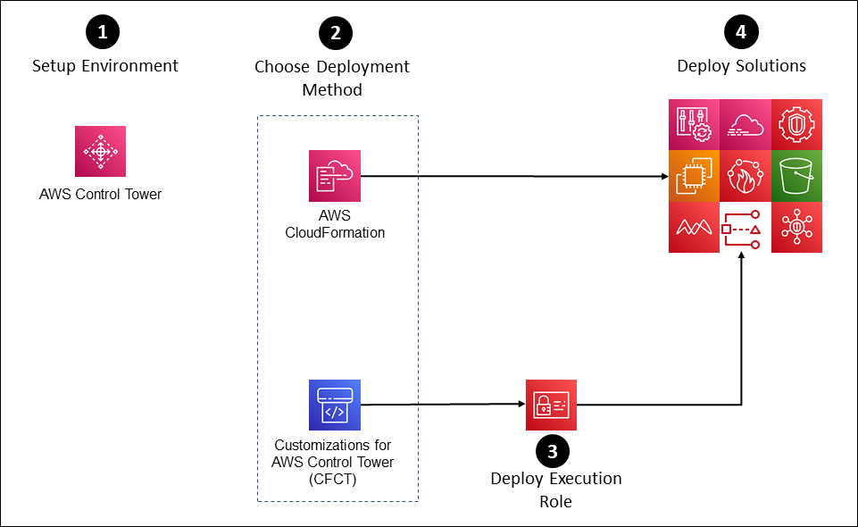
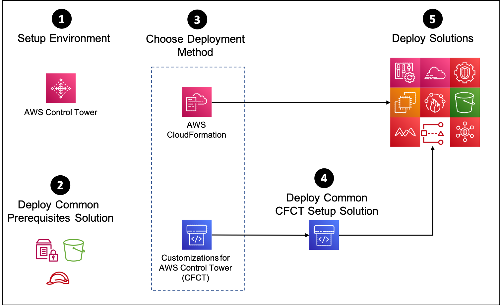

# AWS Security Reference Architecture Examples<!-- omit in toc -->

<!-- markdownlint-disable MD033 -->

Copyright Amazon.com, Inc. or its affiliates. All Rights Reserved. SPDX-License-Identifier: CC-BY-SA-4.0

---
⚠️**Influence the future of the AWS Security Reference Architecture (AWS SRA) code library by taking a <a href="https://amazonmr.au1.qualtrics.com/jfe/form/SV_9oFz0p67iCw3obk">short survey</a>.**
<!-- omit in toc -->
---

## Table of Contents<!-- omit in toc -->

- [Introduction](#introduction)
- [Getting Started Using the AWS SRA Easy Setup (Recommended)](#getting-started-using-the-aws-sra-easy-setup-recommended)
  - [AWS SRA Easy Setup](#aws-sra-easy-setup)
- [Manual Install Method For the AWS SRA](#manual-install-method-for-the-aws-sra)
  - [AWS SRA Quick Setup](#aws-sra-quick-setup)
- [Example Solutions](#example-solutions)
- [Utils](#utils)
- [Environment Setup](#environment-setup)
- [Repository and Solution Naming Convention](#repository-and-solution-naming-convention)
- [Frequently Asked Questions](#frequently-asked-questions)
- [Contributors](#contributors)
- [License Summary](#license-summary)

## Introduction

This repository contains code to help developers and engineers deploy AWS security-related services in an `AWS Control Tower` multi-account environment following patterns that align with the
[AWS Security Reference Architecture](https://docs.aws.amazon.com/prescriptive-guidance/latest/security-reference-architecture/). The Amazon Web Services (AWS) Security Reference Architecture (AWS SRA) is a holistic set of guidelines for deploying
the full complement of AWS security services in a multi-account environment.

The AWS service configurations and resources (e.g. IAM roles and policies) deployed by these templates are deliberately very restrictive. They are intended to illustrate an implementation pattern rather than provide a complete solution. You may need
to modify and tailor these solutions to suit your environment and security needs.

The examples within this repository have been deployed and tested within an `AWS Control Tower` environment using `AWS CloudFormation` as well as the `Customizations for AWS Control Tower (CFCT)` solution.

## Getting Started Using the AWS SRA Easy Setup (Recommended)



1. Setup the environment to configure [AWS Control Tower](https://docs.aws.amazon.com/controltower/latest/userguide/getting-started-with-control-tower.html) within a new or existing AWS account. Existing AWS Control Tower environments can also be used but may require existing service configurations to be removed.
2. Choose a deployment method:
   - AWS CloudFormation StackSets/Stacks - [CFN AWS SRA Easy Setup Implementation Details](./aws_sra_examples/easy_setup#cloudformation-implementation-instructions)
     - See [AWS CloudFormation Documentation](https://docs.aws.amazon.com/AWSCloudFormation/latest/UserGuide/what-is-cfnstacksets.html) for more information.
   - Customizations for AWS Control Tower (CfCT) - [CfCT AWS SRA Easy Setup Implementation Details](./aws_sra_examples/easy_setup#customizations-for-control-tower-implementation-instructions)
     - See [CfCT Documentation](https://aws.amazon.com/solutions/implementations/customizations-for-aws-control-tower/) for more information.
3. If using CfCT, deploy the AWSControlTowerExecution role into the management account.
4. Using parameters within the easy setup template file, choose which AWS SRA Solutions to deploy.  This can be done during initial setup or as an update later.

For more information view the [AWS SRA Easy Setup](./aws_sra_examples/easy_setup) solution page.

### AWS SRA Easy Setup

Using the AWS SRA Easy Setup, the common prerequisites and all AWS SRA solutions are automatically packaged, staged, and deployed into your AWS environment with minimal effort.  This is the recommended method to install the AWS SRA code library because it reduces the likelihood of missing a step in the Manual install method.  If using this method to install the AWS SRA code library, there is no other process you need to follow.

Follow the instructions in the [AWS SRA Easy Setup](./aws_sra_examples/easy_setup) solution page to install everything you need to get the AWS SRA code library and it's solutions deployed.

## Manual Install Method For the AWS SRA



1. Setup the environment to configure [AWS Control Tower](https://docs.aws.amazon.com/controltower/latest/userguide/getting-started-with-control-tower.html) within a new or existing AWS account. Existing AWS Control Tower environments can also be used but may require existing service configurations to be removed.
2. Deploy the [Common Prerequisites](aws_sra_examples/solutions/common/common_prerequisites) solution. **Note:** This only needs to be done once for all the solutions.
3. Choose a deployment method:
   - AWS CloudFormation StackSets/Stacks - [AWS Documentation](https://docs.aws.amazon.com/AWSCloudFormation/latest/UserGuide/what-is-cfnstacksets.html)
   - Customizations for AWS Control Tower (CfCT) - [Solution Documentation](https://aws.amazon.com/solutions/implementations/customizations-for-aws-control-tower/)
4. (Optional) - Deploy the [Customizations for AWS Control Tower (CFCT) Setup](aws_sra_examples/solutions/common/common_cfct_setup) solution. **Note** Only implement if the CFCT deployment method was selected.
5. Per your requirements select one or all of the below [AWS SRA Solutions](#example-solutions) to implement via the selected deployment method.
   -  You may use the `Quick Setup` to deploy the AWS SRA Solutions at this step.

### AWS SRA Quick Setup

The `Quick Setup` can be used along with the manual install of the AWS SRA.  Once you have manually installed the common prerequisites, instead of installing each solution individually, you can deploy all the [Example Solutions](#example-solutions) listed in the below table via a single centralized CloudFormation template either directly within the CloudFormation console or via the Customizations for AWS Control Tower (CFCT) solution. Our testing within an environment that has the default AWS Control Tower setup (3 accounts and 1 region) resulted in deploying all the solutions within the `Quick Setup` in under 20 minutes.  

Follow the instructions within the [Quick Setup](aws_sra_examples/quick_setup) to deploy all or a subset of the solutions based on your environment requirements.

*Note: The `Quick Setup` is not designed to be used with the `Easy Setup` procedure.  Using them together may produce mixed results as we have not tested this.  It is recommended to use the `Easy Setup` process*

## Example Solutions

- **Note:** All solutions below depend on the [Common Prerequisites](aws_sra_examples/solutions/common/common_prerequisites) solution in addition to the specified solutions within the `Depends On` column.
- Navigate to corresponding example solution to review what is deployed and configured within the environment.

| Example Solution                                                                                      | Solution Highlights                                                                                                                                                                         | What does Control Tower provide?                                                                             | Depends On                                                                                                                                                                                                                              |
| :---------------------------------------------------------------------------------------------------- | :------------------------------------------------------------------------------------------------------------------------------------------------------------------------------------------ | :----------------------------------------------------------------------------------------------------------- | :-------------------------------------------------------------------------------------------------------------------------------------------------------------------------------------------------------------------------------------- |
| [Account Alternate Contacts](aws_sra_examples/solutions/account/account_alternate_contacts)           | Sets the billing, operations, and security alternate contacts for all accounts within the organization.                                                                                     |                                                                                                              |
| [CloudTrail](aws_sra_examples/solutions/cloudtrail/cloudtrail_org)                                    | Organization trail with defaults set to configure data events (e.g. S3 and Lambda) to avoid duplicating the Control Tower configured CloudTrail. Options for configuring management events. | CloudTrail enabled in each account with management events only.                                              |                                                                                                                                                                                                                                         |
| [Config Management Account](aws_sra_examples/solutions/config/config_management_account)              | Enables AWS Config in the Management account to allow resource compliance monitoring.                                                                                                       | Configures AWS Config in all accounts except for the Management account in each governed region.             |                                                                                                                                                                                                                                         |
| [Config Organization Conformance Pack](aws_sra_examples/solutions/config/config_conformance_pack_org) | Deploys a conformance pack to all accounts and provided regions within an organization.                                                                                                     |                                                                                                              | <ul><li>[Common Register Delegated Administrator](aws_sra_examples/solutions/common/common_register_delegated_administrator)</li><li>[Config Management Account](aws_sra_examples/solutions/config/config_management_account)</li></ul> |
| [Config Organization Aggregator](aws_sra_examples/solutions/config/config_aggregator_org)             | **Not required for most Control Tower environments.** Deploy an Organization Config Aggregator to a delegated admin other than the Audit account.                                           | Organization Config Aggregator in the Management account and Account Config Aggregator in the Audit account. | <ul><li>[Common Register Delegated Administrator](aws_sra_examples/solutions/common/common_register_delegated_administrator)</li></ul>                                                                                                  |
| [EC2 Default EBS Encryption](aws_sra_examples/solutions/ec2/ec2_default_ebs_encryption)               | Configures the EC2 default EBS encryption to use the default KMS key within all provided regions.                                                                                           |                                                                                                              |                                                                                                                                                                                                                                         |
| [Firewall Manager](aws_sra_examples/solutions/firewall_manager/firewall_manager_org)                  | Demonstrates configuring a security group policy and WAF policies for all accounts within an organization.                                                                                  |                                                                                                              |                                                                                                                                                                                                                                         |
| [GuardDuty](aws_sra_examples/solutions/guardduty/guardduty_org)                                       | Configures GuardDuty within a delegated admin account for all accounts within an organization.                                                                                              |                                                                                                              |                                                                                                                                                                                                                                         |
| [IAM Access Analyzer](aws_sra_examples/solutions/iam/iam_access_analyzer)                             | Configures an organization analyzer within a delegated admin account and account level analyzer within each account.                                                                        |                                                                                                              | <ul><li>[Common Register Delegated Administrator](aws_sra_examples/solutions/common/common_register_delegated_administrator)</li></ul>                                                                                                  |
| [IAM Account Password Policy](aws_sra_examples/solutions/iam/iam_password_policy)                     | Sets the account password policy for users to align with common compliance standards.                                                                                                       |                                                                                                              |                                                                                                                                                                                                                                         |
| [Macie](aws_sra_examples/solutions/macie/macie_org)                                                   | Configures Macie within a delegated admin account for all accounts within the organization.                                                                                                 |                                                                                                              |                                                                                                                                                                                                                                         |
| [S3 Block Account Public Access](aws_sra_examples/solutions/s3/s3_block_account_public_access)        | Configures the account-level S3 BPA settings for all accounts within the organization.                                                                                                      | Configures S3 BPA settings on buckets created by Control Tower only.                                         |                                                                                                                                                                                                                                         |
| [Security Hub](aws_sra_examples/solutions/securityhub/securityhub_org)                                | Configures Security Hub within a delegated admin account for all accounts and governed regions within the organization.                                                                     |                                                                                                              | <ul><li>[Config Management Account](aws_sra_examples/solutions/config/config_management_account)</li></ul>                                                                                                                              |
| [Inspector](aws_sra_examples/solutions/inspector/inspector_org)                  | Configure Inspector within a delegated admin account for all accounts and governed regions within the organization.  **Note:** As of 01/19/2023, this solution is not included in the quick setup (it will be in a future code release)                                                                                  |                                                                                                              |                                                                                                                                                                                                                                      |
## Utils

- packaging_scripts/stage-solution.sh (Package and stage all the AWS SRA example solutions. For more information see [Staging script details](aws_sra_examples/docs/DOWNLOAD-AND-STAGE-SOLUTIONS.md#staging-script-details))

## Environment Setup

Based on the deployment method selected these solutions are required to implement SRA solutions.

- [Common Prerequisites](aws_sra_examples/solutions/common/common_prerequisites)
- [Common Customizations for AWS Control Tower (CFCT) Setup](aws_sra_examples/solutions/common/common_cfct_setup)

## Repository and Solution Naming Convention

The repository is organized by AWS service solutions, which include deployment platforms (e.g., AWS Control Tower and AWS CloudFormation StackSet).

**Example:**

```shell
.
├── solutions
│   ├── guardduty
│   │   └── guardduty_org
│   │       ├── README.md
│   │       ├── customizations_for_aws_control_tower
│   │       │   ├── manifest-v2.yaml
│   │       │   ├── manifest.yaml
│   │       │   └── parameters
│   │       ├── documentation
│   │       ├── lambda
│   │       │   └── src
│   │       │       ├── app.py
│   │       │       └── requirements.txt
│   │       └── templates
│   │           ├── sra-guardduty-org-configuration-role.yaml
│   │           ├── sra-guardduty-org-configuration.yaml
│   │           ├── sra-guardduty-org-delete-detector-role.yaml
│   │           ├── sra-guardduty-org-delivery-kms-key.yaml
│   │           └── sra-guardduty-org-delivery-s3-bucket.yaml
│   ├── ...
```

## Frequently Asked Questions

Q. How were these particular solutions chosen? A. All the examples in this repository are derived from common patterns that many customers ask us to help them deploy within their environments. We will be adding to the examples over time.

Q. How were these solutions created? A. We’ve collected, cataloged, and curated our multi-account security solution knowledge based on working with a variety of AWS customers.

Q. Who is the audience for these AWS Security Reference Architecture examples? A. Security professionals that are looking for illustrative examples of deploying security patterns in AWS. These code samples provide a starting point from which you can
build and tailor infrastructure for your needs.

Q. Why didn't the solutions use inline Lambda functions within the CloudFormation templates? A. Reasons:

- You should control the dependencies in your function's deployment package as stated in the [best practices for working with AWS Lambda functions](https://docs.aws.amazon.com/lambda/latest/dg/best-practices.html).
- The [AWS Lambda runtimes](https://docs.aws.amazon.com/lambda/latest/dg/lambda-runtimes.html) might not be the latest version, which contains a feature that is needed for the solution.

Q. I have ideas to improve this repository. What should I do? A. Please create an issue or submit a pull request.

## Contributors

[Contributors](CONTRIBUTORS)

## License Summary

The documentation is made available under the Creative Commons Attribution-ShareAlike 4.0 International License. See the LICENSE file.

The sample code within this documentation is made available under the MIT-0 license. See the LICENSE-SAMPLECODE file.

Please note when building the project that some of the configured developer dependencies are subject to copyleft licenses. Please review these as needed for your use.
