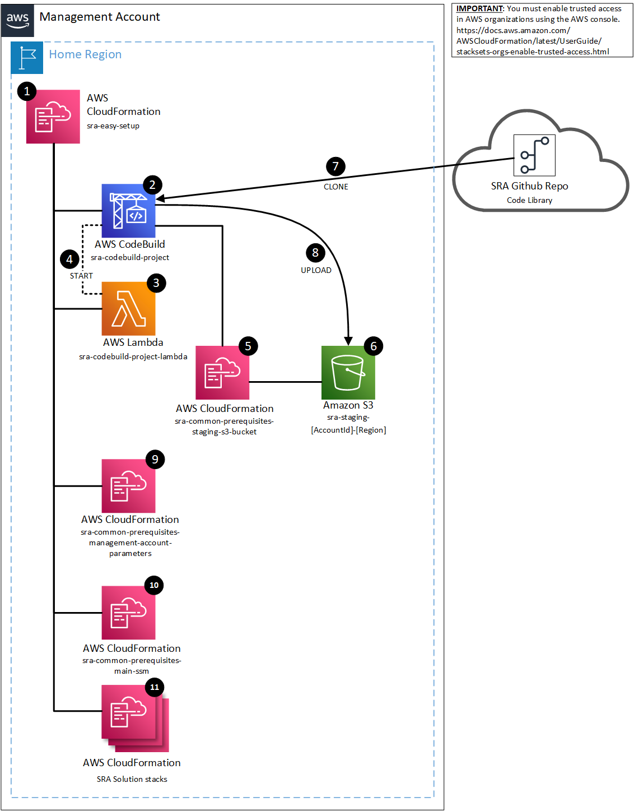

# AWS SRA Easy Setup<!-- omit in toc -->

Copyright Amazon.com, Inc. or its affiliates. All Rights Reserved. SPDX-License-Identifier: CC-BY-SA-4.0

- [Overview of the Easy Setup Deployment Process](#overview-of-the-easy-setup-deployment-process)
- [Enable Trusted Access with AWS Organizations for StackSets](#enable-trusted-access-with-aws-organizations-for-stacksets)
- [CloudFormation Implementation Instructions](#cloudformation-implementation-instructions)
  - [I. Download the Easy Setup CloudFormation Template](#i-download-the-easy-setup-cloudformation-template)
  - [II. (Option A) Deployment using the AWS Console](#ii-option-a-deployment-using-the-aws-console)
  - [II. (Option B) Deployment using the AWS CLI](#ii-option-b-deployment-using-the-aws-cli)
  - [CloudFormation AWS SRA Removal Instructions](#cloudformation-aws-sra-removal-instructions)
- [Customizations for Control Tower Implementation Instructions](#customizations-for-control-tower-implementation-instructions)
  - [I. Setup Customizations for Control Tower](#i-setup-customizations-for-control-tower)
  - [II. Download the AWS SRA Template Files](#ii-download-the-aws-sra-template-files)
  - [III. Deploy AWSControlTowerExecutionRole In Management Account](#iii-deploy-awscontroltowerexecutionrole-in-management-account)
  - [IV. Commit AWS SRA Easy Setup Custom Configuration](#iv-commit-aws-sra-easy-setup-custom-configuration)
  - [CfCT AWS SRA Removal Instructions](#cfct-aws-sra-removal-instructions)
- [Easy Setup Architecture Details](#easy-setup-architecture-details)

## Introduction<!-- omit in toc -->

The current method today to deploy the common solutions and prerequisites is a multi-step process that requires the user to clone the repo, manually set some settings in organizations/CloudFormation, deploy a CFN template, run a shell script, then deploy more CFN templates.  Customers have provided feedback that while this process works, it can lead to deployment delays at times because of the manual steps that are involved.  Users of the AWS SRA needed a simpler way to deploy it's code library which has led to the easy setup method here.

### Overview of the Easy Setup Deployment Process

The easy setup solution performs all of the steps in this section automatically so that you do not have to perform them on your own.  This section describes, at a high level, the automated process.

#### Staging Code Library to S3 Bucket<!-- omit in toc -->

The first steps in the easy setup of the AWS SRA code library is focused on the operations required to build the staging s3 bucket where the code library will be stored and the process to clone the github AWS SRA code which is then uploaded to the staging bucket.

#### Deploying the Common Prerequisite Solution<!-- omit in toc -->

The next steps within the easy setup of the AWS SRA code library focuses on deploying the common prerequisites solution which is provides the base resources shared and used by each of the core solutions that are provided through the AWS SRA code library (e.g. the GuardDuty AWS SRA solution, the Security Hub AWS SRA solution, etc.)  See  for more information

#### Deploying AWS SRA Solutions<!-- omit in toc -->

The final steps within the easy setup of the AWS SRA code library is the deployment of the individual AWS SRA solutions.  Each of the AWS SRA solutions has a set of parameters defined within the AWS SRA easy setup CloudFormation template.  To deploy an AWS SRA solution, set it's associated deployment parameter to 'Yes'.  Each AWS SRA Solution also has a set of parameters that can be used to further customize the solutions configuration options.

### Enable Trusted Access with AWS Organizations for StackSets

For the AWS SRA deployment to work, you must enabled trusted access with AWS Organizations.

- Please follow the instructions here to do this: https://docs.aws.amazon.com/AWSCloudFormation/latest/UserGuide/stacksets-orgs-enable-trusted-access.html

### CloudFormation Implementation Instructions

- The process to implement the easy setup begins with downloading the `sra-easy-setup.yaml` template from the repository.  Then, either follow the instructions for deployment via the AWS console or by using the AWS command line interface (CLI).
- [Trusted Access with AWS Organizations for StackSets](#enable-trusted-access-with-aws-organizations-for-stacksets) must be manually enabled first.

*Note: all AWS CLI commands in this section are run using credentials for the management account. See https://docs.aws.amazon.com/cli/latest/userguide/cli-chap-configure.html for more information on configuring AWS CLI*

#### I. Download the Easy Setup CloudFormation Template

Download the `sra-easy-setup.yaml` template by either navigating to it in the AWS SRA code library repository, or by using the example download commands in this section.

##### Example Download Command<!-- omit in toc -->

```bash
curl -LJO https://raw.githubusercontent.com/aws-samples/aws-security-reference-architecture-examples/main/aws_sra_examples/easy_setup/templates/sra-easy-setup.yaml
```

#### II. (Option A) Deployment using the AWS Console

Deployment using the AWS console requires the template to be downloaded first (see above).

##### Step 1 - Navigate to the CloudFormation Service Console<!-- omit in toc -->

In your AWS management account, navigate to the CloudFormation service console.

##### Step 2 - Navigate to the Stacks area<!-- omit in toc -->

In the CloudFormation service console, navigate to the stacks area.

##### Step 3 - Create a stack<!-- omit in toc -->

In the stacks area, create a stack, and then select the "Upload a template file" option.  Click on "Next", then follow the process to deploy the stack.
Be sure to specify the appropriate parameters for the template as needed.

#### II. (Option B) Deployment using the AWS CLI

Deployment using the AWS CLI requires the template to be downloaded first.

##### Step 1 - Create an S3 bucket for the easy-setup template<!-- omit in toc -->

The easy setup template is greater than 51,200 bytes, therefore, in order to deploy it via the AWS command line interface, you are required to have an S3 bucket that it can be stored in.  You can do this from the AWS console, or by using the example command below.

###### Example Create S3 Bucket Command<!-- omit in toc -->

```bash
aws s3api create-bucket --bucket [bucket name] --create-bucket-configuration LocationConstraint=[region]
```

##### Step 2 - Run the AWS CloudFormation Deploy command<!-- omit in toc -->

Prepare and run the `aws cloudformation deploy` command to launch the template.  Use the example command below to do this.

###### IMPORTANT<!-- omit in toc -->

- Be sure to alter the folder/path for the `sra-easy-setup.yaml` template-file appropriately (replace `[path to template file]`)
- Be sure to put in the s3 bucket name (replace `[s3 bucket name from step 1]`)
- Be sure to specify the proper parameter overrides and specify the alarm email address (`[email address]`)

*NOTE: The example command below deploys The Guard Duty, Security Hub, and Config Management solutions (you can remove those 3 parameters or replace them with other solutions deployment parameters)*

###### Example Command To Launch The Template<!-- omit in toc -->

```bash
aws cloudformation deploy --template-file [path to template file]/sra-easy-setup.yaml --stack-name sra-easy-setup --s3-bucket [s3 bucket name from step 1] --capabilities CAPABILITY_NAMED_IAM --parameter-overrides pDeployGuardDutySolution=Yes pDeployConfigManagementSolution=Yes pDeploySecurityHubSolution=Yes pSRAAlarmEmail=[email address]
```

#### CloudFormation AWS SRA Removal Instructions

From within the management account:

- Delete the `sra-easy-setup` CloudFormation stack
- Delete any remaining `sra-*` CloudWatch log groups
- Delete any remaining `/sra/*` SSM Parameters
- Delete any remaining `sra-*` IAM roles
- Delete any remaining `sra-*` Lambda functions
- Delete any remaining `sra-*` S3 buckets

### Customizations for Control Tower Implementation Instructions

To install the AWS SRA Easy Setup solution using Customizations for Control Tower (CfCT), you must have CfCT setup, the `sra-common-prerequisites-control-tower-execution-role.yaml`, `sra-easy-setup.yaml`, and `manifest.yaml` template files downloaded from the code library, the AWSControlTowerExecution role created in the management account, the `sra-easy-setup.yaml` file committed to the codecommit repo under the `templates` folder, and the `manifest.yaml` file updated appropriately.  Follow the instructions in this section to accomplish this.

#### IMPORTANT<!-- omit in toc -->

- These instructions are assuming you are using CfCT version 2.  If you are using CfCT version 1, there will be other differences in implementation behavior.  Please refer to [Customizations for AWS Control Tower Deployment Instructions](../docs/CFCT-DEPLOYMENT-INSTRUCTIONS.md) for more information on CfCT version 1 that may help you with this.
- [Trusted Access with AWS Organizations for StackSets](#enable-trusted-access-with-aws-organizations-for-stacksets) must be manually enabled.

#### I. Setup Customizations for Control Tower

##### Step 1 - Deploy CfCT<!-- omit in toc -->

Follow the instructions for deploying Customizations for Control Tower (CfCT) here: https://docs.aws.amazon.com/controltower/latest/userguide/step1.html

###### IMPORTANT<!-- omit in toc -->

Use these options when deploying CfCT in your environment:

- `Stack name` = custom-control-tower-initiation
- `AWS CodePipeline Source` = AWS CodeCommit
- `Failure Tolerance Percentage` = 0

##### Step 2 - Clone CodeCommit Repository Locally<!-- omit in toc -->

A. On the local machine install [git](https://git-scm.com/downloads) and [git-remote-codecommit](https://docs.aws.amazon.com/codecommit/latest/userguide/how-to-connect.html).

B. Clone the AWS CodeCommit repository via the following example command:

```bash
git clone codecommit::<HOME REGION>://custom-control-tower-configuration custom-control-tower-configuration
```

#### II. Download the AWS SRA Template Files

##### Step 1 - Download the AWS Control Tower Execution Role AWS SRA Template File<!-- omit in toc -->

Download the `sra-common-prerequisites-control-tower-execution-role.yaml` AWS SRA template by either navigating to it in the AWS SRA code library repository, or by using the example download commands in this section.

###### Example AWS SRA AWS Control Tower Execution Role Template Download Command<!-- omit in toc -->

```bash
curl -LJO https://raw.githubusercontent.com/aws-samples/aws-security-reference-architecture-examples/main/aws_sra_examples/solutions/common/common_prerequisites/templates/sra-common-prerequisites-control-tower-execution-role.yaml
```

##### Step 2 - Download the AWS SRA Easy Setup Template<!-- omit in toc -->

Download the `sra-easy-setup.yaml` template by either navigating to it in the AWS SRA code library repository, or by using the example download commands in this section.

###### Example AWS SRA Easy Setup Template Download Command<!-- omit in toc -->

```bash
curl -LJO https://raw.githubusercontent.com/aws-samples/aws-security-reference-architecture-examples/main/aws_sra_examples/easy_setup/templates/sra-easy-setup.yaml
```

##### Step 3 - Download the AWS SRA Easy Setup Manifest<!-- omit in toc -->

Download the `manifest.yaml` template by either navigating to it in the AWS SRA code library repository, or by using the example download commands in this section.
The AWS SRA Easy Setup Manifest file contains parameters to deploy AWS SRA solutions and you may update these parameters as you need.
For example, setting the `pDeploySecurityHubSolution` parameter to `Yes` will deploy the AWS SRA Security Hub solution.
There are other parameters that are related to each solution as well in the manifest file.
You can set these options during initial deployment or update them later.

###### IMPORTANT<!-- omit in toc -->

You must leave the `pCreateAWSControlTowerExecutionRole` parameter set to `false` or the pipeline will fail because the AWSControlTowerExecution role will already be deployed.

###### Example AWS SRA Easy Setup Manifest Download Command<!-- omit in toc -->

```bash
curl -LJO https://raw.githubusercontent.com/aws-samples/aws-security-reference-architecture-examples/main/aws_sra_examples/easy_setup/customizations_for_aws_control_tower/manifest.yaml
```

#### III. Deploy AWSControlTowerExecutionRole In Management Account

##### IMPORTANT<!-- omit in toc -->

- Be sure to alter the folder/path for the `sra-common-prerequisites-control-tower-execution-role.yaml` template-file you downloaded in step II.1 above appropriately (replace `[path to template file]`)

```bash
aws CloudFormation deploy --template-file [path to template file]/sra-common-prerequisites-control-tower-execution-role.yaml --stack-name sra-common-prerequisites-control-tower-execution-role --capabilities CAPABILITY_NAMED_IAM
```

#### IV. Commit AWS SRA Easy Setup Custom Configuration

See [Define a custom configuration](https://docs.aws.amazon.com/controltower/latest/userguide/cfct-custom-configuration.html) in the Customizations for Control Tower (CfCT) documentation for more information about the steps within this section.

##### Step 1 - Copy AWS SRA Easy Setup Template To CodeCommit Repo<!-- omit in toc -->

- Copy the `sra-easy-setup.yaml` template file that was downloaded in Step II.2 above into the `custom-control-tower-configuration/templates` folder within your locally cloned git repo (from step I.2.B above).

##### Step 2 - Copy the AWS SRA Easy Setup Manifest To CodeCommit Repo<!-- omit in toc -->

- Copy the `manifest.yaml` template file that was downloaded in Step II.3 above into the `custom-control-tower-configuration` folder within your locally cloned git repo (from step I.2.B above).
- Update the region so that it matches your AWS Control Tower home region.
- Update parameters to deploy and configure AWS SRA Solutions as needed.

*Note: depending on your CfCT deployment, you may want to copy the contents into your manifest file instead if you have other custom configuration resources you may have already deployed.*

##### Step 3 - Commit and Push Repo Change to CodeCommit<!-- omit in toc -->

- Perform the `git add`, `git commit`, and `git push` operations appropriately to commit and push these changes to the CodeCommit repo.  This will start the CodePipeline process to deploy the AWS SRA Easy Setup solution.

#### CfCT AWS SRA Removal Instructions

From within the management account:

- Comment out (or remove) the `sra-easy-setup` solution resource from within the `manifest.yaml` file.  Then commit and push these changes to the CodeCommit repository.
- Delete any remaining `sra-*` CloudWatch log groups
- Delete any remaining `/sra/*` SSM Parameters
- Delete any remaining `sra-*` IAM roles
- Delete any remaining `sra-*` Lambda functions
- Delete any remaining `sra-*` S3 buckets

### Easy Setup Architecture Details



#### 1 - CloudFormation Template Deployed and Stack Created<!-- omit in toc -->

The entire process to deploy the common solution and pre-requisites is set in to motion by deploying a single CloudFormation template.  Currently, this prototype is focused on deployment of what is needed for Module 1 (the staging of the AWS SRA code library to the staging s3 bucket in the management account).  This is done by deploying the sra-common-prerequisites-staging-s3-bucket-codebuild.yaml (which in turn creates the sra-common-prerequisites-staging-s3-bucket-codebuild stack) into the management account.

#### 2 - AWS CodeBuild Project Created<!-- omit in toc -->

The `sra-codebuild` AWS CodeBuild project is designed and created to perform the processes required to do a `git clone` operation on the AWS SRA public github repository and run the necessary operations to package and upload it to the AWS SRA code library staging S3 bucket.

#### 3 - AWS Lambda Function Created<!-- omit in toc -->

The `sra-clone-library`  AWS Lambda function is designed and created to perform the `start` operation for the `sra-codebuild` AWS CodeBuild project.

#### 4 - AWS Lambda Function Starts AWS CodeBuild Project<!-- omit in toc -->

The `sra-clone-library`  AWS Lambda function perform the `start` operation for the `sra-codebuild` AWS CodeBuild project via the boto3 AWS SDK.

#### 5 - AWS CloudFormation Deploys Common Prerequisite 1st Solution Stack<!-- omit in toc -->

The AWS SRA code library common prerequisite `sra-common-prerequisites-staging-s3-bucket` CloudFormation stack is launched.  See  for more information.

#### 6 - Amazon S3 Staging Bucket Created<!-- omit in toc -->

The AWS SRA code library staging `sra-staging-[AccountId]-[Region]` Amazon S3 bucket is created along with the appropriate bucket policy in preparation to have the AWS SRA code library uploaded to it later in the process.  NOTE: `[AccountId]` and `[Region]` will be replaced with the appropriate account id and region being deployed to respectively in the S3 bucket name.  

#### 7 - AWS CodeBuild Project Clones AWS SRA Code Library<!-- omit in toc -->

The `sra-codebuild` AWS CodeBuild project, once started by the `sra-clone-library`  AWS Lambda function, will perform a `git clone` operation on the AWS SRA public github repository to clone the AWS SRA code library into the CodeBuild execution environment.

#### 8 - AWS CodeBuild Project Stages the AWS SRA Code Library<!-- omit in toc -->

The `sra-codebuild` AWS CodeBuild project, after the AWS SRA code library has been cloned, packages the cloned AWS SRA code library appropriately and then uploads it into the `sra-staging-[AccountId]-[Region]` Amazon S3 bucket.

#### 9 - AWS CloudFormation Deploys Common Prerequisite 2nd Solution Stack<!-- omit in toc -->

The AWS SRA code library common prerequisite `sra-common-prerequisites-management-account-parameters` CloudFormation stack is launched.  See  for more information.

#### 10 - AWS CloudFormation Deploys Common Prerequisite 3rd Solution Stack<!-- omit in toc -->

The AWS SRA code library common prerequisite `sra-common-prerequisites-main-ssm` CloudFormation stack is launched.  See  for more information.

#### 11 - AWS CloudFormation Deploys AWS SRA Solution Stacks<!-- omit in toc -->

Each AWS SRA solution has a deployment parameter within the easy-setup yaml CloudFormation template (e.g. `pDeployGuardDutySolution` and `pDeploySecurityHubSolution` are 2 of these deployment parameters).  If a solutions deployment parameter is set to "Yes" when the easy-sra template is deployed or updated, then the appropriate AWS SRA solution stack will be created and the solution will be deployed into the AWS environment.  All deployment parameters for solutions are set to "No" by default.  If the parameters for AWS SRA solutions are left as default, they may be updated later as a part of an update operation to the easy-setup template parameters in order to deploy an AWS SRA solution.
