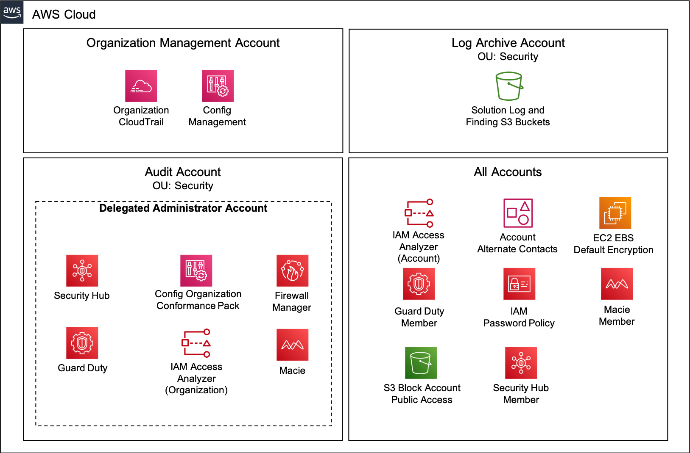

# Quick Setup<!-- omit in toc -->

Copyright Amazon.com, Inc. or its affiliates. All Rights Reserved. SPDX-License-Identifier: CC-BY-SA-4.0

## Table of Contents<!-- omit in toc -->

- [Introduction](#introduction)
- [Deployment Summary](#deployment-summary)
- [Key Parameter Definitions](#key-parameter-definitions)
- [Implementation Instructions](#implementation-instructions)

---

## Introduction

The Quick Setup provides the ability to deploy all of the [SRA solutions](../../README.md#example-solutions) via a single centralized CloudFormation template. Review the individual solution documentation to get the details of what is deployed and configured. Quick Setup utilizes the `<solution_name>-main-ssm.yaml` template within each of the corresponding solutions for deployment. `Deploy Parameters` are provided to allow the selection of which solutions to deploy within the environment along with solution specific parameters .

There are rules built into the Quick Setup CloudFormation template to prevent the deployment of a solution without it's dependent solution(s). Review the [Example Solutions](../../README.md#example-solutions) table within the main README to understand which solutions have dependencies.

Quick Setup was created with the intention of simplifying the setup of new environments but it can be leveraged by existing SRA environments. If one of the SRA solutions has been deployed within the environment, follow the below options to prevent any conflicts.

- Option 1 - Set the `Deploy Parameter` for each of the solutions previously deployed to `No`.
  - **Note:** The Config Management Solution `Deploy Parameter` must be set to `Already Deployed` or `Yes` to pass the validation rules when it is a dependency of another solution (e.g. Security Hub, Config Organization Conformance Pack).
- Option 2
  - Disable/Delete the previously deployed solutions following the associated solution delete instructions.
  - Deploy the solutions using the Quick Setup.

---

## Deployment Summary

---

## Key Parameter Definitions

- Deploy the <SOLUTION_NAME> Solution
  - Yes = Includes the solution in the deployment
  - No = Does not include the solution in the deployment
  - Already Deployed = The solution has already been deployed within the environment
- Disable <SOLUTION_NAME>
  - Yes = The solution `Deploy` parameter above must be `Yes`. This will disable the service within all the member accounts/regions.
  - No = (Default) Use this value when deploying the solution for the first time.

---

## Implementation Instructions

### Prerequisites<!-- omit in toc -->

Verify that the [SRA Prerequisites Solution](../solutions/common/common_prerequisites/) has been deployed. **Note:** This only needs to be done once for all the solutions.

### Solution Deployment<!-- omit in toc -->

Choose a Deployment Method:

- [AWS CloudFormation](#aws-cloudformation)
- [Customizations for AWS Control Tower](../docs/CFCT-DEPLOYMENT-INSTRUCTIONS.md)

#### AWS CloudFormation<!-- omit in toc -->

1. Download the [sra-quick-setup-ssm.yaml](templates/sra-quick-setup-ssm.yaml) template to your Desktop or locate it within the local machine `$HOME/aws-sra-examples/aws_sra_examples/quick_setup/templates/sra-quick-setup-ssm.yaml`.
2. In the `management account (home region)`, launch an AWS CloudFormation **Stack** using the [sra-quick-setup-ssm.yaml](templates/sra-quick-setup-ssm.yaml) template.

#### Solution Update Instructions<!-- omit in toc -->

1. [Download and Stage the SRA Solutions](../docs/DOWNLOAD-AND-STAGE-SOLUTIONS.md). **Note:** Get the latest code and run the staging script.
2. Update the existing CloudFormation Stack or CFCT configuration. **Note:** New parameters or changes to existing parameters may require input.

#### Solution Delete Instructions<!-- omit in toc -->

1. In the `management account (home region)`, change the `Disable GuardDuty`, `Disable Macie`, and `Disable Security Hub` parameters to `true` and update the AWS CloudFormation **Stack** (`sra-quick-setup-ssm`). This will disable the solutions within each of the member accounts/regions.
2. In the `management account (home region)`, verify that the GuardDuty, Macie, and Security Hub Lambda functions are finished processing by confirming no more CloudWatch logs are generated.
3. In the `management account (home region)`, delete the AWS CloudFormation **Stack** (`sra-quick-setup-ssm`).
4. In the `management account (home region)`, delete the AWS CloudWatch **Log Groups**.
   1. `/aws/lambda/<solution_name>` for the Lambda functions deployed
   2. `sra/sra-org-trail` for the SRA Organizations CloudTrail solution
5. In the `Log Archive account`, empty and delete the S3 buckets created by the SRA solutions (e.g. `sra-<solution_name>-<account_id>-<region>`).
