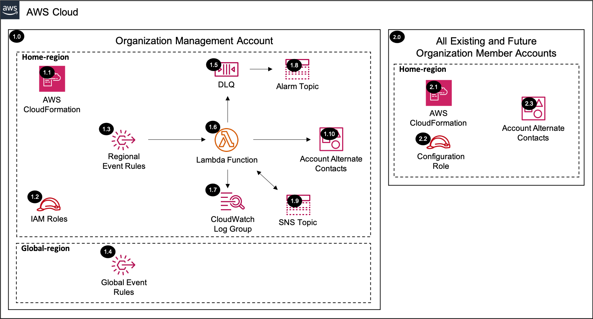

# Account Alternate Contacts<!-- omit in toc -->

Copyright Amazon.com, Inc. or its affiliates. All Rights Reserved. SPDX-License-Identifier: CC-BY-SA-4.0

## Table of Contents

- [Table of Contents](#table-of-contents)
- [Introduction](#introduction)
- [Deployed Resource Details](#deployed-resource-details)
- [Implementation Instructions](#implementation-instructions)
- [References](#references)

---

## Introduction

The Account Alternate Contacts solution sets alternate contacts for all existing and future AWS Organization accounts.

**Key solution features:**

- Sets different alternate contacts for:
  - `Billing`: The alternate billing contact will receive billing-related notifications, such as invoice availability notifications.
  - `Operations`: The alternate operations contact will receive operations-related notifications.
  - `Security`: The alternate security contact will receive security-related notifications, including notifications from the AWS Abuse Team.
- Assumes a role in the management and member accounts to set the alternate contacts.
- Sets alternate contacts for all existing accounts including the `management account` and future accounts.
- Ability to delete alternate contacts via a parameter and CloudFormation update event.

---

## Deployed Resource Details



### 1.0 Organization Management Account<!-- omit in toc -->

#### 1.1 AWS CloudFormation<!-- omit in toc -->

- All resources are deployed via AWS CloudFormation as a `StackSet` and `Stack Instance` within the `management account` or a CloudFormation `Stack` within a specific account.
- The [Customizations for AWS Control Tower](https://aws.amazon.com/solutions/implementations/customizations-for-aws-control-tower/) solution deploys all templates as a CloudFormation `StackSet`.
- For parameter details, review the [AWS CloudFormation templates](templates/).

#### 1.2 IAM Roles<!-- omit in toc -->

- The `Lambda IAM Role` is used by the Lambda function to identify existing and future accounts that need Account Alternate Contacts configured.
- The `Configuration IAM Role` is assumed by the Lambda function to set alternate contacts for the management account and the member accounts.
- The `Event Rule IAM Role` is assumed by EventBridge to forward Global events to the `Home Region` default Event Bus.

#### 1.3 Regional Event Rules<!-- omit in toc -->

- The `AWS Control Tower Lifecycle Event Rule` triggers the `AWS Lambda Function` when a new AWS Account is provisioned through AWS Control Tower.
- The `Organization Compliance Scheduled Event Rule` triggers the `AWS Lambda Function` to capture AWS Account status updates (e.g. suspended to active).
  - A parameter is provided to set the schedule frequency.
  - See the [Instructions to Manually Run the Lambda Function](#instructions-to-manually-run-the-lambda-function) for triggering the `AWS Lambda Function` before the next scheduled run time.
- The `AWS Organizations Event Rule` triggers the `AWS Lambda Function` when updates are made to accounts within the organization.
  - When AWS Accounts are added to the AWS Organization outside of the AWS Control Tower Account Factory. (e.g. account created via AWS Organizations console, account invited from another AWS Organization).
  - When tags are added or updated on AWS Accounts.

#### 1.4 Global Event Rules<!-- omit in toc -->

- If the `Home Region` is different from the `Global Region (e.g. us-east-1)`, then global event rules are created within the `Global Region` to forward events to the `Home Region` default Event Bus.
- The `AWS Organizations Event Rule` forwards AWS Organization account update events.

#### 1.5 Dead Letter Queue (DLQ)<!-- omit in toc -->

- SQS dead letter queue used for retaining any failed Lambda events.

#### 1.6 AWS Lambda Function<!-- omit in toc -->

- The Lambda function includes logic to set Account Alternate Contacts.

#### 1.7 Lambda CloudWatch Log Group<!-- omit in toc -->

- All the `AWS Lambda Function` logs are sent to a CloudWatch Log Group `</aws/lambda/<LambdaFunctionName>` to help with debugging and traceability of the actions performed.
- By default the `AWS Lambda Function` will create the CloudWatch Log Group and logs are encrypted with a CloudWatch Logs service managed encryption key.
- Parameters are provided for changing the default log group retention and encryption KMS key.

#### 1.8 Alarm SNS Topic<!-- omit in toc -->

- SNS Topic used to notify subscribers when messages hit the Dead Letter Queue (DLQ).

#### 1.9 SNS Topic<!-- omit in toc -->

- SNS Topic used to fanout the Lambda function for setting the Account Alternate Contact

#### 1.10 Account Alternate Contacts<!-- omit in toc -->

- Account Alternate Contacts (Billing, Operations, Security) are configured for all accounts.
- Account Alternate Contacts can be updated as necessary via CloudFormation parameters.
- Deleting the CloudFormation stack, will not remove the existing Account Alternate Contacts. (see [Solution Delete Instructions](#solution-delete-instructions) for details on deleting alternate contacts)
- **Note:** If a value is provided to the `Exclude Alternate Contact Account Tags` optional CloudFormation parameter, AWS accounts matching those tags will be excluded from account alternate contacts being applied.

---

### 2.0 All Existing and Future Organization Member Accounts<!-- omit in toc -->

#### 2.1 AWS CloudFormation<!-- omit in toc -->

- See [1.1 AWS CloudFormation](#11-aws-cloudformation)

#### 2.2 Configuration IAM Role<!-- omit in toc -->

- See [1.2 IAM Role](#12-iam-roles)

#### 2.3 Account Alternate Contacts<!-- omit in toc -->

- Account Alternate Contacts (Billing, Operations, Security) are configured for all accounts.
- Account Alternate Contacts can be updated as necessary via CloudFormation parameters.
- Deleting the CloudFormation stack, will not remove the existing Account Alternate Contacts. (see [Solution Delete Instructions](#solution-delete-instructions) for details on deleting alternate contacts)
- **Note:** If a value is provided to the `Exclude Alternate Contact Account Tags` optional CloudFormation parameter, AWS accounts matching those tags will be excluded from account alternate contacts being applied.

---

## Implementation Instructions

### Prerequisites<!-- omit in toc -->

1. [Download and Stage the SRA Solutions](../../../docs/DOWNLOAD-AND-STAGE-SOLUTIONS.md). **Note:** This only needs to be done once for all the solutions.
2. Verify that the [SRA Prerequisites Solution](../../common/common_prerequisites/) has been deployed.

### Solution Deployment<!-- omit in toc -->

Choose a Deployment Method:

- [AWS CloudFormation](#aws-cloudformation)
- [Customizations for AWS Control Tower](../../../docs/CFCT-DEPLOYMENT-INSTRUCTIONS.md)

#### AWS CloudFormation<!-- omit in toc -->

In the `management account (home region)`, launch an AWS CloudFormation **Stack** using one of the options below:

- **Option 1:** (Recommended) Use the [sra-account-alternate-contacts-main-ssm.yaml](templates/sra-account-alternate-contacts-main-ssm.yaml) template. This is a more automated approach where some of the CloudFormation parameters are populated from
  SSM parameters created by the [SRA Prerequisites Solution](../../common/common_prerequisites/).

  ```bash
  aws cloudformation deploy --template-file $HOME/aws-sra-examples/aws_sra_examples/solutions/account/account_alternate_contacts/templates/sra-account-alternate-contacts-main-ssm.yaml --stack-name sra-account-alternate-contacts-main-ssm --capabilities CAPABILITY_NAMED_IAM --parameter-overrides pBillingContactAction=add pBillingName=<BILLING_NAME> pBillingTitle=<BILLING_TITLE> pBillingEmail=<BILLING_EMAIL> pBillingPhone=<BILLING_PHONE> pOperationsContactAction=add pOperationsName=<OPERATIONS_NAME> pOperationsTitle=<OPERATIONS_TITLE> pOperationsEmail=<OPERATIONS_EMAIL> pOperationsPhone=<OPERATIONS_PHONE> pSecurityContactAction=add pSecurityName=<SECURITY_NAME> pSecurityTitle=<SECURITY_TITLE> pSecurityEmail=<SECURITY_EMAIL> pSecurityPhone=<SECURITY_PHONE> pSRAAlarmEmail=<SRA_ALARM_EMAIL> pExcludeAlternateContactAccountTags='<EXCLUDE_ALTERNATE_CONTACT_ACCOUNT_TAGS>'
  ```

- **Option 2:** Use the [sra-account-alternate-contacts-main.yaml](templates/sra-account-alternate-contacts-main.yaml) template. Input is required for the CloudFormation parameters where the default is not set.

  ```bash
  aws cloudformation deploy --template-file $HOME/aws-sra-examples/aws_sra_examples/solutions/account/account_alternate_contacts/templates/sra-account-alternate-contacts-main.yaml --stack-name sra-account-alternate-contacts-main --capabilities CAPABILITY_NAMED_IAM --parameter-overrides pManagementAccountId=<MANAGEMENT_ACCOUNT_ID> pOrganizationId=<ORGANIZATION_ID> pRootOrganizationalUnitId=<ROOT_ORGANIZATIONAL_UNIT_ID> pSRAStagingS3BucketName=<SRA_STAGING_S3_BUCKET_NAME> pBillingContactAction=add pBillingName=<BILLING_NAME> pBillingTitle=<BILLING_TITLE> pBillingEmail=<BILLING_EMAIL> pBillingPhone=<BILLING_PHONE> pOperationsContactAction=add pOperationsName=<OPERATIONS_NAME> pOperationsTitle=<OPERATIONS_TITLE> pOperationsEmail=<OPERATIONS_EMAIL> pOperationsPhone=<OPERATIONS_PHONE> pSecurityContactAction=add pSecurityName=<SECURITY_NAME> pSecurityTitle=<SECURITY_TITLE> pSecurityEmail=<SECURITY_EMAIL> pSecurityPhone=<SECURITY_PHONE> pSRAAlarmEmail=<SRA_ALARM_EMAIL> pExcludeAlternateContactAccountTags='<EXCLUDE_ALTERNATE_CONTACT_ACCOUNT_TAGS>'
  ```

#### Verify Solution Deployment<!-- omit in toc -->

1. Log into the `management account` and navigate to the Account page
   1. Verify that the Alternate Contacts are set correctly.
2. Log into a member account and verify the Alternate Contacts are set correctly.

#### Solution Delete Instructions<!-- omit in toc -->

**Note:** Deleting the solution will not delete the existing Account Alternate Contacts. If needed, update the CloudFormation stack to provide new alternate contacts.

1. (Optional) In the `management account (home region)`, to delete the alternate contacts, change the `Billing Alternate Contact Action`, `Operations Alternate Contact Action`, and `Security Alternate Contact Action` parameters to `delete` and update
   the AWS CloudFormation Stack (`sra-account-alternate-contacts-main-ssm` or `sra-account-alternate-contacts-main`).
2. In the `management account (home region)`, delete the AWS CloudFormation **Stack** (`sra-account-alternate-contacts-main-ssm` or `sra-account-alternate-contacts-main`).
3. In the `management account (home region)`, delete the AWS CloudWatch **Log Group** (e.g. /aws/lambda/<solution_name>) for the Lambda function deployed.

#### Instructions to Manually Run the Lambda Function<!-- omit in toc -->

1. In the `management account (home region)`.
2. Navigate to the AWS Lambda Functions page.
3. Select the `checkbox` next to the Lambda Function and select `Test` from the `Actions` menu.
4. Scroll down to view the `Test event`.
5. Click the `Test` button to trigger the Lambda Function with the default values.
6. Verify that the updates were successful within the expected account(s).

---

## References

- [Update the primary and alternate contact information](https://docs.aws.amazon.com/accounts/latest/reference/manage-acct-update-contact.html)
- [Adding, changing, or removing alternate contacts](https://docs.aws.amazon.com/awsaccountbilling/latest/aboutv2/manage-account-payment.html#manage-account-payment-alternate-contacts)
