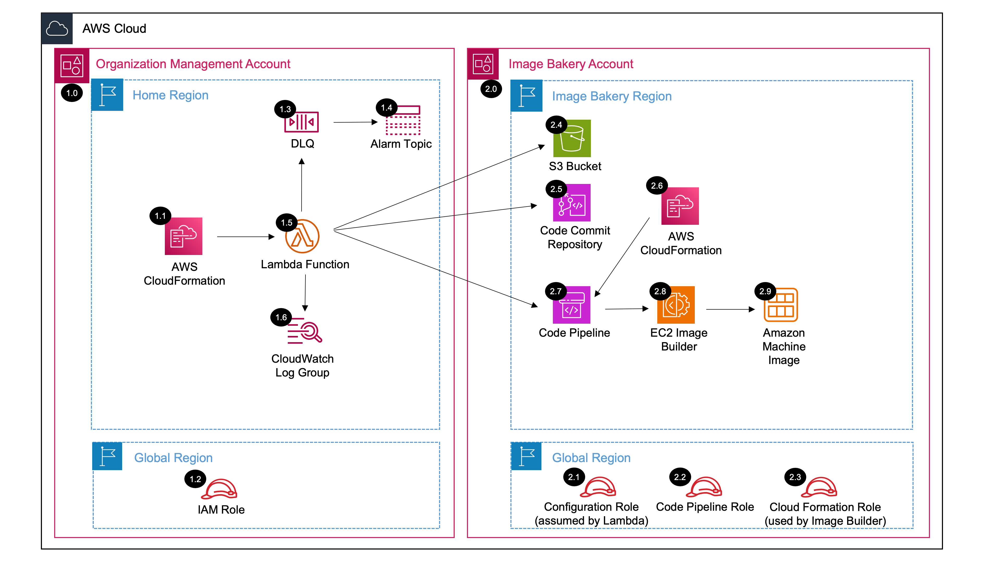

# AMI Bakery Organization<!-- omit in toc -->

Copyright Amazon.com, Inc. or its affiliates. All Rights Reserved. SPDX-License-Identifier: CC-BY-SA-4.0

## Table of Contents

- [Table of Contents](#table-of-contents)
- [Introduction](#introduction)
- [Deployed Resource Details](#deployed-resource-details)
- [Implementation Instructions](#implementation-instructions)
- [Deletion Instructions](#deletion-instructions)
- [References](#references)

---

## Introduction

The AMI Bakery Organization solution will automate creation of standardized and hardened Amazon Machine Operating Images with configurations and services that comply with security standards set by the Government and industry security standards/benchmarks such as and the Security Technical Implementation Guide (STIG) and the Center of Internet Security (CIS).

The solution also provides an easy way to deploy security services such as Amazon Inspector, Amazon Macie, and Amazon GuardDuty that track and report potential vulnerabilities found within the environment. Additionally, the solution, once created, reduces the need to re-create new images when customers move from one multi-account to another as it can be shared and re-used.

**Key solution features:**

- Amazon Linux STIG hardened Image
- Ubuntu Pro CIS Level 1 hardened Image
- Windows CIS Level 1 - `Work on progress`

---

## Deployed Resource Details



### 1.0 Organization Management Account<!-- omit in toc -->

#### 1.1 AWS CloudFormation<!-- omit in toc -->

- All resources are deployed via AWS CloudFormation as a `StackSet` and `Stack Instance` within the `management account` or a CloudFormation `Stack` within a specific account.
- The [Customizations for AWS Control Tower](https://aws.amazon.com/solutions/implementations/customizations-for-aws-control-tower/) solution deploys all templates as a CloudFormation `StackSet`.
- For parameter details, review the [AWS CloudFormation templates](templates/).

#### 1.2 Lambda Role<!-- omit in toc -->

- The `Organizaton Management Lambda Role` is used by the Lambda function to assume a role in the target region.

#### 1.3 DLQ<!-- omit in toc -->

- SQS dead letter queue used for retaining any failed Lambda events.

#### 1.4 Alarm Topic<!-- omit in toc -->

- SNS Topic used to notify subscribers when messages hit the DLQ.

#### 1.5 Lambda Function<!-- omit in toc -->

- The Lambda function assumes a role in the Image Bakery Account and deploys resources to create Amazon Machine Images (AMIs). These resources include a Code Commit Repository to store CloudFormation Templates for creating AMIs, a Code Pipeline to deploy EC2 Image Builder to create AMIs, and other supporting resources such as an S3 Bucket and IAM Roles. The Lambda function also uploads an initial CloudFormation template to the Code Commit Repository.

#### 1.6 CloudWatch Log Group<!-- omit in toc -->

- All the `AWS Lambda Function` logs are sent to a CloudWatch Log Group `</aws/lambda/<LambdaFunctionName>` to help with debugging and traceability of the actions performed.
- By default the `AWS Lambda Function` will create the CloudWatch Log Group and logs are encrypted with a CloudWatch Logs service managed encryption key.
- Parameters are provided for changing the default log group retention and encryption KMS key.

#### 2.0 Image Bakery Account<!-- omit in toc -->

#### 2.1-2.3 Lambda Roles<!-- omit in toc -->

- The `Configuration Role` is assumed by the Lambda function and used to create resources in the Image Bakery Account such as the Code Commit Repository, Code Pipeline, and S3 Bucket.
- The `Code Pipeline Role` is assumed by te Code Pipeline and used to create resources in the Image Bakery Account such as the EC2 Image Builder.
- The `Cloud Formation Role` is assumed by EC2 Image Builder and used to create Amazon Machine Images (AMIs) in the Image Bakery Account.

#### 2.4 S3 bucket<!-- omit in toc -->

- Amazon S3 Bucket for storing Code Commit artifacts.
  
#### 2.5 Code Commit Repository<!-- omit in toc -->

- A Code Commit Repository to store CloudFormation Templates that define EC2 Image Builder, Recipes, Components, etc.

#### 2.6 CloudFormation<!-- omit in toc -->

- AWS CloudFormation Templates describe the EC2 Image Builder, Recipes, Components, etc. used to build Amazon Machine Images (AMIs).
  
#### 2.7 CodePipeline<!-- omit in toc -->

- AWS CodePipeline monitors the CodeCommit Repository for changes to the CloudFormation Templates. When the Repository is updated, CodePipeline automatically updates EC2 Image builder.

#### 2.8 EC2 Image Builder Pipeline<!-- omit in toc -->

- EC2 ImageBuilder builds new Amazon Machine Images (AMIs) based on the CloudFormation Templates in the CodeCommit Repository.

#### 2.9 Amazon Machine Images<!-- omit in toc -->

- Amazon Machine Images (AMIs) are built by EC2 Image Builder. Then can then be used to launch EC2 Instances.

---

## Implementation Instructions

### Prerequisites<!-- omit in toc -->

1. [Download and Stage the SRA Solutions](../../../docs/DOWNLOAD-AND-STAGE-SOLUTIONS.md). **Note:** This only needs to be done once for all the solutions.
2. Verify that the [SRA Prerequisites Solution](../../common/common_prerequisites/) has been deployed.

### Solution Deployment<!-- omit in toc -->

Choose a Deployment Method:

- [AWS CloudFormation](#aws-cloudformation)
- [Customizations for AWS Control Tower](../../../docs/CFCT-DEPLOYMENT-INSTRUCTIONS.md)

#### AWS CloudFormation<!-- omit in toc -->

In the `management account (home region)`, launch an AWS CloudFormation **Stack** using one of the options below:

- **Option 1:** (Recommended) Use the [sra-ami-bakery-org-main-ssm.yaml](templates/sra-ami-bakery-org-main-ssm.yaml) template. This is a more automated approach where some of the CloudFormation parameters are populated from SSM parameters created by
  the [SRA Prerequisites Solution](../../common/common_prerequisites/).

  ```bash
  aws cloudformation deploy --template-file $HOME/aws-security-reference-architecture-examples/aws_sra_examples/solutions/ami_bakery/ami_bakery_org/templates/sra-ami-bakery-org-main-ssm.yaml --stack-name sra-ami-bakery-org-main-ssm --capabilities CAPABILITY_NAMED_IAM --parameter-overrides pAMIBakeryAccountId=<YOUR_ACCOUNT_ID> pAMIBakeryRegion=<YOUR_REGION> pAMIBakeryFileName=<SOLUTION_FILE_NAME.YAML>

**Note:** Below are available cloudformation files, you can change the file names to meet your needs.

1. [sra-ami-bakery-org-stig-hardened.yaml](lambda/src/sra-ami-bakery-org-stig-hardened.yaml)
2. [sra-ami-bakery-org-ubuntu-pro-20-04-cis-level-1-hardened.yaml](sra-ami-bakery-org-ubuntu-pro-20-04-cis-level-1-hardened.yaml)

- **Option 2:** Deploy [sra-ami-bakery-org-main-ssm.yaml](templates/sra-ami-bakery-org-main-ssm.yaml) template using [AWS CloudFormation](https://docs.aws.amazon.com/AWSCloudFormation/latest/UserGuide/cfn-console-create-stack.html) console - Create Stack.

#### Verify Solution Deployment<!-- omit in toc -->

1. Log into the `CodePipeline` console and navigate to the Pipeline page
   1. Select Pipelines under CodePipeline on the left pane
   2. Verify that the Pipeline is created and the `Most recent execution` tab says `Suceeded`
2. Log into the EC2 ImageBuilder console and
   1. Navigate to `Image pipelines` tab, it will displays the `Pipeline` being deployed with Status reads `Green`
   2. Verify that the images has been created by selecting `Images` tab on the left pane

#### Solution Update Instructions<!-- omit in toc -->

1. [Download and Stage the SRA Solutions](../../../docs/DOWNLOAD-AND-STAGE-SOLUTIONS.md). **Note:** Get the latest code and run the staging script.
2. Update the existing CloudFormation Stack or CFCT configuration. **Note:** Make sure to update the `SRA Solution Version` parameter and any new added parameters.

## Deletion Instructions<!-- omit in toc -->

Choose one of the two options below:

- **Option 1:** Use CloudFormation Console
  
1. In the `account (home region)`, identified by `pAMIBakeryAccountId` parameter, delete the AWS CloudFormation **Stack** (`sra-ami-bakery-org-cloudformation-stack`). **Note:** This will delete your solution with associated resources (IAM roles and policies, EC2 Imagebuilder resources, S3 Bucket, Codepipeline resources, etc)
2. In the `account (home region)`, identified by `pAMIBakeryAccountId`, delete the AWS CloudFormation **Stack** (`sra-ami-bakery-org-main-ssm`). **Note:** This will delete all SRA Staging resources
3. In the `account (home region)`, identified by `pAMIBakeryAccountId`, verify that the Lambda function processing is complete by confirming no more CloudWatch logs are generated.
4. In the `account (home region)`, identified by `pAMIBakeryAccountId`, delete the AWS CloudWatch **Log Group** (e.g. /aws/lambda/<solution_name>) for the Lambda function deployed.

- **Option 2:** Use AWS CLI
  
1. `aws cloudformation delete-stact --stack-name sra-ami-bakery-org-cloudformation-stack`.  **Note** This will delete your solution with associated resources (IAM roles and policies, EC2 Imagebuilder resources, S3 Bucket, Codepipeline resources, etc)
2. `aws cloudformation delete-stact --stack-name sra-ami-bakery-org-cloudformation-stack`. **Note:** This will delete all SRA Staging resources

---

## References

- [Managing AWS SDKs in Lambda Functions](https://docs.aws.amazon.com/lambda/latest/operatorguide/sdks-functions.html)
- [Lambda runtimes](https://docs.aws.amazon.com/lambda/latest/dg/lambda-runtimes.html)
- [Python Boto3 SDK changelog](https://github.com/boto/boto3/blob/develop/CHANGELOG.rst)
