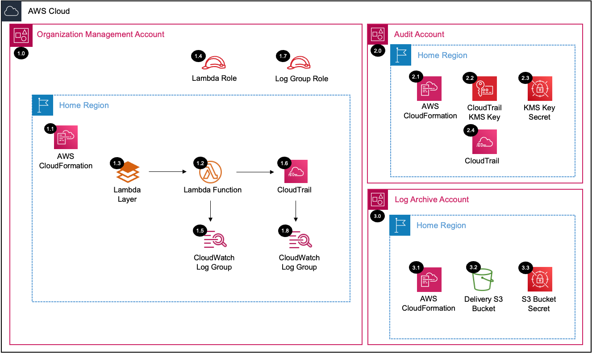

# Organization CloudTrail <!-- omit in toc -->

Copyright Amazon.com, Inc. or its affiliates. All Rights Reserved. SPDX-License-Identifier: CC-BY-SA-4.0

## Table of Contents <!-- omit in toc -->

- [Introduction](#introduction)
- [Deployed Resource Details](#deployed-resource-details)
- [Implementation Instructions](#implementation-instructions)
- [Appendix](#appendix)
- [References](#references)

## Introduction

The Organization CloudTrail solution will create an Organization CloudTrail within the Organization Management Account that is encrypted with a Customer Managed KMS Key managed in the Audit Account and logs delivered to the Log Archive Account. An
Organization CloudTrail logs all events for all AWS accounts in the AWS Organization.

When you create an organization trail, a trail with the name that you give it will be created in every AWS account that belongs to your organization. Users with CloudTrail permissions in member accounts will be able to see this trail when they log
into the AWS CloudTrail console from their AWS accounts, or when they run AWS CLI commands such as describe-trail. However, users in member accounts will not have sufficient permissions to delete the organization trail, turn logging on or off, change
what types of events are logged, or otherwise alter the organization trail in any way.

---

## Deployed Resource Details



### 1.0 Organization Management Account <!-- omit in toc -->

#### 1.1 AWS CloudFormation <!-- omit in toc -->

- All resources are deployed via AWS CloudFormation as a `StackSet` and `Stack Instance` within the management account or a CloudFormation `Stack` within a specific account.
- The [Customizations for AWS Control Tower](https://aws.amazon.com/solutions/implementations/customizations-for-aws-control-tower/) solution deploys all templates as a CloudFormation `StackSet`.
- For parameter details, review the [AWS CloudFormation templates](templates/).

#### 1.2 AWS Lambda Function <!-- omit in toc -->

- The Lambda Function contains logic for configuring the AWS Organization CloudTrail within the `management account`.

#### 1.3 Lambda Execution IAM Role <!-- omit in toc -->

- The AWS Lambda Function Role allows the AWS Lambda service to assume the role and perform actions defined in the attached IAM policies.

#### 1.4 Lambda CloudWatch Log Group <!-- omit in toc -->

- All the `AWS Lambda Function` logs are sent to a CloudWatch Log Group `</aws/lambda/<LambdaFunctionName>` to help with debugging and traceability of the actions performed.
- By default the `AWS Lambda Function` will create the CloudWatch Log Group with a `Retention` (14 days) and are encrypted with a CloudWatch Logs service managed encryption key.

#### 1.5 Organization CloudTrail <!-- omit in toc -->

- AWS CloudTrail for all AWS Organization accounts
- Member accounts are automatically added and cannot modify
- Data events can be disabled via the parameters
- CloudWatch logs can be disabled via the parameters

#### 1.6 Organization CloudTrail CloudWatch Log Group Role <!-- omit in toc -->

- IAM role used to send CloudTrail logs to the CloudWatch log group

#### 1.7 Organization CloudTrail CloudWatch Log Group <!-- omit in toc -->

- Contains the CloudTrail logs with a `Retention` (400 days)

---

### 2.0 Audit Account <!-- omit in toc -->

#### 2.1 AWS CloudFormation <!-- omit in toc -->

- See [1.1 AWS CloudFormation](#11-aws-cloudformation)

#### 2.2 Organization CloudTrail KMS Key <!-- omit in toc -->

- Customer managed KMS key for the AWS Organizations CloudTrail logs and S3 server-side encryption

---

### 3.0 Security Log Archive Account <!-- omit in toc -->

#### 3.1 AWS CloudFormation <!-- omit in toc -->

- See [1.1 AWS CloudFormation](#11-aws-cloudformation)

#### 3.2 Organization CloudTrail S3 Bucket <!-- omit in toc -->

- S3 bucket where the Organization CloudTrail logs are sent for all accounts in the AWS Organization

---

## Implementation Instructions

### Prerequisites <!-- omit in toc -->

- AWS Control Tower is deployed.
- `aws-security-reference-architecture-examples` repository is stored on your local machine or location where you will be deploying from.

### Staging <!-- omit in toc -->

1. In the `management account (home region)`, launch the AWS CloudFormation **Stack** using the [prereq-controltower-execution-role.yaml](../../../utils/aws_control_tower/prerequisites/prereq-controltower-execution-role.yaml) template file as the
   source, to implement the `AWSControlTowerExecution` role pre-requisite.
   - **Note:** Only do this step, if the `AWSControlTowerExecution` IAM role doesn't already exist in the Control Tower `management account`.
2. In the `management account (home region)`, launch the AWS CloudFormation **StackSet** targeting only the `management account` in all of the enabled regions (include home region)
   [prereq-lambda-s3-bucket.yaml](../../../utils/aws_control_tower/prerequisites/prereq-lambda-s3-bucket.yaml) template file as the source, to implement an S3 bucket that will store the Lambda Zip files. (Example Bucket Name:
   `lambda-zips-<Management Account ID>-<AWS Region>`)
   - For additional guidance see [CloudFormation StackSet Instructions](#cloudformation-stackset-instructions)
   - Take note of the S3 Bucket Name from the CloudFormation Outputs, as you will need it for both the packaging step, and the **Solution Deployment Order** section.
   - **Note:** Only do this step if you don't already have an S3 bucket to store the Lambda zip files for CloudFormation custom resources in the Control Tower `management account`.
     - Lambda functions can only access Zip files from an S3 bucket in the same AWS region as the where Lambda function resides.
     - Although for this solution, S3 bucket is only needed in the `home region`, it is recommended to deploy the S3 bucket as a **stackset**, so that you can support future Lambda functions in other regions.
3. Package the Lambda code into a zip file and upload it to the S3 bucket (from above step), using the [Packaging script](../../../utils/packaging_scripts/package-lambda.sh).
   - `SRA_REPO` environment variable should point to the folder where `aws-security-reference-architecture-examples` repository is stored.
   - `BUCKET` environment variable should point to the S3 Bucket where the Lambda zip files are stored.
   - See CloudFormation Output from Step 2
     - Or follow this syntax: `lambda-zips-<CONTROL-TOWER-MANAGEMENT-ACCOUNT>-<CONTROL-TOWER-HOME-REGION>`

```bash
# Example (assumes repository was downloaded to your home directory)
export SRA_REPO="$HOME"/aws-security-reference-architecture-examples
export BUCKET=sra-staging-123456789012-us-east-1
sh "$SRA_REPO"/aws_sra_examples/utils/packaging_scripts/package-lambda.sh \
--file_name cloudtrail-org.zip \
--bucket $BUCKET \
--src_dir "$SRA_REPO"/aws_sra_examples/solutions/cloudtrail/cloudtrail_org/lambda/src
```

```bash
# Export AWS CLI profile for the 'management account'
export AWS_ACCESS_KEY_ID=
export AWS_SECRET_ACCESS_KEY=
export AWS_SESSION_TOKEN=

# Use template below and set the 'SRA_REPO' and 'BUCKET' with your values.
export SRA_REPO=
export BUCKET=
sh "$SRA_REPO"/aws_sra_examples/utils/packaging_scripts/package-lambda.sh \
--file_name cloudtrail-org.zip \
--bucket $BUCKET \
--src_dir "$SRA_REPO"/aws_sra_examples/solutions/cloudtrail/cloudtrail_org/lambda/src
```

### Solution Deployment <!-- omit in toc -->

#### Customizations for AWS Control Tower <!-- omit in toc -->

- [Customizations for AWS Control Tower](./customizations_for_aws_control_tower)

#### AWS CloudFormation <!-- omit in toc -->

1. In the `management account (home region)`, launch an AWS CloudFormation **Stack Set** and deploy to the `Audit account (home region)` using the [sra-cloudtrail-kms.yaml](templates/sra-cloudtrail-org-kms.yaml) template file as the source.
2. In the `management account (home region)`, launch an AWS CloudFormation **Stack Set** and deploy to the `Log Archive account (home region)` using the [sra-cloudtrail-org-bucket.yaml](templates/sra-cloudtrail-org-bucket.yaml) template file as the
   source.
3. In the `management account (home region)`, launch an AWS CloudFormation **Stack** using the [sra-cloudtrail-org.yaml](templates/sra-cloudtrail-org.yaml) template file as the source.
4. After the initial deployment, uncomment the bucket policy statements within the [sra-cloudtrail-org-bucket.yaml](templates/sra-cloudtrail-org-bucket.yaml) and update the AWS CloudFormation **Stack Set** created in step 2

> If replacing an existing Organization Trail with this solution:
>
> - Update any metric filters and any other resources that reference the CloudWatch Log Group
> - If a CloudWatch Log Group Subscription is used for forwarding the logs, remove the Subscription from the old group and add it to the new group

#### Verify Solution Deployment <!-- omit in toc -->

1. Log into the `Management account` and navigate to the CloudTrail page
2. Select Trails and select the "sra-cloudtrail-org" trail
3. Verify the correct configurations have been applied

#### Solution Delete Instructions <!-- omit in toc -->

1. In the `management account (home region)`, delete the AWS CloudFormation **Stack** created in step 3 of the solution deployment.
2. In the `management account (home region)`, delete the AWS CloudFormation **StackSet** created in step 2 of the solution deployment. **Note:** there should not be any `stack instances` associated with this StackSet.
3. In the `management account (home region)`, delete the AWS CloudFormation **StackSet** created in step 1 of the solution deployment. **Note:** there should not be any `stack instances` associated with this StackSet.
4. In the `management account (home region)`, delete the AWS CloudWatch **Log Group** (e.g. /aws/lambda/<solution_name>) for the Lambda function deployed in step 3 of the solution deployment.

---

## Appendix

### CloudFormation StackSet Instructions <!-- omit in toc -->

If you need to launch an AWS CloudFormation **StackSet** in the `management account`, see below steps (for additional details, see
[Create a stack set with self-managed permissions](https://docs.aws.amazon.com/AWSCloudFormation/latest/UserGuide/stacksets-getting-started-create.html#stacksets-getting-started-create-self-managed))

1. AWS CloudFormation -> StackSets -> Create StackSet
2. Choose a Template (upload template)
3. Specify StackSet Details (enter parameter values)
4. Configure StackSet Options -> Self-service permissions
   - IAM Admin Role Name: `AWSControlTowerStackSetRole`
   - IAM Execution Role Name: `AWSControlTowerExecution`
5. Set Deployment Options -> Deploy New Stacks
   - Deploy Stacks in Accounts -> enter the AWS Control Tower Management Account ID
   - Specify Regions: choose regions you want to deploy stacks too (include home region)
6. If in future, you need to update the Stack Set (e.g., add/remove a region), see [Getting Started with AWS CloudFormation StackSets](https://docs.aws.amazon.com/AWSCloudFormation/latest/UserGuide/stacksets-getting-started.html)

---

## References

- [Creating a CloudTrail for the Organization](https://docs.aws.amazon.com/awscloudtrail/latest/userguide/creating-trail-organization.html)
- [Allowing Cross-Account Access to a KMS Key](https://docs.aws.amazon.com/kms/latest/developerguide/key-policy-modifying-external-accounts.html)
