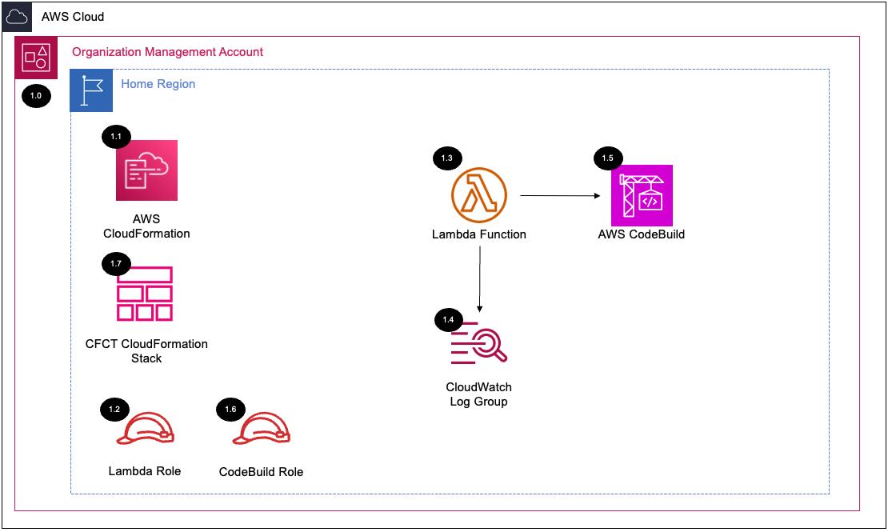

# Customizations for AWS Control Tower (CFCT) Setup<!-- omit in toc -->

Copyright Amazon.com, Inc. or its affiliates. All Rights Reserved. SPDX-License-Identifier: CC-BY-SA-4.0

## Table of Contents<!-- omit in toc -->

- [Introduction](#introduction)
- [Deployed Resource Details](#deployed-resource-details)
- [Implementation Instructions](#implementation-instructions)
- [References](#references)

## Introduction

The `SRA Customizations for Control Tower (CFCT) Solution` deploys the [Customizations for AWS Control Tower](https://aws.amazon.com/solutions/implementations/customizations-for-aws-control-tower/) (CFCT) solution. This provides a method to simplify
the deployment of SRA solutions and customer customizations within an AWS Control Tower environment.

The Customizations for AWS Control Tower solution combines AWS Control Tower and other highly-available, trusted AWS services to help customers more quickly set up a secure, multi-account AWS environment using AWS best practices. Before deploying
this solution, you must have an AWS Control Tower landing zone deployed in your account.

You can easily add customizations to your AWS Control Tower landing zone using an AWS CloudFormation template and service control policies (SCPs). You can deploy the custom template and policies to individual accounts and organizational units (OUs)
within your organization. This solution integrates with AWS Control Tower lifecycle events to ensure that resource deployments stay in sync with your landing zone. For example, when a new account is created using the AWS Control Tower account
factory, the solution ensures that all resources attached to the account's OUs will be automatically deployed.

## Deployed Resource Details



### 1.0 Organization Management Account<!-- omit in toc -->

#### 1.1 AWS CloudFormation<!-- omit in toc -->

- All resources are deployed via AWS CloudFormation as a Stack within the management account.
- For parameter details, review the AWS [CloudFormation templates](templates/).

#### 1.2 Lambda Execution IAM Role<!-- omit in toc -->

- IAM role used by the Lambda function to perform the start operation for the sra-codebuild AWS CodeBuild project.

#### 1.3 AWS Lambda Function<!-- omit in toc -->

The Lambda function to perform the start operation for the sra-codebuild AWS CodeBuild project.

#### 1.4 Lambda CloudWatch Log Group<!-- omit in toc -->

- All the `AWS Lambda Function` logs are sent to a CloudWatch Log Group `</aws/lambda/<LambdaFunctionName>` to help with debugging and traceability of the actions performed.
- By default the `AWS Lambda Function` will create the CloudWatch Log Group with a `Retention` (Never expire) and are encrypted with a CloudWatch Logs service managed encryption key.

#### 1.5 AWS CodeBuild Project Created
The sra-codebuild AWS CodeBuild project is designed and created to download the latest customizations-for-aws-control-tower.template template from GitHub and upload it to the AWS SRA code library staging S3 bucket.

#### 1.6 CodeBuild IAM Role<!-- omit in toc -->

- IAM role used by the CodeBuild project.

#### 1.7 Customizations for AWS Control Tower CloudFormation Template<!-- omit in toc -->
- The [Customizations for AWS Control Tower](https://aws.amazon.com/solutions/implementations/customizations-for-aws-control-tower/) (CFCT) solution to support deploying customizations easily to your AWS Control Tower landing zone.
- Defaults updated per SRA recommendations:
  - Latest template downloaded from [GitHub - customizations-for-aws-control-tower.template](https://github.com/aws-solutions/aws-control-tower-customizations/blob/main/customizations-for-aws-control-tower.template)
  - `AWS CodePipeline Source` = AWS CodeCommit
  - `Failure Tolerance Percentage` = 0

## Implementation Instructions

### Prerequisites<!-- omit in toc -->

- AWS Control Tower is deployed.
- `aws-security-reference-architecture-examples` repository is stored on your local machine or pipeline where you will be deploying from.
- Ensure the [SRA Prerequisites Solution](../common_prerequisites/) was deployed.

### Solution Deployment<!-- omit in toc -->

1. In the `management account (home region)`, launch an AWS CloudFormation **Stack** using the [sra-common-cfct-setup-main.yaml](templates/sra-common-cfct-setup-main.yaml) template file as the source.

   ```bash
   aws cloudformation deploy --template-file $HOME/aws-sra-examples/aws_sra_examples/solutions/common/common_cfct_setup/templates/sra-common-cfct-setup-main.yaml --stack-name sra-common-cfct-setup-main --capabilities CAPABILITY_NAMED_IAM
   ```

2. For CodeCommit setup follow these steps: [AWS CodeCommit Repo](../../../docs/CFCT-DEPLOYMENT-INSTRUCTIONS.md#aws-codecommit-repo)

### Solution Delete Instructions<!-- omit in toc -->

In the `management account (home region)`, delete the AWS CloudFormation Stack created in step 2 of the solution deployment. **Note:** On a Delete Event, the solution will not:

- Delete below Customizations for Control Tower (CFCT) resources:
- CodeCommit Repo (e.g., `custom-control-tower-configuration`)
- S3 Buckets (e.g., buckets names containing `custom-control-tower` or `customcontroltower`)

## References

- [How AWS Control Tower works with roles to create and manage accounts](https://docs.aws.amazon.com/controltower/latest/userguide/roles-how.html)
- [AWS Systems Manager Parameter Store](https://docs.aws.amazon.com/systems-manager/latest/userguide/systems-manager-parameter-store.html)
- [Working with AWS CloudFormation StackSets](https://docs.aws.amazon.com/AWSCloudFormation/latest/UserGuide/what-is-cfnstacksets.html)
- [Customizations for AWS Control Tower](https://aws.amazon.com/solutions/implementations/customizations-for-aws-control-tower/)
