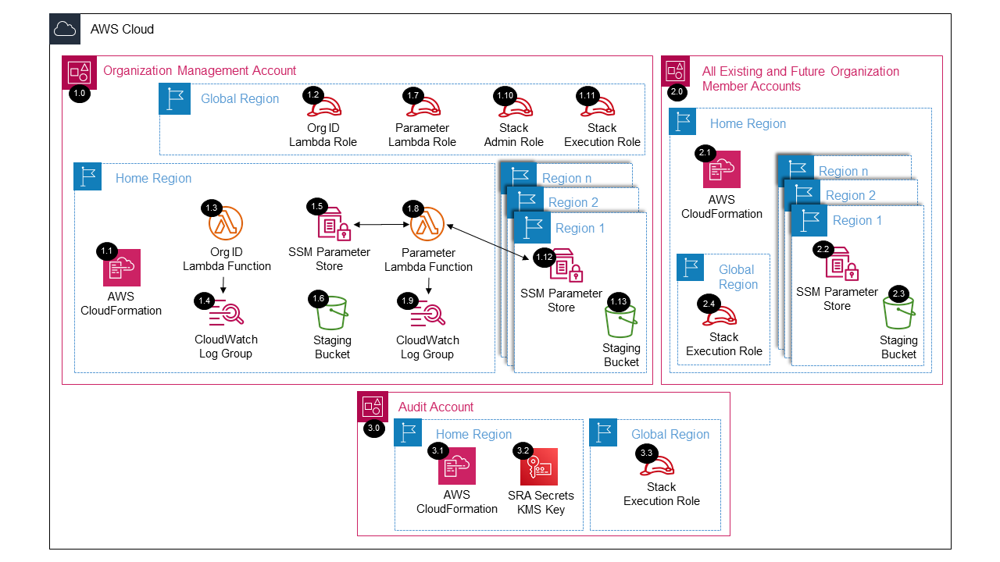

# SRA Prerequisites<!-- omit in toc -->

Copyright Amazon.com, Inc. or its affiliates. All Rights Reserved. SPDX-License-Identifier: CC-BY-SA-4.0

## Table of Contents<!-- omit in toc -->

- [Introduction](#introduction)
- [Deployed Resource Details](#deployed-resource-details)
- [Implementation Instructions](#implementation-instructions)
- [References](#references)

## Introduction

The `SRA Prerequisites Solution` creates the resources (`Staging S3 Buckets` and `Execution IAM Role`) and configuration (`SSM Parameters`) for simplifying the deployment of SRA solutions within an AWS Control Tower environment. All resources that support tags are provided a tag keypair of `sra-solution: sra-common-prerequisites`.

## Deployed Resource Details



### 1.0 Organization Management Account<!-- omit in toc -->

#### 1.1 AWS CloudFormation<!-- omit in toc -->

- All resources are deployed via AWS CloudFormation as a StackSet and Stack Instance within the management account or a CloudFormation Stack within a specific account.
- The [Customizations for AWS Control Tower](https://aws.amazon.com/solutions/implementations/customizations-for-aws-control-tower/) solution deploys all templates as a CloudFormation `StackSet`.
- For parameter details, review the AWS [CloudFormation templates](templates/).

#### 1.2 Org ID AWS Lambda IAM Role<!-- omit in toc -->

- The AWS Org ID Lambda IAM Role allows the AWS Lambda service to assume the role and perform actions defined in the attached IAM policies.

#### 1.3 Org ID AWS Lambda Function<!-- omit in toc -->

- An external deployment package is used in the AWS Lambda Function in the [sra-common-prerequisites-staging-s3-bucket.yaml](templates/sra-common-prerequisites-staging-s3-bucket.yaml) that contains the logic to determine the AWS Organization ID
- The function is triggered by CloudFormation Create, Update, and Delete events.

#### 1.4 AWS Lambda CloudWatch Log Group<!-- omit in toc -->

- `AWS Lambda Function` logs are sent to a CloudWatch Log Group `</aws/lambda/<LambdaFunctionName>` to help with debugging and traceability of the actions performed.
- By default the `AWS Lambda Function` will create the CloudWatch Log Group with a `Retention` (Never expire) and the logs are encrypted with a CloudWatch Logs service managed encryption key.
- Optional parameters are included to allow creating the CloudWatch Log Group, which allows setting `KMS Encryption` using a customer managed KMS key and setting the `Retention` to a specific value (e.g. 14 days).

#### 1.5 AWS SSM Parameter Store<!-- omit in toc -->

- Configuration parameters are created/updated within the `SSM Parameter Store` on CloudFormation events and the parameters are used to simplify deployment of this solution and future SRA solutions.
- All parameters are created under the `/sra/` hierarchy path in all regions of the `management account`.
- Optional parameters are included to create the parameters in all `member accounts` in the same regions that are enabled in the `management account`.
  - This allows for common SSM parameters to be resolved in the `member accounts` for future SRA solutions, and customer workload solutions.
- Common parameters created will be retained even if the CloudFormation stacks from this solution are deleted.

#### 1.6 Staging S3 Bucket<!-- omit in toc -->

- The S3 Bucket is used to store solution files (Lambda Zip files, CloudFormation templates, and other deployment files) that will be used for staging.
- S3 bucket is created in all regions of the `management account` with a name following this syntax: `sra-staging-<aws-account-number>-<aws-region>`.
- Optional parameters are included to create an S3 bucket in all `member accounts` in the same regions that are enabled in the `management account` with a name following this syntax: `sra-staging-<aws-account-number>-<aws-region>`.
  - This allows for a staging S3 bucket to be used in the `member accounts` for future SRA solutions, and customer workload solutions.

#### 1.7 Parameter AWS Lambda IAM Role<!-- omit in toc -->

- The AWS Lambda Function Role allows the AWS Lambda service to assume the role and perform actions defined in the attached IAM policies.

#### 1.8 Parameter AWS Lambda Function<!-- omit in toc -->

- An inline AWS Lambda Function in the [sra-common-prerequisites-management-account-parameters.yaml](templates/sra-common-prerequisites-management-account-parameters.yaml) contains the logic for discovering common values in your Control Tower landing
  zone. (e.g., Root Organizational Unit ID, Control Tower Home Region, Audit Account ID)
- The function is triggered by CloudFormation Create, Update, and Delete events.

#### 1.9 AWS Lambda CloudWatch Log Group<!-- omit in toc -->

- See [1.4 AWS Lambda CloudWatch Log Group](#14-aws-lambda-cloudwatch-log-group)

#### 1.10 AWS Control Tower Execution Role<!-- omit in toc -->

- The `AWSControlTowerExecution` Role provides the support needed to deploy solutions to the `management account` across regions as CloudFormation `StackSets`.

#### 1.11 AWS SSM Parameter Store<!-- omit in toc -->

- See [1.5 AWS SSM Parameter Store](#15-aws-ssm-parameter-store)

#### 1.12 Staging S3 Bucket<!-- omit in toc -->

- See [1.6 Staging S3 Bucket](#16-staging-s3-bucket)

### All Existing and Future Organization Member Accounts<!-- omit in toc -->

#### 2.1 AWS CloudFormation<!-- omit in toc -->

- See [1.1 AWS CloudFormation](#11-aws-cloudformation)

#### 2.2 AWS SSM Parameter Store<!-- omit in toc -->

- See [1.5 AWS SSM Parameter Store](#15-aws-ssm-parameter-store)

#### 2.3 Staging S3 Bucket<!-- omit in toc -->

- See [1.6 Staging S3 Bucket](#16-staging-s3-bucket)

## Implementation Instructions

### Prerequisites<!-- omit in toc -->

- AWS Control Tower is deployed.
- `aws-security-reference-architecture-examples` repository is stored on your local machine or pipeline where you will be deploying from.
- **Note:** If the parameter `Create SRA Staging S3 Bucket in Member Accounts = true`, make sure the following elective AWS Control Tower guardrails are disabled for all OUs:
  - Disallow Changes to Encryption Configuration for Amazon S3 Buckets
  - Disallow Changes to Logging Configuration for Amazon S3 Buckets
  - Disallow Changes to Bucket Policy for Amazon S3 Buckets
  - Disallow Changes to Lifecycle Configuration for Amazon S3 Buckets

### Solution Deployment<!-- omit in toc -->

1. In the `management account (home region)`, launch the AWS CloudFormation **Stack** using the [sra-common-prerequisites-staging-s3-bucket.yaml](templates/sra-common-prerequisites-staging-s3-bucket.yaml) template file as the source.
2. Package the solution, see the [Staging](#staging) instructions.
3. Choose a Deployment Method:
   - [AWS CloudFormation](#aws-cloudformation)
   - [Customizations for AWS Control Tower](../../../docs/DEPLOYMENT-METHODS.md#customizations-for-aws-control-tower-deployment-instructions)

#### AWS CloudFormation<!-- omit in toc -->

1. In the `management account (home region)`, launch the AWS CloudFormation **Stack** using the [sra-common-prerequisites-management-account-parameters.yaml](templates/sra-common-prerequisites-management-account-parameters.yaml) template file as the
   source.
2. In the `management account (home region)`, launch the AWS CloudFormation **Stack** using the template file as the source from the below chosen options:
   - **Option 1:** (Recommended) Use this template, [sra-common-prerequisites-main-ssm.yaml](templates/sra-common-prerequisites-main-ssm.yaml), for a more automated approach where CloudFormation parameters resolve SSM parameters.
   - **Option 2:** Use this template, [sra-common-prerequisites-main.yaml](templates/sra-common-prerequisites-main.yaml), where input is required for the CloudFormation parameters, without resolving SSM parameters.

### Staging<!-- omit in toc -->

1. Package the Lambda code into a zip file and upload the solution files (Lambda Zip files, CloudFormation templates, and other deployment files) to the SRA Staging S3 bucket (from above step), using the
   [Packaging script](../../../utils/packaging_scripts/stage_solution.sh).

   - `SRA_REPO` environment variable should point to the folder where `aws-security-reference-architecture-examples` repository is stored.
   - `BUCKET` environment variable should point to the S3 Bucket where the solution files are stored.
   - See CloudFormation Output from Step 1 in the [Solution Deployment](#solution-deployment) instructions. Or follow this syntax: `sra-staging-<CONTROL-TOWER-MANAGEMENT-ACCOUNT>-<CONTROL-TOWER-HOME-REGION>`

     ```bash
     # Example (assumes repository was downloaded to your home directory)
     export SRA_REPO="$HOME"/aws-security-reference-architecture-examples/aws_sra_examples
     export BUCKET=sra-staging-123456789012-us-east-1
     sh "$SRA_REPO"/utils/packaging_scripts/stage_solution.sh \
         --staging_bucket_name $BUCKET \
         --solution_directory "$SRA_REPO"/solutions/common/common_prerequisites
     ```

     ```bash
     # Use template below and set the 'SRA_REPO' and 'SRA_BUCKET' with your values.
     export SRA_REPO=
     export BUCKET=
     sh "$SRA_REPO"/utils/packaging_scripts/stage_solution.sh \
         --staging_bucket_name $BUCKET \
         --solution_directory "$SRA_REPO"/solutions/common/common_prerequisites
     ```

## References

- [How AWS Control Tower works with roles to create and manage accounts](https://docs.aws.amazon.com/controltower/latest/userguide/roles-how.html)
- [AWS Systems Manager Parameter Store](https://docs.aws.amazon.com/systems-manager/latest/userguide/systems-manager-parameter-store.html)
- [Working with AWS CloudFormation StackSets](https://docs.aws.amazon.com/AWSCloudFormation/latest/UserGuide/what-is-cfnstacksets.html)
