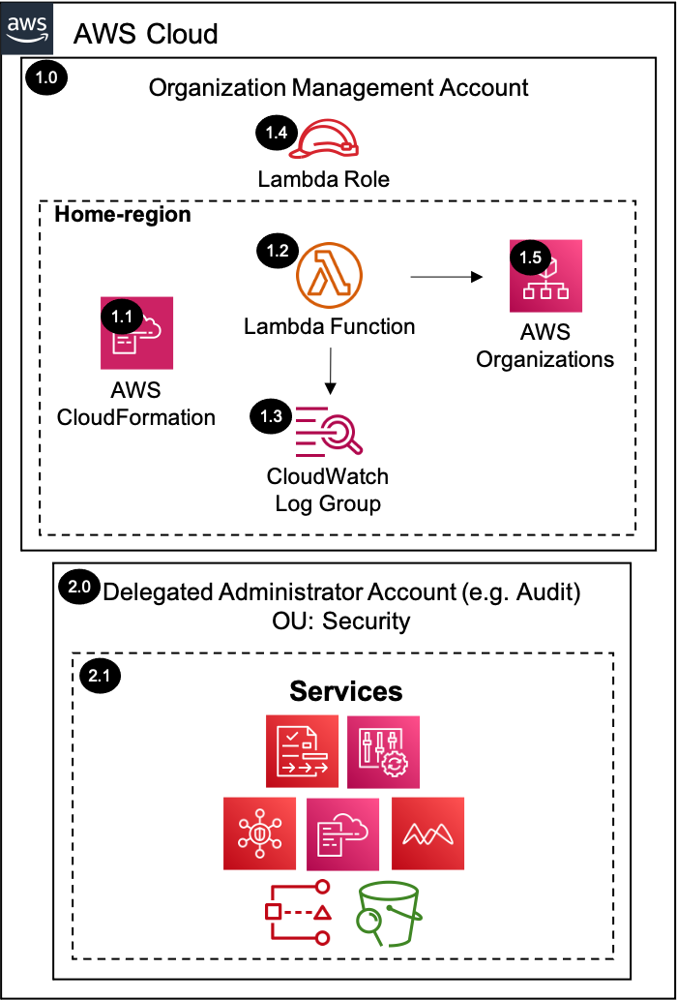

# Register Delegated Administrator Account<!-- omit in toc -->

Copyright Amazon.com, Inc. or its affiliates. All Rights Reserved. SPDX-License-Identifier: CC-BY-SA-4.0

## Table of Contents<!-- omit in toc -->

- [Introduction](#introduction)
- [Deployed Resource Details](#deployed-resource-details)
- [Implementation Instructions](#implementation-instructions)
- [References](#references)

---

## Introduction

The register delegated administrator account solution is a common solution to register a delegated administrator account (e.g. Security Tooling Account) within the AWS Organizations management account using the AWS Organizations APIs.

---

## Deployed Resource Details



### 1.0 Organization Management Account<!-- omit in toc -->

#### 1.1 AWS CloudFormation<!-- omit in toc -->

- All resources are deployed via AWS CloudFormation as a `StackSet` and `Stack Instance` within the management account or a CloudFormation `Stack` within a specific account.
- The [Customizations for AWS Control Tower](https://aws.amazon.com/solutions/implementations/customizations-for-aws-control-tower/) solution deploys all templates as a CloudFormation `StackSet`.
- For parameter details, review the [AWS CloudFormation templates](templates/).

#### 1.2 AWS Lambda Function<!-- omit in toc -->

- The Lambda function delegates the administrator account for the provided service principals

#### 1.3 Lambda CloudWatch Log Group<!-- omit in toc -->

- Contains Lambda function execution logs

#### 1.4 Lambda Execution IAM Role<!-- omit in toc -->

- IAM role used by the Lambda function to enable AWS service access for the provided service and register an AWS account as the delegated administrator.

#### 1.5 AWS Organizations<!-- omit in toc -->

- AWS Organizations APIs are used to delegate the administrator account

---

### 2.0 Delegated Administrator Account (Audit)<!-- omit in toc -->

#### 2.1 Services Supported<!-- omit in toc -->

- The services that support a delegated administrator account can be configured and managed within this account.
- Service Principal Mapping

| Service                      | Service Principal                      |
| ---------------------------- | -------------------------------------- |
| AWS IAM Access Analyzer      | access-analyzer.amazonaws.com          |
| AWS Audit Manager            | auditmanager.amazonaws.com             |
| AWS CloudFormation StackSets | stacksets.cloudformation.amazonaws.com |
| AWS Config                   | config.amazonaws.com                   |
| AWS Config Conformance Packs | config-multiaccountsetup.amazonaws.com |
| Amazon Macie                 | macie.amazonaws.com                    |
| AWS Security Hub             | securityhub.amazonaws.com              |
| Amazon S3 Storage Lens       | storage-lens.s3.amazonaws.com          |

---

## Implementation Instructions

### Prerequisites<!-- omit in toc -->

1. [Download and Stage the SRA Solutions](../../../docs/DOWNLOAD-AND-STAGE-SOLUTIONS.md). **Note:** This only needs to be done once for all the solutions.
2. Verify that the [SRA Prerequisites Solution](../../common/common_prerequisites/) has been deployed.

### Solution Deployment<!-- omit in toc -->

Choose a Deployment Method:

- [AWS CloudFormation](#aws-cloudformation)
- [Customizations for AWS Control Tower](../../../docs/CFCT-DEPLOYMENT-INSTRUCTIONS.md)

#### AWS CloudFormation<!-- omit in toc -->

In the `management account (home region)`, launch an AWS CloudFormation **Stack** using one of the options below:

- **Option 1:** (Recommended) Use the [sra-common-register-delegated-administrator-ssm.yaml](templates/sra-common-register-delegated-administrator-ssm.yaml) template. This is a more automated approach where some of the CloudFormation parameters are populated from SSM parameters created by the [SRA Prerequisites Solution](../../common/common_prerequisites/). The `Audit account` is set as the delegated administrator account for all the associated SRA solutions.
- **Option 2:** Use the [sra-common-register-delegated-administrator.yaml](templates/sra-common-register-delegated-administrator.yaml) template. Input is required for the CloudFormation parameters where the default is not set.

#### Verify Solution Deployment<!-- omit in toc -->

- Verify the configuration using the following AWS CLI shell script

  ```shell
  # Export management account AWS credentials before running the below command
  for accountId in $(aws organizations list-delegated-administrators --query 'DelegatedAdministrators[*].Id' \
  --output text); do echo -e "$accountId\n Service Principals: " \
  $(aws organizations list-delegated-services-for-account --account-id $accountId \
  --query 'DelegatedServices[*].ServicePrincipal'); done
  ```

#### Solution Delete Instructions<!-- omit in toc -->

1. In the `management account (home region)`, delete the AWS CloudFormation **Stack** created in the solution deployment.
2. In the `management account (home region)`, delete the AWS CloudWatch **Log Group** (e.g. /aws/lambda/<solution_name>) for the deployed Lambda function.

---

## References

- [AWS services that you can use with AWS Organizations](https://docs.aws.amazon.com/organizations/latest/userguide/orgs_integrate_services_list.html)
