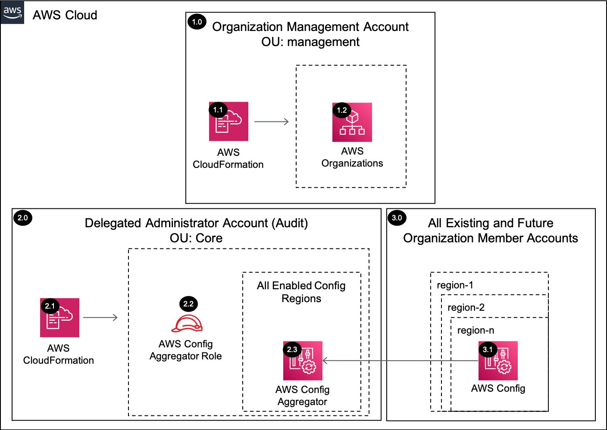

# AWS Config Aggregator<!-- omit in toc -->

Copyright Amazon.com, Inc. or its affiliates. All Rights Reserved. SPDX-License-Identifier: CC-BY-SA-4.0

## Table of Contents<!-- omit in toc -->

- [Introduction](#introduction)
- [Deployed Resource Details](#deployed-resource-details)
- [Implementation Instructions](#implementation-instructions)
- [References](#references)

---

## Introduction

The AWS Config Aggregator Organization solution configures an AWS Config aggregator by delegating administration to a member account (e.g. Audit or Security Tooling) within the Organization Management account and then configuring AWS Config
Aggregator within the delegated administrator account for all the existing and future AWS Organization accounts.

**Note:** This solution is not required for most AWS Control Tower environments due to the existing AWS Config Aggregator configured by the service within the `Audit account`. If configuring an organization AWS Config Aggregator within an account
other than the `Audit account` is a requirement, this solution can meet the requirement.

---

## Deployed Resource Details



### 1.0 Organization Management Account<!-- omit in toc -->

#### 1.1 AWS CloudFormation<!-- omit in toc -->

- All resources are deployed via AWS CloudFormation as a `StackSet` and `Stack Instance` within the management account or a CloudFormation `Stack` within a specific account.
- The [Customizations for AWS Control Tower](https://aws.amazon.com/solutions/implementations/customizations-for-aws-control-tower/) solution deploys all templates as a CloudFormation `StackSet`.
- For parameter details, review the [AWS CloudFormation templates](templates/).

#### 1.2 AWS Organizations<!-- omit in toc -->

- AWS Organizations is used to delegate an administrator account for AWS Config and to identify AWS accounts for aggregation.

---

### 2.0 Delegated Administrator Account (e.g. Security Tooling, Audit)<!-- omit in toc -->

The example solutions use `Audit Account` instead of `Security Tooling Account` to align with the default account name used within the AWS Control Tower setup process for the Security Account. The Account ID for the `Audit Account` SSM parameter is
populated from the `SecurityAccountId` parameter within the `AWSControlTowerBP-BASELINE-CONFIG` StackSet.

#### 2.1 AWS CloudFormation<!-- omit in toc -->

- See [1.1 AWS CloudFormation](#11-aws-cloudformation)

#### 2.2 AWS Config Aggregator IAM Role<!-- omit in toc -->

- IAM role used by AWS Config to access AWS Organizations APIs

#### 2.3 AWS Config Aggregator<!-- omit in toc -->

- AWS Config Aggregator is configured for the AWS Organization and all AWS Regions.

---

### 3.0 All Existing and Future Organization Member Accounts<!-- omit in toc -->

#### 3.1 AWS Config Aggregator<!-- omit in toc -->

- AWS Config Aggregator within each member account has Authorizations for the Delegated Administrator Account to collect AWS Config compliance and configuration data.

---

## Implementation Instructions

### Prerequisites<!-- omit in toc -->

1. [Download and Stage the SRA Solutions](../../../docs/DOWNLOAD-AND-STAGE-SOLUTIONS.md). **Note:** This only needs to be done once for all the solutions.
2. Verify that the [SRA Prerequisites Solution](../../common/common_prerequisites/) has been deployed.

### Solution Deployment<!-- omit in toc -->

Choose a Deployment Method:

- [AWS CloudFormation](#aws-cloudformation)
- [Customizations for AWS Control Tower](../../../docs/CFCT-DEPLOYMENT-INSTRUCTIONS.md)

#### AWS CloudFormation<!-- omit in toc -->

In the `management account (home region)`, launch the [sra-config-aggregator-org-main-ssm.yaml](templates/sra-config-aggregator-org-main-ssm.yaml) template. This uses an approach where some of the CloudFormation parameters are populated from SSM
  parameters created by the [SRA Prerequisites Solution](../../common/common_prerequisites/).

  ```bash
  aws cloudformation deploy --template-file $HOME/aws-sra-examples/aws_sra_examples/solutions/config/config_aggregator_org/templates/sra-config-aggregator-org-main-ssm.yaml --stack-name sra-config-aggregator-org-main-ssm --capabilities CAPABILITY_NAMED_IAM
  ```

#### Verify Solution Deployment<!-- omit in toc -->

- Log into the Audit account and navigate to the AWS Config page
  1. Verify the correct AWS Config Aggregator configurations have been applied.
  2. Verify all existing accounts have been enabled. **Note:** It can take a few minutes to complete.

#### Solution Delete Instructions<!-- omit in toc -->

1. In the `management account (home region)`, delete the AWS CloudFormation **StackSet** created in the solution deployment. **Note:** there should not be any `stack instances` associated with this StackSet.
2. Clean up the `delegated administrator` registered in the **Prerequisites**

---

## References

- [Multi-Account Multi-Region Data Aggregation](https://docs.aws.amazon.com/config/latest/developerguide/aggregate-data.html)
