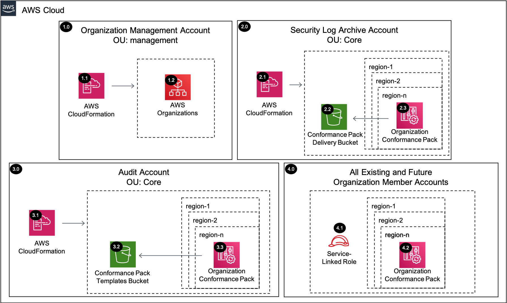

# Conformance Pack Organization Rules <!-- omit in toc -->

Copyright Amazon.com, Inc. or its affiliates. All Rights Reserved. SPDX-License-Identifier: CC-BY-SA-4.0

## Table of Contents <!-- omit in toc -->

- [Introduction](#introduction)
- [Deployed Resource Details](#deployed-resource-details)
- [Implementation Instructions](#implementation-instructions)
- [References](#references)

---

## Introduction

The Conformance Pack Organization Rules solution deploys Organization AWS Config rules by delegating administration to a member account within the Organization Management account and then creating an Organization Conformance Pack within the delegated
administrator account for all the existing and future AWS Organization accounts.

An [AWS Config Conformance Pack](https://docs.aws.amazon.com/config/latest/developerguide/conformance-packs.html) is a collection of AWS Config rules and remediation actions that can be easily deployed as a single entity in an account and a Region or
across an organization in AWS Organizations.

Conformance packs are created by authoring a YAML template that contains the list of AWS Config managed or custom rules and remediation actions. You can deploy the template by using the AWS Config console or the AWS CLI. To quickly get started and to
evaluate your AWS environment, use one of the sample conformance pack templates.

---

## Deployed Resource Details

### 1.0 Organization Management Account <!-- omit in toc -->

#### 1.1 AWS CloudFormation <!-- omit in toc -->

- All resources are deployed via AWS CloudFormation as a `StackSet` and `Stack Instance` within the management account or a CloudFormation `Stack` within a specific account.
- The [Customizations for AWS Control Tower](https://aws.amazon.com/solutions/implementations/customizations-for-aws-control-tower/) solution deploys all templates as a CloudFormation `StackSet`.
- For parameter details, review the [AWS CloudFormation templates](templates/).

#### 1.2 AWS Organizations <!-- omit in toc -->

- AWS Organizations is used to delegate an administrator account for AWS Config and to identify AWS accounts for aggregation.

---

### 2.0 Security Log Archive Account <!-- omit in toc -->

#### 2.1 AWS CloudFormation <!-- omit in toc -->

- See [1.1 AWS CloudFormation](#11-aws-cloudformation)

#### 2.2 Conformance Pack Delivery Bucket <!-- omit in toc -->

- Organization Conformance Packs require a delivery S3 bucket with "awsconfigconforms" as the bucket name prefix. We create this bucket within the Security Log Archive account to stay consistent with where our consolidated logs are stored.

#### 2.3 Organization Conformance Pack <!-- omit in toc -->

- The Organization conformance pack template is deployed to each provided region within the `delegated administrator account` and all accounts within the AWS Organization (except excluded accounts)

---

### 3.0 Audit Account <!-- omit in toc -->

#### 3.1 AWS CloudFormation <!-- omit in toc -->

- See [1.1 AWS CloudFormation](#11-aws-cloudformation)

#### 3.2 Conformance Pack Templates S3 Bucket <!-- omit in toc -->

- S3 bucket containing the conformance pack templates containing the collection of AWS Config rules

#### 3.3 Organization Conformance Pack <!-- omit in toc -->

- See [2.3 Organization Conformance Pack](#23-organization-conformance-pack)

---

### 4.0 All Existing and Future Organization Member Accounts <!-- omit in toc -->

#### 4.1 AWS Config Service-Linked Roles <!-- omit in toc -->

- AWS Config creates 2 service-linked roles within each AWS account which are used to setup and send data to the delivery S3 bucket
  - AWSServiceRoleForConfigMultiAccountSetup - is used for the AWS Config multi-account setup
  - AWSServiceRoleForConfigConforms - is used to send data to the delivery S3 bucket

#### 4.2 Organization Conformance Pack <!-- omit in toc -->

- See [2.3 Organization Conformance Pack](#23-organization-conformance-pack)

---

## Implementation Instructions

### Prerequisites <!-- omit in toc -->

- AWS Control Tower is deployed.
- `aws-security-reference-architecture-examples` repository is stored on your local machine or location where you will be deploying from.
- Register a `delegated administrator` using the [Common Register Delegated Administrator](../../common/common_register_delegated_administrator) solution
  - pServicePrincipalList = "config-multiaccountsetup.amazonaws.com"
- Create the AWS Config Conformance Pack Templates S3 Bucket in the `Audit account (home region)` using the [sra-config-conformance-pack-templates-bucket.yaml](templates/sra-config-conformance-pack-templates-bucket.yaml) to create a CloudFormation
  **Stack**
- Upload [Operational-Best-Practices-for-Encryption-and-Keys.yaml](./documentation/setup/conformance_pack_templates/Operational-Best-Practices-for-Encryption-and-Keys.yaml) to the AWS Config Conformance Pack Templates S3 Bucket
- Verify that all accounts in the organization have an AWS Configuration Recorder
  - Run the [list_config_recorder_status.py](../../../utils/aws_control_tower/helper_scripts/list_config_recorder_status.py) within the Organization Management account to get the list of accounts without an AWS Configuration Recorder.
  - Include the Account IDs without an AWS Configuration Recorder in the pExcludedAccounts parameter when deploying the [sra-config-conformance-pack-org-deployment.yaml](templates/sra-config-conformance-pack-org-deployment.yaml) template
  - [Optional] Add the /org/config/conformance_pack_templates_bucket SSM Parameter in the `management account`

### Solution Deployment <!-- omit in toc -->

#### Customizations for AWS Control Tower <!-- omit in toc -->

- [Customizations for AWS Control Tower](./customizations_for_aws_control_tower)

#### AWS CloudFormation <!-- omit in toc -->

1. In the `management account (home region)`, launch an AWS CloudFormation **Stack Set** and deploy to the `Audit account` in all target regions using the
   [sra-config-conformance-pack-org-deployment.yaml](templates/sra-config-conformance-pack-org-deployment.yaml) template file as the source.

#### Verify Solution Deployment <!-- omit in toc -->

1. Log into the Audit account and navigate to the AWS Config page
2. Verify the correct configurations have been applied to each region
   1. Conformance packs -> OrgConformsPack-Operational-Best-Practices-for-Encryption-and-Keys-\* created in each region
   2. Settings -> Delivery location set to the `awsconfigconforms-<Log Archive Account ID>-<Region>`

#### Solution Delete Instructions <!-- omit in toc -->

1. In the `management account (home region)`, delete the AWS CloudFormation **StackSet** created in step 1 of the solution deployment. **Note:** there should not be any `stack instances` associated with this StackSet.
2. Clean up the `delegated administrator` registered in the **Prerequisites**

---

## References

- [Enabling AWS Config Rules Across all Accounts in Your Organization](https://docs.aws.amazon.com/config/latest/developerguide/config-rule-multi-account-deployment.html)
- [Conformance Packs](https://docs.aws.amazon.com/config/latest/developerguide/conformance-packs.html)
