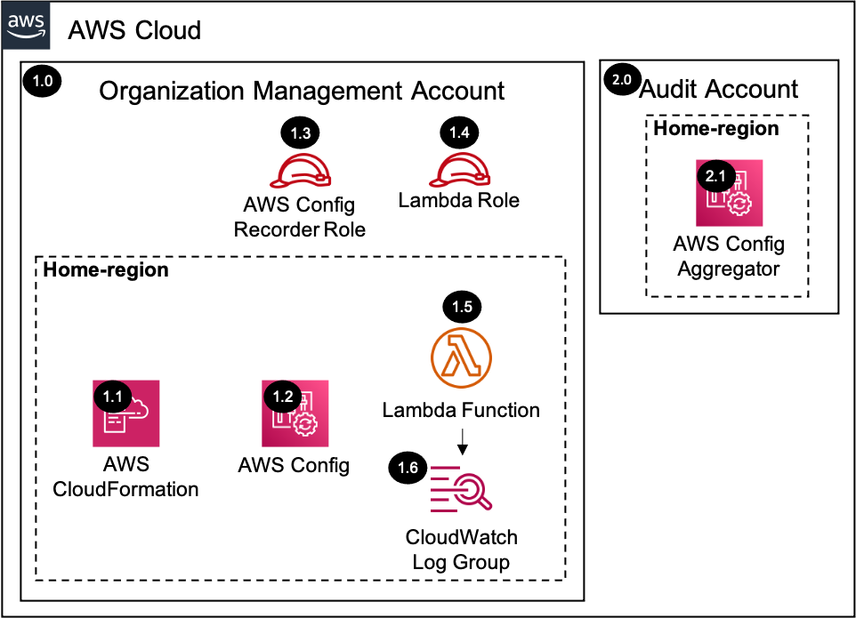

# AWS Config Control Tower Management Account<!-- omit in toc -->

Copyright Amazon.com, Inc. or its affiliates. All Rights Reserved. SPDX-License-Identifier: CC-BY-SA-4.0

## Table of Contents<!-- omit in toc -->

- [Introduction](#introduction)
- [Deployed Resource Details](#deployed-resource-details)
- [Implementation Instructions](#implementation-instructions)
- [References](#references)

## Introduction

The `AWS Config Control Tower Management Account Solution` enables AWS Config in the Control Tower `management account`, and updates the AWS Config aggregator in the `audit account` accordingly. The AWS CloudFormation templates enabling AWS Config
used by AWS Control Tower for the member accounts was used as a reference for this solution. All resources that support tags are provided a tag keypair of `sra-solution: sra-config-management-account`.

[AWS Config](https://aws.amazon.com/config/) is a service that enables you to assess, audit, and evaluate the configurations of your AWS resources. Config continuously monitors and records your AWS resource configurations and allows you to automate
the evaluation of recorded configurations against desired configurations. With Config, you can:

- Review changes in configurations and relationships between AWS resources.
- Dive into detailed resource configuration histories.
- Determine your overall compliance against the configurations specified in your internal guidelines.

An [Aggregator](https://docs.aws.amazon.com/config/latest/developerguide/aggregate-data.html) is an AWS Config resource type that collects AWS Config configuration and compliance data from the following:

- Multiple accounts and multiple regions.
- Single account and multiple regions.
- An organization in AWS Organizations and all the accounts in that organization which have AWS Config enabled.

`AWS Config` enables you to simplify compliance auditing, security analysis, change management, and operational troubleshooting. While an `Aggregator` lets you view the resource configuration and compliance data recorded in AWS Config across
accounts/regions.

---

## Deployed Resource Details



### 1.0 Organization Management Account<!-- omit in toc -->

#### 1.1 AWS CloudFormation<!-- omit in toc -->

- All resources are deployed via AWS CloudFormation as a `StackSet` and `Stack Instance` within the management account or a CloudFormation `Stack` within a specific account.
- The [Customizations for AWS Control Tower](https://aws.amazon.com/solutions/implementations/customizations-for-aws-control-tower/) solution deploys all templates as a CloudFormation `StackSet`. CloudFormation triggers the custom resource Lambda
  function on Create, Update, and Delete events.
- For parameter details, review the [AWS CloudFormation templates](templates/).

#### 1.2 AWS Config<!-- omit in toc -->

- The `AWS Config Delivery Channel` continually records the changes that occur to your AWS resources, it sends notifications and updated configuration states through the delivery channel.
- The `AWS Config Recorder` describes the AWS resource types for which AWS Config records configuration changes.
- The configuration recorder stores the configurations of the supported resources in your account as configuration items.

#### 1.3 AWS Config Recorder IAM Role<!-- omit in toc -->

- The AWS Config Recorder IAM role is deployed into the `management account` and it is assumed by AWS Config so that the recorder can detect changes in your resource configurations and capture these changes as configuration items.

#### 1.4 AWS Lambda Function Role<!-- omit in toc -->

- The AWS Lambda Function Role allows the AWS Lambda service to assume the role and perform actions defined in the attached IAM policies.
- This solution's Lambda function queries and updates the list of source accounts and regions being aggregated in the AWS Config Aggregator from the `audit account`.

#### 1.5 AWS Lambda Function<!-- omit in toc -->

- An external deployment package is used in the AWS Lambda Function in the [sra-config-management-account-update-aggregator.yaml](templates/sra-config-management-account-update-aggregator.yaml) template that contains the logic for querying and
  updating the list of source accounts and regions being aggregated in the AWS Config Aggregator from the `audit account`.
- The function is triggered by CloudFormation Create, Update, and Delete events.

#### 1.6 AWS Lambda CloudWatch Log Group<!-- omit in toc -->

- `AWS Lambda Function` logs are sent to a CloudWatch Log Group `</aws/lambda/<LambdaFunctionName>` to help with debugging and traceability of the actions performed.
- By default the `AWS Lambda Function` will create the CloudWatch Log Group with a `Retention` (Never expire) and the logs are encrypted with a CloudWatch Logs service managed encryption key.
- Optional parameters are included to allow creating the CloudWatch Log Group, which allows setting `KMS Encryption` using a customer managed KMS key and setting the `Retention` to a specific value (e.g. 14 days).

---

### 2.0 Audit Account (Security Tooling)<!-- omit in toc -->

The example solutions use `Audit Account` instead of `Security Tooling Account` to align with the default account name used within the AWS Control Tower setup process for the Security Account. The Account ID for the `Audit Account`  can be determined from the `SecurityAccountId` parameter within the `AWSControlTowerBP-BASELINE-CONFIG` StackSet in AWS Control Tower environments, but is specified manually in other environments, and then stored in an SSM parameter (this is all done in the common prerequisites solution).


#### 2.1 AWS Config Aggregator<!-- omit in toc -->

- `AWS Control Tower` creates an `AWS Config Aggregator` within the Audit Account for all accounts within the `AWS Organization`.
- The `Lambda Function` within the `management account` adds the `management account` to the existing `AWS Config Aggregator`.

---

## Implementation Instructions

### Prerequisites<!-- omit in toc -->

1. [Download and Stage the SRA Solutions](../../../docs/DOWNLOAD-AND-STAGE-SOLUTIONS.md). **Note:** This only needs to be done once for all the solutions.
2. Verify that the [SRA Prerequisites Solution](../../common/common_prerequisites/) has been deployed.
3. Verify the following AWS Config setups within the environment:
   - AWS Config is not enabled in the `management account`.
   - AWS Config Aggregator exists in the `audit account`.
   - AWS Config S3 bucket exists in the `log archive account`.

### Solution Deployment<!-- omit in toc -->

Choose a Deployment Method:

- [AWS CloudFormation](#aws-cloudformation)
- [Customizations for AWS Control Tower](../../../docs/CFCT-DEPLOYMENT-INSTRUCTIONS.md)

#### AWS CloudFormation<!-- omit in toc -->

In the `management account (home region)`, launch the AWS CloudFormation **Stack** using the template file as the source from the below chosen options:

- **Option 1:** (Recommended) Use the [sra-config-management-account-main-ssm.yaml](templates/sra-config-management-account-main-ssm.yaml) template. This is a more automated approach where some of the CloudFormation parameters are populated from SSM
  parameters created by the [SRA Prerequisites Solution](../../common/common_prerequisites/).

  ```bash
  aws cloudformation deploy --template-file $HOME/aws-sra-examples/aws_sra_examples/solutions/config/config_management_account/templates/sra-config-management-account-main-ssm.yaml --stack-name sra-config-management-account-main-ssm --capabilities CAPABILITY_NAMED_IAM
  ```

- **Option 2:** Use the [sra-config-management-account-main.yaml](templates/sra-config-management-account-main.yaml) template. Input is required for the CloudFormation parameters where the default values are not set.

  ```bash
  aws cloudformation deploy --template-file $HOME/aws-sra-examples/aws_sra_examples/solutions/config/config_management_account/templates/sra-config-management-account-main.yaml --stack-name sra-config-management-account-main --capabilities CAPABILITY_NAMED_IAM --parameter-overrides pAuditAccountId=<AUDIT_ACCOUNT_ID> pConfigRegionsToEnable=<CONFIG_REGIONS_TO_ENABLE> pHomeRegion=<HOME_REGION> pLogArchiveAccountId=<LOG_ARCHIVE_ACCOUNT_ID> pOrganizationId=<ORGANIZATION_ID> pSRAStagingS3BucketName=<SRA_STAGING_S3_BUCKET_NAME>
  ```

---

## References

- [AWS Config: Getting Started](https://docs.aws.amazon.com/config/latest/developerguide/getting-started.html)
- [AWS Config: Multi-Account Multi-Region Data Aggregation](https://docs.aws.amazon.com/config/latest/developerguide/aggregate-data.html)
- [Amazon CloudWatch: Encrypt log data in CloudWatch Logs using AWS Key Management Service](https://docs.aws.amazon.com/AmazonCloudWatch/latest/logs/encrypt-log-data-kms.html)
- [Working with AWS CloudFormation StackSets](https://docs.aws.amazon.com/AWSCloudFormation/latest/UserGuide/what-is-cfnstacksets.html)
