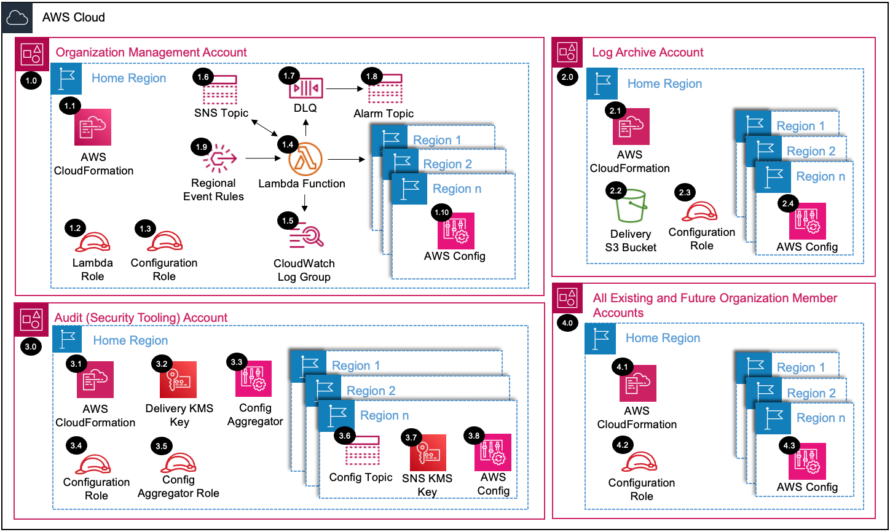

# Config Organization<!-- omit in toc -->

Copyright Amazon.com, Inc. or its affiliates. All Rights Reserved. SPDX-License-Identifier: CC-BY-SA-4.0

## Table of Contents

- [Table of Contents](#table-of-contents)
- [Introduction](#introduction)
- [Deployed Resource Details](#deployed-resource-details)
- [Implementation Instructions](#implementation-instructions)
- [References](#references)

---

## Introduction

The Config Organization solution will enable AWS Config, delegate administration to a member account, and configure AWS Config for all the existing and
future AWS Organization accounts. The Config Organization solution will enable an aggregator in delegated administrator account to collect AWS Config configuration and compliance data for the AWS Organization. AWS Config is also configured to send the configuration snapshots and configuration history files to a central S3 bucket encrypted with a KMS key. 

---

## Deployed Resource Details



### 1.0 Organization Management Account<!-- omit in toc -->

#### 1.1 AWS CloudFormation<!-- omit in toc -->

- All resources are deployed via AWS CloudFormation as a `StackSet` and `Stack Instance` within the management account or a CloudFormation `Stack` within a specific account.
- For parameter details, review the [AWS CloudFormation templates](templates/).

#### 1.2 Lambda Execution IAM Role<!-- omit in toc -->

- IAM role used by the Lambda function to enable the AWS Config and set up AWS Config delivery channel within each account and region provided.

#### 1.3 Configuration IAM Role<!-- omit in toc -->

- IAM role assumed by the Lambda function within the management account to configure AWS Config within each account and region provided.

#### 1.4 AWS Lambda Function<!-- omit in toc -->

- The Lambda function includes logic to enable and configure AWS Config.

#### 1.5 Lambda CloudWatch Log Group<!-- omit in toc -->

- All the `AWS Lambda Function` logs are sent to a CloudWatch Log Group `</aws/lambda/<LambdaFunctionName>` to help with debugging and traceability of the actions performed.
- By default the `AWS Lambda Function` will create the CloudWatch Log Group and logs are encrypted with a CloudWatch Logs service managed encryption key.

#### 1.6 Dead Letter Queue (DLQ)<!-- omit in toc -->

- SQS dead letter queue used for retaining any failed Lambda events.

#### 1.7 Alarm SNS Topic<!-- omit in toc -->

- SNS Topic used to notify subscribers when messages hit the DLQ.

#### 1.8 Regional Event Rules<!-- omit in toc -->

- The `Organization Compliance Scheduled Event Rule` triggers the `AWS Lambda Function` to capture AWS Account status updates (e.g. suspended to active).
  - A parameter is provided to set the schedule frequency.
  - See the [Instructions to Manually Run the Lambda Function](#instructions-to-manually-run-the-lambda-function) for triggering the `AWS Lambda Function` before the next scheduled run time.
- The `AWS Organizations Event Rule` triggers the `AWS Lambda Function` when updates are made to accounts within the organization.
  - When AWS Accounts are added to the AWS Organization. (e.g. account created via AWS Organizations console, account invited from another AWS Organization).
- The `Global Event Rule` in us-east-1 forwards the AWS Organization events to the `Home Region` default Event Bus.
  - If the `Home Region` is different from the `Global Region (e.g. us-east-1)`, then global event rules are created within the `Global Region` to forward events to the `Home Region` default Event Bus.

#### 1.9 AWS Config<!-- omit in toc -->

- AWS Config is enabled for each existing active account and region during the initial setup.
- AWS Config will be automatically enabled for new member accounts when added to the AWS Organization.

---

### 2.0 Log Archive Account<!-- omit in toc -->

#### 2.1 AWS CloudFormation<!-- omit in toc -->

- See [1.1 AWS CloudFormation](#11-aws-cloudformation)

#### 2.2 AWS Config Delivery S3 Bucket<!-- omit in toc -->

- S3 bucket where AWS Config configurations snapshots are exported for each account/region within the AWS Organization.

#### 2.3 Configuration IAM Role<!-- omit in toc -->

- See [1.3 Configuration IAM Role](#13-configuration-iam-role)

#### 2.4 AWS Config<!-- omit in toc -->

- See [1.9 AWS Config](#17-aws-config)

---

### 3.0 Audit Account (Security Tooling) <!-- omit in toc -->

The example solutions use `Security Account Id` for the `Security Tooling Account`. _NOTE_ Conceptually the Security Tooling Account equivalent of Control Tower's default `Audit Account`. The Account ID for the `Security Account Id` SSM parameter is
populated from the `SecurityAccountId` parameter within the `sra-easy-setup` Stack.

#### 3.1 AWS CloudFormation<!-- omit in toc -->

- See [1.1 AWS CloudFormation](#11-aws-cloudformation)

#### 3.2 Notification SNS Topic<!-- omit in toc -->
- Configuration Notification SNS Topic in Audit Account that AWS Config delivers notifications to.

#### 3.3 AWS Config Delivery KMS Key<!-- omit in toc -->

- KMS key to encrypt the configuration snapshots with a customer managed KMS key.

#### 3.4 Configuration IAM Role<!-- omit in toc -->

- See [1.3 Configuration IAM Role](#13-configuration-iam-role)

#### 3.5 AWS Config Aggregator IAM Role<!-- omit in toc -->

- IAM role used by AWS Config to access AWS Organizations APIs.

#### 3.6 AWS Config Aggregator<!-- omit in toc -->

- AWS Config Aggregator configured in the delegated administrator account to collect AWS Config configuration and compliance data for the AWS Organization.

#### 3.7 SNS Topic KMS Key<!-- omit in toc -->

- KMS key to encrypt the SNS Topic with a customer managed KMS key.

#### 3.8 AWS Config<!-- omit in toc -->

- See [1.9 Config](#19-aws-config)

---

### 4.0 All Existing and Future Organization Member Accounts<!-- omit in toc -->

#### 4.1 AWS CloudFormation<!-- omit in toc -->

- See [1.1 AWS CloudFormation](#11-aws-cloudformation)

#### 4.2 Configuration IAM Role<!-- omit in toc -->

- See [1.3 Configuration IAM Role](#13-configuration-iam-role)

#### 4.3 AWS Config<!-- omit in toc -->

- See [1.9 AWS Config](#19-aws-config)

---

## Implementation Instructions

### Prerequisites<!-- omit in toc -->

1. [Download and Stage the SRA Solutions](../../../docs/DOWNLOAD-AND-STAGE-SOLUTIONS.md). **Note:** This only needs to be done once for all the solutions.
2. Verify that the [SRA Prerequisites Solution](../../common/common_prerequisites/) has been deployed.

### Solution Deployment<!-- omit in toc -->

Choose a Deployment Method:

- [AWS CloudFormation](#aws-cloudformation)

#### AWS CloudFormation<!-- omit in toc -->

In the `management account (home region)`, launch an AWS CloudFormation **Stack** using the option below:

- Use the [sra-config-org-main-ssm.yaml](templates/sra-config-org-main-ssm.yaml) template. This is a more automated approach where some of the CloudFormation parameters are populated from SSM parameters created by
  the [SRA Prerequisites Solution](../../common/common_prerequisites/).

  ```bash
  aws cloudformation deploy --template-file $HOME/aws-sra-examples/aws_sra_examples/solutions/config/config_org/templates/sra-config-org-main-ssm.yaml --stack-name sra-config-org-main-ssm --capabilities CAPABILITY_NAMED_IAM
  ```

#### Verify Solution Deployment<!-- omit in toc -->

1. Log into the Audit account and navigate to the AWS Config page.
   1. Verify the correct AWS Config configurations have been applied to each account and region.
   2. Verify all existing accounts have been enabled.
   3. Verify the correct AWS Config Aggregator configurations have been applied.
   4. Verify all existing accounts have been enabled. Note: It can take a few minutes to complete.
2. Log into the Log archive account and navigate to the S3 page.
   1. Verify the sample configuration snapshots have been delivered.

#### Solution Delete Instructions<!-- omit in toc -->

1. In the `management account (home region)`, delete the AWS CloudFormation **Stack** (`sra-config-org-main-ssm`).
3. In the `management account (home region)`, delete the AWS CloudWatch **Log Group** (e.g. /aws/lambda/<solution_name>) for the Lambda function deployed.
4. In the `log archive acccount (home region)`, delete the S3 bucket (e.g. sra-config-delivery-<account_id>-<aws_region>) created by the solution.

---

## References

- [AWS Config and AWS Organizations](https://docs.aws.amazon.com/organizations/latest/userguide/services-that-can-integrate-config.html)
- [Managing AWS SDKs in Lambda Functions](https://docs.aws.amazon.com/lambda/latest/operatorguide/sdks-functions.html)
- [Lambda runtimes](https://docs.aws.amazon.com/lambda/latest/dg/lambda-runtimes.html)
- [Python Boto3 SDK changelog](https://github.com/boto/boto3/blob/develop/CHANGELOG.rst)
