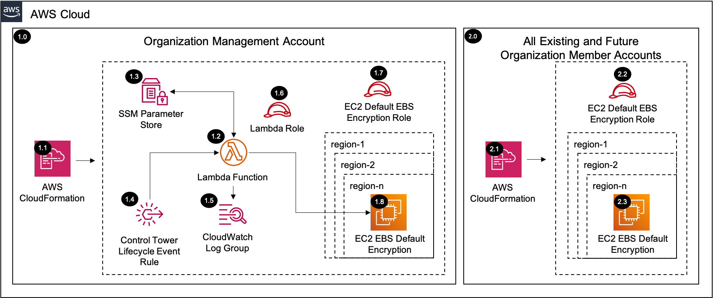

# EC2 Default EBS Encryption<!-- omit in toc -->

Copyright Amazon.com, Inc. or its affiliates. All Rights Reserved. SPDX-License-Identifier: CC-BY-SA-4.0

## Table of Contents<!-- omit in toc -->

- [Introduction](#introduction)
- [Deployed Resource Details](#deployed-resource-details)
- [Implementation Instructions](#implementation-instructions)
- [References](#references)

## Introduction

The EC2 default EBS encryption solution enables the account level default EBS encryption within each `AWS account` and `AWS region` in the AWS Organization.

You can configure your AWS account to enforce the encryption of the new EBS volumes and snapshot copies that you create. For example, Amazon EBS encrypts the EBS volumes created when you launch an instance and the snapshots that you copy from an
unencrypted snapshot. For examples of transitioning from unencrypted to encrypted EBS resources, see [Encrypt unencrypted resources](https://docs.aws.amazon.com/AWSEC2/latest/UserGuide/EBSEncryption.html#encrypt-unencrypted).

Encryption by default has no effect on existing EBS volumes or snapshots.

### **Considerations**<!-- omit in toc -->

- Encryption by default is a Region-specific setting. If you enable it for a Region, you cannot disable it for individual volumes or snapshots in that Region.
- When you enable encryption by default, you can launch an instance only if the instance type supports EBS encryption. For more information, see
  [Supported instance types](https://docs.aws.amazon.com/AWSEC2/latest/UserGuide/EBSEncryption.html#EBSEncryption_supported_instances).
- If you copy a snapshot and encrypt it to a new KMS key, a complete (non-incremental) copy is created. This results in additional storage costs.
- When migrating servers using AWS Server Migration Service (SMS), do not turn on encryption by default. If encryption by default is already on and you are experiencing delta replication failures, turn off encryption by default. Instead, enable AMI
  encryption when you create the replication job.

---

## Deployed Resource Details



### 1.0 Control Tower Management Account<!-- omit in toc -->

#### 1.1 AWS CloudFormation<!-- omit in toc -->

- All resources are deployed via AWS CloudFormation as a `StackSet` and `Stack Instance` within the management account or a CloudFormation `Stack` within a specific account.
- The [Customizations for AWS Control Tower](https://aws.amazon.com/solutions/implementations/customizations-for-aws-control-tower/) solution deploys all templates as a CloudFormation `StackSet`.
- For parameter details, review the [AWS CloudFormation templates](templates/).

#### 1.2 AWS Lambda Function<!-- omit in toc -->

- The AWS Lambda Function contains the logic for configuring the EC2 default EBS encryption settings within each account and region.
- The function is triggered by CloudFormation Create, Update, and Delete events and also by the `Control Tower Lifecycle Event Rule` when new accounts are provisioned.

#### 1.3 AWS SSM Parameter Store<!-- omit in toc -->

- The Lambda Function creates/updates configuration parameters within the `SSM Parameter Store` on CloudFormation events and the parameters are used when triggered by the `Control Tower Lifecycle Event Rule`, which does not send the properties on the
  event like CloudFormation does.

#### 1.4 AWS Control Tower Lifecycle Event Rule<!-- omit in toc -->

- The AWS Control Tower Lifecycle Event Rule triggers the `AWS Lambda Function` when a new AWS Account is provisioned through AWS Control Tower.

#### 1.5 AWS Lambda CloudWatch Log Group<!-- omit in toc -->

- All the `AWS Lambda Function` logs are sent to a CloudWatch Log Group `</aws/lambda/<LambdaFunctionName>` to help with debugging and traceability of the actions performed.
- By default the `AWS Lambda Function` will create the CloudWatch Log Group with a `Retention` (Never expire) and are encrypted with a CloudWatch Logs service managed encryption key.
- Optional parameters are included to allow creating the CloudWatch Log Group, which allows setting `KMS Encryption` using a customer managed KMS key and setting the `Retention` to a specific value (e.g. 14 days).

#### 1.6 AWS Lambda Function Role<!-- omit in toc -->

- The AWS Lambda Function Role allows the AWS Lambda service to assume the role and perform actions defined in the attached IAM policies.
- The role is also trusted by the EC2 Default EBS Encryption IAM Role within each account so that it can configure the default EBS encryption account settings.

#### 1.7 EC2 Default EBS Encryption IAM Role<!-- omit in toc -->

- The EC2 default EBS encryption IAM role is deployed into each account within the AWS Organization and it is assumed by the central `AWS Lambda Function` to configure the default encryption setting for the account and region.

#### 1.8 EC2 Default EBS Encryption<!-- omit in toc -->

- The `AWS Lambda Function` configures the default EBS encryption for the account and region with the `AWS managed EBS encryption key` (alias/aws/ebs).

---

### 2.0 All Existing and Future Organization Member Accounts<!-- omit in toc -->

#### 2.1 AWS CloudFormation<!-- omit in toc -->

- See [1.1 AWS CloudFormation](#11-aws-cloudformation)

#### 2.2 EC2 Default EBS Encryption IAM Role<!-- omit in toc -->

- See [1.7 EC2 Default EBS Encryption IAM Role](#17-ec2-default-ebs-encryption-iam-role)

#### 2.3 EC2 Default EBS Encryption<!-- omit in toc -->

- See [1.8 EC2 Default EBS Encryption](#18-ec2-default-ebs-encryption)

---

## Implementation Instructions

### Prerequisites<!-- omit in toc -->

- AWS Control Tower is deployed.
- No AWS Organizations Service Control Policies (SCPs) are blocking the `ec2:GetEbsEncryptionByDefault` and `ec2:EnableEbsEncryptionByDefault` API actions
- All targeted regions need to be enabled in all accounts within the AWS Organization
- `aws-security-reference-architecture-examples` repository is stored on your local machine or location where you will be deploying from.

### Staging<!-- omit in toc -->

1. In the `management account (home region)`, launch the AWS CloudFormation **Stack** using the [prereq-controltower-execution-role.yaml](../../../utils/aws_control_tower/prerequisites/prereq-controltower-execution-role.yaml) template file as the
   source, to implement the `AWSControlTowerExecution` role pre-requisite.
   - **Note:** Only do this step, if the `AWSControlTowerExecution` IAM role doesn't already exist in the Control Tower `management account`.
2. In the `management account (home region)`, launch the AWS CloudFormation **StackSet** targeting only the `management account` in all of the enabled regions (include home region)
   [prereq-lambda-s3-bucket.yaml](../../../utils/aws_control_tower/prerequisites/prereq-lambda-s3-bucket.yaml) template file as the source, to implement an S3 bucket that will store the Lambda Zip files. (Example Bucket Name:
   `lambda-zips-<Management Account ID>-<AWS Region>`)
   - For additional guidance see [CloudFormation StackSet Instructions](#cloudformation-stackset-instructions)
   - Take note of the S3 Bucket Name from the CloudFormation Outputs, as you will need it for both the packaging step, and the **Solution Deployment Order** section.
   - **Note:** Only do this step if you don't already have an S3 bucket to store the Lambda zip files for CloudFormation custom resources in the Control Tower `management account`.
     - Lambda functions can only access Zip files from an S3 bucket in the same AWS region as the where Lambda function resides.
     - Although for this solution, S3 bucket is only needed in the `home region`, it is recommended to deploy the S3 bucket as a **stackset**, so that you can support future Lambda functions in other regions.
3. Package the Lambda code into a zip file and upload it to the S3 bucket (from above step), using the [Packaging script](../../../utils/packaging_scripts/package-lambda.sh).
   - `SRA_REPO` environment variable should point to the folder where `aws-security-reference-architecture-examples` repository is stored.
   - `BUCKET` environment variable should point to the S3 Bucket where the Lambda zip files are stored.
   - See CloudFormation Output from Step 2
     - Or follow this syntax: `lambda-zips-<CONTROL-TOWER-MANAGEMENT-ACCOUNT>-<CONTROL-TOWER-HOME-REGION>`

```bash
# Example (assumes repository was downloaded to your home directory)
export SRA_REPO="$HOME"/aws-security-reference-architecture-examples
export BUCKET=sra-staging-123456789012-us-east-1
sh "$SRA_REPO"/aws_sra_examples/utils/packaging_scripts/package-lambda.sh \
--file_name ec2-default-ebs-encryption.zip \
--bucket $BUCKET \
--src_dir "$SRA_REPO"/aws_sra_examples/solutions/ec2/ec2_default_ebs_encryption/lambda/src
```

```bash
# Export AWS CLI profile for the 'management account'
export AWS_ACCESS_KEY_ID=
export AWS_SECRET_ACCESS_KEY=
export AWS_SESSION_TOKEN=

# Use template below and set the 'SRA_REPO' and 'BUCKET' with your values.
export SRA_REPO=
export BUCKET=
sh "$SRA_REPO"/aws_sra_examples/utils/packaging_scripts/package-lambda.sh \
--file_name ec2-default-ebs-encryption \
--bucket $BUCKET \
--src_dir "$SRA_REPO"/aws_sra_examples/solutions/ec2/ec2_default_ebs_encryption/lambda/src
```

### Solution Deployment<!-- omit in toc -->

#### Customizations for AWS Control Tower<!-- omit in toc -->

- [Customizations for AWS Control Tower](./customizations_for_aws_control_tower)

#### AWS CloudFormation<!-- omit in toc -->

1. In the `management account (home region)`, launch an AWS CloudFormation **Stack Set** and deploy to `All active accounts (home region)` using the [sra-ec2-default-ebs-encryption-role.yaml](templates/sra-ec2-default-ebs-encryption-role.yaml)
   template file as the source.
2. In the `management account (home region)`, launch an AWS CloudFormation **Stack** using the [sra-ec2-default-ebs-encryption-role.yaml](templates/sra-ec2-default-ebs-encryption-role.yaml) template file as the source.
3. In the `management account (home region)`, launch the AWS CloudFormation **Stack** using the [sra-ec2-default-ebs-encryption.yaml](templates/sra-ec2-default-ebs-encryption.yaml) template file as the source.
   1. Control Tower Regions Only
      1. `true` = All AWS Control Tower governed regions
      2. `false` = All default AWS enabled regions
   2. Enabled Regions = User provided regions. **Leave blank to enable all regions**. **Note:** All provided regions need to be enabled in all accounts within the AWS Organization.

#### Verify Solution Deployment<!-- omit in toc -->

1. How to verify after the pipeline completes?
   1. Log into an account and navigate to the EC2 console page
   2. Select a region where the EBS default encryption was enabled
   3. Select the `EBS Encryption` from the `Account attributes` section and verify the settings match the parameters provided in the configuration

#### Solution Delete Instructions<!-- omit in toc -->

1. In the `management account (home region)`, delete the AWS CloudFormation **Stack** created in step 3 of the solution deployment. **Note:** The solution will not modify the default EBS encryption setting on a `Delete` event. Only the SSM
   configuration parameter is deleted in this step.
2. In the `management account (home region)`, delete the AWS CloudFormation **Stack** created in step 2 of the solution deployment.
3. In the `management account (home region)`, delete the AWS CloudFormation **StackSet** created in step 1 of the solution deployment. **Note:** there should not be any `stack instances` associated with this StackSet.
4. In the `management account (home region)`, delete the AWS CloudWatch **Log Group** (e.g. /aws/lambda/<solution_name>) for the Lambda function deployed in step 2 of the solution deployment.

---

## References

- [EC2 Encryption by Default](https://docs.aws.amazon.com/AWSEC2/latest/UserGuide/EBSEncryption.html#encryption-by-default)
