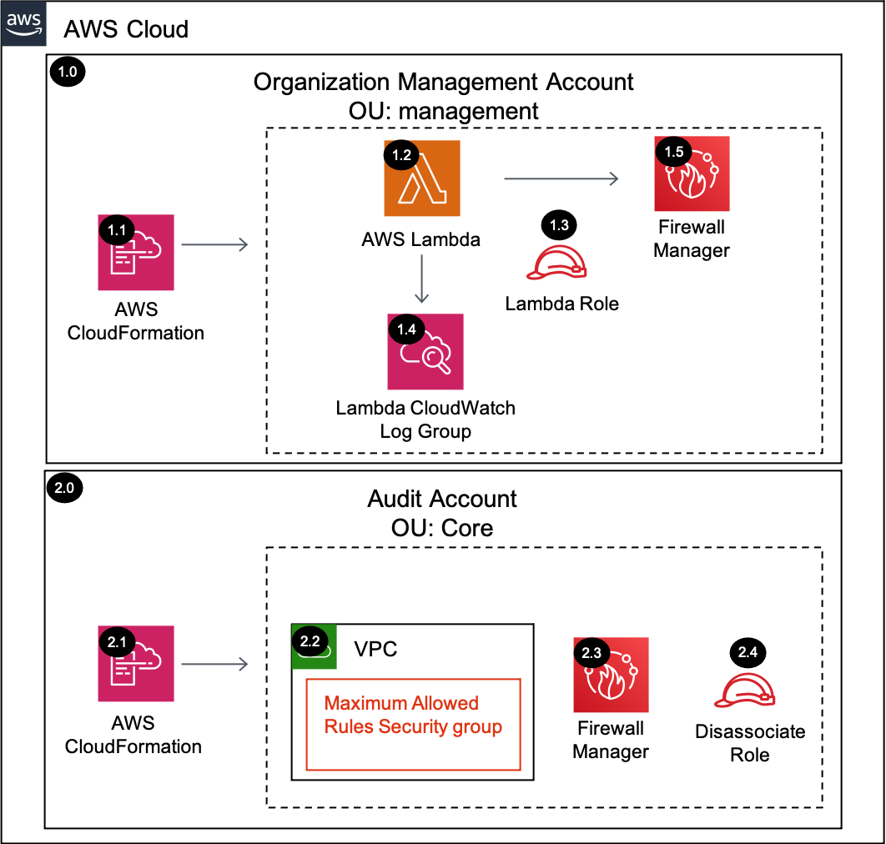

# Firewall Manager<!-- omit in toc -->

Copyright Amazon.com, Inc. or its affiliates. All Rights Reserved. SPDX-License-Identifier: CC-BY-SA-4.0

## Table of Contents<!-- omit in toc -->

- [Introduction](#introduction)
- [Deployed Resource Details](#deployed-resource-details)
  - [Control Tower](#control-tower)
  - [Organizations Environments not using Control Tower](#organizations-environments-not-using-control-tower)
- [Implementation Instructions](#implementation-instructions)
- [References](#references)

## Introduction

The Organization Firewall Manager solution will delegate an administrator account (e.g. Audit Account), deploy a maximum allowed security group, configure a security group policy, and configure multiple WAF policies.

AWS Firewall Manager simplifies your AWS WAF, AWS Shield Advanced, and Amazon VPC security groups administration and maintenance tasks across multiple accounts and resources. With Firewall Manager, you set up your AWS WAF firewall rules, Shield
Advanced protections, and Amazon VPC security groups just once. Firewall Manager is particularly useful when you want to protect your entire organization rather than a few number of specific accounts and resources, or if you frequently add new
resources that you want to protect. To use Firewall Manager, your account must be a member of an organization in the AWS Organizations service, and you must **enable AWS Config** for each member account in your AWS Organization.

---

## Deployed Resource Details



### 1.0 Organization Management Account<!-- omit in toc -->

#### 1.1 AWS CloudFormation<!-- omit in toc -->

- All resources are deployed via AWS CloudFormation as a `StackSet` and `Stack Instance` within the management account or a CloudFormation `Stack` within a specific account.
- The [Customizations for AWS Control Tower](https://aws.amazon.com/solutions/implementations/customizations-for-aws-control-tower/) solution deploys all templates as a CloudFormation `StackSet`.
- For parameter details, review the [AWS CloudFormation templates](templates/).

#### 1.2 AWS Lambda Function<!-- omit in toc -->

The Lambda function contains logic to associate a delegated administrator account for Firewall Manager

#### 1.3 Lambda Execution IAM Role<!-- omit in toc -->

- IAM role used by the Lambda function to configure the Firewall Delegated Administrator Account

#### 1.4 Lambda CloudWatch Log Group<!-- omit in toc -->

- All the `AWS Lambda Function` logs are sent to a CloudWatch Log Group `</aws/lambda/<LambdaFunctionName>` to help with debugging and traceability of the actions performed.
- By default the `AWS Lambda Function` will create the CloudWatch Log Group with a `Retention` (Never expire) and are encrypted with a CloudWatch Logs service managed encryption key.

#### 1.5 Firewall Manager<!-- omit in toc -->

- Firewall Manager APIs are used to delegate an administrator account. Once the delegated administrator account is allocated, Firewall Manager can take a few minutes to activate all accounts and regions.
- The Lambda function has built in wait times (e.g. 5 minutes) to help avoid errors when configuring Firewall Manager with security policies.

---

### 2.0 Audit Account (Security Tooling)<!-- omit in toc -->

#### Control Tower

The example solutions use `Audit Account` instead of `Security Tooling Account` to align with the default account name used within the AWS Control Tower setup process for the Security Account. The Account ID for the `Audit Account` SSM parameter is
populated from the `SecurityAccountId` parameter within the `AWSControlTowerBP-BASELINE-CONFIG` StackSet.

#### Organizations Environments not using Control Tower

The example solutions use `Security Account Id` for the `Security Tooling Account`. _NOTE_ Conceptually the Security Tooling Account equivalent of Control Tower's default `Audit Account`. The Account ID for the `Security Account Id` SSM parameter is
populated from the `SecurityAccountId` parameter within the `sra-easy-setup` Stack.

#### 2.1 AWS CloudFormation<!-- omit in toc -->

- See [1.1 AWS CloudFormation](#11-aws-cloudformation)

#### 2.2 VPC and Security Group<!-- omit in toc -->

- A security group is used by the Firewall Manager security group policy to define the maximum allowed rules.
- A VPC is required for creating the security group.

- **Using AWS Firewall Manager to audit VPC Security Groups:**

  - AWS Firewall Manager enables the ability to audit (and remediate - if desired) security groups across the AWS Organization Unit. This solution utilizes
    [Content Audit Security Group Policies](https://docs.aws.amazon.com/waf/latest/developerguide/security-group-policies.html#security-group-policies-audit) to verify that Security Groups created across the AWS Organization Unit adhere to the rules.
  - A [Usage Audit Security Group Policy](https://docs.aws.amazon.com/waf/latest/developerguide/security-group-policies.html#security-group-policies-usage) is used to identify and remediate unused security groups to keep proper hygiene in the target
    accounts.

- **Security Group Policies:**
  - Firewall Manager Security Group Content Audit Policy
    - This Security Group Policy utilizes a provided security group to audit against 2 rules:
      - The only protocol that can ever allow inbound traffic is TCP/443 (HTTPS)
      - All other protocols are allowed internally to the CIDR blocks for the VPC Networks
  - Firewall Manager Unused Security Group Policy
    - This Security Group policy specifically targets unused Security groups.
    - If remediation is enabled, Firewall Manager will automatically clean up security groups that are not actively being used to maintain good hygiene in the AWS environment.

#### 2.3 Firewall Manager<!-- omit in toc -->

- This solution utilizes AWS Firewall Manager to deploy a baseline set of [AWS Managed WAF Rules](https://docs.aws.amazon.com/waf/latest/developerguide/aws-managed-rule-groups-list.html) to monitor and remediate the configured resources within the
  AWS Organization.
- [Firewall Manager WAF Policies](https://docs.aws.amazon.com/waf/latest/developerguide/waf-policies.html) allow Firewall Manager to centrally mandate the application of AWS WAF Rule sets and Web ACLs to endpoints (ELBs, CloudFront Distributions, and
  API Gateway) in the environment.
- The solution enforces the policies based on resource tags, which can be enforced using an IAM or SCP policy.

- **WAF Policies:**
  - FMS Regional WAF Default Policy
    - Resource Types
      - ELBv2
    - API Gateway
    - AWS Managed Rule sets
      - AWS Core Ruleset
      - AWS SQL Database Ruleset
      - AWS IP Reputation List
    - Resource Tag
      - Key: fms-default-policy
      - Value: true
  - FMS CloudFront Default Policy
    - Resource Types
      - Cloudfront Distribution
    - AWS Managed Rule sets
      - AWS Core Ruleset
      - AWS SQL Database Ruleset
      - AWS IP Reputation List
    - Resource Tag
      - Key: fms-default-policy
      - Value: true
  - FMS Regional WAF Windows Policy
    - Resource Types
      - ELBv2
      - API Gateway
    - AWS Managed Rule sets
      - AWS Core Ruleset
      - AWS Windows Operating System Ruleset
    - Resource Tag
      - Key: workload-os
      - Value: windows
  - FMS Regional WAF Linux Policy
    - Resource Types
      - ELBv2
      - API Gateway
    - AWS Managed Rule sets
      - AWS Core Ruleset
      - AWS Linux Operating System Ruleset
    - Resource Tag
      - Key: workload-os
      - Value: linux
  - FMS Regional WAF Posix Policy
    - Resource Types
      - ELBv2
      - API Gateway
    - AWS Managed Rule sets
      - AWS Core Ruleset
      - AWS Posix Operating System Ruleset
    - Resource Tag
      - Key: workload-os
      - Value: posix

#### 2.4 Firewall Manager Disassociate IAM Role<!-- omit in toc -->

- The Firewall Manager Disassociate IAM role is deployed to the `delegated administrator account` to disassociate the account from Firewall Manager when the solution is deleted.
- Firewall Manager requires the disassociation to happen within the `delegated administrator account`. The `management account` Lambda function assumes this role to disassociate the account when the custom resource is deleted via CloudFormation.
- The disassociation process can take about 15 minutes before allowing another delegated administrator account association.

---

## Implementation Instructions

### Prerequisites<!-- omit in toc -->

1. [Download and Stage the SRA Solutions](../../../docs/DOWNLOAD-AND-STAGE-SOLUTIONS.md). **Note:** This only needs to be done once for all the solutions.
2. Verify that the [SRA Prerequisites Solution](../../common/common_prerequisites/) has been deployed.

### Solution Deployment<!-- omit in toc -->

Choose a Deployment Method:

- [AWS CloudFormation](#aws-cloudformation)
- [Customizations for AWS Control Tower](../../../docs/CFCT-DEPLOYMENT-INSTRUCTIONS.md)

#### AWS CloudFormation<!-- omit in toc -->

In the `management account (home region)`, launch an AWS CloudFormation **Stack** using one of the options below:

- **Option 1:** (Recommended) Use the [sra-firewall-manager-org-main-ssm.yaml](templates/sra-firewall-manager-org-main-ssm.yaml) template. This is a more automated approach where some of the CloudFormation parameters are populated from SSM parameters
  created by the [SRA Prerequisites Solution](../../common/common_prerequisites/).

  ```bash
  aws cloudformation deploy --template-file $HOME/aws-sra-examples/aws_sra_examples/solutions/firewall_manager/firewall_manager_org/templates/sra-firewall-manager-org-main-ssm.yaml --stack-name sra-firewall-manager-org-main-ssm --capabilities CAPABILITY_NAMED_IAM --parameter-overrides pInternalNetCIDR=<INTERNAL_NET_CIDR>
  ```

- **Option 2:** Use the [sra-firewall-manager-org-main.yaml](templates/sra-firewall-manager-org-main.yaml) template. Input is required for the CloudFormation parameters where the default values are not set.

  ```bash
  aws cloudformation deploy --template-file $HOME/aws-sra-examples/aws_sra_examples/solutions/firewall_manager/firewall_manager_org/templates/sra-firewall-manager-org-main.yaml --stack-name sra-firewall-manager-org-main --capabilities CAPABILITY_NAMED_IAM --parameter-overrides pDelegatedAdminAccountId=<DELEGATED_ADMIN_ACCOUNT_ID> pInternalNetCIDR=<INTERNAL_NET_CIDR> pSRAStagingS3BucketName=<SRA_STAGING_S3_BUCKET_NAME>
  ```

#### Verify Solution Deployment<!-- omit in toc -->

1. Log into the Delegated Admin Account (eg. `Audit account`) and navigate to the AWS Firewall Manager page
2. Verify the correct configurations have been applied
   1. Security policies
      - security-group-maximum-allowed
      - security-group-common-policy
      - fms-regional-waf-default-policy
      - fms-regional-waf-windows-policy
      - fms-regional-waf-linux-policy
      - fms-regional-waf-posix-policy

#### Solution Delete Instructions<!-- omit in toc -->

1. In the `management account (home region)`, delete the AWS CloudFormation **Stack** created in the solution deployment.
2. In the `management account (home region)`, delete the AWS CloudWatch **Log Group** (e.g. /aws/lambda/<solution_name>) for the Lambda function.

---

## References

- [Firewall Manager Developer Guide](https://docs.aws.amazon.com/waf/latest/developerguide/fms-chapter.html)
- [Firewall Manager WAF Policies](https://docs.aws.amazon.com/waf/latest/developerguide/waf-policies.html)
- [Firewall Manager Security Group Policy Usage](https://docs.aws.amazon.com/waf/latest/developerguide/security-group-policies.html#security-group-policies-usage)
