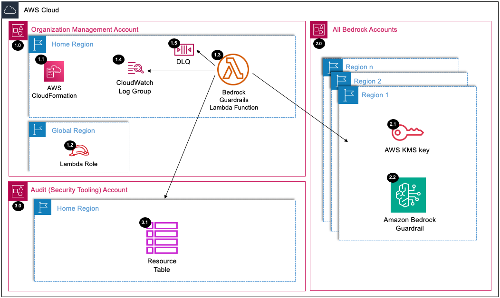

# SRA Bedrock Guardrails Solution

## Table of Contents
- [Introduction](#introduction)
- [Deployed Resource Details](#deployed-resource-details)
- [Implementation Instructions](#implementation-instructions)
- [References](#references)
- [JSON Parameters Explanation](#json-parameters-explanation)

---

## Introduction

This solution provides an automated framework for deploying Bedrock guardrails using AWS CloudFormation. It leverages a Lambda function to deploy  and encrypt Bedrock guardrails across multiple AWS accounts and regions in an organization.

The solution supports deployment of the following Amazon Bedrock Guardrails policies:
- `Content filters` – Adjust filter strengths to help block input prompts or model responses containing harmful content. Filtering is done based on detection of certain predefined harmful content categories - Hate, Insults, Sexual, Violence, Misconduct and Prompt Attack.
- `Denied topics` – Define a set of topics that are undesirable in the context of your application. The filter will help block them if detected in user queries or model responses.
- `Word filters` – Configure filters to help block undesirable words, phrases, and profanity (exact match). Such words can include offensive terms, competitor names, etc.
- `Sensitive information filters` – Configure filters to help block or mask sensitive information, such as personally identifiable information (PII), or custom regex in user inputs and model responses. Blocking or masking is done based on probabilistic detection of sensitive information in standard formats in entities such as SSN number, Date of Birth, address, etc. This also allows configuring regular expression based detection of patterns for identifiers.
- `Contextual grounding check` – Help detect and filter hallucinations in model responses based on grounding in a source and relevance to the user query.

`Note`: This solution creates a customer managed KMS key for enhanced guardrail security. You will need to update KMS key policies to grant access to guardrail users and administrators and modify IAM role policies for users who need to invoke or manage guardrails. Please refer to the documentation for detailed policy configurations and examples - [Set up permissions to use guardrails for content filtering](https://docs.aws.amazon.com/bedrock/latest/userguide/guardrails-permissions.html).

---

## Deployed Resource Details



This section provides a detailed explanation of the resources shown in the updated architecture diagram:

### 1.0 Organization Management Account<!-- omit in toc -->

#### 1.1 AWS CloudFormation<!-- omit in toc -->
- Used to define and deploy resources in the solution.

#### 1.2 Lambda Role<!-- omit in toc -->
-  Role used by the Lambda function

#### 1.3 Bedrock Guardrails Lambda Function<!-- omit in toc -->
- Core function responsible for deploying resources and managing configurations across accounts and regions.

#### 1.4 CloudWatch Log Group<!-- omit in toc -->
- Logs for monitoring the execution of the Lambda function.

#### 1.5 Dead-Letter Queue (DLQ)<!-- omit in toc -->
- Handles failed Lambda invocations.

### 2.0 All Bedrock Accounts<!-- omit in toc -->

#### 2.1 AWS KMS Key<!-- omit in toc -->
- Encrypts Bedrock guardrails.

#### 2.2 Bedrock Guardrail<!-- omit in toc -->
- Amazon Bedrock Guardrail

### 3.0 Audit (Security Tooling) Account<!-- omit in toc -->

### 3.1 Resource Table<!-- omit in toc -->
- Maintains metadata for tracking deployed resources and configurations.

---

## Implementation Instructions

### Prerequisites<!-- omit in toc -->

1. [Download and Stage the SRA Solutions](../../../docs/DOWNLOAD-AND-STAGE-SOLUTIONS.md). **Note:** This only needs to be done once for all the solutions.
2. Verify that the [SRA Prerequisites Solution](../../common/common_prerequisites/) has been deployed.

### Solution Deployment<!-- omit in toc -->

You can deploy this solution using the AWS Management Console or AWS CLI.

### Deploying via AWS Management Console<!-- omit in toc -->
1. In the `management account (home region)`, open the [CloudFormation Console](https://console.aws.amazon.com/cloudformation).
2. Create a new stack by uploading the `sra-bedrock-guardrails-main.yaml` template located in the `./templates` directory. `Note`: you can update the `sra-bedrock-guardrails-main.yaml` template parameters (pGuardrailTopicPolicyConfig, pGuardrailContentPolicyConfig, pGuardrailWordConfig, pGuardrailPiiEntity, pGuardrailGroundingPolicyConfig) based on your specific settings prior to uploading the template. 
3. Provide the required parameters to configure Bedrock guardrails policies.
4. Review and confirm the stack creation.

### Deploying via AWS CLI
1. Run the following command to deploy the stack:
#### Notes:
- Update parameter values with your specific settings.
- Verify supported regions - [Supported regions and models for Amazon Bedrock Guardrails](https://docs.aws.amazon.com/bedrock/latest/userguide/guardrails-supported.html)
- Ensure the JSON strings are formatted correctly and match your deployment requirements.
- This example assumes the CloudFormation template file is saved in the templates directory. Adjust the --template-body path if necessary.
- Always validate the JSON parameters for correctness to avoid deployment errors.
- Ensure the --capabilities CAPABILITY_NAMED_IAM flag is included to allow CloudFormation to create the necessary IAM resources.

```bash
aws cloudformation create-stack \
    --stack-name SRABedrockGuardrails \
    --template-body file://aws_sra_examples/solutions/genai/bedrock_guardrails/templates/sra-bedrock-guardrails-main.yaml \
    --region us-east-2 \
    --parameters \
        ParameterKey=pDryRun,ParameterValue="true" \
        ParameterKey=pSRAExecutionRoleName,ParameterValue=sra-execution \
        ParameterKey=pLambdaLogLevel,ParameterValue=INFO \
        ParameterKey=pSRASolutionName,ParameterValue=sra-bedrock-guardrails \
        ParameterKey=pSRASolutionVersion,ParameterValue="1.0.0" \
        ParameterKey=pSRAStagingS3BucketName,ParameterValue=/sra/staging-s3-bucket-name \
        ParameterKey=pBedrockGuardrailLambdaRoleName,ParameterValue=sra-bedrock-guardrails-lambda \
        ParameterKey=pBedrockGuardrailName,ParameterValue=sra-bedrock-guardrail \
        ParameterKey=pDeployGuardrailTopicPolicy,ParameterValue="true" \
        ParameterKey=pGuardrailTopicPolicyConfig,ParameterValue='"[{\"name\":\"A valid name\",\"definition\":\"A valid definition of the topic to deny\",\"examples\":[\"Example 1\",\"Example 2\"],\"type\":\"DENY\"}]"' \
        ParameterKey=pDeployGuardrailContentPolicy,ParameterValue="true" \
        ParameterKey=pGuardrailContentPolicyConfig,ParameterValue='"[{\"type\":\"SEXUAL\",\"inputStrength\":\"HIGH\",\"outputStrength\":\"HIGH\"},{\"type\":\"VIOLENCE\",\"inputStrength\":\"HIGH\",\"outputStrength\":\"HIGH\"},{\"type\":\"HATE\",\"inputStrength\":\"HIGH\",\"outputStrength\":\"HIGH\"},{\"type\":\"INSULTS\",\"inputStrength\":\"HIGH\",\"outputStrength\":\"HIGH\"},{\"type\":\"MISCONDUCT\",\"inputStrength\":\"HIGH\",\"outputStrength\":\"HIGH\"},{\"type\":\"PROMPT_ATTACK\",\"inputStrength\":\"HIGH\",\"outputStrength\":\"NONE\"}]"' \
        ParameterKey=pDeployWordPolicy,ParameterValue="true" \
        ParameterKey=pGuardrailWordConfig,ParameterValue='"[{\"text\":\"word or phrase to block\"},{\"text\":\"word or phrase to block\"},{\"text\":\"word or phrase to block\"}]"' \
        ParameterKey=pDeployManagedWordLists,ParameterValue="true" \
        ParameterKey=pDeploySensitiveInformationPolicy,ParameterValue="true" \
        ParameterKey=pGuardrailPiiEntity,ParameterValue='"[{\"type\":\"ADDRESS\",\"action\":\"ANONYMIZE\"},{\"type\":\"AGE\",\"action\":\"BLOCK\"}]"' \
        ParameterKey=pDeployContextualGroundingPolicy,ParameterValue="true" \
        ParameterKey=pGuardrailGroundingPolicyConfig,ParameterValue='"[{\"type\":\"GROUNDING\",\"threshold\":0.7},{\"type\":\"RELEVANCE\",\"threshold\":0.7}]"' \
        ParameterKey=pBlockedInputMessaging,ParameterValue="Your input was blocked by content filters." \
        ParameterKey=pBlockedOutputsMessaging,ParameterValue="The model response was blocked by content filters." \
        ParameterKey=pBedrockAccounts,ParameterValue='"111111111111,2222222222222"' \
        ParameterKey=pBedrockRegions,ParameterValue='"us-east-1,us-east-2"' \
    --capabilities CAPABILITY_NAMED_IAM
```

2. Monitor the stack creation progress in the AWS CloudFormation Console or via CLI commands.

### Post-Deployment
Once the stack is deployed, the Bedrock Guardrails Lambda function (`sra-bedrock-guardrails`) will automatically deploy all the resources and configurations across the accounts and regions specified in the parameters.

---

## References
- [AWS SRA Generative AI Deep-Dive](https://docs.aws.amazon.com/prescriptive-guidance/latest/security-reference-architecture/gen-ai-sra.html)
- [Stop harmful content in models using Amazon Bedrock Guardrails](https://docs.aws.amazon.com/bedrock/latest/userguide/guardrails.html)
- [Supported regions and models for Amazon Bedrock Guardrails](https://docs.aws.amazon.com/bedrock/latest/userguide/guardrails-supported.html)
- [Set up permissions to use guardrails for content filtering](https://docs.aws.amazon.com/bedrock/latest/userguide/guardrails-permissions.html)
- [AWS CloudFormation Documentation](https://docs.aws.amazon.com/cloudformation/index.html)
- [AWS Lambda](https://docs.aws.amazon.com/lambda/latest/dg/welcome.html)
- [AWS KMS](https://docs.aws.amazon.com/kms/latest/developerguide/overview.html)


## JSON Parameters Explanation

This section explains the parameters in the CloudFormation template that require JSON string values. Each parameter's structure and purpose are described in detail to assist in their configuration.

### `pGuardrailTopicPolicyConfig`
- **Purpose**: Defines topics and patterns that the guardrail should identify and deny.
- **Structure**:
  [
    {
      "name": "Topic Name",
      "definition": "Topic definition string",
      "examples": ["Example 1", "Example 2"],
      "type": "DENY"
    }
  ]
- **Fields**:
  - `name`: The name of the topic to deny. Length Constraints: Minimum length of 1. Maximum length of 100. Pattern: `^[0-9a-zA-Z-_ !?.]+$`
  - `definition`: A definition of the topic to deny. Length Constraints: Minimum length of 1. Maximum length of 200.
  - `examples`: Optional list of prompts, each of which is an example of a prompt that can be categorized as belonging to the topic. Array Members: Minimum number of 0 items. Maximum number of 5 items. Length Constraints: Minimum length of 1. Maximum length of 100.
  - `type`: Specifies to deny the topic. Valid Values: DENY

---

### `pGuardrailContentPolicyConfig`
- **Purpose**: Configures content filtering policies for different types of harmful content.
- **Structure**:
  [
    {
      "type": "CATEGORY",
      "inputStrength": "STRENGTH_LEVEL",
      "outputStrength": "STRENGTH_LEVEL"
    }
  ]

- **Fields**:
  - `type`: The harmful category that the content filter is applied to. Valid Values: SEXUAL | VIOLENCE | HATE | INSULTS | MISCONDUCT | PROMPT_ATTACK
  - `inputStrength`: The strength of the content filter to apply to prompts. As you increase the filter strength, the likelihood of filtering harmful content increases and the probability of seeing harmful content in your application reduces. Valid Values: NONE | LOW | MEDIUM | HIGH
  - `outputStrength`: The strength of the content filter to apply to model responses. As you increase the filter strength, the likelihood of filtering harmful content increases and the probability of seeing harmful content in your application reduces. Valid Values: NONE | LOW | MEDIUM | HIGH
  - **Note**: `PROMPT_ATTACK` must have `outputStrength` set to `NONE`

---

### `pGuardrailWordConfig`
- **Purpose**: Specifies a list of words to be blocked by the guardrail.
- **Structure**:
  [
    {
      "text": "word or phrase to block"
    },
    {
      "text": "word or phrase to block"
    },
  ]
- **Fields**:
  - `text`: Text of the word configured for the guardrail to block. Length Constraints: Minimum length of 1. Maximum length of 100.

---

### `pGuardrailPiiEntity`
- **Purpose**: Configures handling of different types of PII (Personally Identifiable Information).
- **Structure**:
  [
    {
      "type": "PII_TYPE",
      "action": "ACTION_TYPE"
    }
  ]
- **Fields**:
  - `type`: Configure guardrail type when the PII entity is detected. The following PIIs are used to block or mask sensitive information: [GuardrailPiiEntityConfig](https://docs.aws.amazon.com/bedrock/latest/APIReference/API_GuardrailPiiEntityConfig.html)
  - `action`: Configure guardrail action when the PII entity is detected. Valid Values: BLOCK | ANONYMIZE

---

### `pGuardrailGroundingPolicyConfig`
- **Purpose**: The filter configuration details for the guardrails contextual grounding filter.
- **Structure**:
  [
    {
      "type": "GROUNDING|RELEVANCE",
      "threshold": 0.XX
    }
  ]
- **Fields**:
  - `type`: The filter details for the guardrails contextual grounding filter. Valid Values: GROUNDING | RELEVANCE
  - `threshold`: The threshold details for the guardrails contextual grounding filter. Valid Range: Minimum value of 0.
