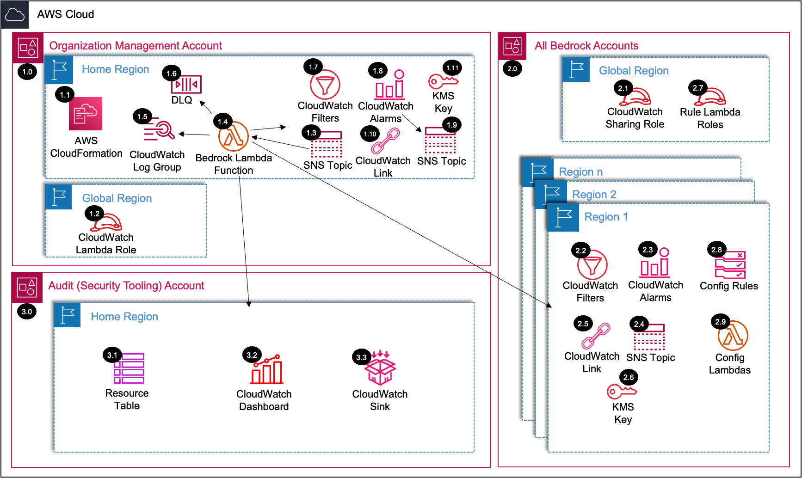

# SRA Bedrock Organizations Solution

## Table of Contents
- [Introduction](#introduction)
- [Deployed Resource Details](#deployed-resource-details)
- [Implementation Instructions](#implementation-instructions)
- [Security Controls](#security-controls)
- [JSON Parameters](#json-parameters)
- [References](#references)

---

## Introduction

This solution provides an automated framework for deploying Bedrock organizational security controls using AWS CloudFormation. It leverages a Lambda function to configure and deploy AWS Config rules, CloudWatch metrics, and other resources necessary to monitor and enforce governance policies across multiple AWS accounts and regions in an organization.

The architecture follows best practices for security and scalability and is designed for easy extensibility.

---

## Deployed Resource Details



This section provides a detailed explanation of the resources shown in the updated architecture diagram. More details on the resources can be found in the [Security Controls](#security-controls) section.

### Organization Management Account
- **(1.1) AWS CloudFormation**: Used to define and deploy resources in the solution.
- **(1.2) CloudWatch Lambda Role**: Role for enabling CloudWatch access by the Lambda function in the global region.
- **(1.3) SNS Topic**: SNS publish to Lambda. Handles fanout configuration of the solution.
- **(1.4) Bedrock Lambda Function**: Core function responsible for deploying resources and managing configurations across accounts and regions.
- **(1.5) CloudWatch Log Group**: Logs for monitoring the execution of the Lambda function.
- **(1.6) Dead-Letter Queue (DLQ)**: Handles failed Lambda invocations.
- **(1.7) CloudWatch Filters**: Filters specific log events to track relevant activities.
- **(1.8) CloudWatch Alarms**: Triggers notifications based on preconfigured thresholds.
- **(1.9) SNS Topic**: Publishes notifications for alarms and events.
- **(1.10) CloudWatch Link**: Links CloudWatch metrics across accounts and regions for centralized observability.
- **(1.11) KMS Key**: Encrypts SNS topic.

### All Bedrock Accounts
- **(2.1) CloudWatch Sharing Role**: Role enabling CloudWatch metrics sharing.
- **(2.2) CloudWatch Filters**: Region-specific filters to monitor log events for compliance and security.
- **(2.3) CloudWatch Alarms**: Configured to trigger notifications for specific metric thresholds.
- **(2.4) SNS Topic**: Publishes notifications for alarms and events in the respective regions.
- **(2.5) CloudWatch Link**: Links metrics from regional accounts back to the Organization Management Account.
- **(2.6) KMS Key**: Encrypts SNS topic.
- **(2.7) Rule Lambda Roles**: Lambda execution roles for AWS Config rules.
- **(2.8) Config Rules**: Enforces governance and compliance policies.
- **(2.9) Config Lambdas**: Evaluates and remediates non-compliance with governance policies.

### Audit (Security Tooling) Account
- **(3.1) Resource Table**: Maintains metadata for tracking deployed resources and configurations.
- **(3.2) CloudWatch Dashboard**: Provides a centralized view of the security and compliance state across accounts and regions.
- **(3.3) CloudWatch Sink**: Aggregates logs and metrics from other accounts and regions for analysis and auditing.

---

## Implementation Instructions

You can deploy this solution using the AWS Management Console or AWS CLI.
Read the [Important Notes](#important-notes) section before deploying the stack.

### Deploying via AWS Management Console
1. Open the [CloudFormation Console](https://console.aws.amazon.com/cloudformation).
2. Create a new stack by uploading the `sra-bedrock-org-main.yaml` template located in the `./templates` directory.
3. Provide the required parameters such as the email for SNS notifications and other configuration details.
4. Review and confirm the stack creation.

### Deploying via AWS CLI
1. Run the following command to deploy the stack:

```bash
aws cloudformation create-stack \
    --stack-name sra-bedrock-org-main \
    --template-body file://aws_sra_examples/solutions/genai/bedrock_org/templates/sra-bedrock-org-main.yaml \
    --region us-east-1 \
    --parameters \
        ParameterKey=pSRARepoZipUrl,ParameterValue=https://github.com/aws-security-reference-architecture-examples/archive/refs/heads/sra-genai.zip \
        ParameterKey=pDryRun,ParameterValue=true \
        ParameterKey=pSRAExecutionRoleName,ParameterValue=sra-execution \
        ParameterKey=pDeployLambdaLogGroup,ParameterValue=true \
        ParameterKey=pLogGroupRetention,ParameterValue=30 \
        ParameterKey=pLambdaLogLevel,ParameterValue=INFO \
        ParameterKey=pSRASolutionName,ParameterValue=sra-bedrock-org \
        ParameterKey=pSRASolutionVersion,ParameterValue=1.0.0 \
        ParameterKey=pSRAAlarmEmail,ParameterValue=alerts@examplecorp.com \
        ParameterKey=pSRAStagingS3BucketName,ParameterValue=/sra/staging-s3-bucket-name \
        ParameterKey=pBedrockOrgLambdaRoleName,ParameterValue=sra-bedrock-org-lambda \
        ParameterKey=pBedrockAccounts,ParameterValue='"[\"222222222222\",\"333333333333\"]"' \
        ParameterKey=pBedrockRegions,ParameterValue='"[\"us-east-1\",\"us-west-2\"]"' \
        ParameterKey=pBedrockModelEvalBucketRuleParams,ParameterValue='"{\"deploy\": \"true\", \"accounts\": [\"222222222222\",\"333333333333\"], \"regions\": [\"us-east-1\",\"us-west-2\"], \"input_params\": {\"BucketNamePrefix\": \"model-eval-job-bucket\",\"CheckRetention\": \"true\", \"CheckEncryption\": \"true\", \"CheckLogging\": \"true\", \"CheckObjectLocking\": \"true\", \"CheckVersioning\": \"true\"}}"' \
        ParameterKey=pBedrockIAMUserAccessRuleParams,ParameterValue='"{\"deploy\": \"true\", \"accounts\": [\"222222222222\",\"333333333333\"], \"regions\": [\"us-east-1\",\"us-west-2\"], \"input_params\": {}}"' \
        ParameterKey=pBedrockGuardrailsRuleParams,ParameterValue='"{\"deploy\": \"true\", \"accounts\": [\"222222222222\",\"333333333333\"], \"regions\": [\"us-east-1\",\"us-west-2\"], \"input_params\": {\"content_filters\": \"true\", \"denied_topics\": \"true\", \"word_filters\": \"true\", \"sensitive_info_filters\": \"true\", \"contextual_grounding\": \"true\"}}"' \
        ParameterKey=pBedrockVPCEndpointsRuleParams,ParameterValue='"{\"deploy\": \"true\", \"accounts\": [\"222222222222\",\"333333333333\"], \"regions\": [\"us-east-1\",\"us-west-2\"], \"input_params\": {\"check_bedrock\": \"true\", \"check_bedrock_agent\": \"true\", \"check_bedrock_agent_runtime\": \"true\", \"check_bedrock_runtime\": \"true\"}}"' \
        ParameterKey=pBedrockInvocationLogCWRuleParams,ParameterValue='"{\"deploy\": \"true\", \"accounts\": [\"222222222222\",\"333333333333\"], \"regions\": [\"us-east-1\",\"us-west-2\"], \"input_params\": {\"check_retention\": \"true\", \"check_encryption\": \"true\"}}"' \
        ParameterKey=pBedrockInvocationLogS3RuleParams,ParameterValue='"{\"deploy\": \"true\", \"accounts\": [\"222222222222\",\"333333333333\"], \"regions\": [\"us-east-1\",\"us-west-2\"], \"input_params\": {\"check_retention\": \"true\", \"check_encryption\": \"true\", \"check_access_logging\": \"true\", \"check_object_locking\": \"true\", \"check_versioning\": \"true\"}}"' \
        ParameterKey=pBedrockCWEndpointsRuleParams,ParameterValue='"{\"deploy\": \"true\", \"accounts\": [\"222222222222\",\"333333333333\"], \"regions\": [\"us-east-1\",\"us-west-2\"], \"input_params\": {}}"' \
        ParameterKey=pBedrockS3EndpointsRuleParams,ParameterValue='"{\"deploy\": \"true\", \"accounts\": [\"222222222222\",\"333333333333\"], \"regions\": [\"us-east-1\",\"us-west-2\"], \"input_params\": {}}"' \
        ParameterKey=pBedrockGuardrailEncryptionRuleParams,ParameterValue='"{\"deploy\": \"true\", \"accounts\": [\"222222222222\",\"333333333333\"], \"regions\": [\"us-east-1\",\"us-west-2\"], \"input_params\": {}}"' \
        ParameterKey=pBedrockServiceChangesFilterParams,ParameterValue='"{\"deploy\": \"true\", \"accounts\": [\"111111111111\"], \"regions\": [\"us-east-1\"], \"filter_params\": {\"log_group_name\": \"aws-controltower/CloudTrailLogs\"}}"' \
        ParameterKey=pBedrockBucketChangesFilterParams,ParameterValue='"{\"deploy\": \"true\", \"accounts\": [\"111111111111\"], \"regions\": [\"us-east-1\"], \"filter_params\": {\"log_group_name\": \"aws-controltower/CloudTrailLogs\", \"bucket_names\": [\"model-invocation-log-bucket-222222222222-us-west-2\",\"model-invocation-log-bucket-222222222222-us-east-1\",\"model-invocation-log-bucket-333333333333-us-west-2\",\"model-invocation-log-bucket-333333333333-us-east-1\"]}}"' \
        ParameterKey=pBedrockPromptInjectionFilterParams,ParameterValue='"{\"deploy\": \"true\", \"accounts\": [\"222222222222\",\"333333333333\"], \"regions\": [\"us-east-1\"], \"filter_params\": {\"log_group_name\": \"model-invocation-log-group\", \"input_path\": \"input.inputBodyJson.messages[0].content\"}}"' \
        ParameterKey=pBedrockSensitiveInfoFilterParams,ParameterValue='"{\"deploy\": \"true\", \"accounts\": [\"222222222222\",\"333333333333\"], \"regions\": [\"us-east-1\"], \"filter_params\": {\"log_group_name\": \"model-invocation-log-group\", \"input_path\": \"input.inputBodyJson.messages[0].content\"}}"' \
        ParameterKey=pBedrockCentralObservabilityParams,ParameterValue='"{\"deploy\": \"true\", \"bedrock_accounts\": [\"222222222222\",\"333333333333\"], \"regions\": [\"us-east-1\"]}"' \
        ParameterKey=pBedrockKBLoggingRuleParams,ParameterValue='"{\"deploy\": \"true\", \"accounts\": [\"222222222222\",\"333333333333\"], \"regions\": [\"us-east-1\",\"us-west-2\"], \"input_params\": {}}"' \
        ParameterKey=pBedrockKBIngestionEncryptionRuleParams,ParameterValue='"{\"deploy\": \"true\", \"accounts\": [\"222222222222\",\"333333333333\"], \"regions\": [\"us-east-1\",\"us-west-2\"], \"input_params\": {}}"' \
        ParameterKey=pBedrockKBS3BucketRuleParams,ParameterValue='"{\"deploy\": \"true\", \"accounts\": [\"222222222222\",\"333333333333\"], \"regions\": [\"us-east-1\",\"us-west-2\"], \"input_params\": {\"check_retention\": \"true\", \"check_encryption\": \"true\", \"check_access_logging\": \"true\", \"check_object_locking\": \"true\", \"check_versioning\": \"true\"}}"' \
        ParameterKey=pBedrockKBVectorStoreSecretRuleParams,ParameterValue='"{\"deploy\": \"true\", \"accounts\": [\"222222222222\",\"333333333333\"], \"regions\": [\"us-east-1\",\"us-west-2\"], \"input_params\": {}}"' \
        ParameterKey=pBedrockKBOpenSearchEncryptionRuleParams,ParameterValue='"{\"deploy\": \"true\", \"accounts\": [\"222222222222\",\"333333333333\"], \"regions\": [\"us-east-1\",\"us-west-2\"], \"input_params\": {}}"' \
    --capabilities CAPABILITY_NAMED_IAM
```

2. Monitor the stack creation progress in the AWS CloudFormation Console or via CLI commands.

### Post-Deployment
Once the stack is deployed, the Bedrock Lambda function (`sra-bedrock-org`) will automatically deploy all the resources and configurations across the accounts and regions specified in the parameters.

### Important Notes:

Please read the following notes before deploying the stack to ensure successful deployment.

- Replace alerts@examplecorp.com, my-staging-bucket, evaluation-bucket, invocation-log-group, and other parameter values with your specific settings.
- Ensure the JSON strings (e.g., pBedrockAccounts, pBedrockModelEvalBucketRuleParams) are formatted correctly and match your deployment requirements.
- This example assumes the CloudFormation template file is saved in the templates directory. Adjust the --template-body path if necessary.
- Always validate the JSON parameters for correctness to avoid deployment errors.
- Ensure the --capabilities CAPABILITY_NAMED_IAM flag is included to allow CloudFormation to create the necessary IAM resources.
- An example test fork URL for `pSRARepoZipUrl` is - `https://github.com/<your-fork-namespace>/aws-security-reference-architecture-examples/archive/refs/heads/<your-branch-name>.zip`
- The eval job bucket config rule will append `-<ACCOUNTID>-<REGION>` to the `BucketNamePrefix` parameter provided to get the existing bucket name(s).  Ensure any S3 eval job bucket names to be checked match this naming convention.
- The Config rule Lambda execution role needs to have access to any KMS keys used to encrypt Bedrock guardrails. Make sure to grant the appropriate KMS key permissions to the Lambda role to ensure proper evaluation of encrypted guardrail configurations.

---
## Security Controls

### AWS Config Rules

| Security Control | Description | JSON Parameter | 
|-----------------|-------------|----------------|
| Model Evaluation Bucket Compliance | Validates S3 bucket configurations for model evaluation jobs | [pBedrockModelEvalBucketRuleParams](#pbedrockmodelevalbucketruleparams) |
| IAM User Access Control | Ensures proper IAM access controls for Bedrock services | [pBedrockIAMUserAccessRuleParams](#pbedrockiamuseraccessruleparams) |
| Bedrock Guardrails | Validates content filtering, topic restrictions, and other guardrails | [pBedrockGuardrailsRuleParams](#pbedrockguardrailsruleparams) |
| VPC Endpoint Configuration | Checks required VPC endpoints for Bedrock services | [pBedrockVPCEndpointsRuleParams](#pbedrockvpcendpointsruleparams) |
| CloudWatch Logging Compliance | Validates CloudWatch logging configuration for invocations | [pBedrockInvocationLogCWRuleParams](#pbedrockinvocationlogcwruleparams) |
| S3 Logging Compliance | Validates S3 logging configuration for invocations | [pBedrockInvocationLogS3RuleParams](#pbedrockinvocationlogs3ruleparams) |
| CloudWatch Endpoint Validation | Ensures proper CloudWatch VPC endpoint setup | [pBedrockCWEndpointsRuleParams](#pbedrockcwendpointsruleparams) |
| S3 Endpoint Validation | Ensures proper S3 VPC endpoint setup | [pBedrockS3EndpointsRuleParams](#pbedrocks3endpointsruleparams) |
| Guardrail Encryption | Validates KMS encryption for Bedrock guardrails | [pBedrockGuardrailEncryptionRuleParams](#pbedrockguardrailencryptionruleparams) |
| Knowledge Base Logging | Validates logging configuration for Bedrock Knowledge Base | [pBedrockKBLoggingRuleParams](#pbedrockkbloggingruleparams) |
| Knowledge Base Ingestion Encryption | Validates encryption for Knowledge Base data ingestion | [pBedrockKBIngestionEncryptionRuleParams](#pbedrockkbingestionencryptionruleparams) |
| Knowledge Base S3 Bucket | Validates S3 bucket configurations for Knowledge Base | [pBedrockKBS3BucketRuleParams](#pbedrockkbs3bucketruleparams) |
| Knowledge Base Vector Store Secret | Validates vector store secret configuration | [pBedrockKBVectorStoreSecretRuleParams](#pbedrockkbvectorstoresecretruleparams) |
| Knowledge Base OpenSearch Encryption | Validates OpenSearch encryption configuration | [pBedrockKBOpenSearchEncryptionRuleParams](#pbedrockkbopensearchencryptionruleparams) |

> **Important Note**: The Config rule Lambda execution role needs to have access to any KMS keys used to encrypt Bedrock guardrails. Make sure to grant the appropriate KMS key permissions to the Lambda role to ensure proper evaluation of encrypted guardrail configurations.

### CloudWatch Metrics, Filters, and Alarms
| Security Control | Description | JSON Parameter |
|-----------------|-------------|----------------|
| Service Changes Monitoring | Tracks changes to Bedrock service configurations | [pBedrockServiceChangesFilterParams](#pbedrockservicechangesfilterparams) |
| Bucket Changes Monitoring | Monitors changes to associated S3 buckets | [pBedrockBucketChangesFilterParams](#pbedrockbucketchangesfilterparams) |
| Prompt Injection Detection | Monitors for potential prompt injection attempts | [pBedrockPromptInjectionFilterParams](#pbedrockpromptinjectionfilterparams) |
| Sensitive Information Detection | Monitors for potential sensitive data exposure | [pBedrockSensitiveInfoFilterParams](#pbedrocksensitiveinfofilterparams) |

### Centralized Observability
| Security Control | Description | JSON Parameter |
|-----------------|-------------|----------------|
| Central Observability | Configures cross-account/region metric aggregation | [pBedrockCentralObservabilityParams](#pbedrockcentralobservabilityparams) |

### Bedrock Knowledge Base
| Security Control | Description | JSON Parameter |
|-----------------|-------------|----------------|
| KB Logging | Validates logging configuration for Bedrock Knowledge Base | [pBedrockKBLoggingRuleParams](#pbedrockkbloggingruleparams) |
| KB Ingestion Encryption | Validates encryption configuration for Bedrock Knowledge Base | [pBedrockKBIngestionEncryptionRuleParams](#pbedrockkbingestionencryptionruleparams) |
| KB S3 Bucket | Validates S3 bucket configuration for Bedrock Knowledge Base | [pBedrockKBS3BucketRuleParams](#pbedrockkbs3bucketruleparams) |
| KB Vector Store Secret | Validates secret configuration for Bedrock Knowledge Base | [pBedrockKBVectorStoreSecretRuleParams](#pbedrockkbvectorstoresecretruleparams) |
| KB OpenSearch Encryption | Validates encryption configuration for Bedrock Knowledge Base | [pBedrockKBOpenSearchEncryptionRuleParams](#pbedrockkbopensearchencryptionruleparams) |

---
## JSON Parameters

This section explains the parameters in the CloudFormation template that require JSON string values. Each parameter's structure and purpose are described in detail to assist in their configuration.

### `pBedrockModelEvalBucketRuleParams`
- **Purpose**: Configures a rule to validate Bedrock Model Evaluation buckets. NOTE: `-<ACCOUNTID>-<REGION>` will be appended to get the existing bucket name(s). Ensure any S3 eval job bucket names to be checked match this naming convention.
- **Structure**:
```json
{
  "deploy": "true|false",
  "accounts": ["account_id1", "account_id2"],
  "regions": ["region1", "region2"],
  "input_params": {
    "BucketNamePrefix": "bucket-name",
    "CheckRetention": "true|false",
    "CheckEncryption": "true|false",
    "CheckLogging": "true|false",
    "CheckObjectLocking": "true|false",
    "CheckVersioning": "true|false"
  }
}
```

### `pBedrockIAMUserAccessRuleParams`
- **Purpose**: Validates IAM user access to Bedrock resources.
- **Structure**:
```json
{
  "deploy": "true|false",
  "accounts": ["account_id1", "account_id2"],
  "regions": ["region1", "region2"],
  "input_params": {}
}
```

### `pBedrockGuardrailsRuleParams`
- **Purpose**: Enforces governance guardrails for Bedrock resources.
- **Structure**:
```json
{
  "deploy": "true|false",
  "accounts": ["account_id1", "account_id2"],
  "regions": ["region1", "region2"],
  "input_params": {
    "content_filters": "true|false",
    "denied_topics": "true|false",
    "word_filters": "true|false",
    "sensitive_info_filters": "true|false",
    "contextual_grounding": "true|false"
  }
}
```

### `pBedrockVPCEndpointsRuleParams`
- **Purpose**: Validates VPC endpoints for Bedrock services.
- **Structure**:
```json
{
  "deploy": "true|false",
  "accounts": ["account_id1", "account_id2"],
  "regions": ["region1", "region2"],
  "input_params": {
    "check_bedrock": "true|false",
    "check_bedrock_agent": "true|false",
    "check_bedrock_agent_runtime": "true|false",
    "check_bedrock_runtime": "true|false"
  }
}
```

### `pBedrockInvocationLogCWRuleParams`
- **Purpose**: Validates CloudWatch logging for model invocations.
- **Structure**:
```json
{
  "deploy": "true|false",
  "accounts": ["account_id1", "account_id2"],
  "regions": ["region1", "region2"],
  "input_params": {
    "check_retention": "true|false",
    "check_encryption": "true|false"
  }
}
```

### `pBedrockInvocationLogS3RuleParams`
- **Purpose**: Validates S3 logging for model invocations.
- **Structure**:
```json
{
  "deploy": "true|false",
  "accounts": ["account_id1", "account_id2"],
  "regions": ["region1", "region2"],
  "input_params": {
    "check_retention": "true|false",
    "check_encryption": "true|false",
    "check_access_logging": "true|false",
    "check_object_locking": "true|false",
    "check_versioning": "true|false"
  }
}
```

### `pBedrockCWEndpointsRuleParams`
- **Purpose**: Validates CloudWatch VPC endpoints.
- **Structure**:
```json
{
  "deploy": "true|false",
  "accounts": ["account_id1", "account_id2"],
  "regions": ["region1", "region2"],
  "input_params": {}
}
```

### `pBedrockS3EndpointsRuleParams`
- **Purpose**: Validates S3 VPC endpoints.
- **Structure**:
```json
{
  "deploy": "true|false",
  "accounts": ["account_id1", "account_id2"],
  "regions": ["region1", "region2"],
  "input_params": {}
}
```

### `pBedrockGuardrailEncryptionRuleParams`
- **Purpose**: Validates KMS encryption configuration for Bedrock guardrails.
- **Structure**:
```json
{
  "deploy": "true|false",
  "accounts": ["account_id1", "account_id2"],
  "regions": ["region1", "region2"],
  "input_params": {}
}
```

### `pBedrockServiceChangesFilterParams`
- **Purpose**: Tracks changes to Bedrock services in CloudTrail logs.
- **Structure**:
```json
{
  "deploy": "true|false",
  "accounts": ["account_id1", "account_id2"],
  "regions": ["region1", "region2"],
  "filter_params": {
    "log_group_name": "aws-controltower/CloudTrailLogs"
  }
}
```

### `pBedrockBucketChangesFilterParams`
- **Purpose**: Monitors S3 bucket changes in CloudTrail logs.
- **Structure**:
```json
{
  "deploy": "true|false",
  "accounts": ["account_id1", "account_id2"],
  "regions": ["region1", "region2"],
  "filter_params": {
    "log_group_name": "aws-controltower/CloudTrailLogs",
    "bucket_names": ["bucket1", "bucket2"]
  }
}
```

### `pBedrockPromptInjectionFilterParams`
- **Purpose**: Filters prompt injection attempts in logs.
- **Structure**:
```json
{
  "deploy": "true|false",
  "accounts": ["account_id1", "account_id2"],
  "regions": ["region1", "region2"],
  "filter_params": {
    "log_group_name": "model-invocation-log-group",
    "input_path": "input.inputBodyJson.messages[0].content"
  }
}
```
**Note**: `input_path` is based on the base model used (e.g., Claude or Titan). Check the invocation log InvokeModel messages for details.

### `pBedrockSensitiveInfoFilterParams`
- **Purpose**: Filters sensitive information from logs.
- **Structure**:
```json
{
  "deploy": "true|false",
  "accounts": ["account_id1", "account_id2"],
  "regions": ["region1", "region2"],
  "filter_params": {
    "log_group_name": "model-invocation-log-group",
    "input_path": "input.inputBodyJson.messages[0].content"
  }
}
```
**Note**: `input_path` is based on the base model used (e.g., Claude or Titan). Check the invocation log InvokeModel messages for details.

### `pBedrockCentralObservabilityParams`
- **Purpose**: Configures central observability for Bedrock accounts.
- **Structure**:
```json
{
  "deploy": "true|false",
  "bedrock_accounts": ["account_id1", "account_id2"],
  "regions": ["region1", "region2"]
}
```

### `pBedrockKBLoggingRuleParams`
- **Purpose**: Validates logging configuration for Bedrock Knowledge Base.
- **Structure**:
```json
{
  "deploy": "true|false",
  "accounts": ["account_id1", "account_id2"],
  "regions": ["region1", "region2"],
  "input_params": {}
}
```

### `pBedrockKBIngestionEncryptionRuleParams`
- **Purpose**: Validates encryption configuration for Bedrock Knowledge Base.
- **Structure**:
```json
{
  "deploy": "true|false",
  "accounts": ["account_id1", "account_id2"],
  "regions": ["region1", "region2"],
  "input_params": {}
}
```

### `pBedrockKBS3BucketRuleParams`
- **Purpose**: Validates S3 bucket configuration for Bedrock Knowledge Base.
- **Structure**:
```json
{
  "deploy": "true|false",
  "accounts": ["account_id1", "account_id2"],
  "regions": ["region1", "region2"],
  "input_params": {
    "check_retention": "true|false",
    "check_encryption": "true|false",
    "check_access_logging": "true|false",
    "check_object_locking": "true|false",
    "check_versioning": "true|false"
  }
}
```

### `pBedrockKBVectorStoreSecretRuleParams`
- **Purpose**: Validates secret configuration for Bedrock Knowledge Base.
- **Structure**:
```json
{
  "deploy": "true|false",
  "accounts": ["account_id1", "account_id2"],
  "regions": ["region1", "region2"],
  "input_params": {}
}
```

### `pBedrockKBOpenSearchEncryptionRuleParams`
- **Purpose**: Validates encryption configuration for Bedrock Knowledge Base.
- **Structure**:
```json
{
  "deploy": "true|false",
  "accounts": ["account_id1", "account_id2"],
  "regions": ["region1", "region2"],
  "input_params": {}
}
```

---
## References
- [AWS SRA Generative AI Deep-Dive](https://docs.aws.amazon.com/prescriptive-guidance/latest/security-reference-architecture/gen-ai-sra.html)
- [AWS CloudFormation Documentation](https://docs.aws.amazon.com/cloudformation/index.html)
- [AWS Config Rules](https://docs.aws.amazon.com/config/latest/developerguide/evaluate-config.html)
- [CloudWatch Metrics and Alarms](https://docs.aws.amazon.com/AmazonCloudWatch/latest/monitoring/WhatIsCloudWatch.html)
- [AWS Lambda](https://docs.aws.amazon.com/lambda/latest/dg/welcome.html)
- [AWS KMS](https://docs.aws.amazon.com/kms/latest/developerguide/overview.html)
