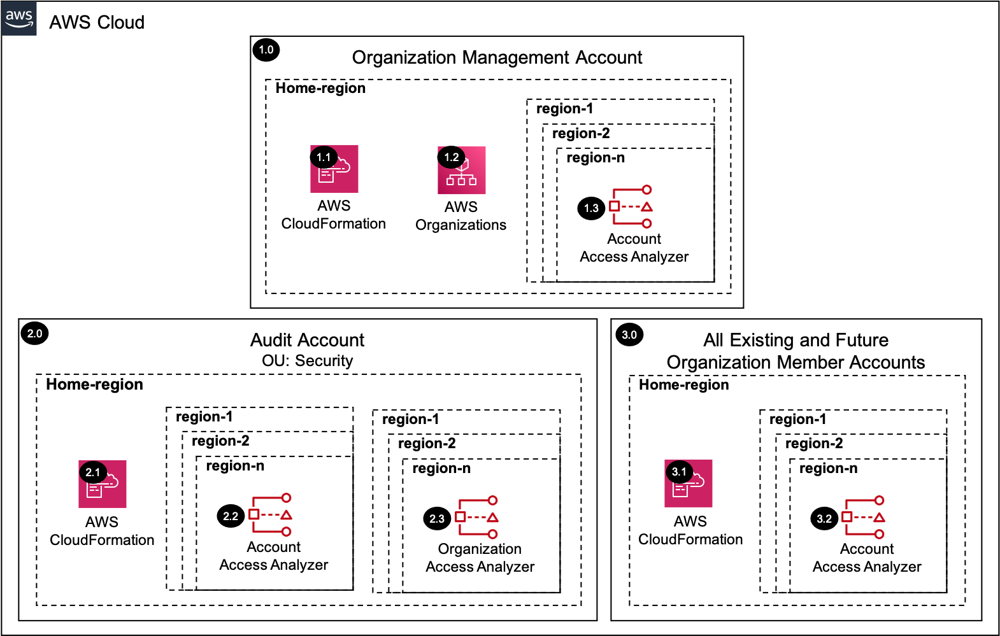

# Access Analyzer<!-- omit in toc -->

Copyright Amazon.com, Inc. or its affiliates. All Rights Reserved. SPDX-License-Identifier: CC-BY-SA-4.0

## Table of Contents<!-- omit in toc -->

- [Introduction](#introduction)
- [Deployed Resource Details](#deployed-resource-details)
- [Implementation Instructions](#implementation-instructions)
- [References](#references)

---

## Introduction

The IAM Access Analyzer solution enables AWS IAM Access Analyzer by delegating administration to a member account within the Organization management account. It then configures Access Analyzer within the `delegated administrator account` for all the
existing and future AWS Organization accounts.

In addition to the organization deployment, the solution deploys AWS Access Analyzer to all the member accounts and regions for analyzing account level permissions.

---

## Deployed Resource Details



### 1.0 Organization Management Account<!-- omit in toc -->

#### 1.1 AWS CloudFormation<!-- omit in toc -->

- All resources are deployed via AWS CloudFormation as a `StackSet` and `Stack Instance` within the management account or a CloudFormation `Stack` within a specific account.
- The [Customizations for AWS Control Tower](https://aws.amazon.com/solutions/implementations/customizations-for-aws-control-tower/) solution deploys all templates as a CloudFormation `StackSet`.
- For parameter details, review the [AWS CloudFormation templates](templates/).

#### 1.2 AWS Organizations<!-- omit in toc -->

- AWS Organizations is used to delegate an administrator account for AWS Access Analyzer Delegated Administrator Account
- See [Common Register Delegated Administrator](../../common/common_register_delegated_administrator)

#### 1.3 Account AWS IAM Access Analyzer<!-- omit in toc -->

AWS IAM Access Analyzer is configured to monitor [supported resources](https://docs.aws.amazon.com/IAM/latest/UserGuide/access-analyzer-resources.html) for the AWS Account zone of trust.

---

### 2.0 Audit Account<!-- omit in toc -->

The example solutions use `Audit Account` instead of `Security Tooling Account` to align with the default account name used within the AWS Control Tower setup process for the Security Account. The Account ID for the `Audit Account` SSM parameter is
populated from the `SecurityAccountId` parameter within the `AWSControlTowerBP-BASELINE-CONFIG` StackSet.

#### 2.1 AWS CloudFormation<!-- omit in toc -->

- See [1.1 AWS CloudFormation](#11-aws-cloudformation)

#### 2.2 Account AWS IAM Access Analyzer<!-- omit in toc -->

- See [1.2 Account AWS IAM Access Analyzer](#12-account-aws-iam-access-analyzer)

#### 2.3 Organization AWS IAM Access Analyzer<!-- omit in toc -->

- AWS IAM Access Analyzer is configured to monitor supported resources for the AWS Organization zone of trust.

---

### 3.0 All Existing and Future Organization Member Accounts<!-- omit in toc -->

#### 3.1 AWS CloudFormation<!-- omit in toc -->

- See [1.1 AWS CloudFormation](#11-aws-cloudformation)

#### 3.2 Account AWS IAM Access Analyzer<!-- omit in toc -->

- See [1.2 Account AWS IAM Access Analyzer](#12-account-aws-iam-access-analyzer)

---

## Implementation Instructions

### Pre-requisites<!-- omit in toc -->

1. [Download and Stage the SRA Solutions](../../../docs/DOWNLOAD-AND-STAGE-SOLUTIONS.md). **Note:** This only needs to be done once for all the solutions.
2. Verify that the [SRA Prerequisites Solution](../../common/common_prerequisites/) has been deployed.

### Solution Deployment<!-- omit in toc -->

Choose a Deployment Method:

- [AWS CloudFormation](#aws-cloudformation)
- [Customizations for AWS Control Tower](../../../docs/CFCT-DEPLOYMENT-INSTRUCTIONS.md)

#### AWS CloudFormation<!-- omit in toc -->

In the `management account (home region)`, launch an AWS CloudFormation **Stack** using one of the options below:

- **Option 1:** (Recommended) Use the [sra-iam-access-analyzer-main-ssm.yaml](templates/sra-iam-access-analyzer-main-ssm.yaml) template. This is a more automated approach where some of the CloudFormation parameters are populated from SSM parameters
  created by the [SRA Prerequisites Solution](../../common/common_prerequisites/).

  ```bash
  aws cloudformation deploy --template-file $HOME/aws-sra-examples/aws_sra_examples/solutions/iam/iam_access_analyzer/templates/sra-iam-access-analyzer-main-ssm.yaml --stack-name sra-iam-access-analyzer-main-ssm --capabilities CAPABILITY_NAMED_IAM
  ```

- **Option 2:** Use the [sra-iam-access-analyzer-main.yaml](templates/sra-iam-access-analyzer-main.yaml) template. Input is required for the CloudFormation parameters where the default is not set.

  ```bash
  aws cloudformation deploy --template-file $HOME/aws-sra-examples/aws_sra_examples/solutions/iam/iam_access_analyzer/templates/sra-iam-access-analyzer-main.yaml --stack-name sra-iam-access-analyzer-main --capabilities CAPABILITY_NAMED_IAM --parameter-overrides pAccessAnalyzerRegionsToEnable=<ACCESS_ANALYZER_REGIONS_TO_ENABLE> pAuditAccountId=<AUDIT_ACCOUNT_ID> pRootOrganizationalUnitId=<ROOT_ORGANIZATIONAL_UNIT_ID> pSRAStagingS3BucketName=<SRA_STAGING_S3_BUCKET_NAME>
  ```

#### Verify Solution Deployment<!-- omit in toc -->

1. Log into the Audit account and navigate to the IAM Access Analyzer page
   1. Verify that there are 2 Access Analyzers (account and organization)
2. Verify all existing accounts/regions have an account Access Analyzer

#### Solution Delete Instructions<!-- omit in toc -->

In the `management account (home region)`, delete the AWS CloudFormation **Stack** (`sra-iam-access-analyzer-main-ssm` or `sra-iam-access-analyzer-main`) created above.

---

## References

- [Using AWS IAM Access Analyzer](https://docs.aws.amazon.com/IAM/latest/UserGuide/what-is-access-analyzer.html)
