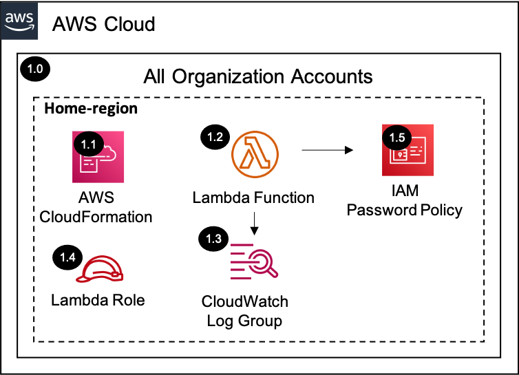

# IAM Password Policy<!-- omit in toc -->

Copyright Amazon.com, Inc. or its affiliates. All Rights Reserved. SPDX-License-Identifier: CC-BY-SA-4.0

## Table of Contents<!-- omit in toc -->

- [Introduction](#introduction)
- [Deployed Resource Details](#deployed-resource-details)
- [Implementation Instructions](#implementation-instructions)
- [References](#references)

---

## Introduction

The IAM Password Policy solution updates the AWS account password policy within all accounts in an AWS Organization.

---

## Deployed Resource Details

### 1.0 All Organization Accounts<!-- omit in toc -->

#### 1.1 AWS CloudFormation<!-- omit in toc -->

- All resources are deployed via AWS CloudFormation as a `StackSet` and `Stack Instance` within the management account or a CloudFormation `Stack` within a specific account.
- The [Customizations for AWS Control Tower](https://aws.amazon.com/solutions/implementations/customizations-for-aws-control-tower/) solution deploys all templates as a CloudFormation `StackSet`.
- For parameter details, review the [AWS CloudFormation templates](templates/).

#### 1.2 AWS Lambda Function<!-- omit in toc -->

- The Lambda function includes logic to set the account password policy

#### 1.3 Amazon CloudWatch Log Group<!-- omit in toc -->

- All the `AWS Lambda Function` logs are sent to a CloudWatch Log Group `</aws/lambda/<LambdaFunctionName>` to help with debugging and traceability of the actions performed.
- By default the `AWS Lambda Function` will create the CloudWatch Log Group and logs are encrypted with a CloudWatch Logs service managed encryption key.

#### 1.4 Lambda Execution IAM Role<!-- omit in toc -->

- IAM role used by the Lambda function to update the account password policy

#### 1.5 IAM Password Policy<!-- omit in toc -->

- AWS account password policy for IAM users

---

## Implementation Instructions

### Prerequisites<!-- omit in toc -->

1. [Download and Stage the SRA Solutions](../../../docs/DOWNLOAD-AND-STAGE-SOLUTIONS.md). **Note:** This only needs to be done once for all the solutions.
2. Verify that the [SRA Prerequisites Solution](../../common/common_prerequisites/) has been deployed.

### Solution Deployment<!-- omit in toc -->

Choose a Deployment Method:

- [AWS CloudFormation](#aws-cloudformation)
- [Customizations for AWS Control Tower](../../../docs/CFCT-DEPLOYMENT-INSTRUCTIONS.md)

#### AWS CloudFormation<!-- omit in toc -->

In the `management account (home region)`, launch an AWS CloudFormation **Stack** using one of the options below:

- **Option 1:** (Recommended) Use the [sra-iam-password-policy-main-ssm.yaml](templates/sra-iam-password-policy-main-ssm.yaml) template. This is a more automated approach where some of the CloudFormation parameters are populated from SSM parameters created by the [SRA Prerequisites Solution](../../common/common_prerequisites/).
- **Option 2:** Use the [sra-iam-password-policy-main.yaml](templates/sra-iam-password-policy-main.yaml) template. Input is required for the CloudFormation parameters where the default is not set.

#### Verify Solution Deployment<!-- omit in toc -->

1. Log into any account within the AWS Organization
2. Navigate to the IAM -> Account settings page
3. Verify the password policy settings

#### Solution Delete Instructions<!-- omit in toc -->

1. In the `management account (home region)`, delete the AWS CloudFormation **Stack** (`sra-iam-password-policy-main-ssm` or `sra-iam-password-policy-main`) created above.
2. In each AWS account, delete the AWS CloudWatch **Log Group** (e.g. /aws/lambda/<solution_name>) for the Lambda function deployed.

---

## References

- [Setting an account password policy](https://docs.aws.amazon.com/IAM/latest/UserGuide/id_credentials_passwords_account-policy.html)
- [CIS AWS Foundations Benchmark controls](https://docs.aws.amazon.com/securityhub/latest/userguide/securityhub-cis-controls.html)
