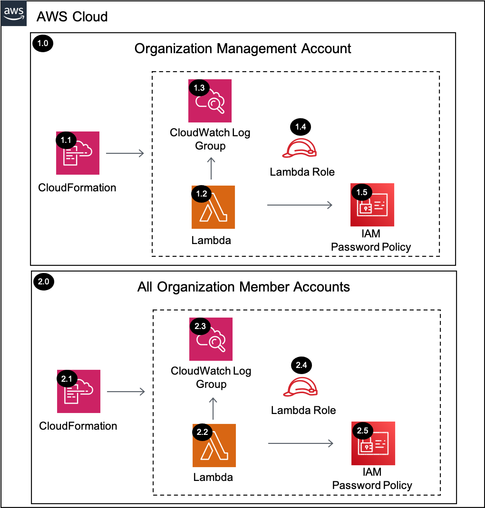

# IAM Password Policy <!-- omit in toc -->

Copyright Amazon.com, Inc. or its affiliates. All Rights Reserved. SPDX-License-Identifier: CC-BY-SA-4.0

## Table of Contents <!-- omit in toc -->

- [Introduction](#introduction)
- [Deployed Resource Details](#deployed-resource-details)
- [Implementation Instructions](#implementation-instructions)
- [References](#references)

---

## Introduction

The IAM Password Policy solution updates the AWS account password policy within all accounts in an AWS Organization.

---

## Deployed Resource Details



### 1.0 Organization Management Account <!-- omit in toc -->

#### 1.1 AWS CloudFormation <!-- omit in toc -->

- All resources are deployed via AWS CloudFormation as a `StackSet` and `Stack Instance` within the management account or a CloudFormation `Stack` within a specific account.
- The [Customizations for AWS Control Tower](https://aws.amazon.com/solutions/implementations/customizations-for-aws-control-tower/) solution deploys all templates as a CloudFormation `StackSet`.
- For parameter details, review the [AWS CloudFormation templates](templates/).

#### 1.2 AWS Lambda Function <!-- omit in toc -->

- The Lambda function includes logic to set the account password policy

#### 1.3 Amazon CloudWatch Log Group <!-- omit in toc -->

- All the `AWS Lambda Function` logs are sent to a CloudWatch Log Group `</aws/lambda/<LambdaFunctionName>` to help with debugging and traceability of the actions performed.
- By default the `AWS Lambda Function` will create the CloudWatch Log Group and logs are encrypted with a CloudWatch Logs service managed encryption key.

#### 1.4 Lambda Execution IAM Role <!-- omit in toc -->

- IAM role used by the Lambda function to update the account password policy

#### 1.5 IAM Password Policy <!-- omit in toc -->

- AWS account password policy for IAM users

---

### 2.0 All Organization Member Accounts <!-- omit in toc -->

Same configuration details as 1.0 Organization Management Account

---

## Implementation Instructions

### Staging <!-- omit in toc -->

1. In the `management account (home region)`, launch the AWS CloudFormation **Stack** using the [prereq-controltower-execution-role.yaml](../../../utils/aws_control_tower/prerequisites/prereq-controltower-execution-role.yaml) template file as the
   source, to implement the `AWSControlTowerExecution` role pre-requisite.
   - **Note:** Only do this step, if the `AWSControlTowerExecution` IAM role doesn't already exist in the Control Tower `management account`.
2. In the `management account (home region)`, launch the AWS CloudFormation **StackSet** targeting only the `management account` in all of the enabled regions (include home region)
   [prereq-lambda-s3-bucket.yaml](../../../utils/aws_control_tower/prerequisites/prereq-lambda-s3-bucket.yaml) template file as the source, to implement an S3 bucket that will store the Lambda Zip files. (Example Bucket Name:
   `lambda-zips-<Management Account ID>-<AWS Region>`)
   - For additional guidance see [CloudFormation StackSet Instructions](#cloudformation-stackset-instructions)
   - Take note of the S3 Bucket Name from the CloudFormation Outputs, as you will need it for both the packaging step, and the **Solution Deployment Order** section.
   - **Note:** Only do this step if you don't already have an S3 bucket to store the Lambda zip files for CloudFormation custom resources in the Control Tower `management account`.
     - Lambda functions can only access Zip files from an S3 bucket in the same AWS region as the where Lambda function resides.
     - Although for this solution, S3 bucket is only needed in the `home region`, it is recommended to deploy the S3 bucket as a **stackset**, so that you can support future Lambda functions in other regions.
3. Package the Lambda code into a zip file and upload it to the S3 bucket (from above step), using the [Packaging script](../../../utils/packaging_scripts/package-lambda.sh).
   - `SRA_REPO` environment variable should point to the folder where `aws-security-reference-architecture-examples` repository is stored.
   - `BUCKET` environment variable should point to the S3 Bucket where the Lambda zip files are stored.
   - See CloudFormation Output from Step 2
     - Or follow this syntax: `lambda-zips-<CONTROL-TOWER-MANAGEMENT-ACCOUNT>-<CONTROL-TOWER-HOME-REGION>`

```bash
# Example (assumes repository was downloaded to your home directory)
export SRA_REPO="$HOME"/aws-security-reference-architecture-examples
export BUCKET=sra-staging-123456789012-us-east-1
sh "$SRA_REPO"/aws_sra_examples/utils/packaging_scripts/package-lambda.sh \
--file_name iam-password-policy-acct.zip \
--bucket $BUCKET \
--src_dir "$SRA_REPO"/aws_sra_examples/solutions/iam/iam_password_policy_acct/lambda/src
```

```bash
# Export AWS CLI profile for the 'management account'
export AWS_ACCESS_KEY_ID=
export AWS_SECRET_ACCESS_KEY=
export AWS_SESSION_TOKEN=

# Use template below and set the 'SRA_REPO' and 'BUCKET' with your values.
export SRA_REPO=
export BUCKET=
sh "$SRA_REPO"/aws_sra_examples/utils/packaging_scripts/package-lambda.sh \
--file_name iam-password-policy-acct.zip \
--bucket $BUCKET \
--src_dir "$SRA_REPO"/aws_sra_examples/solutions/iam/iam_password_policy_acct/lambda/src
```

### Solution Deployment <!-- omit in toc -->

#### Customizations for AWS Control Tower <!-- omit in toc -->

- [Customizations for AWS Control Tower](./customizations_for_aws_control_tower)

#### AWS CloudFormation <!-- omit in toc -->

1. In the `management account (home region)`, launch an AWS CloudFormation **Stack Set** and deploy to `All active accounts` within the `home region` using the [sra-iam-password-policy-acct.yaml](templates/sra-iam-password-policy-acct.yaml)

#### Verify Solution Deployment <!-- omit in toc -->

1. Log into any account within the AWS Organization
   1. Navigate to the IAM -> Account settings page
   2. Verify the custom password policy settings

#### Solution Delete Instructions <!-- omit in toc -->

1. In the `management account (home region)`, delete the AWS CloudFormation **StackSet** created in step 1 of the solution deployment. **Note:** there should not be any `stack instances` associated with this StackSet.

---

## References

- [Setting an account password policy](https://docs.aws.amazon.com/IAM/latest/UserGuide/id_credentials_passwords_account-policy.html)
- [CIS AWS Foundations Benchmark controls](https://docs.aws.amazon.com/securityhub/latest/userguide/securityhub-cis-controls.html)
