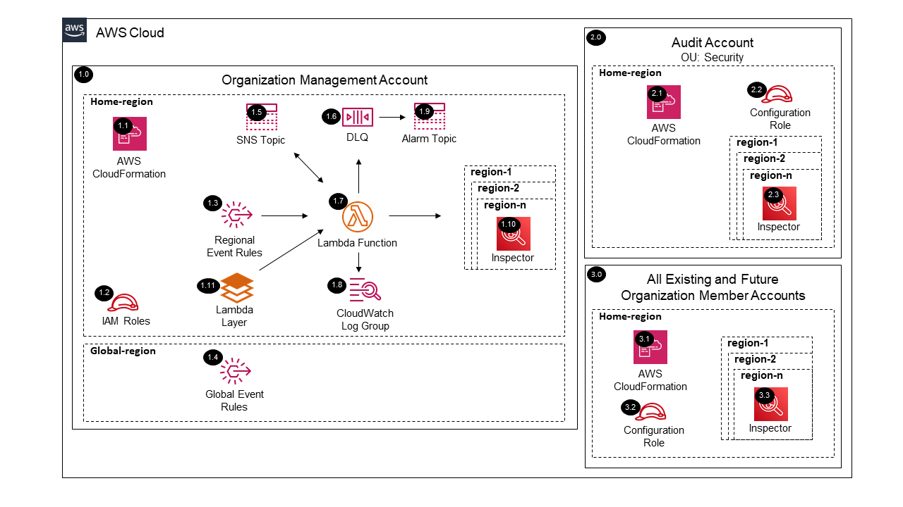

# Inspector Organization<!-- omit in toc -->

Copyright Amazon.com, Inc. or its affiliates. All Rights Reserved. SPDX-License-Identifier: CC-BY-SA-4.0

## Table of Contents

- [Table of Contents](#table-of-contents)
- [Introduction](#introduction)
- [Deployed Resource Details](#deployed-resource-details)
- [Implementation Instructions](#implementation-instructions)
- [References](#references)

---

## Introduction

The Inspector Organization solution will automate enabling Amazon Inspector by delegating administration to an account (e.g. Audit or Security Tooling) and configuring Inspector for all the existing and future AWS Organization accounts.

**Key solution features:**

- Delegates Inspector administration to another account (i.e Audit account).
- Assumes a role in the delegated administrator account to configure organizations management.
- Adds all existing accounts including the `management account` as members.
- Configures a region aggregator within the `Home region`.
- Assumes a role in each member account to enable/disable standards aligning with the delegated administrator account.
- Ability to disable Inspector within all accounts and regions via a parameter and CloudFormation update event.

---

## Deployed Resource Details



### 1.0 Organization Management Account<!-- omit in toc -->

#### 1.1 AWS CloudFormation<!-- omit in toc -->

- All resources are deployed via AWS CloudFormation as a `StackSet` and `Stack Instance` within the `management account` or a CloudFormation `Stack` within a specific account.
- The [Customizations for AWS Control Tower](https://aws.amazon.com/solutions/implementations/customizations-for-aws-control-tower/) solution deploys all templates as a CloudFormation `StackSet`.
- For parameter details, review the [AWS CloudFormation templates](templates/).

#### 1.2 IAM Roles<!-- omit in toc -->

- The `Lambda IAM Role` is used by the Lambda function to enable the Inspector Delegated Administrator Account within each region provided.
- The `Configuration IAM Role` is assumed by the Lambda function to configure Inspector within the delegated administrator account and all member accounts.
- The `Event Rule IAM Role` is assumed by EventBridge to forward Global events to the `Home Region` default Event Bus.

#### 1.3 Regional Event Rules<!-- omit in toc -->

- The `AWS Control Tower Lifecycle Event Rule` triggers the `AWS Lambda Function` when a new AWS Account is provisioned through AWS Control Tower.
- The `Organization Compliance Scheduled Event Rule` triggers the `AWS Lambda Function` to capture AWS Account status updates (e.g. suspended to active).
  - A parameter is provided to set the schedule frequency.
  - See the [Instructions to Manually Run the Lambda Function](#instructions-to-manually-run-the-lambda-function) for triggering the `AWS Lambda Function` before the next scheduled run time.
- The `AWS Organizations Event Rule` triggers the `AWS Lambda Function` when updates are made to accounts within the organization.
  - When AWS Accounts are added to the AWS Organization outside of the AWS Control Tower Account Factory. (e.g. account created via AWS Organizations console, account invited from another AWS Organization).
  - When tags are added or updated on AWS Accounts.

#### 1.4 Global Event Rules<!-- omit in toc -->

- If the `Home Region` is different from the `Global Region (e.g. us-east-1)`, then global event rules are created within the `Global Region` to forward events to the `Home Region` default Event Bus.
- The `AWS Organizations Event Rule` forwards AWS Organization account update events.

#### 1.5 SNS Topic<!-- omit in toc -->

- SNS Topic used to fanout the Lambda function for configuring the service within each region.

#### 1.6 Dead Letter Queue (DLQ)<!-- omit in toc -->

- SQS dead letter queue used for retaining any failed Lambda events.

#### 1.7 AWS Lambda Function<!-- omit in toc -->

- The Lambda function includes logic to enable and configure Inspector.

#### 1.8 Lambda CloudWatch Log Group<!-- omit in toc -->

- All the `AWS Lambda Function` logs are sent to a CloudWatch Log Group `</aws/lambda/<LambdaFunctionName>` to help with debugging and traceability of the actions performed.
- By default the `AWS Lambda Function` will create the CloudWatch Log Group and logs are encrypted with a CloudWatch Logs service managed encryption key.
- Parameters are provided for changing the default log group retention and encryption KMS key.

#### 1.9 Alarm SNS Topic<!-- omit in toc -->

- SNS Topic used to notify subscribers when messages hit the DLQ.

#### 1.10 Inspector<!-- omit in toc -->

- The Inspector delegated administrator is registered within organizations in the `management account` using the Inspector APIs within each provided region.
- EC2, ECR, and Lambda function scanning is set to be auto-enabled for all associated member accounts (newly associated and newly created accounts)

#### 1.11 Lambda Layer<!-- omit in toc -->

- The python boto3 SDK lambda layer to enable capability for lambda to enable all elements of the inspector service.
- This is downloaded during the deployment process and packaged into a layer that is used by the lambda function in this solution.
- The inspector API available in the current lambda environment (as of 01/19/2023) is boto3-1.20.32, however, enhanced functionality of the inspector API used in this solution requires at least 1.26.18 (see references below).
- Note: Future revisions to this solution will remove this layer when boto3 is updated within the lambda environment.

---

### 2.0 Audit Account<!-- omit in toc -->

The example solutions use `Audit Account` instead of `Security Tooling Account` to align with the default account name used within the AWS Control Tower setup process for the Security Account. The Account ID for the `Audit Account` SSM parameter is
populated from the `SecurityAccountId` parameter within the `AWSControlTowerBP-BASELINE-CONFIG` StackSet.

#### 2.1 AWS CloudFormation<!-- omit in toc -->

- See [1.1 AWS CloudFormation](#11-aws-cloudformation)

#### 2.2 Configuration IAM Role<!-- omit in toc -->

- IAM role assumed by the Lambda function within the `management account` to configure Inspector within each region provided.

#### 2.3 Inspector (Delegated admin)<!-- omit in toc -->

- Inspector is enabled in the delegated admin account within each provided region.
- EC2, ECR, and Lambda function scanning is enabled.

---

### 3.0 All Existing and Future Organization Member Accounts<!-- omit in toc -->

#### 3.1 AWS CloudFormation<!-- omit in toc -->

- See [1.1 AWS CloudFormation](#11-aws-cloudformation)

#### 3.2 Configuration IAM Role<!-- omit in toc -->

- See [2.2 AWS CloudFormation](#22-configuration-iam-role)

#### 3.3 Inspector (Members)<!-- omit in toc -->

- Inspector is enabled from the delegated administrator account.
- EC2, ECR, and Lambda function scanning is enabled.

---

## Implementation Instructions

### Prerequisites<!-- omit in toc -->

1. [Download and Stage the SRA Solutions](../../../docs/DOWNLOAD-AND-STAGE-SOLUTIONS.md). **Note:** This only needs to be done once for all the solutions.
2. Verify that the [SRA Prerequisites Solution](../../common/common_prerequisites/) has been deployed.

### Solution Deployment<!-- omit in toc -->

Choose a Deployment Method:

- [AWS CloudFormation](#aws-cloudformation)
- [Customizations for AWS Control Tower](../../../docs/CFCT-DEPLOYMENT-INSTRUCTIONS.md)

#### AWS CloudFormation<!-- omit in toc -->

In the `management account (home region)`, launch an AWS CloudFormation **Stack** using one of the options below:

- **Option 1:** (Recommended) Use the [sra-inspector-org-main-ssm.yaml](templates/sra-inspector-org-main-ssm.yaml) template. This is a more automated approach where some of the CloudFormation parameters are populated from SSM parameters created
  by the [SRA Prerequisites Solution](../../common/common_prerequisites/).

  ```bash
  aws cloudformation deploy --template-file $HOME/aws-sra-examples/aws_sra_examples/solutions/inspector/inspector_org/templates/sra-inspector-org-main-ssm.yaml --stack-name sra-inspector-org-main-ssm --capabilities CAPABILITY_NAMED_IAM
  ```

- **Option 2:** Use the [sra-inspector-org-main.yaml](templates/sra-inspector-org-main.yaml) template. Input is required for the CloudFormation parameters where the default is not set.

  ```bash
  aws cloudformation deploy --template-file $HOME/aws-sra-examples/aws_sra_examples/solutions/inspector/inspector_org/templates/sra-inspector-org-main.yaml --stack-name sra-inspector-org-main --capabilities CAPABILITY_NAMED_IAM --parameter-overrides pAuditAccountId=<AUDIT_ACCOUNT_ID> pOrganizationId=<ORGANIZATION_ID> pRootOrganizationalUnitId=<ROOT_ORGANIZATIONAL_UNIT_ID> pSRAStagingS3BucketName=<SRA_STAGING_S3_BUCKET_NAME>
  ```

#### Verify Solution Deployment<!-- omit in toc -->

1. Log into the `management account` and navigate to the Inspector page
   1. Select Settings and then General
   1. Verify that the delegated admin account is set for each region
2. Log into the Audit account and navigate to the Inspector page
   1. Verify the Inspector service is enabled in each region
   2. Verify the auto-enable ec2, ecr, and lambda scanning for new accounts is ON in each region
   3. Verify all existing member accounts have inspector ec2, ecr, and lambda scanning enabled in each region
3. Log into a member account and verify the inspector is enabled and configured to scan ec2, ecr, and lambda functions

#### Solution Update Instructions<!-- omit in toc -->

1. [Download and Stage the SRA Solutions](../../../docs/DOWNLOAD-AND-STAGE-SOLUTIONS.md). **Note:** Get the latest code and run the staging script.
2. Update the existing CloudFormation Stack or CFCT configuration. **Note:** Make sure to update the `SRA Solution Version` parameter and any new added parameters.

#### Solution Delete Instructions<!-- omit in toc -->

1. In the `management account (home region)`, delete the AWS CloudFormation **Stack** (`sra-inspector-org-main-ssm` or `sra-inspector-org-main`).
2. In the `management account (home region)`, delete stack instances from the the AWS CloudFormation **StackSet** (`sra-inspector-org-main-ssm` or `sra-inspector-org-main`).
3. In the `management account (home region)`, delete AWS CloudFormation **StackSet** (`sra-inspector-org-main-ssm` or `sra-inspector-org-main`).
4. In the `management account (home region)`, verify that the Lambda function processing is complete by confirming no more CloudWatch logs are generated.
5. In the `management account (home region)`, delete the AWS CloudWatch **Log Group** (e.g. /aws/lambda/<solution_name>) for the Lambda function deployed.

#### Instructions to Manually Run the Lambda Function<!-- omit in toc -->

1. In the `management account (home region)`.
2. Navigate to the AWS Lambda Functions page.
3. Select the `checkbox` next to the Lambda Function and select `Test` from the `Actions` menu.
4. Scroll down to view the `Test event`.
5. Click the `Test` button to trigger the Lambda Function with the default values.
6. Verify that the updates were successful within the expected account(s).

---

## References

- [Managing multiple accounts in Amazon Inspector with AWS Organizations](https://docs.aws.amazon.com/inspector/latest/user/managing-multiple-accounts.html)
- [Managing AWS SDKs in Lambda Functions](https://docs.aws.amazon.com/lambda/latest/operatorguide/sdks-functions.html)
- [Lambda runtimes](https://docs.aws.amazon.com/lambda/latest/dg/lambda-runtimes.html)
- [Python Boto3 SDK changelog](https://github.com/boto/boto3/blob/develop/CHANGELOG.rst)
