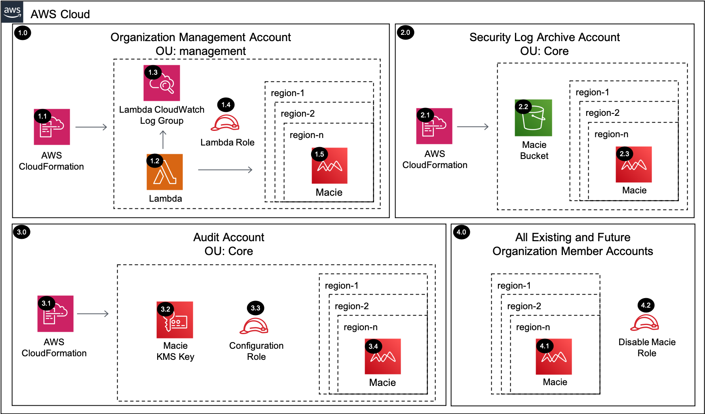

# Macie Organization<!-- omit in toc -->

Copyright Amazon.com, Inc. or its affiliates. All Rights Reserved. SPDX-License-Identifier: CC-BY-SA-4.0

## Table of Contents<!-- omit in toc -->

- [Introduction](#introduction)
- [Deployed Resource Details](#deployed-resource-details)
- [Implementation Instructions](#implementation-instructions)
- [References](#references)

---

## Introduction

The Macie Organization solution will enable Amazon Macie by delegating administration to a member account within the Organization Management Account and configuring Macie within the delegated administrator account for all the existing and future AWS
Organization accounts. Macie is also configured to send the findings to a central S3 bucket encrypted with a KMS key.

---

## Deployed Resource Details



### 1.0 Organization Management Account<!-- omit in toc -->

#### 1.1 AWS CloudFormation<!-- omit in toc -->

- All resources are deployed via AWS CloudFormation as a `StackSet` and `Stack Instance` within the management account or a CloudFormation `Stack` within a specific account.
- The [Customizations for AWS Control Tower](https://aws.amazon.com/solutions/implementations/customizations-for-aws-control-tower/) solution deploys all templates as a CloudFormation `StackSet`.
- For parameter details, review the [AWS CloudFormation templates](templates/).

#### 1.2 AWS Lambda Function<!-- omit in toc -->

The Lambda function is required to register the Macie delegated administrator account within each region provided

#### 1.3 Lambda IAM Role<!-- omit in toc -->

- IAM role used by the Lambda function to register the Macie delegated administrator account within each region provided

#### 1.4 Lambda CloudWatch Log Group<!-- omit in toc -->

- All the `AWS Lambda Function` logs are sent to a CloudWatch Log Group `</aws/lambda/<LambdaFunctionName>` to help with debugging and traceability of the actions performed.
- By default the `AWS Lambda Function` will create the CloudWatch Log Group and logs are encrypted with a CloudWatch Logs service managed encryption key.

#### 1.5 Configuration SNS Topic<!-- omit in toc -->

- SNS Topic used to fanout the Lambda function for disabling Macie within each account and region.

#### 1.6 Dead Letter Queue (DLQ)<!-- omit in toc -->

- SQS dead letter queue used for retaining any failed Lambda events.

#### 1.7 Alarm SNS Topic<!-- omit in toc -->

- SNS Topic used to notify subscribers when messages hit the DLQ.

#### 1.8 Macie<!-- omit in toc -->

- Macie is enabled for each existing active account and region during the initial setup
- Macie will automatically enable new member accounts/regions when added to the AWS Organization

---

### 2.0 Log Archive Account<!-- omit in toc -->

#### 2.1 AWS CloudFormation<!-- omit in toc -->

- See [1.1 AWS CloudFormation](#11-aws-cloudformation)

#### 2.2 Macie Delivery S3 Bucket<!-- omit in toc -->

- S3 bucket where Macie classifications are exported for each account/region within the AWS Organization

#### 2.3 Macie<!-- omit in toc -->

- See [1.8 Macie](#18-macie)

---

### 3.0 Audit Account (Security Tooling)<!-- omit in toc -->

The example solutions use `Audit Account` instead of `Security Tooling Account` to align with the default account name used within the AWS Control Tower setup process for the Security Account. The Account ID for the `Audit Account`  can be determined from the `SecurityAccountId` parameter within the `AWSControlTowerBP-BASELINE-CONFIG` StackSet in AWS Control Tower environments, but is specified manually in other environments, and then stored in an SSM parameter (this is all done in the common prerequisites solution).

#### 3.1 AWS CloudFormation<!-- omit in toc -->

- See [1.1 AWS CloudFormation](#11-aws-cloudformation)

#### 3.2 Macie Delivery KMS Key<!-- omit in toc -->

- Macie is configured to encrypt the exported findings with a customer managed KMS key

#### 3.3 Configuration IAM Role<!-- omit in toc -->

- IAM role assumed by the Lambda function within the management account to configure Macie within each region provided

#### 3.4 Macie<!-- omit in toc -->

- See [1.8 Macie](#18-macie)

---

### 4.0 All Existing and Future Organization Member Accounts<!-- omit in toc -->

#### 4.1 Macie<!-- omit in toc -->

- See [1.8 Macie](#18-macie)

#### 4.2 Disable Macie Role<!-- omit in toc -->

- An IAM role is created within all the accounts to disable Macie when the Disable Macie parameter is set to 'true' and the CloudFormation stack is updated.

---

## Implementation Instructions

### Prerequisites<!-- omit in toc -->

### Prerequisites<!-- omit in toc -->

1. [Download and Stage the SRA Solutions](../../../docs/DOWNLOAD-AND-STAGE-SOLUTIONS.md). **Note:** This only needs to be done once for all the solutions.
2. Verify that the [SRA Prerequisites Solution](../../common/common_prerequisites/) has been deployed.

### Solution Deployment<!-- omit in toc -->

Choose a Deployment Method:

- [AWS CloudFormation](#aws-cloudformation)
- [Customizations for AWS Control Tower](../../../docs/CFCT-DEPLOYMENT-INSTRUCTIONS.md)

#### AWS CloudFormation<!-- omit in toc -->

In the `management account (home region)`, launch an AWS CloudFormation **Stack** using one of the options below:

- **Option 1:** (Recommended) Use the [sra-macie-org-main-ssm.yaml](templates/sra-macie-org-main-ssm.yaml) template. This is a more automated approach where some of the CloudFormation parameters are populated from SSM parameters created by the
  [SRA Prerequisites Solution](../../common/common_prerequisites/).

  ```bash
  aws cloudformation deploy --template-file $HOME/aws-sra-examples/aws_sra_examples/solutions/macie/macie_org/templates/sra-macie-org-main-ssm.yaml --stack-name sra-macie-org-main-ssm --capabilities CAPABILITY_NAMED_IAM
  ```

- **Option 2:** Use the [sra-macie-org-main.yaml](templates/sra-macie-org-main.yaml) template. Input is required for the CloudFormation parameters where the default is not set.

  ```bash
  aws cloudformation deploy --template-file $HOME/aws-sra-examples/aws_sra_examples/solutions/macie/macie_org/templates/sra-macie-org-main.yaml --stack-name sra-macie-org-main --capabilities CAPABILITY_NAMED_IAM --parameter-overrides pAuditAccountId=<AUDIT_ACCOUNT_ID> pLogArchiveAccountId=<LOG_ARCHIVE_ACCOUNT_ID> pOrganizationId=<ORGANIZATION_ID> pRootOrganizationalUnitId=<ROOT_ORGANIZATIONAL_UNIT_ID> pSRAStagingS3BucketName=<SRA_STAGING_S3_BUCKET_NAME>
  ```

#### Verify Solution Deployment<!-- omit in toc -->

1. Log into the Management account and navigate to the Macie page
   1. Validate that the delegated admin account is set for each region
2. Log into the Audit account and navigate to the Macie page
   1. Verify the correct Macie configurations have been applied to each region
   2. Verify all existing accounts have been enabled
   3. Verify the findings export is configured for the S3 bucket
   4. Generate sample findings to verify S3 delivery
3. Log into the Log archive account and navigate to the S3 page
   1. Verify the sample findings have been delivered

#### Solution Delete Instructions<!-- omit in toc -->

1. In the `management account (home region)`, delete the AWS CloudFormation **Stack** (`sra-macie-org-main-ssm` or `sra-macie-org-main`) created above.
2. In the `management account (home region)`, delete the AWS CloudWatch **Log Group** (e.g. /aws/lambda/<solution_name>) for the Lambda function deployed.
3. In the `log archive acccount (home region)`, delete the S3 bucket (e.g. sra-macie-org-delivery-<account_id>-<aws_region>) created by the solution.

---

## References

- [Managing multiple Amazon Macie accounts with AWS Organizations](https://docs.aws.amazon.com/macie/latest/user/macie-organizations.html)
