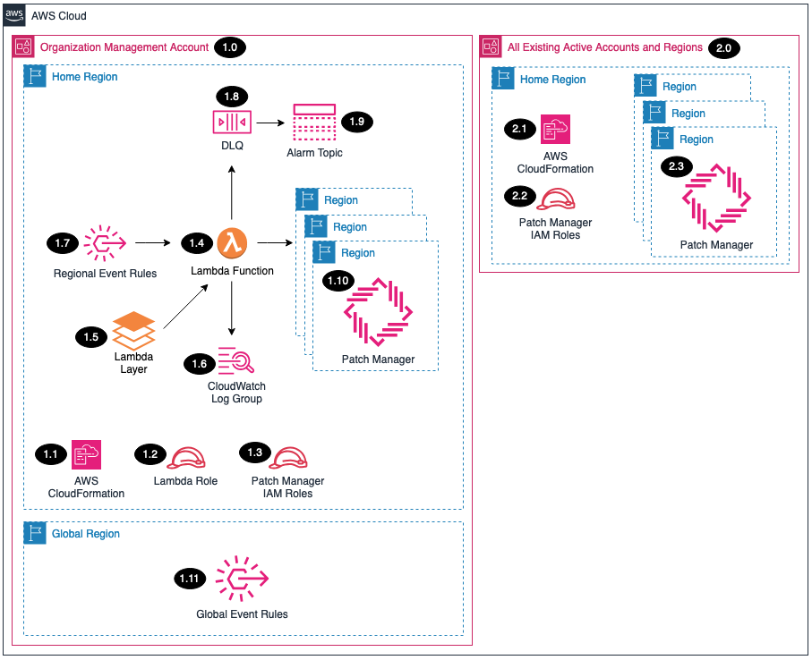
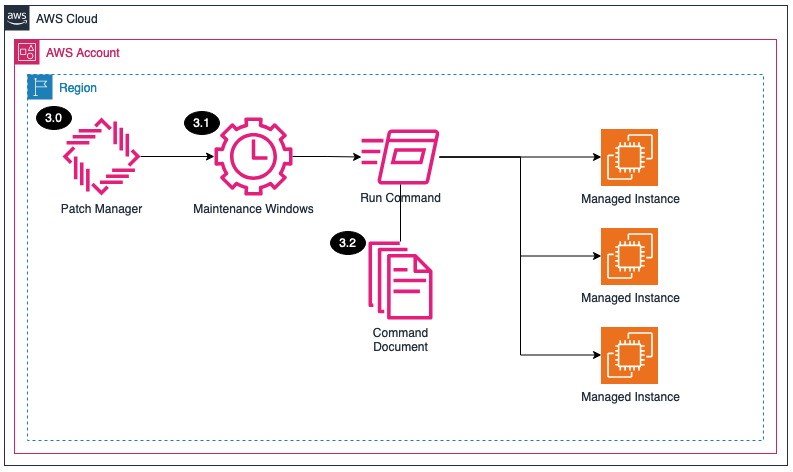

# Patch Manager<!-- omit in toc -->

Copyright Amazon.com, Inc. or its affiliates. All Rights Reserved. SPDX-License-Identifier: CC-BY-SA-4.0

## Table of Contents

- [Table of Contents](#table-of-contents)
- [Introduction](#introduction)
- [Deployed Resource Details](#deployed-resource-details)
- [Implementation Instructions](#implementation-instructions)
- [References](#references)

---

## Introduction

The SRA Patch Manager solution will automate enabling Systems Manager - Patch manager by configuring Patch Manager for all the existing AWS Organization accounts.

**Key solution features:**
- Assumes a role in each member account to enable/disable the Patch Manager Solution.
- Creates 3 Maintenance Windows:
   - One updates the SSM Agents on all Managed Instances.
   - One scans for, or installs, missing **Security patches rated Critical or Important** and **Bugfixes** on Managed Instances tagged as Windows.
   - One scans for, or installs, missing **Security patches rated Critical or Important** and **Bugfixes** on Managed Instances tagged as Linux.
- Configures the [Default Host Configuration](https://docs.aws.amazon.com/systems-manager/latest/userguide/quick-setup-default-host-management-configuration.html) feature.
- Ability to disable Patch Manager within all accounts and regions via a parameter and CloudFormation update event.

---

## Prerequisites

The Patch Manager solution requires:
- SSM Agent 3.0.502 or later to be installed on the managed node
- Internet connectivity from the managed node to the source patch repositories
- Supported OS
- A tag is applied to the Managed Instance. Key: InstanceOS Value: Linux or Windows

---

## Deployed Resource Details

## Solution Details

### 1.0 Organization Management Account<!-- omit in toc -->

#### 1.1 AWS CloudFormation<!-- omit in toc -->

- All resources are deployed via AWS CloudFormation as a `StackSet` and `Stack Instance` within the management account or a CloudFormation `Stack` within a specific account.
- The [Customizations for AWS Control Tower](https://aws.amazon.com/solutions/implementations/customizations-for-aws-control-tower/) solution deploys all templates as a CloudFormation `StackSet`.
- For parameter details, review the [AWS CloudFormation templates](templates/).

#### 1.2 AWS Lambda Function<!-- omit in toc -->

- The Lambda function includes logic to enable and configure Patch Manager

#### 1.3 Lambda Execution IAM Role<!-- omit in toc -->

- The `Lambda IAM Role` is used by the Lambda function in the management account to enable the Patch Manager in the management account.

#### 1.4 Lambda CloudWatch Log Group<!-- omit in toc -->

- All the `AWS Lambda Function` logs are sent to a CloudWatch Log Group `</aws/lambda/<LambdaFunctionName>` to help with debugging and traceability of the actions performed.
- By default the `AWS Lambda Function` will create the CloudWatch Log Group and logs are encrypted with a CloudWatch Logs service managed encryption key.

#### 1.5 AWS Patch Manager<!-- omit in toc -->

- Patch Manager is enabled for each existing active account and region during the initial setup.

### 2.0 All existing active accounts and regions<!-- omit in toc -->

#### 2.1 AWS CloudFormation<!-- omit in toc -->

- All resources are deployed via AWS CloudFormation as a `StackSet` and `Stack Instance` within the management account or a CloudFormation `Stack` within a specific account.
- The [Customizations for AWS Control Tower](https://aws.amazon.com/solutions/implementations/customizations-for-aws-control-tower/) solution deploys all templates as a CloudFormation `StackSet`.
- For parameter details, review the [AWS CloudFormation templates](templates/).

#### 2.2 IAM Roles<!-- omit in toc -->

- The `Patch Management IAM Role` is assumed by the Lambda function in each of the member accounts to to configure Patch Manager.
- The `SSM Automation Role` is used by the Maintenance Window to execute the task.
- The `DefaultHostConfig Role` is used to enable the Default Host Configuration setting.
- The `Patch Mgr EC2 Profile` is used if there are issue with the Default Host Configuration setting.

### 3.0 Patch Manager Solution<!-- omit in toc -->

#### 3.1 Maintenance Windows<!-- omit in toc -->

##### Maintenance Windows Window

Three Maintenance Windows are created:
- `Update_SSM` updates SSM Agent on all Managed Instances
- `Windows_Scan` scans for missing patches on all Managed Instances Tagged as Windows
- `Linux_Scan` scans for missing patches on all Managed Instances Tagged as Linux

##### Maintenance Windows Tasks

Three tasks are created and registered with each of the Maintenance Windows:
- `Update_SSM` Runs an SSM Agent update on all Managed Instances
- `Windows_Scan` Runs a scan on all Managed Instances Tagged as Windows
- `Linux_Scan` Runs a scan on all Managed Instances Tagged as Linux

##### Maintenance Window Targets

Three target groups are created and registered with each of the Maintenance Windows:
- `Update_SSM` which includes all instances with the tag InstanceOS:Windows or InstanceOS:Linux
- `Windows_Scan`  which includes all instances with the tag InstanceOS:Windows
- `Linux_Scan`  which includes all instances with the tag InstanceOS:Linux

#### 3.2 Command Documents<!-- omit in toc -->

These AWS Managed SSM Documents are used by the tasks:
- `AWS-UpdateSSMAgent`
- `AWS-RunPatchBaseline`

## Implementation Instructions

### Prerequisites<!-- omit in toc -->

1. [Download and Stage the SRA Solutions](../../../docs/DOWNLOAD-AND-STAGE-SOLUTIONS.md). **Note:** This only needs to be done once for all the solutions.
2. Verify that the [SRA Prerequisites Solution](../../common/common_prerequisites/) has been deployed.

### Solution Deployment<!-- omit in toc -->

Choose a Deployment Method:

- [AWS CloudFormation](#aws-cloudformation)
- [Customizations for AWS Control Tower](../../../docs/CFCT-DEPLOYMENT-INSTRUCTIONS.md)

#### AWS CloudFormation<!-- omit in toc -->

Refer to the [AWS SRA Easy Setup](https://github.com/aws-samples/aws-security-reference-architecture-examples/tree/main/aws_sra_examples/easy_setup#customizations-for-control-tower-implementation-instructions) Guide to pick the best installation type for you.

Choose to deploy the Patch Manager solution from within the chosen deployment type.

#### Verify Solution Deployment<!-- omit in toc -->

1. Log into the `management account` and navigate to the Systems Manager page.
   1. Select Maintenance Windows.
   2. Verify that there is now a maintnance window with registered tasks and targets.
2. Log into a member account and verify the maintenance windows also exist.

#### Solution Update Instructions<!-- omit in toc -->

1. [Download and Stage the SRA Solutions](../../../docs/DOWNLOAD-AND-STAGE-SOLUTIONS.md). **Note:** Get the latest code and run the staging script.
2. Update the existing CloudFormation Stack or CFCT configuration. **Note:** Make sure to update the `SRA Solution Version` parameter and any new added parameters.

#### Solution Delete Instructions<!-- omit in toc -->

1. In the `management account (home region)`, delete the AWS CloudFormation **Stack** (`sra-patch-mgmt-main-ssm`).

---

## Viewing Results

### Viewing Node Compliance<!-- omit in toc -->

Navigate to `Systems Manager` then `Patch Manager`. From the Dashboard select the `Compliance Reporting` tab. This will show you all your managed instances, the Compliance Status, and the Non-Compliant Count of patches.

### Viewing Missing Patches<!-- omit in toc -->

Selecting the link on Non-Compliant Count will show you the missing patches for that Managed Instance. Selecting `Patch Now` at the top right of the window will allow you to plan the installation of the patches.

---

## Troubleshooting<!-- omit in toc -->

Q: Its been more than 24 hours and the Instances are still not appearing in Fleet Manager (and therefore not being scanned).\
A: Attach the `patch-mgr-ec2-profile` to the EC2 instances.

---

## References

- [AWS Systems Manager Patch Manager](https://docs.aws.amazon.com/systems-manager/latest/userguide/patch-manager.html)
- [Amazon Machine Images (AMIs) with SSM Agent preinstalled](https://docs.aws.amazon.com/systems-manager/latest/userguide/ami-preinstalled-agent.html)
- [Troubleshooting managed node availability using ssm-cli](https://docs.aws.amazon.com/systems-manager/latest/userguide/ssm-cli.html)
