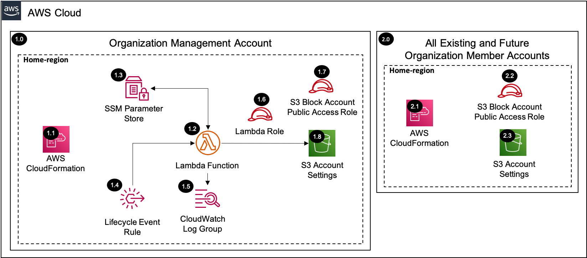

# S3 Block Account Public Access <!-- omit in toc -->

Copyright Amazon.com, Inc. or its affiliates. All Rights Reserved. SPDX-License-Identifier: CC-BY-SA-4.0

## Table of Contents <!-- omit in toc -->

- [Introduction](#introduction)
- [Deployed Resource Details](#deployed-resource-details)
- [Implementation Instructions](#implementation-instructions)
- [References](#references)

## Introduction

The S3 block account public access solution enables the S3 account level settings within each `AWS account` in the AWS Organization.

The Amazon S3 Block Public Access feature provides settings for access points, buckets, and accounts to help you manage public access to Amazon S3 resources. By default, new buckets, access points, and objects don't allow public access. However,
users can modify bucket policies, access point policies, or object permissions to allow public access. S3 Block Public Access settings override these policies and permissions so that you can limit public access to these resources.

With S3 Block Public Access, account administrators and bucket owners can easily set up centralized controls to limit public access to their Amazon S3 resources that are enforced regardless of how the resources are created.

### Block public access settings <!-- omit in toc -->

> **S3 Block Public Access provides four settings. This solution applies the settings to the account, which applies to all buckets and access points that are owned by that account.**

- **BlockPublicAcls**
  - Setting this option to TRUE causes the following behavior:
    - PUT Bucket acl and PUT Object acl calls fail if the specified access control list (ACL) is public.
    - PUT Object calls fail if the request includes a public ACL.
    - If this setting is applied to an account, then PUT Bucket calls fail if the request includes a public ACL.
- **IgnorePublicAcls**
  - Setting this option to TRUE causes Amazon S3 to ignore all public ACLs on a bucket and any objects that it contains.
- **BlockPublicPolicy**
  - Setting this option to TRUE for a bucket causes Amazon S3 to reject calls to PUT Bucket policy if the specified bucket policy allows public access, and to reject calls to PUT access point policy for all of the bucket's access points if the
    specified policy allows public access.
- **RestrictPublicBuckets**
  - Setting this option to TRUE restricts access to an access point or bucket with a public policy to only AWS service principals and authorized users within the bucket owner's account. This setting blocks all cross-account access to the access point
    or bucket (except by AWS service principals), while still allowing users within the account to manage the access point or bucket.

---

## Deployed Resource Details



### 1.0 Control Tower Management Account <!-- omit in toc -->

#### 1.1 AWS CloudFormation <!-- omit in toc -->

- All resources are deployed via AWS CloudFormation as a `StackSet` and `Stack Instance` within the management account or a CloudFormation `Stack` within a specific account.
- The [Customizations for AWS Control Tower](https://aws.amazon.com/solutions/implementations/customizations-for-aws-control-tower/) solution deploys all templates as a CloudFormation `StackSet`.
- For parameter details, review the [AWS CloudFormation templates](templates/).

#### 1.2 AWS Lambda Function <!-- omit in toc -->

- The AWS Lambda Function contains the logic for configuring the S3 block public access settings within each account.
- The function is triggered by CloudFormation Create, Update, and Delete events and also by the `Control Tower Lifecycle Event Rule` when new accounts are provisioned.

#### 1.3 AWS SSM Parameter Store <!-- omit in toc -->

- The Lambda Function creates/updates configuration parameters within the `SSM Parameter Store` on CloudFormation events and the parameters are used when triggered by the `Control Tower Lifecycle Event Rule`, which does not send the properties on the
  event like CloudFormation does.

#### 1.4 AWS Control Tower Lifecycle Event Rule <!-- omit in toc -->

- The AWS Control Tower Lifecycle Event Rule triggers the `AWS Lambda Function` when a new AWS Account is provisioned through AWS Control Tower.

#### 1.5 AWS Lambda CloudWatch Log Group <!-- omit in toc -->

- All the `AWS Lambda Function` logs are sent to a CloudWatch Log Group `</aws/lambda/<LambdaFunctionName>` to help with debugging and traceability of the actions performed.
- By default the `AWS Lambda Function` will create the CloudWatch Log Group with a `Retention` (Never expire) and are encrypted with a CloudWatch Logs service managed encryption key.
- Optional parameters are included to allow creating the CloudWatch Log Group, which allows setting `KMS Encryption` using a customer managed KMS key and setting the `Retention` to a specific value (e.g. 14 days).

#### 1.6 AWS Lambda Function Role <!-- omit in toc -->

- The AWS Lambda Function Role allows the AWS Lambda service to assume the role and perform actions defined in the attached IAM policies.
- The role is also trusted by the S3 Block Account Public Access IAM Role within each account so that it can configure the S3 account settings.

#### 1.7 S3 Block Account Public Access IAM Role <!-- omit in toc -->

- The S3 block account public access IAM role is deployed into each account within the AWS Organization and it is assumed by the central `AWS Lambda Function` to configure the block public access settings for the account.

#### 1.8 S3 Account Settings <!-- omit in toc -->

- The `AWS Lambda Function` configures the block public access settings for the account.

---

### 2.0 All Existing and Future Organization Member Accounts <!-- omit in toc -->

#### 2.1 AWS CloudFormation <!-- omit in toc -->

- See [1.1 AWS CloudFormation](#11-aws-cloudformation)

#### 2.2 S3 Block Account Public Access IAM Role <!-- omit in toc -->

- See [1.7 S3 Block Account Public Access IAM Role](#17-s3-block-account-public-access-iam-role)

#### 2.3 S3 Account Settings <!-- omit in toc -->

- See [1.8 S3 Account Settings](#18-s3-account-settings)

---

## Implementation Instructions

### Prerequisites <!-- omit in toc -->

- AWS Control Tower is deployed.
- No AWS Organizations Service Control Policies (SCPs) are blocking the `s3:GetAccountPublicAccessBlock` and `s3:PutAccountPublicAccessBlock` API actions
- `aws-security-reference-architecture-examples` repository is stored on your local machine or location where you will be deploying from.

### Staging <!-- omit in toc -->

1. In the `management account (home region)`, launch the AWS CloudFormation **Stack** using the [prereq-controltower-execution-role.yaml](../../../utils/aws_control_tower/prerequisites/prereq-controltower-execution-role.yaml) template file as the
   source, to implement the `AWSControlTowerExecution` role pre-requisite.
   - **Note:** Only do this step, if the `AWSControlTowerExecution` IAM role doesn't already exist in the Control Tower `management account`.
2. In the `management account (home region)`, launch the AWS CloudFormation **StackSet** targeting only the `management account` in all of the enabled regions (include home region)
   [prereq-lambda-s3-bucket.yaml](../../../utils/aws_control_tower/prerequisites/prereq-lambda-s3-bucket.yaml) template file as the source, to implement an S3 bucket that will store the Lambda Zip files. (Example Bucket Name:
   `lambda-zips-<Management Account ID>-<AWS Region>`)
   - For additional guidance see [CloudFormation StackSet Instructions](#cloudformation-stackset-instructions)
   - Take note of the S3 Bucket Name from the CloudFormation Outputs, as you will need it for both the packaging step, and the **Solution Deployment Order** section.
   - **Note:** Only do this step if you don't already have an S3 bucket to store the Lambda zip files for CloudFormation custom resources in the Control Tower `management account`.
     - Lambda functions can only access Zip files from an S3 bucket in the same AWS region as the where Lambda function resides.
     - Although for this solution, S3 bucket is only needed in the `home region`, it is recommended to deploy the S3 bucket as a **stackset**, so that you can support future Lambda functions in other regions.
3. Package the Lambda code into a zip file and upload it to the S3 bucket (from above step), using the [Packaging script](../../../utils/packaging_scripts/package-lambda.sh).
   - `SRA_REPO` environment variable should point to the folder where `aws-security-reference-architecture-examples` repository is stored.
   - `BUCKET` environment variable should point to the S3 Bucket where the Lambda zip files are stored.
   - See CloudFormation Output from Step 2
     - Or follow this syntax: `lambda-zips-<CONTROL-TOWER-MANAGEMENT-ACCOUNT>-<CONTROL-TOWER-HOME-REGION>`

```bash
# Example (assumes repository was downloaded to your home directory)
export SRA_REPO="$HOME"/aws-security-reference-architecture-examples
export BUCKET=sra-staging-123456789012-us-east-1
sh "$SRA_REPO"/aws_sra_examples/utils/packaging_scripts/package-lambda.sh \
--file_name s3-block-account-public-access.zip \
--bucket $BUCKET \
--src_dir "$SRA_REPO"/aws_sra_examples/solutions/s3/s3_block_account_public_access/lambda/src
```

```bash
# Export AWS CLI profile for the 'management account'
export AWS_ACCESS_KEY_ID=
export AWS_SECRET_ACCESS_KEY=
export AWS_SESSION_TOKEN=

# Use template below and set the 'SRA_REPO' and 'BUCKET' with your values.
export SRA_REPO=
export BUCKET=
sh "$SRA_REPO"/aws_sra_examples/utils/packaging_scripts/package-lambda.sh \
--file_name s3-block-account-public-access.zip \
--bucket $BUCKET \
--src_dir "$SRA_REPO"/aws_sra_examples/solutions/s3/s3_block_account_public_access/lambda/src
```

### Solution Deployment <!-- omit in toc -->

#### Customizations for AWS Control Tower <!-- omit in toc -->

- [Customizations for AWS Control Tower](./customizations_for_aws_control_tower)

#### AWS CloudFormation <!-- omit in toc -->

1. In the `management account (home region)`, launch an AWS CloudFormation **Stack Set** and deploy to `All active accounts (home region)` using the
   [sra-s3-block-account-public-access-role.yaml](templates/sra-s3-block-account-public-access-role.yaml) template file as the source.
2. In the `management account (home region)`, launch an AWS CloudFormation **Stack** using the [sra-s3-block-account-public-access-role.yaml](templates/sra-s3-block-account-public-access-role.yaml) template file as the source.
3. In the `management account (home region)`, launch the AWS CloudFormation **Stack** using the [sra-s3-block-account-public-access.yaml](templates/sra-s3-block-account-public-access.yaml) template file as the source.

#### Verify Solution Deployment <!-- omit in toc -->

1. How to verify after the pipeline completes?
   1. Log into an account and navigate to the S3 console page
   2. Select the `Block Public Access settings for this account` in the side menu and verify the settings match the parameters provided in the configuration

#### Solution Delete Instructions <!-- omit in toc -->

1. In the `management account (home region)`, delete the AWS CloudFormation **Stack** created in step 3 of the solution deployment. **Note:** The solution will not modify the S3 block account public access settings on a `Delete` event. Only the SSM
   configuration parameter is deleted in this step.
2. In the `management account (home region)`, delete the AWS CloudFormation **Stack** created in step 2 of the solution deployment.
3. In the `management account (home region)`, delete the AWS CloudFormation **StackSet** created in step 1 of the solution deployment. **Note:** there should not be any `stack instances` associated with this StackSet.
4. In the `management account (home region)`, delete the AWS CloudWatch **Log Group** (e.g. /aws/lambda/sra-s3-block-account-public-access) for the Lambda function deployed in step 3 of the solution deployment.

---

## References

- [Blocking public access to your Amazon S3 storage](https://docs.aws.amazon.com/AmazonS3/latest/userguide/access-control-block-public-access.html)
