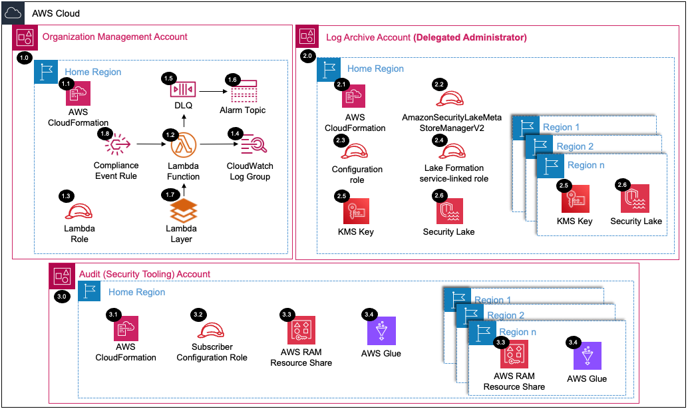

# Security Lake Organization<!-- omit in toc -->

Copyright Amazon.com, Inc. or its affiliates. All Rights Reserved. SPDX-License-Identifier: CC-BY-SA-4.0

## Table of Contents

- [Table of Contents](#table-of-contents)
- [Introduction](#introduction)
- [Deployed Resource Details](#deployed-resource-details)
- [Implementation Instructions](#implementation-instructions)
- [References](#references)

---

## Introduction

AWS SRA Security Lake solution will automate enabling Amazon Security Lake by delegating administration to a Log Archive account and configuring Amazon Security Lake for all existing and future AWS Organization accounts.

**Key solution features:**

- Delegates the administration of Amazon Security Lake to a Log Archive account in the Security OU (Organizational Unit).
- Creates the required IAM roles for Amazon Security Lake.
- Configures the ingestion of AWS logs and event sources in all existing or specified accounts.
- Creates an organization configuration to automatically enable Amazon Security Lake for new member accounts in your organization.
- (Optional) Creates an Audit account (Security Tooling) subscriber with data access.
- (Optional) Creates an Audit account (Security Tooling) subscriber with query access.
- (Optional) Creates a resource link to shared tables in an Audit account (Security Tooling).


---

## Deployed Resource Details



### 1.0 Organization Management Account<!-- omit in toc -->

#### 1.1 AWS CloudFormation<!-- omit in toc -->

- All resources are deployed via AWS CloudFormation as a `StackSet` and `Stack Instance` within the management account or a CloudFormation `Stack` within a specific account.
- The [Customizations for AWS Control Tower](https://aws.amazon.com/solutions/implementations/customizations-for-aws-control-tower/) solution deploys all templates as a CloudFormation `StackSet`.
- For parameter details, review the [AWS CloudFormation templates](templates/).

#### 1.2 AWS Lambda Function<!-- omit in toc -->

- The Lambda function includes logic to enable and configure Security Lake

#### 1.3 Lambda Execution IAM Role<!-- omit in toc -->

- IAM role used by the Lambda function to enable the Security Lake Delegated Administrator Account within each region provided

#### 1.4 Lambda CloudWatch Log Group<!-- omit in toc -->

- All the `AWS Lambda Function` logs are sent to a CloudWatch Log Group `</aws/lambda/<LambdaFunctionName>` to help with debugging and traceability of the actions performed.
- By default the `AWS Lambda Function` will create the CloudWatch Log Group and logs are encrypted with a CloudWatch Logs service managed encryption key.

#### 1.5 Dead Letter Queue (DLQ)<!-- omit in toc -->

- SQS dead letter queue used for retaining any failed Lambda events.

#### 1.6 Alarm SNS Topic<!-- omit in toc -->

- SNS Topic used to notify subscribers when messages hit the DLQ.

#### 1.7 Lambda Layer<!-- omit in toc -->

- The python boto3 SDK lambda layer to enable capability for Lambda to enable features of the Security Lake service.
- This is downloaded during the deployment process and packaged into a layer that is used by the Lambda function in this solution.
- The Security Lake API available in the current Lambda environment (as of 09/03/2024) is 1.20.32, however, enhanced functionality of the Security Lake API used in this solution requires at least 1.35.10 (see references below).
- Note: Future revisions to this solution will remove this layer when boto3 is updated within the Lambda environment.

#### 1.8 Compliance Event Rule<!-- omit in toc -->

- The `Organization Compliance Scheduled Event Rule` triggers the `AWS Lambda Function` to capture AWS Account status updates (e.g. suspended to active).
  - A parameter is provided to set the schedule frequency.


---

### 2.0 Log Archive Account(Delegated Administrator)<!-- omit in toc -->

#### 2.1 AWS CloudFormation<!-- omit in toc -->

- See [1.1 AWS CloudFormation](#11-aws-cloudformation)

#### 2.2 AmazonSecurityLakeMetaStoreManagerV2 IAM role<!-- omit in toc -->

-  IAM role used by Security Lake to create data lake or query data from Security Lake.

#### 2.3 Configuration IAM role<!-- omit in toc -->

-  The Configuration IAM Role is assumed by the Lambda function to configure Security Lake within the delegated administrator account.

#### 2.4 Lake Formation service-linked IAM role<!-- omit in toc -->

- AWSServiceRoleForLakeFormationDataAccess role provides a set of Amazon Simple Storage Service (Amazon S3) permissions that enable the Lake Formation integrated service (such as Amazon Athena) to access registered locations.

#### 2.5 KMS key<!-- omit in toc -->

- AWS KMS key  to encrypt Security Lake data and Security Lake Amazon Simple Queue Service (Amazon SQS) queues.

#### 2.6 Security Lake<!-- omit in toc -->

- Security Lake is enabled in the delegated admin account within each provided region.
- Based on the specified parameters:
  - Natively supported AWS log and event sources added in required Regions.
  - Organization configuration created to automatically enable Amazon Security Lake for new member accounts in your organization.
  - Audit account (Security Tooling) subscriber with data access created.
  - Audit account (Security Tooling) subscriber with query access created.
  - Resource link to shared tables created in the Audit account (Security Tooling).

---

### 3.0 Audit Account<!-- omit in toc -->

The example solutions use `Audit Account` instead of `Security Tooling Account` to align with the default account name used within the AWS Control Tower 
setup process for the Security Account. The Account ID for the `Audit Account` SSM parameter is 
populated from the `SecurityAccountId` parameter within the `AWSControlTowerBP-BASELINE-CONFIG` StackSet, but is specified manually in other environments, and then stored in an SSM parameter (this is all done in the common prerequisites solution).

#### 3.1 AWS CloudFormation<!-- omit in toc -->

- See [1.1 AWS CloudFormation](#11-aws-cloudformation)

#### 3.2 Subscriber Configuration IAM role<!-- omit in toc -->

- The Subscriber Configuration IAM Role is assumed by the Lambda function to configure resource link to shared tables within the Audit account.

#### 3.3 AWS RAM resource share<!-- omit in toc -->

- The resource share invitation is accepted within the Audit account.

#### 3.4 AWS Glue resource link<!-- omit in toc -->

-  A resource link to the shared Lake Formation tables is created in AWS Glue to point the subscriber's account to the shared tables. 

---

## Implementation Instructions

### Prerequisites<!-- omit in toc -->

1. [Download and Stage the SRA Solutions](../../../docs/DOWNLOAD-AND-STAGE-SOLUTIONS.md). **Note:** This only needs to be done once for all the solutions.
2. Verify that the [SRA Prerequisites Solution](../../common/common_prerequisites/) has been deployed.
3. Verify that the AmazonSecurityLakeMetaStoreManagerV2 IAM role does not exist in the Log Archive account. If the role exists, either modify the sra-security-lake-org-main-ssm.yaml template or delete the role.
4. Verify that the AWSServiceRoleForLakeFormationDataAccess IAM role does not exist in the Log Archive account. If the role exists, either modify the sra-security-lake-org-main-ssm.yaml template or delete the role.

### Solution Deployment<!-- omit in toc -->

Choose a Deployment Method:

- [AWS CloudFormation](#aws-cloudformation)
- [Customizations for AWS Control Tower](../../../docs/CFCT-DEPLOYMENT-INSTRUCTIONS.md)

#### AWS CloudFormation<!-- omit in toc -->

In the `management account (home region)`, launch the [sra-security-lake-org-main-ssm.yaml](templates/sra-security-lake-org-main-ssm.yaml) template. This uses an approach where some of the CloudFormation parameters are populated from SSM parameters created by the [SRA Prerequisites Solution](../../common/common_prerequisites/).

  ```bash
  aws cloudformation deploy --template-file $PWD/aws_sra_examples/solutions/security-lake/security-lake-org/templates/sra-security-lake-org-main-ssm.yaml --stack-name sra-security-lake-org-main-ssm --capabilities CAPABILITY_NAMED_IAM --parameter-overrides pSecurityLakeWarning=<ACCEPT_OR_REJECT>
  ```

##### Important<!-- omit in toc -->

Pay close attention to the `--parameter-overrides` argument.  For launching of the AWS Cloudformation stack using the command above to be successful, the `pSecurityLakeWarning` parameter in the `--parameter-overrides` argument must be set to `Accept`.  If it is set to `Reject` the stack launch will fail and provide an error.
- To create an Audit account subscriber with data access, add `pRegisterAuditAccountDataSubscriber` parameter in the `--parameter-overrides` with argument set to `true`. Provide value for `pAuditAccountDataSubscriberExternalId` parameter.
- To create an Audit account subscriber with query access, add `pRegisterAuditAccountQuerySubscriber` parameter in the `--parameter-overrides` with argument set to `true`. Provide value for `pAuditAccountQuerySubscriberExternalId` parameter.
- To creates a resource link to shared tables in an Audit account, , add `pCreateResourceLink` parameter in the `--parameter-overrides` with argument set to `true`

#### Verify Solution Deployment<!-- omit in toc -->

1. Log into the `Log Archive account` and navigate to the Security Lake page
   1. Select Summary
   2. Verify that Security Lake is enabled for each region
   3. Select Sources
   4. Verify requested sources are enabled for each region and account
   5. To verify that Organization Configuration is ON in each region, run command `aws securitylake get-data-lake-organization-configuration` in the CLI or CloudShell
   6. Select Subscribers
   7. Verify that the Audit account query and/or data access subscribers are created
2. If an Audit account subscriber with query access was created, Log into the `Audit audit`
    1. Navigate to AWS Glue
    2. Select Databases
    3. Verify `amazon_security_lake_glue_db_<REGION>_subscriber` database is created
    4. Select Tables
    5. Verify that resource links to shared tables were created
    6. Navigate to Athena
    7. Create a new query and verify that the query executes successfully. **Note:** The Lake Formation data lake administrator must grant SELECT permissions on the relevant databases and tables to the IAM identity that queries the data. 


#### Solution Update Instructions<!-- omit in toc -->

1. [Download and Stage the SRA Solutions](../../../docs/DOWNLOAD-AND-STAGE-SOLUTIONS.md). **Note:** Get the latest code and run the staging script.
2. Update the existing CloudFormation Stack or CFCT configuration. **Note:** Make sure to update the `SRA Solution Version` parameter and any new added parameters.

#### Solution Delete Instructions<!-- omit in toc -->

1. In the `management account (home region)`, change the `Disable Security Lake log sources and organization configuration` parameter to `true` and update the AWS CloudFormation **Stack** (`sra-security-lake-org-main-ssm`). This will disable the AWS log and event source collection and delete organization configuration in all regions. **Note:** Security Lake will stop collecting logs and events from your AWS sources, but the existing Security Lake settings and the resources that were created in your AWS account, including AmazonSecurityLakeMetaStoreManagerV2, AWSServiceRoleForLakeFormationDataAccess IAM roles and KMS keys, will be retained. Refer to the Amazon Security Lake documentation for the recommended steps to address the service and resources.
2. In the `management account (home region)`, delete the AWS CloudFormation **Stack** (`sra-security-lake-org-main-ssm`).
3. In the `management account (home region)`, delete the AWS CloudWatch **Log Group** (e.g. /aws/lambda/<solution_name>) for the Lambda function deployed.


---

## References

- [Amazon Security Lake User Guide](https://docs.aws.amazon.com/security-lake/latest/userguide/what-is-security-lake.html)
- [Managing AWS SDKs in Lambda Functions](https://docs.aws.amazon.com/lambda/latest/operatorguide/sdks-functions.html)
- [Lambda runtimes](https://docs.aws.amazon.com/lambda/latest/dg/lambda-runtimes.html)
- [Python Boto3 SDK changelog](https://github.com/boto/boto3/blob/develop/CHANGELOG.rst)
