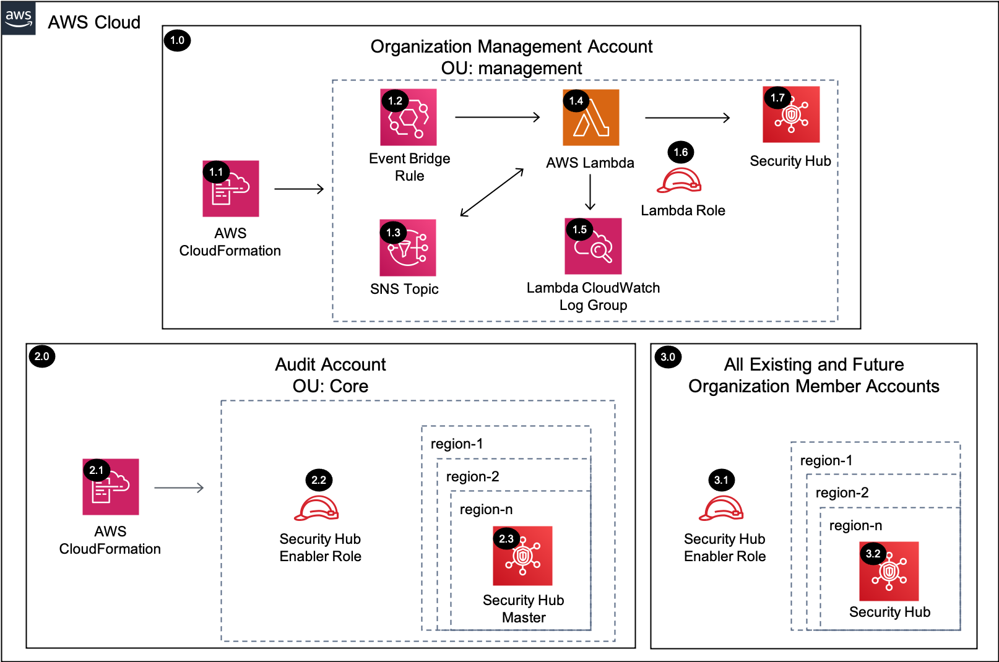

# SecurityHub Enabler Account <!-- omit in toc -->

Copyright Amazon.com, Inc. or its affiliates. All Rights Reserved. SPDX-License-Identifier: CC-BY-SA-4.0

## Table of Contents <!-- omit in toc -->

- [Introduction](#introduction)
- [Deployed Resource Details](#deployed-resource-details)
- [Implementation Instructions](#implementation-instructions)
- [Appendix](#appendix)
- [References](#references)

---

## Introduction

The SecurityHub Enabler solution will enable SecurityHub within each AWS Organizations account configured with an admin account (e.g. Audit) and security standards enabled. Centralizing SecurityHub within the Security Tooling account provides a
cross-account view of security standards compliance and findings from AWS service integrations.

The solution implements a SecurityHub Enabler Lambda function in the Organization Management account, which runs periodically to verify each account/region has been invited into the central SecurityHub account and that SecurityHub is enabled.
Optionally, security standards and integrations can be enabled as part of the solution deployment.

This solution differs from that presented [here](https://github.com/awslabs/aws-securityhub-multiaccount-scripts) as it takes a serverless approach (vs. launching an EC2 instance) and auto enables new accounts added to the AWS Organization.

---

## Deployed Resource Details



### 1.0 Organization Management Account <!-- omit in toc -->

#### 1.1 AWS CloudFormation <!-- omit in toc -->

- All resources are deployed via AWS CloudFormation as a `StackSet` and `Stack Instance` within the management account or a CloudFormation `Stack` within a specific account.
- The [Customizations for AWS Control Tower](https://aws.amazon.com/solutions/implementations/customizations-for-aws-control-tower/) solution deploys all templates as a CloudFormation `StackSet`.
- For parameter details, review the [AWS CloudFormation templates](templates/).

#### 1.2 EventBridge Scheduled Rule <!-- omit in toc -->

- The scheduled rule triggers the Lambda Function between 1 and 3600 minutes to check organization compliance

#### 1.3 SNS Topic <!-- omit in toc -->

- SNS Topic triggers the Lambda Function during initial setup to handle multiple accounts.
- The Lambda Function will publish all the AWS Organization accounts to the SNS Topic if it isn't triggered by SNS.

#### 1.4 AWS Lambda Function <!-- omit in toc -->

- The Lambda Function enables Security Hub within all the active AWS Organizations accounts

#### 1.5 Lambda CloudWatch Log Group <!-- omit in toc -->

- Contains the Lambda function execution logs

#### 1.6 Lambda Execution IAM Role <!-- omit in toc -->

- Used by the custom CloudFormation Lambda function to enable Security Hub in all accounts and regions

#### 1.7 Security Hub <!-- omit in toc -->

- Security Hub is enabled in all the active Organization accounts and regions via the Lambda Function.
- Each member account Security Hub is configured with the provided Security Hub master account.

---

### 2.0 Audit Account <!-- omit in toc -->

#### 2.1 AWS CloudFormation <!-- omit in toc -->

- See [1.1 AWS CloudFormation](#11-aws-cloudformation)

#### 2.2 Security Hub Enabler Role <!-- omit in toc -->

- IAM role assumed by the Management account Lambda function to enable Security Hub within each account and all the active regions

#### 2.3 Security Hub <!-- omit in toc -->

- Security Hub provides visibility of all Security Hub member results

---

### 3.0 All Existing and Future Organization Member Accounts <!-- omit in toc -->

#### 3.1 Security Hub Enabler Role <!-- omit in toc -->

- IAM role assumed by the Management account Lambda function to enable Security Hub within each account and all the active regions

#### 3.2 Security Hub <!-- omit in toc -->

- Security Hub enabled within each account and all active regions

---

## Implementation Instructions

### Prerequisites <!-- omit in toc -->

- AWS Control Tower is deployed.
- `aws-security-reference-architecture-examples` repository is stored on your local machine or location where you will be deploying from.
- Security Hub is not enabled in any of the accounts within the AWS Organization

### Staging <!-- omit in toc -->

1. In the `management account (home region)`, launch the AWS CloudFormation **Stack** using the [prereq-controltower-execution-role.yaml](../../../utils/aws_control_tower/prerequisites/prereq-controltower-execution-role.yaml) template file as the
   source, to implement the `AWSControlTowerExecution` role pre-requisite.
   - **Note:** Only do this step, if the `AWSControlTowerExecution` IAM role doesn't already exist in the Control Tower `management account`.
2. In the `management account (home region)`, launch the AWS CloudFormation **StackSet** targeting only the `management account` in all of the enabled regions (include home region)
   [prereq-lambda-s3-bucket.yaml](../../../utils/aws_control_tower/prerequisites/prereq-lambda-s3-bucket.yaml) template file as the source, to implement an S3 bucket that will store the Lambda Zip files. (Example Bucket Name:
   `lambda-zips-<Management Account ID>-<AWS Region>`)
   - For additional guidance see [CloudFormation StackSet Instructions](#cloudformation-stackset-instructions)
   - Take note of the S3 Bucket Name from the CloudFormation Outputs, as you will need it for both the packaging step, and the **Solution Deployment Order** section.
   - **Note:** Only do this step if you don't already have an S3 bucket to store the Lambda zip files for CloudFormation custom resources in the Control Tower `management account`.
     - Lambda functions can only access Zip files from an S3 bucket in the same AWS region as the where Lambda function resides.
     - Although for this solution, S3 bucket is only needed in the `home region`, it is recommended to deploy the S3 bucket as a **stackset**, so that you can support future Lambda functions in other regions.
3. Package the Lambda code into a zip file and upload it to the S3 bucket (from above step), using the [Packaging script](../../../utils/packaging_scripts/package-lambda.sh).
   - `SRA_REPO` environment variable should point to the folder where `aws-security-reference-architecture-examples` repository is stored.
   - `BUCKET` environment variable should point to the S3 Bucket where the Lambda zip files are stored.
   - See CloudFormation Output from Step 2
     - Or follow this syntax: `lambda-zips-<CONTROL-TOWER-MANAGEMENT-ACCOUNT>-<CONTROL-TOWER-HOME-REGION>`

```bash
# Example (assumes repository was downloaded to your home directory)
export SRA_REPO="$HOME"/aws-security-reference-architecture-examples
export BUCKET=sra-staging-123456789012-us-east-1
sh "$SRA_REPO"/aws_sra_examples/utils/packaging_scripts/package-lambda.sh \
--file_name securityhub-enabler-acct.zip \
--bucket $BUCKET \
--src_dir "$SRA_REPO"/aws_sra_examples/solutions/securityhub/securityhub_enabler_acct/lambda/src
```

```bash
# Export AWS CLI profile for the 'management account'
export AWS_ACCESS_KEY_ID=
export AWS_SECRET_ACCESS_KEY=
export AWS_SESSION_TOKEN=

# Use template below and set the 'SRA_REPO' and 'BUCKET' with your values.
export SRA_REPO=
export BUCKET=
sh "$SRA_REPO"/aws_sra_examples/utils/packaging_scripts/package-lambda.sh \
--file_name securityhub-enabler-acct.zip \
--bucket $BUCKET \
--src_dir "$SRA_REPO"/aws_sra_examples/solutions/securityhub/securityhub_enabler_acct/lambda/src
```

### Solution Deployment <!-- omit in toc -->

#### Customizations for AWS Control Tower <!-- omit in toc -->

- [Customizations for AWS Control Tower](./customizations_for_aws_control_tower)

#### AWS CloudFormation <!-- omit in toc -->

1. In the `management account (home region)`, launch an AWS CloudFormation **Stack Set** and deploy to `All active accounts (home region)` using the [sra-securityhub-enabler-acct-role.yaml](templates/sra-securityhub-enabler-acct-role.yaml) template
   file as the source.
2. In the `management account (home region)`, launch an AWS CloudFormation **Stack** using the [sra-securityhub-enabler-acct.yaml](templates/sra-securityhub-enabler-acct.yaml) template file as the source.

#### Verify Solution Deployment <!-- omit in toc -->

1. Log into the Audit account and navigate to the Security Hub page
2. Verify the correct configurations have been applied to each region
   1. Security standards enabled
   2. Settings -> Accounts enabled
   3. Integrations enabled

#### Solution Delete Instructions <!-- omit in toc -->

1. In the `management account (home region)`, delete the AWS CloudFormation **Stack** created in step 2 of the solution deployment.
2. In the `management account (home region)`, delete the AWS CloudWatch **Log Group** (e.g. /aws/lambda/<solution_name>) for the Lambda function deployed in step 2 of the solution deployment.
3. In the `management account (home region)`, delete the AWS CloudFormation **StackSet** created in step 1 of the solution deployment. **Note:** there should not be any `stack instances` associated with this StackSet.

---

## Appendix

### CloudFormation StackSet Instructions <!-- omit in toc -->

If you need to launch an AWS CloudFormation **StackSet** in the `management account`, see below steps (for additional details, see
[Create a stack set with self-managed permissions](https://docs.aws.amazon.com/AWSCloudFormation/latest/UserGuide/stacksets-getting-started-create.html#stacksets-getting-started-create-self-managed))

1. AWS CloudFormation -> StackSets -> Create StackSet
2. Choose a Template (upload template)
3. Specify StackSet Details (enter parameter values)
4. Configure StackSet Options -> Self-service permissions
   - IAM Admin Role Name: `AWSControlTowerStackSetRole`
   - IAM Execution Role Name: `AWSControlTowerExecution`
5. Set Deployment Options -> Deploy New Stacks
   - Deploy Stacks in Accounts -> enter the AWS Control Tower Management Account ID
   - Specify Regions: choose regions you want to deploy stacks too (include home region)
6. If in future, you need to update the Stack Set (e.g., add/remove a region), see [Getting Started with AWS CloudFormation StackSets](https://docs.aws.amazon.com/AWSCloudFormation/latest/UserGuide/stacksets-getting-started.html)

---

## References

- [Setting up AWS Security Hub](https://docs.aws.amazon.com/securityhub/latest/userguide/securityhub-settingup.html)
