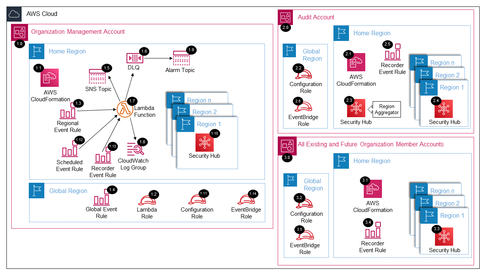

# Security Hub Organization<!-- omit in toc -->

Copyright Amazon.com, Inc. or its affiliates. All Rights Reserved. SPDX-License-Identifier: CC-BY-SA-4.0

## Table of Contents

- [Table of Contents](#table-of-contents)
- [Introduction](#introduction)
- [Deployed Resource Details](#deployed-resource-details)
- [Implementation Instructions](#implementation-instructions)
- [References](#references)

---

## Introduction

The Security Hub Organization solution will enable AWS Security Hub by delegating administration to the `Audit account` within the `management account` and assuming an IAM role within the `Audit account` to configure Security Hub for all the existing
and future AWS Organization accounts.

**Key solution features:**

- Delegates Security Hub administration to another account (i.e Audit account).
- Assumes a role in the delegated administrator account to configure organizations management.
- Adds all existing accounts including the `management account` as members.
- Configures a region aggregator within the `Home region`.
- Assumes a role in each member account to enable/disable standards aligning with the delegated administrator account.
- Ability to disable Security Hub within all accounts and regions via a parameter and CloudFormation update event.

---

## Deployed Resource Details

### 1.0 Organization Management Account<!-- omit in toc -->

#### 1.1 AWS CloudFormation<!-- omit in toc -->

- All resources are deployed via AWS CloudFormation as a `StackSet` and `Stack Instance` within the `management account` or a CloudFormation `Stack` within a specific account.
- The [Customizations for AWS Control Tower](https://aws.amazon.com/solutions/implementations/customizations-for-aws-control-tower/) solution deploys all templates as a CloudFormation `StackSet`.
- For parameter details, review the [AWS CloudFormation templates](templates/).

#### 1.2 Lambda IAM Role<!-- omit in toc -->

- IAM role used by the Lambda function to enable the Security Hub Delegated Administrator Account within each region provided.

#### 1.3 Configuration IAM Role<!-- omit in toc -->

- IAM role is assumed by the Lambda function to configure Security Hub within the delegated administrator account and all member accounts.

#### 1.4 AWS Lambda Function<!-- omit in toc -->

- The Lambda function includes logic to enable and configure Security Hub.

#### 1.5 Lambda CloudWatch Log Group<!-- omit in toc -->

- All the `AWS Lambda Function` logs are sent to a CloudWatch Log Group `</aws/lambda/<LambdaFunctionName>` to help with debugging and traceability of the actions performed.
- By default the `AWS Lambda Function` will create the CloudWatch Log Group and logs are encrypted with a CloudWatch Logs service managed encryption key.
- Parameters are provided for changing the default log group retention and encryption KMS key.

#### 1.6 AWS SSM Parameter Store<!-- omit in toc -->

- The Lambda Function creates/updates configuration parameters within the `SSM Parameter Store` on CloudFormation events and the parameters are used when triggered by the `Control Tower Lifecycle Event Rule` or `SNS Topic`.

#### 1.7 Dead Letter Queue (DLQ)<!-- omit in toc -->

- SQS dead letter queue used for retaining any failed Lambda events.

#### 1.8 Alarm SNS Topic<!-- omit in toc -->

- SNS Topic used to notify subscribers when messages hit the DLQ.

#### 1.9 SNS Topic<!-- omit in toc -->

- SNS Topic used to fanout the Lambda function for deleting GuardDuty within each account and region.

#### 1.10 AWS Control Tower Lifecycle Event Rule<!-- omit in toc -->

- The AWS Control Tower Lifecycle Event Rule triggers the `AWS Lambda Function` when a new AWS Account is provisioned through AWS Control Tower.

#### 1.11 Security Hub<!-- omit in toc -->

- The Security Hub delegated administrator is registered within the `management account` using the Security Hub APIs within each provided region.

---

### 2.0 Audit Account<!-- omit in toc -->

The example solutions use `Audit Account` instead of `Security Tooling Account` to align with the default account name used within the AWS Control Tower setup process for the Security Account. The Account ID for the `Audit Account` SSM parameter is
populated from the `SecurityAccountId` parameter within the `AWSControlTowerBP-BASELINE-CONFIG` StackSet.

#### 2.1 AWS CloudFormation<!-- omit in toc -->

- See [1.1 AWS CloudFormation](#11-aws-cloudformation)

#### 2.2 Configuration IAM Role<!-- omit in toc -->

- IAM role assumed by the Lambda function within the `management account` to configure Security Hub within each region provided.

#### 2.3 Security Hub (Home Region)<!-- omit in toc -->

- A region aggregator is configured within the `Home region` to aggregate findings from the configured regions.
- A parameter is provided to aggregate all configured Security Hub regions including any future regions.

#### 2.4 Security Hub (Regions)<!-- omit in toc -->

- Security Hub is enabled within each provided region.
- Standards are enabled/disabled based on the provided parameter values.

---

### 3.0 All Existing and Future Organization Member Accounts<!-- omit in toc -->

#### 3.1 AWS CloudFormation<!-- omit in toc -->

- See [1.1 AWS CloudFormation](#11-aws-cloudformation)

#### 3.2 Configuration IAM Role<!-- omit in toc -->

- See [2.2 AWS CloudFormation](#22-configuration-iam-role)

#### 3.3 Security Hub<!-- omit in toc -->

- Security Hub is enabled from the delegated administrator account.
- Standards are configured by the solution to align with the delegated administrator account.
- Security Hub can be disabled by the solution via a provided parameter and CloudFormation update event.

---

## Implementation Instructions

### Prerequisites<!-- omit in toc -->

1. [Download and Stage the SRA Solutions](../../../docs/DOWNLOAD-AND-STAGE-SOLUTIONS.md). **Note:** This only needs to be done once for all the solutions.
2. Verify that the [SRA Prerequisites Solution](../../common/common_prerequisites/) has been deployed.
3. Deploy the [Config Management Account](../../config/config_management_account) solution to enable AWS Config within the `management account`.

### Solution Deployment<!-- omit in toc -->

Choose a Deployment Method:

- [AWS CloudFormation](#aws-cloudformation)
- [Customizations for AWS Control Tower](../../../docs/CFCT-DEPLOYMENT-INSTRUCTIONS.md)

#### AWS CloudFormation<!-- omit in toc -->

In the `management account (home region)`, launch an AWS CloudFormation **Stack** using one of the options below:

- **Option 1:** (Recommended) Use the [sra-securityhub-org-main-ssm.yaml](templates/sra-securityhub-org-main-ssm.yaml) template. This is a more automated approach where some of the CloudFormation parameters are populated from SSM parameters created
  by the [SRA Prerequisites Solution](../../common/common_prerequisites/).
- **Option 2:** Use the [sra-securityhub-org-main.yaml](templates/sra-securityhub-org-main.yaml) template. Input is required for the CloudFormation parameters where the default is not set.

#### Verify Solution Deployment<!-- omit in toc -->

1. Log into the `management account` and navigate to the Security Hub page
   1. Select Settings and then General
   1. Verify that the delegated admin account is set for each region
2. Log into the Audit account and navigate to the Security Hub page
   1. Verify the correct Security Hub configurations have been applied to each region
   2. Verify all existing accounts have been enabled and auto enabled is ON
   3. Verify the region aggregator is configured
   4. Verify the Auto-enable new controls is ON
3. Log into a member account and verify the standards are configured correctly

#### Solution Delete Instructions<!-- omit in toc -->

1. In the `management account (home region)`, change the `Disable Security Hub` parameter to `true` and update the AWS CloudFormation **Stack** (`sra-securityhub-org-main-ssm` or `sra-securityhub-org-main`).
2. In the `management account (home region)`, verify that the Lambda function processing is complete by confirming no more CloudWatch logs are generated.
3. In the `management account (home region)`, delete the AWS CloudFormation **Stack** (`sra-securityhub-org-main-ssm` or `sra-securityhub-org-main`).
4. In the `management account (home region)`, delete the AWS CloudWatch **Log Group** (e.g. /aws/lambda/<solution_name>) for the Lambda function deployed.

---

## References

- [Managing administrator and member accounts](https://docs.aws.amazon.com/securityhub/latest/userguide/securityhub-accounts.html)
