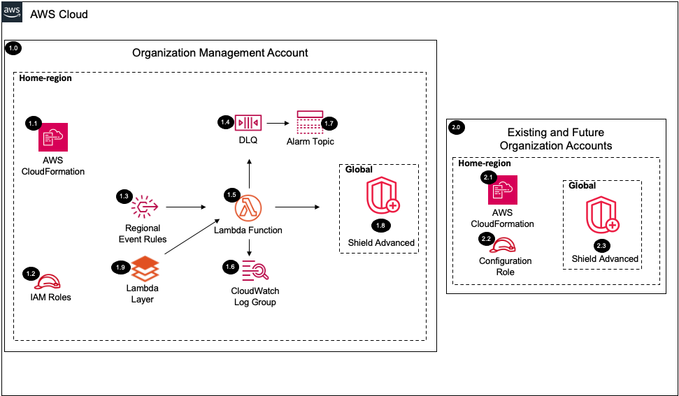

# Shield Advanced<!-- omit in toc -->

Copyright Amazon.com, Inc. or its affiliates. All Rights Reserved. SPDX-License-Identifier: CC-BY-SA-4.0

## Table of Contents

- [Table of Contents](#table-of-contents)
- [Introduction](#introduction)
- [Deployed Resource Details](#deployed-resource-details)
- [Implementation Instructions](#implementation-instructions)
- [References](#references)

---

## Introduction

The Shield Advanced solution will automate enabling AWS Shield Advanced by deploying and configuring for the chosen AWS accounts or all the existing and future AWS Organization accounts.

**Key solution features:**

- Deploys to all specified accounts accounts or within an AWS Organization
- Configures up to 5 Protection Groups.
- Dynamically figures out which S3 buckets are configured to which account.
- Configures DDOS Response Team (DRT) access for accounts and buckets where applicable.
- Configures contacts/emergency contacts
- Enables Proactive Support
- Assumes a role in each account to configure Shield Advanced.
- Ability to disable shield within all accounts and regions via a parameter and CloudFormation update event.

---

## Deployed Resource Details



### 1.0 Organization Management Account<!-- omit in toc -->

#### 1.1 AWS CloudFormation<!-- omit in toc -->

- All resources are deployed via AWS CloudFormation as a `StackSet` and `Stack Instance` within the `management account` or a CloudFormation `Stack` within a specific account.
- The [Customizations for AWS Control Tower](https://aws.amazon.com/solutions/implementations/customizations-for-aws-control-tower/) solution deploys all templates as a CloudFormation `StackSet`.
- For parameter details, review the [AWS CloudFormation templates](templates/).

#### 1.2 IAM Roles<!-- omit in toc -->

- The `Lambda IAM Role` is used by the Lambda function to enable the shield Delegated Administrator Account within each region provided.
- The `Configuration IAM Role` is assumed by the Lambda function to configure Shield Advanced.

#### 1.3 Regional Event Rules<!-- omit in toc -->

- The `Organization Compliance Scheduled Event Rule` triggers the `AWS Lambda Function` to capture AWS Account status updates (e.g. suspended to active).
  - A parameter is provided to set the schedule frequency.
  - See the [Instructions to Manually Run the Lambda Function](#instructions-to-manually-run-the-lambda-function) for triggering the `AWS Lambda Function` before the next scheduled run time.

#### 1.4 Dead Letter Queue (DLQ)<!-- omit in toc -->

- SQS dead letter queue used for retaining any failed Lambda events.

#### 1.5 AWS Lambda Function<!-- omit in toc -->

- The Lambda function includes logic to enable and configure shield.

#### 1.6 Lambda CloudWatch Log Group<!-- omit in toc -->

- All the `AWS Lambda Function` logs are sent to a CloudWatch Log Group `</aws/lambda/<LambdaFunctionName>` to help with debugging and traceability of the actions performed.
- By default the `AWS Lambda Function` will create the CloudWatch Log Group and logs are encrypted with a CloudWatch Logs service managed encryption key.
- Parameters are provided for changing the default log group retention and encryption KMS key.

#### 1.7 Alarm SNS Topic<!-- omit in toc -->

- SNS Topic used to notify subscribers when messages hit the DLQ.

#### 1.8 Shield<!-- omit in toc -->

- The Shield Advanced Solution is configured globally for each account specified in the parameter Accounts to Update.
- Note to configure new accounts update the template parameter Accounts to Update with the account number or ALL and include resources or Protection Groups specific to that account.

#### 1.9 Lambda Layer<!-- omit in toc -->

- The python boto3 SDK lambda layer to enable capability for lambda to enable all elements of the shield service.
- This is downloaded during the deployment process and packaged into a layer that is used by the lambda function in this solution.
- The shield API available in the current lambda environment (as of 01/19/2023) is boto3-1.20.32, however, enhanced functionality of the shield API used in this solution requires at least 1.26.18 (see references below).
- Note: Future revisions to this solution will remove this layer when boto3 is updated within the lambda environment.

---

### 2.0 All Existing and Future Organization Accounts (Per Configuration in pShieldAccountsToProtect)<!-- omit in toc -->

#### 2.1 AWS CloudFormation<!-- omit in toc -->

- See [1.1 AWS CloudFormation](#11-aws-cloudformation)

#### 2.2 Configuration IAM Role<!-- omit in toc -->

- See [2.2 AWS CloudFormation](#22-configuration-iam-role)

#### 2.3 Shield Advanced<!-- omit in toc -->

- Shield Advanced is enabled globally for each account specificied.

---

## Implementation Instructions

### Prerequisites<!-- omit in toc -->

1. [Download and Stage the SRA Solutions](../../../docs/DOWNLOAD-AND-STAGE-SOLUTIONS.md). **Note:** This only needs to be done once for all the solutions.
2. Verify that the [SRA Prerequisites Solution](../../common/common_prerequisites/) has been deployed.

### Solution Deployment<!-- omit in toc -->

Choose a Deployment Method:

- [AWS CloudFormation](#aws-cloudformation)
- [Customizations for AWS Control Tower](../../../docs/CFCT-DEPLOYMENT-INSTRUCTIONS.md)

#### AWS CloudFormation<!-- omit in toc -->

In the `management account (home region)`, launch the [sra-shield-advanced-main-ssm.yaml](templates/sra-shield-advanced-main-ssm.yaml) template. This uses an approach where some of the CloudFormation parameters are populated from SSM parameters created.

Note: open [sra-shield-advanced-main-ssm.yaml](templates/sra-shield-advanced-main-ssm.yaml) template and update the following parameters (pShieldDRTLogBuckets, pResourcesToProtect, pShieldAccountsToProtect) based on your environment by the [SRA Prerequisites Solution](../../common/common_prerequisites/).

  ```bash
  aws cloudformation deploy --template-file $HOME/aws-sra-examples/aws_sra_examples/solutions/shield_advanced/shield_advanced/templates/sra-shield-advanced-main-ssm.yaml --stack-name sra-shield-advanced-main-ssm --capabilities CAPABILITY_NAMED_IAM
  ```

#### Verify Solution Deployment<!-- omit in toc -->

1. Log into the each account where Shield Advanced is Configured and navigate to the WAF service console
   1. Navigate to `Overview` section of `AWS Shield` header
   2. Verify `Subscribe to Shield Advanced` status is `Complete`
   3. If configured verify `Add resources to protect` status is set to `Complete`
   4. If configured verify `Configure AWS SRT support` status is set to `Complete`
   5. If configured verify `IAM Role` for DRT Access is listed and `S3 buckets SRT is authorized to access` are listed
   6. If configured verify `Proactive engagement status` status is `Complete` and the Email, Phone Number, and Notes match the values from the parameters

#### Solution Update Instructions<!-- omit in toc -->

1. [Download and Stage the SRA Solutions](../../../docs/DOWNLOAD-AND-STAGE-SOLUTIONS.md). **Note:** Get the latest code and run the staging script.
2. Update the existing CloudFormation Stack or CFCT configuration. **Note:** Make sure to update the `SRA Solution Version` parameter and any new added parameters.

#### Solution Delete Instructions<!-- omit in toc -->

1. In the `management account (home region)`, delete the AWS CloudFormation **Stack** (`sra-shield-advanced-main-ssm`.
2. In the `management account (home region)`, delete stack instances from the the AWS CloudFormation **StackSet** (`sra-shield-advanced-main-ssm`.
3. In the `management account (home region)`, delete AWS CloudFormation **StackSet** (`sra-shield-advanced-main-ssm` or `sra-shield-advanced-main`).
4. In the `management account (home region)`, verify that the Lambda function processing is complete by confirming no more CloudWatch logs are generated.
5. In the `management account (home region)`, delete the AWS CloudWatch **Log Group** (e.g. /aws/lambda/<solution_name>) for the Lambda function deployed.

#### Instructions to Manually Run the Lambda Function<!-- omit in toc -->

1. In the `management account (home region)`.
2. Navigate to the AWS Lambda Functions page.
3. Select the `checkbox` next to the Lambda Function and select `Test` from the `Actions` menu.
4. Scroll down to view the `Test event`.
5. Click the `Test` button to trigger the Lambda Function with the default values.
6. Verify that the updates were successful within the expected account(s).

---

## References

- [Shield Advanced](https://aws.amazon.com/shield/features/#AWS_Shield_Advanced)
