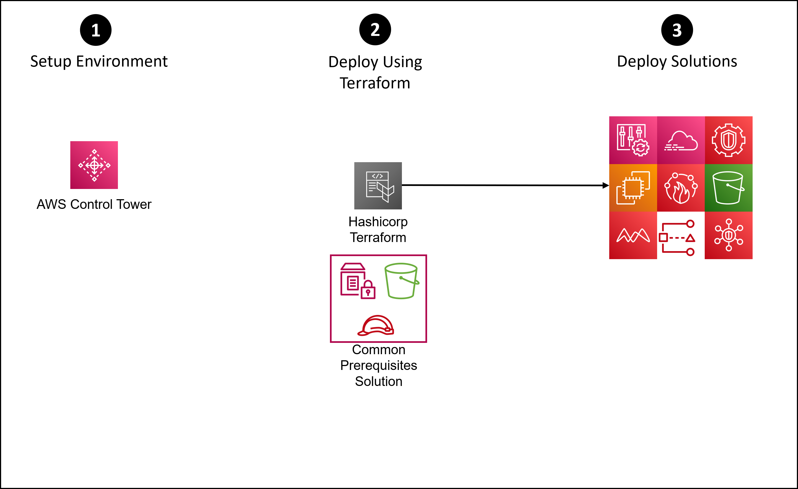
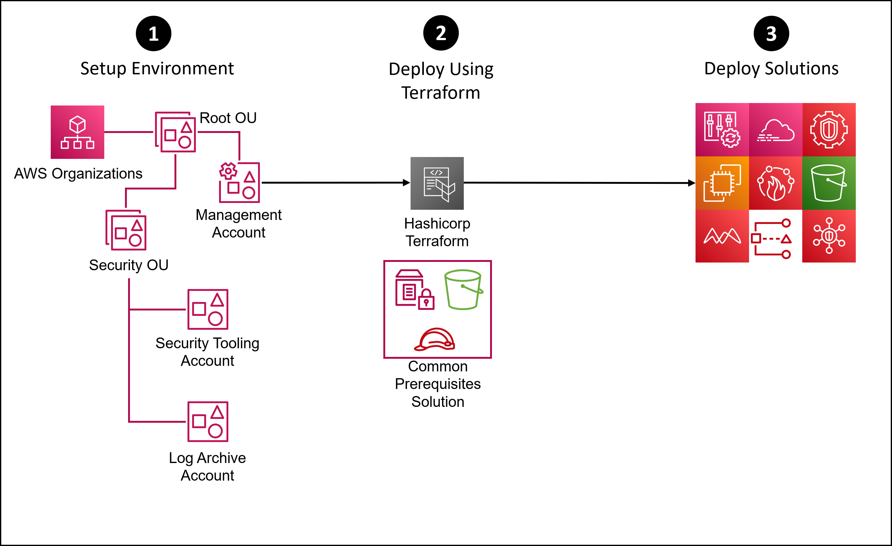

# SRA Terraform Edition<!-- omit in toc -->
<!-- markdownlint-disable MD033 -->

Copyright Amazon.com, Inc. or its affiliates. All Rights Reserved. SPDX-License-Identifier: CC-BY-SA-4.0

---

⚠️**Influence the future of the AWS Security Reference Architecture (AWS SRA) code library by taking a [short survey](https://amazonmr.au1.qualtrics.com/jfe/form/SV_9oFz0p67iCw3obk).**

## <!-- omit in toc -->

## Table of Contents<!-- omit in toc -->

- [Introduction](#introduction)
- [Prerequisites](#prerequisites)
- [Getting Started Using AWS SRA with Terraform and AWS Control Tower](#getting-started-using-aws-sra-with-terraform-and-aws-control-tower)
- [Getting Started Using AWS SRA with Terraform and AWS Organizations](#getting-started-using-aws-sra-with-terraform-and-aws-organizations)
- [Implementation Instructions](#implementation-instructions)
  - [Installing the AWS SRA Common Pre-Requisite Solution](#installing-the-aws-sra-common-pre-requisite-solution)
  - [Installing the AWS SRA Solutions](#installing-the-aws-sra-solutions)
  - [Updating and removing the AWS SRA Solutions](#updating-and-removing-the-aws-sra-solutions)

## Introduction

The AWS Security Reference Architecture (SRA) code library, a comprehensive public code repository, offers a suite of example code designed to help organizations implement robust security controls within their AWS environments. Recognizing the increasing complexity and evolving security requirements of cloud infrastructures, AWS has expanded the accessibility and usability of the SRA by enabling deployment through Terraform. This integration marks a significant advancement, providing developers and cloud engineers with a more flexible and efficient method to enforce security best practices and configurations directly into their AWS cloud environments.

The SRA Terraform edition was driven by valuable customer feedback, highlighting a strong demand for more versatile and automation-friendly options to apply AWS’s security guidance. Customers expressed a need for tools that could seamlessly integrate into their existing Infrastructure as Code (IaC) workflows, allowing for a more streamlined and scalable approach to cloud security. By building the code to deploy SRA via Terraform, AWS responds to this need, empowering users to deploy the Security Reference Architecture with ease and precision tailored to their specific needs. This development not only enhances security posture management but also aligns with the dynamic and automated nature of cloud computing, ensuring that AWS users have the necessary resources to protect their environments effectively.

## Prerequisites

- Terraform version >= 1.0
- Clone the SRA code library github repository

## Getting Started Using AWS SRA with Terraform and AWS Control Tower



1. Setup the environment to configure [AWS Control Tower](https://docs.aws.amazon.com/controltower/latest/userguide/getting-started-with-control-tower.html) within a new or existing AWS account. Existing AWS Control Tower environments can also be
   used but may require existing service configurations to be removed.
   - NOTE: The `aws_sra_examples/terraform/common/variables.tf` file, by default, should be setup already with the proper values for a control tower environment.  So, it should not need to be modified for this deployment.
2. Deploy the common prerequisites using Terraform (command line)
   - See [Installaing the AWS Common Pre-Requisite Solution](#installaing-the-aws-common-pre-requisite-solution) below.
3. Deploy solutions using Terraform (command line)
   - See [Installing the AWS SRA Solutions](#installing-the-aws-sra-solutions) below.


## Getting Started Using AWS SRA with Terraform and AWS Organizations



1. Setup the environment to configure [AWS Organizations](https://docs.aws.amazon.com/organizations/latest/userguide/orgs_getting-started.html) within a new or existing AWS account. Existing AWS Organizations environments can also be used but may
   require existing service configurations to be removed.
   - The `Security Tooling` and `Log Archive` accounts must be created or already be part of the existing AWS Organizations environment (though they may be named differently in your environment).
   - It is recommended that the OU structure is setup in alignment with the [AWS SRA design guidance](https://docs.aws.amazon.com/prescriptive-guidance/latest/security-reference-architecture/architecture.html)
2. Deploy the common prerequisites using Terraform (command line)
   - Edit the `aws_sra_examples/terraform/common/variables.tf` or pass in the variables in the command-line.
     - The `control_tower` variable must be `"false"`
     - The `governed_regions` variable must be set for the environments regions
     - The `security_account_id` variable must be set to the security tooling account Id
     - The `log_archive_account_id` variable must be set to the log archive account Id
   - See [Installaing the AWS Common Pre-Requisite Solution](#installaing-the-aws-common-pre-requisite-solution) below.
3. Deploy solutions using Terraform (command line)
   - See [Installing the AWS SRA Solutions](#installing-the-aws-sra-solutions) below.


## Implementation Instructions

### Installing the AWS SRA Common Pre-Requisite Solution

This will install the common pre-requisites solution including lambda and SSM parameter resources into your environment for usage by other AWS SRA solutions in its code library.

1. From the location where the SRA code library was cloned to, change to the `./aws_sra_examples/terraform/common` folder
```bash
cd aws_sra_examples/terraform/common
```
2. Run terraform init
```bash
terraform init
```
3. Run terraform plan (this is optional to review before applying)
```bash
terraform plan
```
4. Run terraform apply
```bash
terraform apply
```

After the apply operation is complete, Terraform will have created two files in your `./aws_sra_examples/terraform/solutions` folder:  `backend.tfvars` and `config.tfvars`

### Installing the AWS SRA Solutions

1. From the location where the SRA code library was cloned to, change to the ./aws_sra_examples/terraform/common folder
```bash
cd aws_sra_examples/terraform/solutions
```
2. Edit the `aws_sra_examples/terraform/solutions/config.tfvars` file, choose which AWS SRA Solutions to deploy and their settings. This can be done during initial setup or as an update later but nothing will be done unless at least one solution is set to be deployed.

#### Deployment To All Accounts and Governed Regions<!-- omit in toc -->

Inside the `aws_sra_examples/terraform/solutions` directory is a python script, `terraform_stack.py`, that handles the deployment of all resources and configurations to all accounts and all specified governed regions.

1. Run terraform init using `terraform_stack.py` script
```bash
python3 terraform_stack.py init
```
2. Run terraform plan using `terraform_stack.py` script (this is optional to review before applying)
```bash
python3 terraform_stack.py plan
```
3. Run terraform apply using `terraform_stack.py` script
```bash
python3 terraform_stack.py apply
```

### Updating and removing the AWS SRA Solutions

#### Solution Update Instructions<!-- omit in toc -->

1. Edit the `aws_sra_examples/terraform/solutions/config.tfvars` file and change the variable for the updated setting.  (e.g. update the AWS SRA security hub solution that was previously deployed to enable the NIST standard by changing the `enable_nist_standard variable` setting to `true`)
2. Run terraform apply using `terraform_stack.py` script from inside the `aws_sra_examples/terraform/solutions` directory
```bash
python3 terraform_stack.py apply
```


#### Solution Delete Instructions<!-- omit in toc -->

1. Edit the `aws_sra_examples/terraform/solutions/config.tfvars` file and change the disable variable for the solutions being removed.  (e.g. update the AWS SRA guardduty solution that was previously deployed to disable itself by changing the `disable_guard_duty` setting to `true`)

2. Run terraform apply using `terraform_stack.py` script from inside the `aws_sra_examples/terraform/solutions` directory
```bash
python3 terraform_stack.py apply
```
3. Edit the `aws_sra_examples/terraform/solutions/config.tfvars` file and change the deployment (enable) variable for the solutions being removed.  (e.g. update the `config.tfvars` file by setting the `enable_gd` setting to `false`)
4. Run terraform apply using `terraform_stack.py` script from inside the `aws_sra_examples/terraform/solutions` directory
```bash
python3 terraform_stack.py apply
```

