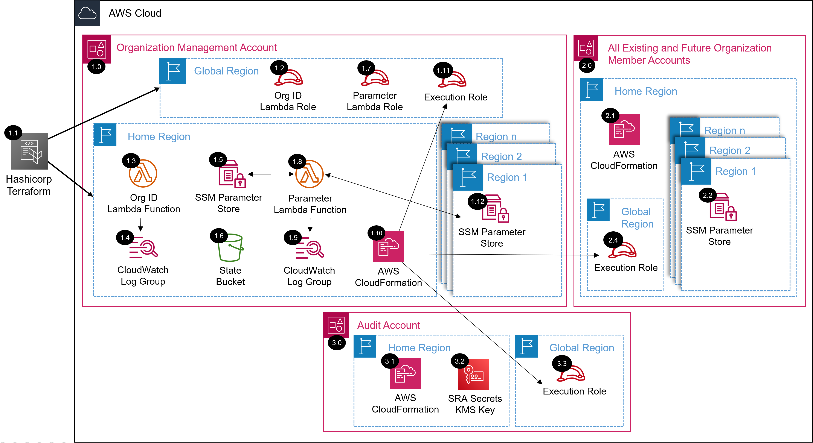

# AWS SRA Common Pre-Requisites Solution<!-- omit in toc -->
<!-- markdownlint-disable MD033 -->

Copyright Amazon.com, Inc. or its affiliates. All Rights Reserved. SPDX-License-Identifier: CC-BY-SA-4.0

---

⚠️**Influence the future of the AWS Security Reference Architecture (AWS SRA) code library by taking a [short survey](https://amazonmr.au1.qualtrics.com/jfe/form/SV_9oFz0p67iCw3obk).**

## <!-- omit in toc -->

## Introduction

This will install the common pre-requisites solution including lambda and SSM parameter resources into your environment for usage by other AWS SRA solutions in its code library.

This must be installed, in the management account, prior to installing and of the other AWS SRA solutions.

Information on the resources deployed as well as terraform requirements, providers, modules, resources, and inputs of this module are documented below.

Please navigate to the [installing the AWS SRA common pre-requisite solution](./aws_sra_examples/terraform#installing-the-aws-sra-common-pre-requisite-solution) section of the documentation for more information and installation instructions.

## Table of Contents<!-- omit in toc -->
- [Introduction](#introduction)
- [Deployed Resource Details](#deployed-resource-details)
- [Requirements](#requirements)
- [Providers](#providers)
- [Modules](#modules)
- [Resources](#resources)
- [Inputs](#inputs)
- [Outputs](#outputs)

## Deployed Resource Details

### 1.0 Organization Management Account<!-- omit in toc -->

#### 1.1 Hashicorp Terraform<!-- omit in toc -->

- Resources are deployed via Hashicorp Terraform within the management account.

#### 1.2 Org ID AWS Lambda IAM Role<!-- omit in toc -->

- See [1.2 Org ID AWS Lambda IAM Role](./../../solutions/common/common_prerequisites#12-org-id-aws-lambda-iam-role){:target="_blank"}

#### 1.3 Org ID AWS Lambda Function<!-- omit in toc -->

- See [1.3 Org ID AWS Lambda Function](./../../solutions/common/common_prerequisites#13-org-id-aws-lambda-function){:target="_blank"}

#### 1.4 AWS Lambda CloudWatch Log Group<!-- omit in toc -->

- See [1.4 AWS Lambda CloudWatch Log Group](./../../solutions/common/common_prerequisites#14-aws-lambda-cloudwatch-log-group)

#### 1.5 AWS SSM Parameter Store<!-- omit in toc -->

- See [1.5 AWS SSM Parameter Store](./../../solutions/common/common_prerequisites#15-aws-ssm-parameter-store)
  
#### 1.6 Terraform State S3 Bucket<!-- omit in toc -->

- The S3 Bucket is used to store the Terraform state information.

#### 1.7 Parameter AWS Lambda IAM Role<!-- omit in toc -->

- See [1.7 Parameter AWS Lambda IAM Role](./../../solutions/common/common_prerequisites#17-parameter-aws-lambda-iam-role)

#### 1.8 Parameter AWS Lambda Function<!-- omit in toc -->

- See [1.8 Parameter AWS Lambda Function](./../../solutions/common/common_prerequisites#18-parameter-aws-lambda-function)

#### 1.9 AWS Lambda CloudWatch Log Group<!-- omit in toc -->

- See [1.9 AWS Lambda CloudWatch Log Group](./../../solutions/common/common_prerequisites#19-aws-lambda-cloudwatch-log-group)

#### 1.10 AWS CloudFormation<!-- omit in toc -->

- CloudFormation is used to create a stackset to deploy the [1.11 SRA Execution Role](#111-sra-execution-role) to all accounts in the organization.

#### 1.11 SRA Execution Role<!-- omit in toc -->

- See [1.11 SRA Execution Role](./../../solutions/common/common_prerequisites#111-sra-execution-role)

#### 1.12 AWS SSM Parameter Store<!-- omit in toc -->

- See [1.5 AWS SSM Parameter Store](#15-aws-ssm-parameter-store)

### 2.0 All Existing and Future Organization Member Accounts<!-- omit in toc -->

#### 2.1 AWS CloudFormation<!-- omit in toc -->

- See [1.10 AWS CloudFormation](#110-aws-cloudformation)
- 
#### 2.2 AWS SSM Parameter Store<!-- omit in toc -->

- See [1.5 AWS SSM Parameter Store](#15-aws-ssm-parameter-store)

#### 2.4 SRA Execution Role<!-- omit in toc -->

- See [1.11 SRA Execution Role](#111-sra-execution-role)

### 3.0 Audit (Security Tooling) Account<!-- omit in toc -->

#### 3.1 AWS CloudFormation<!-- omit in toc -->

- See [1.10 AWS CloudFormation](#110-aws-cloudformation)

#### 3.2 SRA Secrets KMS Key<!-- omit in toc -->

- See [3.2 SRA Secrets KMS Key](./../../solutions/common/common_prerequisites#32-sra-secrets-kms-key)

#### 3.3 SRA Execution Role<!-- omit in toc -->

- See [1.11 SRA Execution Role](#111-sra-execution-role)

<!-- BEGIN_TF_DOCS -->
## Requirements

| Name | Version |
|------|---------|
|  [aws](#requirement\_aws) | >= 5.1.0 |

## Providers

| Name | Version |
|------|---------|
|  [aws](#provider\_aws) | >= 5.1.0 |
|  [local](#provider\_local) | n/a |

## Modules

| Name | Source | Version |
|------|--------|---------|
|  [dynamo\_tf\_lock](#module\_dynamo\_tf\_lock) | ./dynamodb | n/a |
|  [mangement\_account\_parameters](#module\_mangement\_account\_parameters) | ./ssm_parameters | n/a |
|  [s3\_state\_bucket](#module\_s3\_state\_bucket) | ./s3 | n/a |
|  [sra\_execution\_role](#module\_sra\_execution\_role) | ./sra_execution_role | n/a |
|  [sra\_secrets\_kms](#module\_sra\_secrets\_kms) | ./secrets_kms | n/a |

## Resources

| Name | Type |
|------|------|
| [aws_cloudformation_stack_set.sra_execution_role_stackset](https://registry.terraform.io/providers/hashicorp/aws/latest/docs/resources/cloudformation_stack_set) | resource |
| [aws_cloudformation_stack_set_instance.sra_execution_role_stackset_instance](https://registry.terraform.io/providers/hashicorp/aws/latest/docs/resources/cloudformation_stack_set_instance) | resource |
| [local_file.backend_file_creation](https://registry.terraform.io/providers/hashicorp/local/latest/docs/resources/file) | resource |
| [local_file.config_file_creation](https://registry.terraform.io/providers/hashicorp/local/latest/docs/resources/file) | resource |
| [aws_caller_identity.current](https://registry.terraform.io/providers/hashicorp/aws/latest/docs/data-sources/caller_identity) | data source |
| [aws_ssm_parameter.audit_account_id](https://registry.terraform.io/providers/hashicorp/aws/latest/docs/data-sources/ssm_parameter) | data source |
| [aws_ssm_parameter.customer_control_tower_regions](https://registry.terraform.io/providers/hashicorp/aws/latest/docs/data-sources/ssm_parameter) | data source |
| [aws_ssm_parameter.customer_control_tower_regions_without_home_region](https://registry.terraform.io/providers/hashicorp/aws/latest/docs/data-sources/ssm_parameter) | data source |
| [aws_ssm_parameter.enabled_regions](https://registry.terraform.io/providers/hashicorp/aws/latest/docs/data-sources/ssm_parameter) | data source |
| [aws_ssm_parameter.enabled_regions_without_home_region](https://registry.terraform.io/providers/hashicorp/aws/latest/docs/data-sources/ssm_parameter) | data source |
| [aws_ssm_parameter.home_region](https://registry.terraform.io/providers/hashicorp/aws/latest/docs/data-sources/ssm_parameter) | data source |
| [aws_ssm_parameter.log_archive_account_id](https://registry.terraform.io/providers/hashicorp/aws/latest/docs/data-sources/ssm_parameter) | data source |
| [aws_ssm_parameter.management_account_id](https://registry.terraform.io/providers/hashicorp/aws/latest/docs/data-sources/ssm_parameter) | data source |
| [aws_ssm_parameter.organization_id](https://registry.terraform.io/providers/hashicorp/aws/latest/docs/data-sources/ssm_parameter) | data source |
| [aws_ssm_parameter.root_organizational_unit_id](https://registry.terraform.io/providers/hashicorp/aws/latest/docs/data-sources/ssm_parameter) | data source |

## Inputs

| Name | Description | Type | Default | Required |
|------|-------------|------|---------|:--------:|
|  [aws\_partition](#input\_aws\_partition) | AWS Partition (e.g., aws or aws-cn) | `string` | `"aws"` | no |
|  [control\_tower](#input\_control\_tower) | AWS Control Tower landing zone deployed/in-use | `string` | `"true"` | no |
|  [execution\_role\_name](#input\_execution\_role\_name) | Name of the SRA execution role | `string` | `"sra-execution"` | no |
|  [governed\_regions](#input\_governed\_regions) | AWS regions (comma separated) if not using AWS Control Tower (leave set to ct-regions for AWS Control Tower environments) | `string` | `"ct-regions"` | no |
|  [log\_archive\_account\_id](#input\_log\_archive\_account\_id) | Log Archive Account ID | `string` | `"222222222222"` | no |
|  [security\_account\_id](#input\_security\_account\_id) | Security Tooling Account ID | `string` | `"111111111111"` | no |
|  [solution\_name](#input\_solution\_name) | Name of the SRA solution | `string` | `"sra-create-deployment-roles"` | no |

## Outputs

No outputs.
<!-- END_TF_DOCS -->