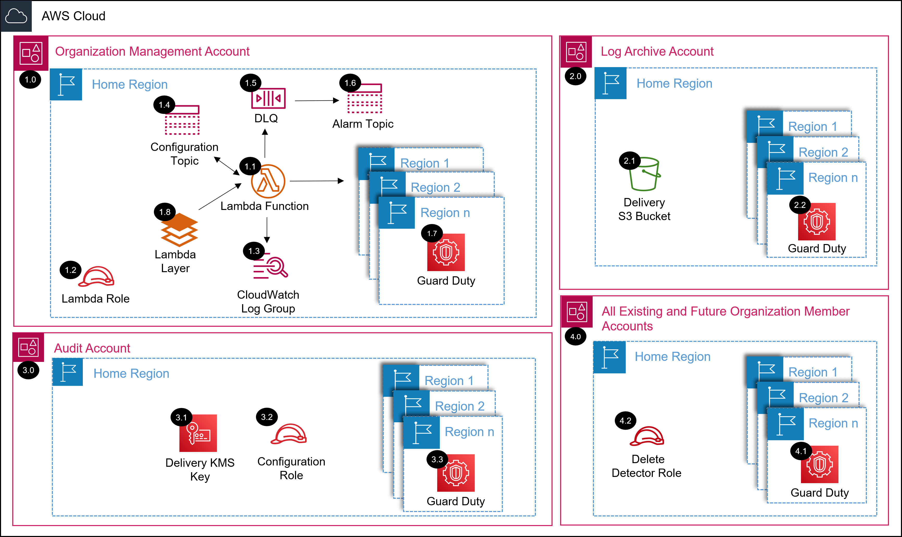

# AWS SRA GuardDuty Organization Solution with Terraform<!-- omit in toc -->
<!-- markdownlint-disable MD033 -->

Copyright Amazon.com, Inc. or its affiliates. All Rights Reserved. SPDX-License-Identifier: CC-BY-SA-4.0

---

⚠️**Influence the future of the AWS Security Reference Architecture (AWS SRA) code library by taking a [short survey](https://amazonmr.au1.qualtrics.com/jfe/form/SV_9oFz0p67iCw3obk).**

## <!-- omit in toc -->

## Table of Contents<!-- omit in toc -->

- [Introduction](#introduction)
- [Deployed Resource Details](#deployed-resource-details)
- [Implementation Instructions](#implementation-instructions)
- [Requirements](#requirements)
- [Providers](#providers)
- [Modules](#modules)
- [Resources](#resources)
- [Inputs](#inputs)
- [Outputs](#outputs)

---

## Introduction

This Terraform module deploys GuardDuty Organization AWS SRA solution.  

The common pre-requisite solution must be installed, in the management account, prior to installing this solution.

Information on the resources deployed as well as terraform requirements, providers, modules, resources, and inputs of this module are documented below.

Please navigate to the [installing the AWS SRA Solutions](./../../README.md#installing-the-aws-sra-solutions) section of the documentation for more information and installation instructions.

*For the CloudFormation version of this AWS SRA solution as well as more information please navigate to the [AWS SRA GuardDuty solution documentation](./../../../solutions/guardduty/guardduty_org/README.md) page.*

---

## Deployed Resource Details

### 1.0 Organization Management Account<!-- omit in toc -->

#### 1.1 AWS Lambda Function<!-- omit in toc -->

- See [1.2 AWS Lambda Function](./../../../solutions/guardduty/guardduty_org/README.md#12-aws-lambda-function)

#### 1.2 Lambda Execution IAM Role<!-- omit in toc -->

- See [1.3 Lambda Execution IAM Role](./../../../solutions/guardduty/guardduty_org/README.md#13-lambda-execution-iam-role)

#### 1.3 Lambda CloudWatch Log Group<!-- omit in toc -->

- See [1.4 Lambda CloudWatch Log Group](./../../../solutions/guardduty/guardduty_org/README.md#14-lambda-cloudwatch-log-group)

#### 1.4 Configuration SNS Topic<!-- omit in toc -->

- See [1.5 Configuration SNS Topic](./../../../solutions/guardduty/guardduty_org/README.md#15-configuration-sns-topic)

#### 1.5 Dead Letter Queue (DLQ)<!-- omit in toc -->

- See [1.6 Dead Letter Queue (DLQ)](./../../../solutions/guardduty/guardduty_org/README.md#16-dead-letter-queue-dlq)

#### 1.6 Alarm SNS Topic<!-- omit in toc -->

- See [1.7 Alarm SNS Topic](./../../../solutions/guardduty/guardduty_org/README.md#17-alarm-sns-topic)

#### 1.7 GuardDuty<!-- omit in toc -->

- See [1.8 GuardDuty](./../../../solutions/guardduty/guardduty_org/README.md#18-guardduty)

#### 1.8 Lambda Layer<!-- omit in toc -->

- See [1.9 Lambda Layer](./../../../solutions/guardduty/guardduty_org/README.md#19-lambda-layer)

---

### 2.0 Log Archive Account<!-- omit in toc -->

#### 2.1 GuardDuty Delivery S3 Bucket<!-- omit in toc -->

- See [2.2 GuardDuty Delivery S3 Bucket](./../../../solutions/guardduty/guardduty_org/README.md#22-guardduty-delivery-s3-bucket)

#### 2.2 GuardDuty<!-- omit in toc -->

- See [2.3 GuardDuty](./../../../solutions/guardduty/guardduty_org/README.md#23-guardduty)

---

### 3.0 Audit (Security Tooling) Account<!-- omit in toc -->

#### 3.1 GuardDuty Delivery KMS Key<!-- omit in toc -->

- See [3.2 GuardDuty Delivery KMS Key](./../../../solutions/guardduty/guardduty_org/README.md#32-guardduty-delivery-kms-key)

#### 3.2 Configuration IAM Role<!-- omit in toc -->

- See [3.3 Configuration IAM Role](./../../../solutions/guardduty/guardduty_org/README.md#33-configuration-iam-role)

#### 3.3 GuardDuty<!-- omit in toc -->

- See [3.4 GuardDuty](./../../../solutions/guardduty/guardduty_org/README.md#34-guardduty)

---

### 4.0 All Existing and Future Organization Member Accounts<!-- omit in toc -->

#### 4.1 GuardDuty<!-- omit in toc -->

- See [4.1 GuardDuty](./../../../solutions/guardduty/guardduty_org/README.md#41-guardduty)

#### 4.2 Delete Detector Role<!-- omit in toc -->

- See [4.2 Delete Detector Role](./../../../solutions/guardduty/guardduty_org/README.md#42-delete-detector-role)

---

## Implementation Instructions

Please navigate to the [installing the AWS SRA Solutions](./../../README.md#installing-the-aws-sra-solutions) section of the documentation for installation instructions.

---
<!-- BEGIN_TF_DOCS -->
## Requirements

| Name | Version |
|------|---------|
|  [aws](#requirement\_aws) | >= 5.1.0 |

## Providers

| Name | Version |
|------|---------|
|  [aws.main](#provider\_aws.main) | >= 5.1.0 |

## Modules

| Name | Source | Version |
|------|--------|---------|
|  [guardduty\_configuration](#module\_guardduty\_configuration) | ./gd_configuration | n/a |
|  [guardduty\_configuration\_role](#module\_guardduty\_configuration\_role) | ./configuration_role | n/a |
|  [guardduty\_delete\_role](#module\_guardduty\_delete\_role) | ./delete_detector | n/a |
|  [guardduty\_delivery\_key](#module\_guardduty\_delivery\_key) | ./kms_key | n/a |
|  [guardduty\_s3\_bucket](#module\_guardduty\_s3\_bucket) | ./s3 | n/a |

## Resources

| Name | Type |
|------|------|
| [aws_caller_identity.current](https://registry.terraform.io/providers/hashicorp/aws/latest/docs/data-sources/caller_identity) | data source |
| [aws_partition.current](https://registry.terraform.io/providers/hashicorp/aws/latest/docs/data-sources/partition) | data source |
| [aws_region.current](https://registry.terraform.io/providers/hashicorp/aws/latest/docs/data-sources/region) | data source |

## Inputs

| Name | Description | Type | Default | Required |
|------|-------------|------|---------|:--------:|
|  [account\_id](#input\_account\_id) | Current Account ID | `string` | n/a | yes |
|  [audit\_account\_id](#input\_audit\_account\_id) | AWS Account ID of the Control Tower Audit account. | `string` | n/a | yes |
|  [disable\_guard\_duty](#input\_disable\_guard\_duty) | Update to 'true' to disable GuardDuty in all accounts and regions before deleting the TF. | `string` | n/a | yes |
|  [enable\_eks\_addon\_management](#input\_enable\_eks\_addon\_management) | Auto enable EKS Add-on Management | `string` | n/a | yes |
|  [enable\_eks\_runtime\_monitoring](#input\_enable\_eks\_runtime\_monitoring) | Auto enable EKS Runtime Monitoring | `string` | n/a | yes |
|  [enable\_kubernetes\_audit\_logs](#input\_enable\_kubernetes\_audit\_logs) | Auto enable Kubernetes Audit Logs | `string` | n/a | yes |
|  [enable\_lambda\_network\_logs](#input\_enable\_lambda\_network\_logs) | Auto enable Lambda Network Logs | `string` | n/a | yes |
|  [enable\_malware\_protection](#input\_enable\_malware\_protection) | Auto enable Malware Protection | `string` | n/a | yes |
|  [enable\_rds\_login\_events](#input\_enable\_rds\_login\_events) | Auto enable RDS Login Events | `string` | n/a | yes |
|  [enable\_s3\_logs](#input\_enable\_s3\_logs) | Auto enable S3 logs | `string` | n/a | yes |
|  [finding\_publishing\_frequency](#input\_finding\_publishing\_frequency) | Finding publishing frequency | `string` | n/a | yes |
|  [guardduty\_control\_tower\_regions\_only](#input\_guardduty\_control\_tower\_regions\_only) | Only enable in the Control Tower governed regions | `string` | n/a | yes |
|  [home\_region](#input\_home\_region) | Name of the Control Tower home region | `string` | n/a | yes |
|  [log\_archive\_account\_id](#input\_log\_archive\_account\_id) | AWS Account ID of the Control Tower Log Archive account. | `string` | n/a | yes |
|  [management\_account\_id](#input\_management\_account\_id) | Organization Management Account ID | `string` | n/a | yes |
|  [organization\_id](#input\_organization\_id) | AWS Organization ID | `string` | n/a | yes |

## Outputs

| Name | Description |
|------|-------------|
|  [guard\_duty\_results](#output\_guard\_duty\_results) | n/a |
<!-- END_TF_DOCS -->
---

