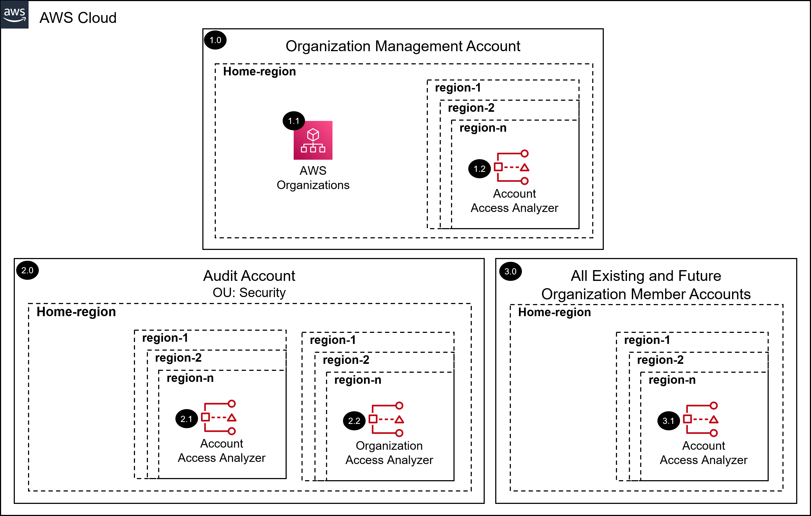

# AWS SRA cloudtrail Organization Solution with Terraform<!-- omit in toc -->
<!-- markdownlint-disable MD033 -->

Copyright Amazon.com, Inc. or its affiliates. All Rights Reserved. SPDX-License-Identifier: CC-BY-SA-4.0

---

⚠️**Influence the future of the AWS Security Reference Architecture (AWS SRA) code library by taking a [short survey](https://amazonmr.au1.qualtrics.com/jfe/form/SV_9oFz0p67iCw3obk).**

## <!-- omit in toc -->

## Table of Contents<!-- omit in toc -->

- [Introduction](#introduction)
- [Deployed Resource Details](#deployed-resource-details)
- [Implementation Instructions](#implementation-instructions)
- [Requirements](#requirements)
- [Providers](#providers)
- [Modules](#modules)
- [Resources](#resources)
- [Inputs](#inputs)
- [Outputs](#outputs)

---

## Introduction

This Terraform module deploys the IAM Access Analyzer AWS SRA solution.  

The common pre-requisite solution must be installed, in the management account, prior to installing this solution.

Information on the resources deployed as well as terraform requirements, providers, modules, resources, and inputs of this module are documented below.

Please navigate to the [installing the AWS SRA Solutions](./../../terraform##installing-the-aws-sra-solutions) section of the documentation for more information and installation instructions.

*For the CloudFormation version of this AWS SRA solution as well as more information please navigate to the [AWS SRA cloudtrail solution documentation](./../../../solutions/iam/iam_access_analyzer/README.md) page.*

---

## Deployed Resource Details

### 1.0 Organization Management Account<!-- omit in toc -->

#### 1.1 AWS Organizations<!-- omit in toc -->

- See [1.2 AWS Organizations](./../../../solutions/iam/iam_access_analyzer/README.md#12-aws-organizations)

#### 1.2 Account AWS IAM Access Analyzer<!-- omit in toc -->

- See [1.3 Account AWS IAM Access Analyzer](./../../../solutions/iam/iam_access_analyzer/README.md#13-account-aws-iam-access-analyzer)

---

### 2.0 Audit Account (Security Tooling)<!-- omit in toc -->

#### 2.1 Account AWS IAM Access Analyzer<!-- omit in toc -->

- See [2.2 Account AWS IAM Access Analyzer](./../../../solutions/iam/iam_access_analyzer/README.md#22-account-aws-iam-access-analyzer)

#### 2.2 Organization AWS IAM Access Analyzer<!-- omit in toc -->

- See [2.3 Organization AWS IAM Access Analyzer](./../../../solutions/iam/iam_access_analyzer/README.md#23-organization-aws-iam-access-analyzer)

---

### 3.0 All Existing and Future Organization Member Accounts<!-- omit in toc -->

#### 3.1 Account AWS IAM Access Analyzer<!-- omit in toc -->

- See [3.2 Account AWS IAM Access Analyzer](./../../../solutions/iam/iam_access_analyzer/README.md#32-account-aws-iam-access-analyzer)

---

## Implementation Instructions

Please navigate to the [installing the AWS SRA Solutions](./../../terraform##installing-the-aws-sra-solutions) section of the documentation for installation instructions.

---
<!-- BEGIN_TF_DOCS -->
## Requirements

| Name | Version |
|------|---------|
|  [aws](#requirement\_aws) | >= 5.1.0 |

## Providers

| Name | Version |
|------|---------|
|  [aws](#provider\_aws) | >= 5.1.0 |

## Modules

| Name | Source | Version |
|------|--------|---------|
|  [account\_analyzer](#module\_account\_analyzer) | ./account | n/a |
|  [org\_analyzer](#module\_org\_analyzer) | ./org | n/a |

## Resources

| Name | Type |
|------|------|
| [aws_caller_identity.current](https://registry.terraform.io/providers/hashicorp/aws/latest/docs/data-sources/caller_identity) | data source |
| [aws_partition.current](https://registry.terraform.io/providers/hashicorp/aws/latest/docs/data-sources/partition) | data source |
| [aws_region.current](https://registry.terraform.io/providers/hashicorp/aws/latest/docs/data-sources/region) | data source |

## Inputs

| Name | Description | Type | Default | Required |
|------|-------------|------|---------|:--------:|
|  [access\_analyzer\_name\_prefix](#input\_access\_analyzer\_name\_prefix) | Access Analyzer Name Prefix. The Account ID will be appended to the name. | `string` | `"sra-account-access-analyzer"` | no |
|  [account\_id](#input\_account\_id) | Current Account ID | `string` | n/a | yes |
|  [audit\_account\_id](#input\_audit\_account\_id) | AWS Account ID of the Control Tower Audit account. | `string` | n/a | yes |
|  [home\_region](#input\_home\_region) | Name of the Control Tower home region | `string` | n/a | yes |
|  [log\_archive\_account\_id](#input\_log\_archive\_account\_id) | AWS Account ID of the Control Tower Log Archive account. | `string` | n/a | yes |
|  [org\_access\_analyzer\_name](#input\_org\_access\_analyzer\_name) | Organization Access Analyzer Name | `string` | `"sra-organization-access-analyzer"` | no |
|  [sra\_solution\_name](#input\_sra\_solution\_name) | The SRA solution name. The default value is the folder name of the solution | `string` | `"sra-iam-access-analyzer"` | no |

## Outputs

No outputs.
<!-- END_TF_DOCS -->