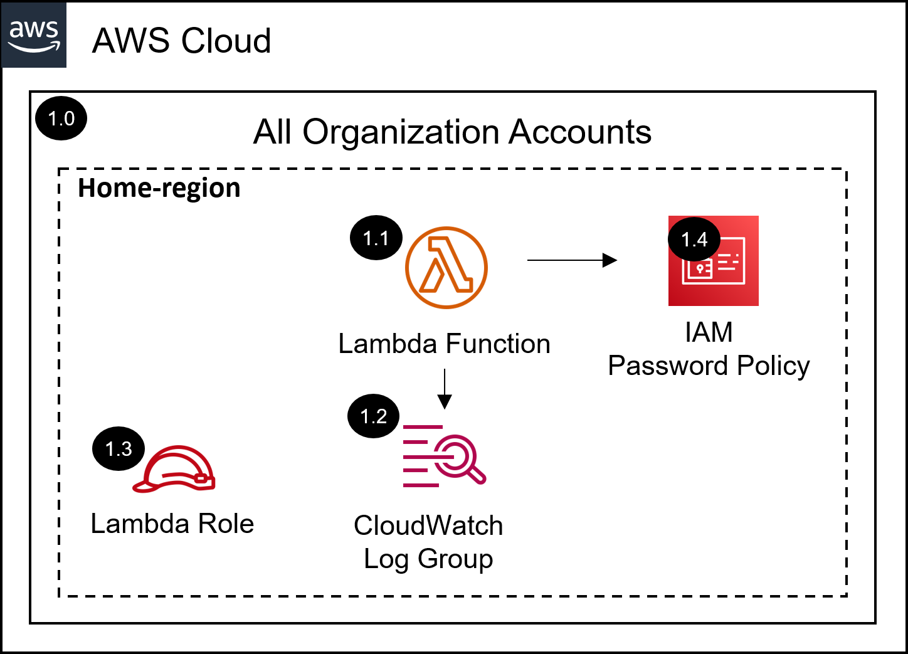

# AWS SRA IAM Password Policy Solution with Terraform<!-- omit in toc -->
<!-- markdownlint-disable MD033 -->

Copyright Amazon.com, Inc. or its affiliates. All Rights Reserved. SPDX-License-Identifier: CC-BY-SA-4.0

---

⚠️**Influence the future of the AWS Security Reference Architecture (AWS SRA) code library by taking a [short survey](https://amazonmr.au1.qualtrics.com/jfe/form/SV_9oFz0p67iCw3obk).**

## <!-- omit in toc -->

## Table of Contents<!-- omit in toc -->

- [Introduction](#introduction)
- [Deployed Resource Details](#deployed-resource-details)
- [Implementation Instructions](#implementation-instructions)
- [Requirements](#requirements)
- [Providers](#providers)
- [Modules](#modules)
- [Resources](#resources)
- [Inputs](#inputs)
- [Outputs](#outputs)

---

## Introduction

This Terraform module deploys the IAM password policy AWS SRA solution.  

The common pre-requisite solution must be installed, in the management account, prior to installing this solution.

Information on the resources deployed as well as terraform requirements, providers, modules, resources, and inputs of this module are documented below.

Please navigate to the [installing the AWS SRA Solutions](./../../README.md#installing-the-aws-sra-solutions) section of the documentation for more information and installation instructions.

*For the CloudFormation version of this AWS SRA solution as well as more information please navigate to the [AWS SRA cloudtrail solution documentation](./../../../solutions/iam/iam_password_policy/README.md) page.*

---

## Deployed Resource Details

### 1.0 All Organization Accounts<!-- omit in toc -->

#### 1.2 AWS Lambda Function<!-- omit in toc -->

- See [1.2 AWS Lambda Function](./../../../solutions/iam/iam_password_policy/README.md#12-aws-lambda-function)

#### 1.3 Amazon CloudWatch Log Group<!-- omit in toc -->

- See [1.3 Amazon CloudWatch Log Group](./../../../solutions/iam/iam_password_policy/README.md#13-amazon-cloudwatch-log-group)

#### 1.4 Lambda Execution IAM Role<!-- omit in toc -->

- See [1.4 Lambda Execution IAM Role](./../../../solutions/iam/iam_password_policy/README.md#14-lambda-execution-iam-role)

#### 1.5 IAM Password Policy<!-- omit in toc -->

- See [1.5 IAM Password Policy](./../../../solutions/iam/iam_password_policy/README.md#15-iam-password-policy)

---

## Implementation Instructions

Please navigate to the [installing the AWS SRA Solutions](./../../README.md#installing-the-aws-sra-solutions) section of the documentation for installation instructions.

---
<!-- BEGIN_TF_DOCS -->
## Requirements

| Name | Version |
|------|---------|
|  [aws](#requirement\_aws) | >= 5.1.0 |

## Providers

| Name | Version |
|------|---------|
|  [aws.main](#provider\_aws.main) | >= 5.1.0 |

## Modules

| Name | Source | Version |
|------|--------|---------|
|  [inspector\_configuration](#module\_inspector\_configuration) | ./configuration | n/a |

## Resources

| Name | Type |
|------|------|
| [aws_caller_identity.current](https://registry.terraform.io/providers/hashicorp/aws/latest/docs/data-sources/caller_identity) | data source |
| [aws_partition.current](https://registry.terraform.io/providers/hashicorp/aws/latest/docs/data-sources/partition) | data source |
| [aws_region.current](https://registry.terraform.io/providers/hashicorp/aws/latest/docs/data-sources/region) | data source |

## Inputs

| Name | Description | Type | Default | Required |
|------|-------------|------|---------|:--------:|
|  [allow\_users\_to\_change\_password](#input\_allow\_users\_to\_change\_password) | You can permit all IAM users in your account to use the IAM console to change their own passwords. | `string` | `"true"` | no |
|  [create\_lambda\_log\_group](#input\_create\_lambda\_log\_group) | Indicates whether a CloudWatch Log Group should be explicitly created for the Lambda function, to allow for setting a Log Retention and/or KMS Key for encryption. | `string` | `"false"` | no |
|  [hard\_expiry](#input\_hard\_expiry) | You can prevent IAM users from choosing a new password after their current password has expired. | `string` | `"false"` | no |
|  [home\_region](#input\_home\_region) | Name of the Control Tower home region | `string` | n/a | yes |
|  [lambda\_function\_name](#input\_lambda\_function\_name) | Lambda function name | `string` | `"sra-iam-password-policy"` | no |
|  [lambda\_log\_group\_kms\_key](#input\_lambda\_log\_group\_kms\_key) | (Optional) KMS Key ARN to use for encrypting the Lambda logs data. If empty, encryption is enabled with CloudWatch Logs managing the server-side encryption keys. | `string` | `""` | no |
|  [lambda\_log\_group\_retention](#input\_lambda\_log\_group\_retention) | Specifies the number of days you want to retain log events | `string` | `"14"` | no |
|  [lambda\_log\_level](#input\_lambda\_log\_level) | Lambda Function Logging Level | `string` | `"INFO"` | no |
|  [lambda\_role\_name](#input\_lambda\_role\_name) | Lambda role name | `string` | `"sra-iam-password-policy-lambda"` | no |
|  [max\_password\_age](#input\_max\_password\_age) | You can set IAM user passwords to be valid for only the specified number of days. | `string` | `90` | no |
|  [minimum\_password\_length](#input\_minimum\_password\_length) | You can specify the minimum number of characters allowed in an IAM user password. | `string` | `14` | no |
|  [password\_reuse\_prevention](#input\_password\_reuse\_prevention) | You can prevent IAM users from reusing a specified number of previous passwords. | `string` | `24` | no |
|  [require\_lowercase\_characters](#input\_require\_lowercase\_characters) | You can require that IAM user passwords contain at least one lowercase character from the ISO basic Latin alphabet (a to z). | `string` | `"true"` | no |
|  [require\_numbers](#input\_require\_numbers) | You can require that IAM user passwords contain at least one numeric character (0 to 9). | `string` | `"true"` | no |
|  [require\_symbols](#input\_require\_symbols) | You can require that IAM user passwords contain at least one of the following nonalphanumeric characters: ! @ # $ % ^ & * ( ) \_ + - = [ ] {} \| ' | `string` | `"true"` | no |
|  [require\_uppercase\_characters](#input\_require\_uppercase\_characters) | You can require that IAM user passwords contain at least one uppercase character from the ISO basic Latin alphabet (A to Z). | `string` | `"true"` | no |
|  [sra\_solution\_name](#input\_sra\_solution\_name) | The SRA solution name. The default value is the folder name of the solution | `string` | `"sra-iam-password-policy"` | no |

## Outputs

No outputs.
<!-- END_TF_DOCS -->