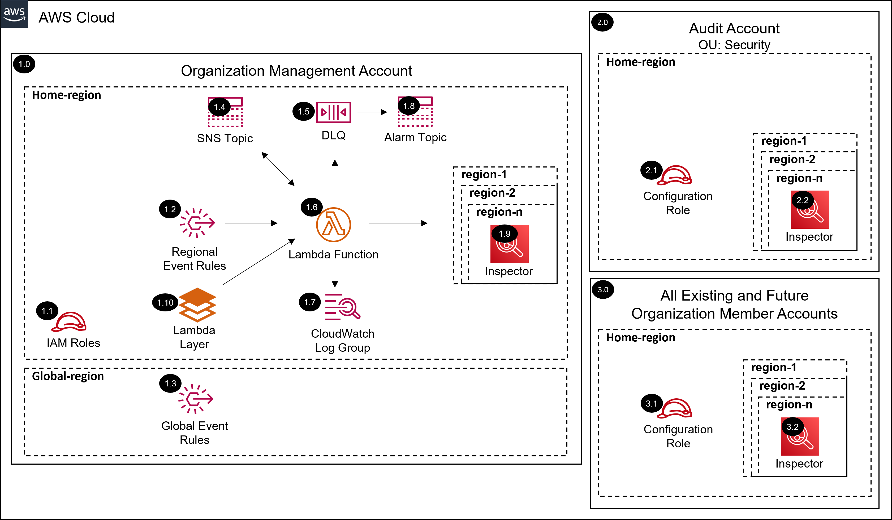

# AWS SRA Inspector Solution with Terraform<!-- omit in toc -->
<!-- markdownlint-disable MD033 -->

Copyright Amazon.com, Inc. or its affiliates. All Rights Reserved. SPDX-License-Identifier: CC-BY-SA-4.0

---

⚠️**Influence the future of the AWS Security Reference Architecture (AWS SRA) code library by taking a [short survey](https://amazonmr.au1.qualtrics.com/jfe/form/SV_9oFz0p67iCw3obk).**

## <!-- omit in toc -->

## Table of Contents<!-- omit in toc -->

- [Introduction](#introduction)
- [Deployed Resource Details](#deployed-resource-details)
- [Implementation Instructions](#implementation-instructions)
- [Requirements](#requirements)
- [Providers](#providers)
- [Modules](#modules)
- [Resources](#resources)
- [Inputs](#inputs)
- [Outputs](#outputs)

---

## Introduction

This Terraform module deploys the Inspector AWS SRA solution.  

The common pre-requisite solution must be installed, in the management account, prior to installing this solution.

Information on the resources deployed as well as terraform requirements, providers, modules, resources, and inputs of this module are documented below.

Please navigate to the [installing the AWS SRA Solutions](./../../README.md#installing-the-aws-sra-solutions) section of the documentation for more information and installation instructions.

*For the CloudFormation version of this AWS SRA solution as well as more information please navigate to the [AWS SRA Inspector solution documentation](./../../../solutions/inspector/inspector_org/README.md) page.*

---

## Deployed Resource Details

### 1.0 Organization Management Account<!-- omit in toc -->

#### 1.1 IAM Roles<!-- omit in toc -->

- See [1.2 IAM Roles](./../../../solutions/inspector/inspector_org/README.md#12-iam-roles)

#### 1.2 Regional Event Rules<!-- omit in toc -->

- See [1.3 Regional Event Rules](./../../../solutions/inspector/inspector_org/README.md#13-regional-event-rules)

#### 1.3 Global Event Rules<!-- omit in toc -->

- See [1.4 Global Event Rules](./../../../solutions/inspector/inspector_org/README.md#14-global-event-rules)

#### 1.4 SNS Topic<!-- omit in toc -->

- See [1.5 SNS Topic](./../../../solutions/inspector/inspector_org/README.md#15-sns-topic)

#### 1.5 Dead Letter Queue (DLQ)<!-- omit in toc -->

- See [1.6 Dead Letter Queue (DLQ)](./../../../solutions/inspector/inspector_org/README.md#16-dead-letter-queue-dlq)

#### 1.6 AWS Lambda Function<!-- omit in toc -->

- See [1.7 AWS Lambda Function](./../../../solutions/inspector/inspector_org/README.md#17-aws-lambda-function)

#### 1.7 Lambda CloudWatch Log Group<!-- omit in toc -->

- See [1.8 Lambda CloudWatch Log Group](./../../../solutions/inspector/inspector_org/README.md#18-lambda-cloudwatch-log-group)

#### 1.8 Alarm SNS Topic<!-- omit in toc -->

- See [1.9 Alarm SNS Topic](./../../../solutions/inspector/inspector_org/README.md#19-alarm-sns-topic)

#### 1.9 Inspector<!-- omit in toc -->

- See [1.10 Inspector](./../../../solutions/inspector/inspector_org/README.md#110-inspector)

#### 1.10 Lambda Layer<!-- omit in toc -->

- See [1.11 Lambda Layer](./../../../solutions/inspector/inspector_org/README.md#111-lambda-layer)

---

### 2.0 Audit Account<!-- omit in toc -->

#### 2.2 Configuration IAM Role<!-- omit in toc -->

- See [2.2 Configuration IAM Role](./../../../solutions/inspector/inspector_org/README.md#22-configuration-iam-role)

#### 2.2 Inspector (Delegated admin)<!-- omit in toc -->

- See [2.3 Inspector (Delegated admin)](./../../../solutions/inspector/inspector_org/README.md#23-inspector-delegated-admin)

---

### 3.0 All Existing and Future Organization Member Accounts<!-- omit in toc -->

#### 3.1 Configuration IAM Role<!-- omit in toc -->

- See [3.2 Configuration IAM Role](./../../../solutions/inspector/inspector_org/README.md#32-configuration-iam-role)

#### 3.2 Inspector (Members)<!-- omit in toc -->

- See [3.3 Inspector (Members)](./../../../solutions/inspector/inspector_org/README.md#33-inspector-members)

---

## Implementation Instructions

Please navigate to the [installing the AWS SRA Solutions](./../../README.md#installing-the-aws-sra-solutions) section of the documentation for installation instructions.

---
<!-- BEGIN_TF_DOCS -->
## Requirements

| Name | Version |
|------|---------|
|  [aws](#requirement\_aws) | >= 5.1.0 |

## Providers

| Name | Version |
|------|---------|
|  [aws.main](#provider\_aws.main) | >= 5.1.0 |

## Modules

| Name | Source | Version |
|------|--------|---------|
|  [inspector\_configuration](#module\_inspector\_configuration) | ./configuration | n/a |
|  [inspector\_configuration\_role](#module\_inspector\_configuration\_role) | ./configuration_role | n/a |

## Resources

| Name | Type |
|------|------|
| [aws_caller_identity.current](https://registry.terraform.io/providers/hashicorp/aws/latest/docs/data-sources/caller_identity) | data source |
| [aws_partition.current](https://registry.terraform.io/providers/hashicorp/aws/latest/docs/data-sources/partition) | data source |
| [aws_region.current](https://registry.terraform.io/providers/hashicorp/aws/latest/docs/data-sources/region) | data source |

## Inputs

| Name | Description | Type | Default | Required |
|------|-------------|------|---------|:--------:|
|  [audit\_account\_id](#input\_audit\_account\_id) | AWS Account ID of the Control Tower Audit account. | `string` | n/a | yes |
|  [ecr\_rescan\_duration](#input\_ecr\_rescan\_duration) | ECR Rescan Duration | `string` | n/a | yes |
|  [enabled\_regions](#input\_enabled\_regions) | (Optional) Enabled regions (AWS regions, separated by commas). Leave blank to enable all regions. | `string` | `""` | no |
|  [home\_region](#input\_home\_region) | Name of the Control Tower home region | `string` | n/a | yes |
|  [inspector\_configuration\_role\_name](#input\_inspector\_configuration\_role\_name) | Inspector Configuration role to assume in the delegated administrator account | `string` | `"sra-inspector-configuration"` | no |
|  [inspector\_control\_tower\_regions\_only](#input\_inspector\_control\_tower\_regions\_only) | Only enable in the Control Tower governed regions | `bool` | `true` | no |
|  [inspector\_org\_lambda\_function\_name](#input\_inspector\_org\_lambda\_function\_name) | Lambda function name | `string` | `"sra-inspector-org"` | no |
|  [inspector\_org\_lambda\_role\_name](#input\_inspector\_org\_lambda\_role\_name) | Inspector configuration Lambda role name | `string` | `"sra-inspector-org-lambda"` | no |
|  [log\_archive\_account\_id](#input\_log\_archive\_account\_id) | AWS Account ID of the Control Tower Log Archive account. | `string` | n/a | yes |
|  [management\_account\_id](#input\_management\_account\_id) | Organization Management Account ID | `string` | n/a | yes |
|  [organization\_id](#input\_organization\_id) | AWS Organizations ID | `string` | n/a | yes |
|  [scan\_components](#input\_scan\_components) | Components to scan (e.g., 'ec2,ecs') | `string` | n/a | yes |
|  [sra\_solution\_name](#input\_sra\_solution\_name) | The SRA solution name. The default value is the folder name of the solution. | `string` | `"sra-inspector-org"` | no |

## Outputs

No outputs.
<!-- END_TF_DOCS -->