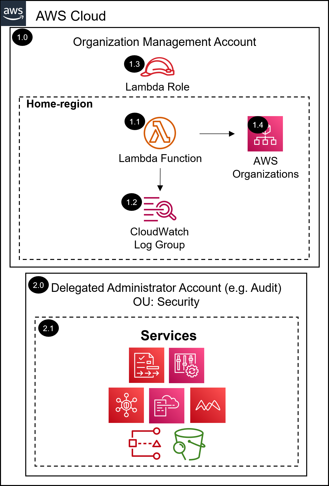

# AWS SRA register delegated admin solution with Terraform<!-- omit in toc -->
<!-- markdownlint-disable MD033 -->

Copyright Amazon.com, Inc. or its affiliates. All Rights Reserved. SPDX-License-Identifier: CC-BY-SA-4.0

---

⚠️**Influence the future of the AWS Security Reference Architecture (AWS SRA) code library by taking a [short survey](https://amazonmr.au1.qualtrics.com/jfe/form/SV_9oFz0p67iCw3obk).**

## <!-- omit in toc -->

## Table of Contents<!-- omit in toc -->

- [Introduction](#introduction)
- [Deployed Resource Details](#deployed-resource-details)
- [Implementation Instructions](#implementation-instructions)
- [Requirements](#requirements)
- [Providers](#providers)
- [Modules](#modules)
- [Resources](#resources)
- [Inputs](#inputs)
- [Outputs](#outputs)

---

## Introduction

This Terraform module deploys the register delegated administrator AWS SRA solution.  

The common pre-requisite solution must be installed, in the management account, prior to installing this solution.

Information on the resources deployed as well as terraform requirements, providers, modules, resources, and inputs of this module are documented below.

Please navigate to the [installing the AWS SRA Solutions](./../../README.md#installing-the-aws-sra-solutions) section of the documentation for more information and installation instructions.

*For the CloudFormation version of this AWS SRA solution as well as more information please navigate to the [AWS SRA cloudtrail solution documentation](./../../../solutions/common/common_register_delegated_administrator/README.md) page.*

---

## Deployed Resource Details

### 1.0 Organization Management Account<!-- omit in toc -->

#### 1.2 AWS Lambda Function<!-- omit in toc -->

- See [1.2 AWS Lambda Function](#./../../../solutions/common/common_register_delegated_administrator/README.md12-aws-lambda-function)

#### 1.3 Lambda CloudWatch Log Group<!-- omit in toc -->

- See [1.3 Lambda CloudWatch Log Group](#./../../../solutions/common/common_register_delegated_administrator/README.md13-lambda-cloudwatch-log-group)

#### 1.4 Lambda Execution IAM Role<!-- omit in toc -->

- See [1.4 Lambda Execution IAM Role](#./../../../solutions/common/common_register_delegated_administrator/README.md14-lambda-execution-iam-role)

#### 1.5 AWS Organizations<!-- omit in toc -->

- See [1.5 AWS Organizations](#./../../../solutions/common/common_register_delegated_administrator/README.md15-aws-organizations)

---

### 2.0 Delegated Administrator Account (Audit)<!-- omit in toc -->

#### 2.1 Services Supported<!-- omit in toc -->

- See [2.1 Services Supported](#./../../../solutions/common/common_register_delegated_administrator/README.md21-services-supported)

---

## Implementation Instructions

Please navigate to the [installing the AWS SRA Solutions](./../../README.md#installing-the-aws-sra-solutions) section of the documentation for installation instructions.

---
<!-- BEGIN_TF_DOCS -->
## Requirements

| Name | Version |
|------|---------|
|  [aws](#requirement\_aws) | >= 5.1.0 |

## Providers

| Name | Version |
|------|---------|
|  [aws](#provider\_aws) | >= 5.1.0 |

## Modules

| Name | Source | Version |
|------|--------|---------|
|  [register\_delegated\_admin](#module\_register\_delegated\_admin) | ./register_admin | n/a |

## Resources

| Name | Type |
|------|------|
| [aws_caller_identity.current](https://registry.terraform.io/providers/hashicorp/aws/latest/docs/data-sources/caller_identity) | data source |
| [aws_partition.current](https://registry.terraform.io/providers/hashicorp/aws/latest/docs/data-sources/partition) | data source |
| [aws_region.current](https://registry.terraform.io/providers/hashicorp/aws/latest/docs/data-sources/region) | data source |

## Inputs

| Name | Description | Type | Default | Required |
|------|-------------|------|---------|:--------:|
|  [delegated\_admin\_account\_id](#input\_delegated\_admin\_account\_id) | Delegated Admin Account ID | `string` | n/a | yes |
|  [register\_delegated\_admin\_lambda\_function\_name](#input\_register\_delegated\_admin\_lambda\_function\_name) | Register Delegated Admin - Lambda Function Name | `string` | `"sra-common-register-delegated-admin"` | no |
|  [register\_delegated\_admin\_lambda\_role\_name](#input\_register\_delegated\_admin\_lambda\_role\_name) | Register Delegated Admin - Lambda Role Name | `string` | `"sra-common-register-delegated-admin-lambda"` | no |
|  [service\_principal\_list](#input\_service\_principal\_list) | Comma delimited list of AWS service principals to delegate an administrator account | `list(string)` | <pre>[   "access-analyzer.amazonaws.com",   "config-multiaccountsetup.amazonaws.com",   "config.amazonaws.com" ]</pre> | no |

## Outputs

No outputs.
<!-- END_TF_DOCS -->