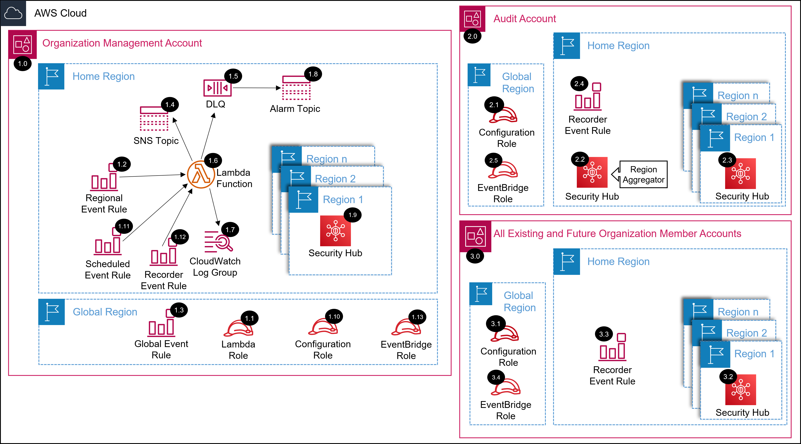

# AWS SRA Security Hub Organization Solution with Terraform<!-- omit in toc -->
<!-- markdownlint-disable MD033 -->

Copyright Amazon.com, Inc. or its affiliates. All Rights Reserved. SPDX-License-Identifier: CC-BY-SA-4.0

---

⚠️**Influence the future of the AWS Security Reference Architecture (AWS SRA) code library by taking a [short survey](https://amazonmr.au1.qualtrics.com/jfe/form/SV_9oFz0p67iCw3obk).**

## <!-- omit in toc -->

## Table of Contents<!-- omit in toc -->

- [Introduction](#introduction)
- [Deployed Resource Details](#deployed-resource-details)
- [Implementation Instructions](#implementation-instructions)
- [Requirements](#requirements)
- [Providers](#providers)
- [Modules](#modules)
- [Resources](#resources)
- [Inputs](#inputs)
- [Outputs](#outputs)

---

## Introduction

This Terraform module deploys Security Hub Organization AWS SRA solution.  

The common pre-requisite solution must be installed, in the management account, prior to installing this solution.

Information on the resources deployed as well as terraform requirements, providers, modules, resources, and inputs of this module are documented below.

Please navigate to the [installing the AWS SRA Solutions](./../../terraform##installing-the-aws-sra-solutions) section of the documentation for more information and installation instructions.

*For the CloudFormation version of this AWS SRA solution as well as more information please navigate to the [AWS SRA Security Hub solution documentation](./../../../solutions/securityhub/securityhub_org/README.md) page.*

---

## Deployed Resource Details

### 1.0 Organization Management Account<!-- omit in toc -->

#### 1.1 Lambda IAM Role<!-- omit in toc -->

- See [1.2 Lambda IAM Role](./../../../solutions/securityhub/securityhub_org/README.md#12-lambda-iam-role).

#### 1.2 Regional Event Rule<!-- omit in toc -->

- See [1.3 Regional Event Rule](./../../../solutions/securityhub/securityhub_org/README.md#13-regional-event-rule)

#### 1.3 Global Event Rules<!-- omit in toc -->

- See [1.4 Global Event Rules](./../../../solutions/securityhub/securityhub_org/README.md#14-global-event-rules)

#### 1.4 SNS Topic<!-- omit in toc -->

- See [1.5 SNS Topic](./../../../solutions/securityhub/securityhub_org/README.md#15-sns-topic)

#### 1.5 Dead Letter Queue (DLQ)<!-- omit in toc -->

- See [1.6 Dead Letter Queue (DLQ)](./../../../solutions/securityhub/securityhub_org/README.md#16-dead-letter-queue-dlq)

#### 1.6 AWS Lambda Function<!-- omit in toc -->

- See [1.7 AWS Lambda Function](./../../../solutions/securityhub/securityhub_org/README.md#17-aws-lambda-function)

#### 1.7 Lambda CloudWatch Log Group<!-- omit in toc -->

- See [1.8 Lambda CloudWatch Log Group](./../../../solutions/securityhub/securityhub_org/README.md#18-lambda-cloudwatch-log-group)

#### 1.8 Alarm SNS Topic<!-- omit in toc -->

- See [1.9 Alarm SNS Topic](./../../../solutions/securityhub/securityhub_org/README.md#19-alarm-sns-topic)

#### 1.9 Security Hub<!-- omit in toc -->

- See [1.10 Security Hub](./../../../solutions/securityhub/securityhub_org/README.md#110-security-hub)

#### 1.10 Configuration IAM Role<!-- omit in toc -->

- See [1.11 Configuration IAM Role](./../../../solutions/securityhub/securityhub_org/README.md#111-configuration-iam-role)

#### 1.11 Scheduled Event Rule<!-- omit in toc -->

- See [1.12 Regional Event Rule](./../../../solutions/securityhub/securityhub_org/README.md#112-regional-event-rule)

#### 1.12 Config Recorder Start Event Rule<!-- omit in toc -->

- See [1.13 Config Recorder Start Event Rule](./../../../solutions/securityhub/securityhub_org/README.md#113-config-recorder-start-event-rule)

#### 1.13 EventBridge IAM Role<!-- omit in toc -->

- See [1.14 EventBridge IAM Role](./../../../solutions/securityhub/securityhub_org/README.md#114-eventbridge-iam-role)

---

### 2.0 Audit (Security Tooling) Account<!-- omit in toc -->

#### 2.1 Configuration IAM Role<!-- omit in toc -->

- See [2.2 Configuration IAM Role](./../../../solutions/securityhub/securityhub_org/README.md#22-configuration-iam-role)

#### 2.2 Security Hub (Home Region)<!-- omit in toc -->

- See [2.3 Security Hub (Home Region)](./../../../solutions/securityhub/securityhub_org/README.md#23-security-hub-home-region)

#### 2.3 Security Hub (Regions)<!-- omit in toc -->

- See [2.4 Security Hub (Regions)](./../../../solutions/securityhub/securityhub_org/README.md#24-security-hub-regions)

#### 2.4 Config Recorder Start Event Rule<!-- omit in toc -->

- See [2.5 Config Recorder Start Event Rule](./../../../solutions/securityhub/securityhub_org/README.md#25-config-recorder-start-event-rule)

#### 2.5 EventBridge IAM Role<!-- omit in toc -->

- See [2.6 EventBridge IAM Role](./../../../solutions/securityhub/securityhub_org/README.md#26-eventbridge-iam-role)

---

### 3.0 All Existing and Future Organization Member Accounts<!-- omit in toc -->

#### 3.1 Configuration IAM Role<!-- omit in toc -->

- See [3.2 Configuration IAM Role](./../../../solutions/securityhub/securityhub_org/README.md#32-configuration-iam-role)

#### 3.2 Security Hub<!-- omit in toc -->

- See [3.3 Security Hub](./../../../solutions/securityhub/securityhub_org/README.md#33-security-hub)

#### 3.3 Config Recorder Start Event Rule<!-- omit in toc -->

- See [3.4 Config Recorder Start Event Rule](./../../../solutions/securityhub/securityhub_org/README.md#34-config-recorder-start-event-rule)

#### 3.4 EventBridge IAM Role<!-- omit in toc -->

- See [3.5 EventBridge IAM Role](./../../../solutions/securityhub/securityhub_org/README.md#35-eventbridge-iam-role)

---

## Implementation Instructions

Please navigate to the [installing the AWS SRA Solutions](./../../terraform##installing-the-aws-sra-solutions) section of the documentation for installation instructions.

---
<!-- BEGIN_TF_DOCS -->
## Requirements

| Name | Version |
|------|---------|
|  [aws](#requirement\_aws) | >= 5.1.0 |

## Providers

| Name | Version |
|------|---------|
|  [aws.main](#provider\_aws.main) | >= 5.1.0 |

## Modules

| Name | Source | Version |
|------|--------|---------|
|  [recorder\_start\_event](#module\_recorder\_start\_event) | ./recorder_start_event | n/a |
|  [security\_hub](#module\_security\_hub) | ./configuration | n/a |
|  [securityhub\_configuration\_role](#module\_securityhub\_configuration\_role) | ./configuration_role | n/a |

## Resources

| Name | Type |
|------|------|
| [aws_caller_identity.current](https://registry.terraform.io/providers/hashicorp/aws/latest/docs/data-sources/caller_identity) | data source |
| [aws_partition.current](https://registry.terraform.io/providers/hashicorp/aws/latest/docs/data-sources/partition) | data source |
| [aws_region.current](https://registry.terraform.io/providers/hashicorp/aws/latest/docs/data-sources/region) | data source |

## Inputs

| Name | Description | Type | Default | Required |
|------|-------------|------|---------|:--------:|
|  [audit\_account\_id](#input\_audit\_account\_id) | AWS Account ID of the Control Tower Audit account. | `string` | n/a | yes |
|  [cis\_standard\_version](#input\_cis\_standard\_version) | CIS Standard Version | `string` | `"1.4.0"` | no |
|  [compliance\_frequency](#input\_compliance\_frequency) | Frequency to Check for Organizational Compliance (in days between 1 and 30, default is 7) | `number` | `7` | no |
|  [control\_tower\_lifecycle\_rule\_name](#input\_control\_tower\_lifecycle\_rule\_name) | The name of the AWS Control Tower Life Cycle Rule | `string` | `"sra-securityhub-org-trigger"` | no |
|  [create\_lambda\_log\_group](#input\_create\_lambda\_log\_group) | Indicates whether a CloudWatch Log Group should be explicitly created for the Lambda function | `bool` | `false` | no |
|  [delegated\_admin\_account\_id](#input\_delegated\_admin\_account\_id) | Delegated administrator account ID | `string` | n/a | yes |
|  [disable\_security\_hub](#input\_disable\_security\_hub) | Update to 'true' to disable Security Hub in all accounts and regions before deleting the stack | `bool` | `false` | no |
|  [enable\_cis\_standard](#input\_enable\_cis\_standard) | Indicates whether to enable the CIS AWS Foundations Benchmark Standard | `bool` | `false` | no |
|  [enable\_nist\_standard](#input\_enable\_nist\_standard) | Indicates whether to enable the National Institute of Standards and Technology (NIST) SP 800-53 Rev. 5 | `bool` | `false` | no |
|  [enable\_pci\_standard](#input\_enable\_pci\_standard) | Indicates whether to enable the Payment Card Industry Data Security Standard (PCI DSS) | `bool` | `false` | no |
|  [enable\_security\_best\_practices\_standard](#input\_enable\_security\_best\_practices\_standard) | Indicates whether to enable the AWS Foundational Security Best Practices Standard | `bool` | `true` | no |
|  [enabled\_regions](#input\_enabled\_regions) | (Optional) Enabled regions (AWS regions, separated by commas). Leave blank to enable all regions. | `string` | n/a | yes |
|  [event\_rule\_role\_name](#input\_event\_rule\_role\_name) | Event rule role name for putting events on the home region event bus | `string` | `"sra-security-hub-global-events"` | no |
|  [home\_region](#input\_home\_region) | Name of the Control Tower home region | `string` | n/a | yes |
|  [lambda\_log\_group\_kms\_key](#input\_lambda\_log\_group\_kms\_key) | (Optional) KMS Key ARN to use for encrypting the Lambda logs data | `string` | `""` | no |
|  [lambda\_log\_group\_retention](#input\_lambda\_log\_group\_retention) | Specifies the number of days you want to retain log events | `number` | `14` | no |
|  [lambda\_log\_level](#input\_lambda\_log\_level) | Lambda Function Logging Level | `string` | `"INFO"` | no |
|  [log\_archive\_account\_id](#input\_log\_archive\_account\_id) | AWS Account ID of the Control Tower Log Archive account. | `string` | n/a | yes |
|  [management\_account\_id](#input\_management\_account\_id) | Organization Management Account ID | `string` | n/a | yes |
|  [nist\_standard\_version](#input\_nist\_standard\_version) | NIST Standard Version | `string` | `"5.0.0"` | no |
|  [organization\_id](#input\_organization\_id) | AWS Organizations ID | `string` | n/a | yes |
|  [pci\_standard\_version](#input\_pci\_standard\_version) | PCI Standard Version | `string` | `"3.2.1"` | no |
|  [region\_linking\_mode](#input\_region\_linking\_mode) | Indicates whether to aggregate findings from all of the available Regions in the current partition | `string` | `"SPECIFIED_REGIONS"` | no |
|  [sechub\_rule\_name](#input\_sechub\_rule\_name) | Eventbridge rule name | `string` | `"sra-config-recorder"` | no |
|  [security\_best\_practices\_standard\_version](#input\_security\_best\_practices\_standard\_version) | SBP Standard Version | `string` | `"1.0.0"` | no |
|  [security\_hub\_configuration\_role\_name](#input\_security\_hub\_configuration\_role\_name) | SecurityHub Configuration role to assume in the delegated administrator account | `string` | `"sra-securityhub-configuration"` | no |
|  [security\_hub\_org\_lambda\_function\_name](#input\_security\_hub\_org\_lambda\_function\_name) | Lambda function name | `string` | `"sra-securityhub-org"` | no |
|  [security\_hub\_org\_lambda\_role\_name](#input\_security\_hub\_org\_lambda\_role\_name) | SecurityHub configuration Lambda role name | `string` | `"sra-securityhub-org-lambda"` | no |
|  [securityhub\_control\_tower\_regions\_only](#input\_securityhub\_control\_tower\_regions\_only) | Only enable in the Control Tower governed regions | `bool` | `true` | no |
|  [sra\_alarm\_email](#input\_sra\_alarm\_email) | (Optional) Email address for receiving DLQ alarms | `string` | `""` | no |
|  [sra\_solution\_name](#input\_sra\_solution\_name) | The SRA solution name. The default value is the folder name of the solution. | `string` | `"sra-securityhub-org"` | no |

## Outputs

No outputs.
<!-- END_TF_DOCS -->
---

