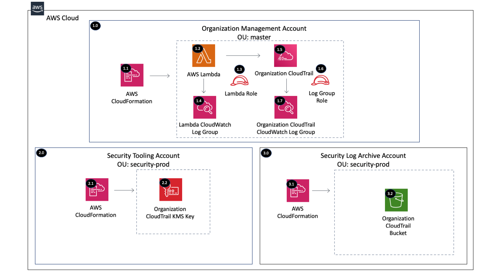

Copyright Amazon.com, Inc. or its affiliates. All Rights Reserved. SPDX-License-Identifier: CC-BY-SA-4.0

# Organization CloudTrail

The Organization CloudTrail solution will create an Organization CloudTrail within the Organization Management Account 
that is encrypted with a Customer Managed Key (CMK) managed in the Security Account and logs delivered to the Log 
Archive Account. An Organization CloudTrail logs all events for all AWS accounts in the AWS Organization. 

When you create an organization trail, a trail with the name that you give it will be created in every AWS account 
that belongs to your organization. Users with CloudTrail permissions in member accounts will be able to see this trail 
when they log into the AWS CloudTrail console from their AWS accounts, or when they run AWS CLI commands such as 
describe-trail. However, users in member accounts will not have sufficient permissions to delete the organization 
trail, turn logging on or off, change what types of events are logged, or otherwise alter the organization trail 
in any way. 

#### Resources Deployed:
- **Organization CloudTrail** (Primary Account)
   - Data events enabled for all S3 buckets (Optional)
   - Data events enabled for all Lambda functions (Optional)
   - Encrypt log files with SSE-KMS CMK
   - Enable log file validation = Yes
   - CloudWatch Logs configured  
- **Customer Managed Key** (Security Account)
   - Key policy restricting access
- **S3 Bucket for CloudTrail Logs** (Log Archive Account)
   - Block all public access enabled
   - Versioning enabled
   - Default encryption enabled
   - S3 bucket policy restricting access

----

# Table of Contents
* [Deployed Resource Details](#deployed-resource-details)
* [Implementation Instructions](#implementation-instructions)
* [References](#references)

----

# Deployed Resource Details



## 1.0 Organization Management Account

### 1.1 AWS CloudFormation

**Description:**

All resources are deployed via CloudFormation StackSet and Stack

**Configuration:**

* StackSet Names:
    * CloudTrailOrgKMSKey
    * CloudTrailOrgS3Bucket
    * CloudTrailOrgConfig

### 1.2 AWS Lambda Function

**Description:**

The custom CloudFormation Lambda resource Organization CloudTrail configuration currently not supported by 
CloudFormation

**Configuration:**

* Lambda Function Name = cloudtrail-org-config
* Environment Variables:
    * LOG_LEVEL - Default = info, Valid Values = debug, info, warning, error, critical
* Custom Resource Properties:
    * AWS_PARTITION - AWS ARN partition (aws, aws-cn, aws-us-gov)
    * CLOUDTRAIL_NAME - cloudtrail-org
    * CLOUDWATCH_LOG_GROUP_ARN - Provided by CloudFormation after creating the resource
    * CLOUDWATCH_LOG_GROUP_ROLE_ARN - Provided by CloudFormation after creating the resource
    * KMS_KEY_ID - KMS Key ID ARN provided by CloudFormation from SSM parameter
    * ENABLE_DATA_EVENTS_ONLY - Enables just the data events and not the management API events
    * ENABLE_LAMBDA_DATA_EVENTS - Enables Lambda data events    
    * ENABLE_S3_DATA_EVENTS - Enables S3 data events for all buckets
    * S3_BUCKET_NAME - Bucket to send logs to
    * S3_KEY_PREFIX - Example: CloudTrail
    * TAG_KEY1 - Tags the CloudTrail with this key
    * TAG_VALUE1 - Tags the CloudTrail with this value
    
**Input Validation**

Validation of environment variables is done to make sure values exist and are the correct type
 

### 1.3 Lambda Execution IAM Role

**Description:**

Used by the custom CloudFormation Lambda function to create the Organization CloudTrail

**Configuration:**

* Role Name: cloudtrail-org-config-lambda
* Policy Name: cloudtrail-org-lambda
* Permissions:
    * CloudTrail - Full: Tagging, Limited: Read, Write on TrailName like prefix
    * CloudWatch Logs - Limited Write on LogGroupName like /aws/lambda/[Lambda Function Name]
    * IAM - Limited Read, Write on AWSServiceRoleForCloudTrail*
    * Organizations - Full: List, Read

### 1.4 Lambda CloudWatch Log Group

**Description:**

Contains Lambda function execution logs

**Configuration:**

* Retention = 2 weeks (14 days)
* Log group name = /aws/lambda/[Lambda Function Name]
* DeletionPolicy = Retain

### 1.5 Organization CloudTrail

**Description:**

CloudTrail for all AWS Organization accounts

**Configuration:**

* Data events only (Optional) Default = false
* Data events enabled for all S3 buckets (Optional) Default = true
* Data events enabled for all Lambda functions (Optional) Default = true
* CloudWatch Logs configured (Optional) Default = true
* Encrypt log files with SSE-KMS CMK
* Enable log file validation = Yes

### 1.6 Organization CloudTrail CloudWatch Log Group Role

**Description:**

Role used to send logs to CloudWatch

**Configuration**

* Role Name: [Resource Prefix]-[CloudTrail Name]-cloudwatch-logs
* Policy Name: [Resource Prefix]-[CloudTrail Name]-cloudwatch-logs
* Permissions
    * CloudWatch Logs - Limited:Write to the Organization CloudTrail Log Group “CloudTrail/[CloudTrail Name]”

### 1.7 Organization CloudTrail CloudWatch Log Group

**Description:**

Contains CloudTrail logs

**Configuration:**

* Retention = 2 weeks (14 days)
* Log group name = CloudTrail/[CloudTrail Name]

----

## 2.0 Security Tooling Account

### 2.1 AWS CloudFormation

**Description:**

All resources are deployed via CloudFormation Stack created by the Management account StackSet

**Configuration:**

* Stack Name: ...-CloudTrailOrgKMSKey-...

### 2.2 Organization CloudTrail KMS Key

**Description:**

Customer managed KMS key for AWS Organizations CloudTrail logs

**Configuration:**

* Alias: OrganizationCloudTrailKMSKey
* Permissions
    * Security account (DescribeKey, Decrypt, GenerateDataKey, GenerateDataKeyWithoutPlaintext)
    * Management and Logging Accounts (DescribeKey, Encrypt, Decrypt, ReEncrypt*, GenerateDataKey, 
        GenerateDataKeyWithoutPlaintext)
    * CloudTrail Service (DescribeKey, GenerateDataKey, Decrypt, ReEncryptFrom)

----

## 3.0 Security Log Archive Account

### 3.1 AWS CloudFormation

**Description:**

All resources are deployed via CloudFormation Stack created by the Management account StackSet

**Configuration:**

* Stack Name: ...-CloudTrailOrgS3Bucket-...

### 3.2 Organization CloudTrail S3 Bucket

**Description:**

S3 bucket where the CloudTrail logs are sent for all the AWS Organizations accounts

**Configuration:**

* S3 Bucket Name: [Bucket Name Prefix]-[ACCOUNT ID]-[REGION]
* Block public access settings set to true
* Versioning Enabled
* Default encryption Enabled
* Ownership controls - Object Ownership = BucketOwnerPreferred
* S3 Bucket Policy Statements
    * DenyPutObject - Only allows CloudTrail to put objects
    * SecureTransport - Requires logs sent over secure transport
    * AWSBucketPermissionsCheck - Allows CloudTrail to check the bucket permissions
    * AWSBucketDelivery - Allows CloudTrail to PutObject and PutObjectACL with bucket owner full control
    * DenyUnecryptedObjects - Requires PutObject to use KMS server side encryption (Add after initial create)
    * DenyWrongKMSKey - Only allows the Organization CloudTrail KMS Key for PutObject (Add after initial create)
    

----

# Implementation Instructions

### [AWS Control Tower](./aws-control-tower)
### [AWS Landing Zone](./aws-landing-zone)
### CloudFormation StackSets
> **Solution Deployment Order:**
> 1. security (CloudTrailOrgKMSKey)
> 2. log-archive (CloudTrailOrgS3Bucket)
> 3. management (CloudTrailOrgConfig)

1. Create new or use an existing S3 bucket within the region owned by the Organization Management Account
   * Example bucket name: lambda-zips-[Management Account ID]-[AWS Region]
   * [Example CloudFormation Template](../../../extras/lambda-s3-buckets.yaml)
   * The bucket must allow the s3:GetObject action to the Organization using a bucket policy like the one below to 
        allow the accounts within the Organization to get the Lambda files.
    ```
    {
        "Version": "2012-10-17",
        "Statement": [
            {
                "Sid": "AllowGetObject",
                "Effect": "Allow",
                "Principal": "*",
                "Action": "s3:GetObject",
                "Resource": "arn:[AWS::Partition]:s3:::[BUCKET NAME]/*",
                "Condition": {
                    "StringEquals": {
                        "aws:PrincipalOrgID": "[ORGANIZATION ID]"
                    }
                }
            }
        ]
    }
    ```
2. Package the Lambda code into a zip file and upload it to the Lambda source S3 bucket
   * Package and Upload the Lambda zip file to S3 - [Packaging script](../../../extras/packaging-scripts/package-lambda.sh)
3. Create CloudFormation StackSets using the following templates

    |     Account     | StackSet Name |  Template  |
    | --------------- | ------------- | ---------- |
    | Security | CloudTrailOrgKMSKey | templates/cloudtrail-org-kms.yaml |
    | Log Archive | CloudTrailOrgS3Bucket | templates/cloudtrail-org-bucket.yaml |
    | Management | CloudTrailOrg | templates/cloudtrail-org.yaml |

4. If replacing an existing Organization Trail with this solution:
   * Update any metric filters and any other resources that reference the CloudWatch Log Group
   * If a CloudWatch Log Group Subscription is used for forwarding the logs, remove the Subscription from the old 
        group and add it to the new group

----

# References
* [Creating a CloudTrail for the Organization](https://docs.aws.amazon.com/awscloudtrail/latest/userguide/creating-trail-organization.html)
* [Allowing Cross-Account Access to a CMK](https://docs.aws.amazon.com/kms/latest/developerguide/key-policy-modifying-external-accounts.html)