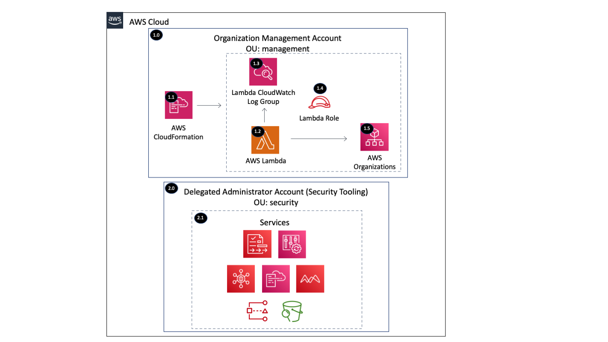

Copyright Amazon.com, Inc. or its affiliates. All Rights Reserved. SPDX-License-Identifier: CC-BY-SA-4.0

# Register Delegated Administrator Account

The register delegated administrator account solution is a common solution to register a delegated administrator 
account (e.g. Security Tooling Account) within the AWS Organizations management account using the AWS Organizations 
APIs.

----

# Table of Contents
* [Deployed Resource Details](#deployed-resource-details)
* [Implementation Instructions](#implementation-instructions)
* [References](#references)

----

# Deployed Resource Details



## 1.0 Organization Management Account

### 1.1 AWS CloudFormation

**Description:**

All resources are deployed via CloudFormation StackSet and Stacks within member accounts

**Configuration:**

* StackSet Names:
    * RegisterDelegatedAdmin

### 1.2 AWS Lambda Function

**Description:**

The custom CloudFormation Lambda resource is required to delegate an administrator account because this capability 
is not supported by CloudFormation.

**Configuration:**

* Lambda Function Name = [Prefix]-register-delegated-admin
* Environment Variables and Properties (Configurable and set via CloudFormation)
    * AWS_SERVICE_PRINCIPAL_LIST - AWS service principals to delegate administration for
    * DELEGATED_ADMIN_ACCOUNT_ID - Organization Member Account ID, e.g. Security Tooling Account
    * LOG_LEVEL - Default = info, Valid Values = debug, info, warning, error, critical
    
**Input Validation**

Validation of environment variables and properties is done to make sure values exist and are the correct type

### 1.3 Lambda CloudWatch Log Group

**Description:**

Contains Lambda function execution logs

**Configuration:**

* Log group name = /aws/lambda/[Lambda Function]

### 1.4 Lambda Execution IAM Role

**Description:**

Used by the custom CloudFormation Lambda function to enable AWS service access for the provided service and register 
an AWS account as the delegated administrator.

**Configuration:**

* Role Name: [Prefix]-register-delegated-admin-lambda
* Policy Name: [Prefix]-register-delegated-admin-lambda
* Permissions:
    * CloudWatch Logs - Limited: Write on LogGroupName like /aws/lambda/[Lambda Function]
    * Organizations - Limited: List, Read, Write

### 1.5 AWS Organizations

**Description:**

AWS Organizations APIs are used to delegate the administrator account

**Configuration:**

* Delegated Admin Account ID
* Service Principal


----

## 2.0 Delegated Administrator Account (Security Tooling)

### 2.1 Services Supported

**Description:**

The services that support a delegated administrator account can be configured and managed within this account.  

**Configuration:**

* Service Principal Mapping

|          Service             |          Service Principal             |
| ---------------------------- | -------------------------------------- |
| AWS IAM Access Analyzer      | access-analyzer.amazonaws.com          |
| AWS Audit Manager            | auditmanager.amazonaws.com             |
| AWS CloudFormation StackSets | stacksets.cloudformation.amazonaws.com |
| AWS Config                   | config.amazonaws.com                   | 
| AWS Config Conformance Packs | config-multiaccountsetup.amazonaws.com |
| Amazon Macie                 | macie.amazonaws.com                    |
| AWS Security Hub             | securityhub.amazonaws.com              |
| Amazon S3 Storage Lens       | storage-lens.s3.amazonaws.com          |


----

# Implementation Instructions

### [AWS Control Tower](./aws-control-tower)
### CloudFormation StackSets

1. Create new or use an existing S3 bucket within the deployment region owned by the Organization Management Account
   * Example bucket name: lambda-zips-[Management Account ID]-[AWS region]
   * [Example CloudFormation Template](../../../extras/lambda-s3-buckets.yaml)
   * Each bucket must allow the s3:GetObject action to the AWS Organization using a bucket policy like the one below 
        to allow the accounts within the Organization to get the Lambda files.
2. Package the Lambda code into a zip file and upload it to the S3 bucket
   * Package and Upload the Lambda zip file to S3 - [Packaging script](../../../extras/packaging-scripts/package-lambda.sh)
   ```shell
    export BUCKET=lambda-zips-CHANGE_ME_ACCOUNT_ID-CHANGE_ME_REGION
    sh ~/aws-security-reference-architecture-examples/extras/packaging-scripts/package-lambda.sh \
    --file_name common-register-delegated-administrator.zip \
    --bucket $BUCKET \
    --src_dir ~/aws-security-reference-architecture-examples/solutions/common/register-delegated-admninistrator/code/src
   ```
3. Create a CloudFormation StackSet or Stack with the following template
   
   |     Account     |   StackSet Name   |  Template  |
   | --------------- | ----------------- | ---------- |
   | Management | RegisterDelegatedAdmin | templates/register-delegated-admin.yaml |
4. Verify configuration using the following AWS CLI shell script
   ```shell
    for accountId in $(aws organizations list-delegated-administrators --query 'DelegatedAdministrators[*].Id' \
    --output text); do echo -e "$accountId\n Service Principals: " \
    $(aws organizations list-delegated-services-for-account --account-id $accountId \
    --query 'DelegatedServices[*].ServicePrincipal'); done
   ```

----

# References

* [AWS services that you can use with AWS Organizations](https://docs.aws.amazon.com/organizations/latest/userguide/orgs_integrate_services_list.html)