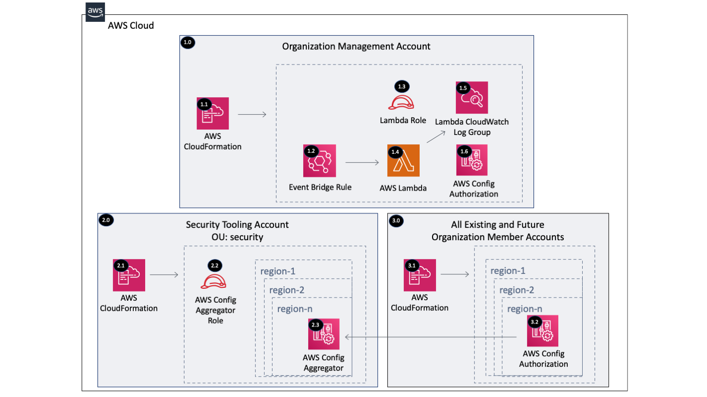

Copyright Amazon.com, Inc. or its affiliates. All Rights Reserved. SPDX-License-Identifier: CC-BY-SA-4.0

# AWS Config Aggregator Account

The AWS Config Aggregator Account solution enables an AWS Config Aggregator in a specified account and creates 
authorizations within each member account.

An aggregator is an AWS Config resource type that collects AWS Config configuration and compliance data 
from the following:
* Multiple accounts and multiple regions.
* Single account and multiple regions.
* An organization in AWS Organizations and all the accounts in that organization.

You can use an aggregator to view the resource configuration and compliance data recorded in AWS Config. 

----

# Table of Contents
* [Deployed Resource Details](#deployed-resource-details)
* [Implementation Instructions](#implementation-instructions)
* [References](#references)

----

# Deployed Resource Details



## 1.0 Organization Management Account

### 1.1 AWS CloudFormation

**Description:**

All resources are deployed via a CloudFormation StackSet and a Stack Instance within the management and each member
 account

**Configuration:**

* StackSet Names:
    * AWSConfigAggregatorLambda
    * AWSConfigAggregatorRole
    * AWSConfigAggregatorAuthorization

### 1.2 EventBridge Scheduled Rule

**Description:**

The scheduled rule triggers the Lambda Function every day to check if a new account has been added to the AWS
 Organization

**Configuration:**

* pEventRuleName: Name of the scheduled event rule

### 1.3 Lambda Execution IAM Role

**Description:**

Used by the Lambda function to query active AWS Organization accounts and add them to the AWS Config Aggregator
 within the specified account

**Configuration:**

* Role and Policy Name: [Prefix]-aggregator-acct-lambda
* Permissions:
    * CloudWatch Logs - Limited: Write on LogGroupName like /aws/lambda/[Lambda Function Name]
    * Organizations - Limited: List, Read
    * STS - Limited: Write RoleName like [Prefix]-aggregator-acct


### 1.4 AWS Lambda Function

**Description:**

The Lambda Function queries for all active AWS Organizations accounts and adds them to the AWS Config Aggregator

**Configuration:**

* Lambda Function Name = [Prefix]-aggregator-acct
* Environment Variables (Configurable and set via CloudFormation)
    * LOG_LEVEL = Valid values (info, warning, error, critical)
    * ASSUME_ROLE_NAME = Role to assume in the AWS Config Aggregator Account to update the active accounts
    * AWS_CONFIG_MANAGEMENT_ACCOUNT_ID = AWS Config Aggregator Account (e.g. Security Tooling Account)
    * AWS_CONFIG_AGGREGATOR_NAME = [Prefix]ConfigAggregator
    * AWS_PARTITION = Valid values (aws, aws-cn, aws-us-gov)
    
**Input Validation**

Validation of environment variables is done to make sure values exist and are the correct type

### 1.5 Lambda CloudWatch Log Group

**Description:**

The CloudWatch Log Group containing the Lambda function execution logs

**Configuration:**

* Retention = Default 2 weeks (14 days)
* Log group name = /aws/lambda/[Lambda Function Name]

### 1.6 AWS Config Authorization

**Description:**

Authorizes the AWS Config Aggregator account to collect AWS Config configuration and compliance data

**Configuration:**

* AWS Config Aggregator Name = [Prefix]ConfigAggregator
* AWS Config Aggregator Account ID = The Security Tooling Account ID
* AWS Config Aggregator Region = The aggregator region within the Security Tooling account

----

## 2.0 Security Tooling Account

### 2.1 AWS CloudFormation

**Description:**

Deployment of all resources is done via a CloudFormation Stack created by the Management account CloudFormation StackSet

**Configuration:**

* Stack Name = [Prefix]-AggregatorAcctRole-...

### 2.2 AWS Config Aggregator Role

**Description:**

Creates the IAM role assumed by the Management account Lambda function to update the AWS Config Aggregator with
 active accounts

**Configuration:**

* Role and Policy Name: [Prefix]-aggregator-acct
* Permissions:
    * Config - Limited: Write

### 2.3 AWS Config Aggregator

**Description:**

The AWS Config Aggregator collects AWS Config configuration and compliance data from authorized accounts and regions

**Configuration:**

* Provided by the Management account Lambda function which queries active AWS Organizations accounts and adds them to
 the Aggregator

----

## 3.0 All Existing and Future Organization Member Accounts

### 3.1 AWS CloudFormation

**Description:**

Deployment of all resources is done via CloudFormation Stack created by the Management account CloudFormation StackSet

**Configuration:**

* Stack Name = [Prefix]-AggregatorAcctAuthorization-...

### 3.2 AWS Config Authorization

**Description:**

Authorizes the AWS Config Aggregator account to collect AWS Config configuration and compliance data

**Configuration:**

* AWS Config Aggregator Name = [Prefix]ConfigAggregator
* AWS Config Aggregator Account ID = The Security Tooling Account ID

----

# Implementation Instructions

### CloudFormation StackSets

> **Solution Deployment Order:**
> 1. management account (AWSConfigAggregatorLambda) 
> 2. security account (AWSConfigAggregatorRole)
> 3. member accounts (AWSConfigAggregatorAuthorization)

#### Pre-requisites
* No existing AWS Config Aggregator
* Make sure there are no SCP statements preventing the following actions:
   * config:DeleteConfigurationAggregator
   * config:PutConfigurationAggregator
   
#### Instructions
1. Create new or use existing S3 bucket within the region owned by the Organization Management Account. The
 region needs to be the same as the AWS Config Aggregator CloudFormation Stack region. The default region in the
  manifest.yaml file is used.
   * Example bucket name: lambda-zips-[Management Account ID]-[AWS Region]
   * [Example CloudFormation Template](../../../extras/lambda-s3-buckets.yaml)
   * The bucket must allow the s3:GetObject action to the Organization using a bucket policy like the one below to
    allow the accounts within the Organization to get the Lambda files.
    ```
    {
        "Version": "2012-10-17",
        "Statement": [
            {
                "Sid": "AllowGetObject",
                "Effect": "Allow",
                "Principal": "*",
                "Action": "s3:GetObject",
                "Resource": "arn:[AWS::Partition]:s3:::[BUCKET NAME]/*",
                "Condition": {
                    "StringEquals": {
                        "aws:PrincipalOrgID": "[ORGANIZATION ID]"
                    }
                }
            }
        ]
    }
    ```
2. Package the Lambda code into a zip file and upload it to the S3 bucket
   * Package and Upload the Lambda zip file to S3 - [Packaging script](../../../extras/packaging-scripts/package-lambda.sh)
3. Copy the below folders/files to the new add-on folder excluding the lambda folder
   
    |     Account     | StackSet Name |  Template  |
    | --------------- | ------------- | ---------- |
    | Management | AWSConfigAggregatorLambda | templates/aggregator-acct-lambda.yaml |
    | Security | AWSConfigAggregatorRole | templates/aggregator-acct-role.yaml |
    | All Member Accounts | AWSConfigAggregatorAuthorization | templates/aggregator-acct-authorization.yaml |
   
4. To trigger the initial deployment before the scheduled rule, disable then enable the scheduled event rule

----

# References
* [Multi-Account Multi-Region Data Aggregation](https://docs.aws.amazon.com/config/latest/developerguide/aggregate-data.html)
