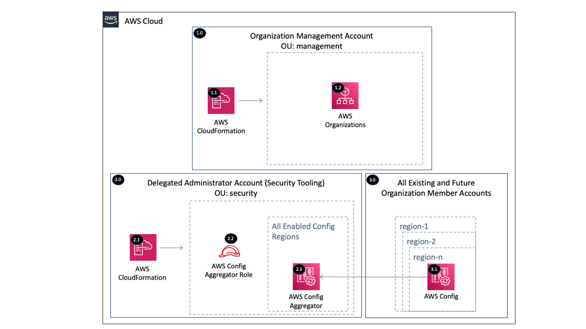

Copyright Amazon.com, Inc. or its affiliates. All Rights Reserved. SPDX-License-Identifier: CC-BY-SA-4.0

# AWS Config Aggregator

The AWS Config Aggregator Organization solution configures an AWS Config aggregator by delegating administration 
to a member account (e.g. Security Tooling) within the Organization Management account and then configuring 
AWS Config Aggregator within the delegated administrator account for all the existing and future AWS Organization 
accounts.

----

# Table of Contents
* [Deployed Resource Details](#deployed-resource-details)
* [Implementation Instructions](#implementation-instructions)
* [References](#references)

----

# Deployed Resource Details

## 1.0 Organization Management Account

### 1.1 AWS CloudFormation

**Description:**

All resources are deployed via CloudFormation StackSet and Stacks within member accounts

**Configuration:**

* StackSet Names:
    * AggregatorConfiguration

### 1.2 AWS Organizations

**Description:**

AWS Organizations is used to delegate an administrator account for AWS Config and to identify AWS accounts for 
aggregation. 

**Configuration:**

* Delegated Administrator Account - See [Common Register Delegated Administrator](../../common/register-delegated-administrator)

----

## 2.0 Delegated Administrator Account (e.g. Security Tooling)

### 2.1 AWS CloudFormation

**Description:**

All resources are deployed via CloudFormation Stack created by the Management account StackSet

**Configuration:**

* Stack Name: StackSet-...-AggregatorConfiguration-...

### 2.2 AWS Config Aggregator IAM Role

**Description:**

An IAM role is created by the solution to allow AWS Config to access AWS Organizations APIs.

**Configuration:**

* Role Name: [Prefix]-org-config-aggregator
* Permissions:
    * Organizations - Limited: List, Read All resources

### 2.3 AWS Config Aggregator

**Description:**

AWS Config Aggregator is configured for the AWS Organization and all AWS Regions.

**Configuration:**

* AllAwsRegions: True

----

## 3.0 All Existing and Future Organization Member Accounts

### 3.1 AWS Config Aggregator

**Description:**

AWS Config Aggregator within each member account has Authorizations for the Delegated Administrator Account to collect 
AWS Config compliance and configuration data.

**Configuration:**

* N/A

----

# Implementation Instructions

### [AWS Control Tower](./aws-control-tower)
### CloudFormation StackSets

#### Pre-requisites
1. Register a delegated administrator using the
 [Common Register Delegated Administrator](../../common/register-delegated-administrator) solution
   1. pServicePrincipalList = "config.amazonaws.com" 
   
#### Instructions

> **Solution Deployment Order:**
> 1. Management Account (CommonRegisterDelegatedAdmin)
> 3. Security Account (AggregatorConfiguration)

1. Create a CloudFormation StackSet using the following template
   
   |     Account     |   StackSet Name   |  Template  |
   | --------------- | ----------------- | ---------- |
   | Security | AggregatorConfiguration | templates/aggregator-org-configuration.yaml |
   
----

# References
* [Multi-Account Multi-Region Data Aggregation](https://docs.aws.amazon.com/config/latest/developerguide/aggregate-data.html)
