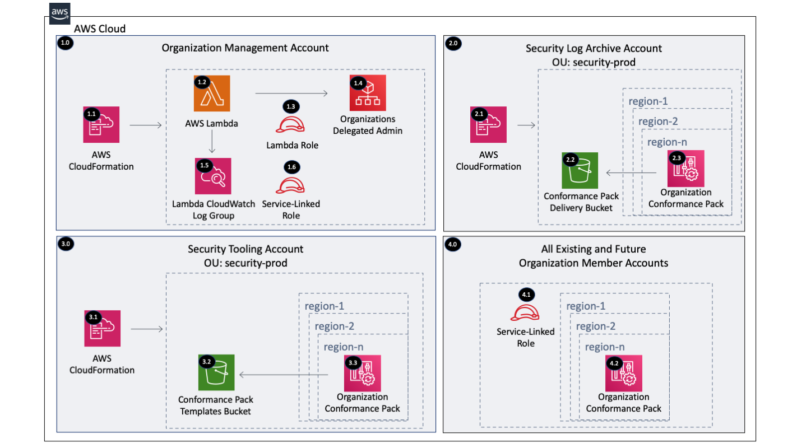

Copyright Amazon.com, Inc. or its affiliates. All Rights Reserved. SPDX-License-Identifier: CC-BY-SA-4.0

# Conformance Pack Organization Rules

The Conformance Pack Organization Rules solution deploys Organization AWS Config rules by delegating administration 
to a member account within the Organization Management account and then creating an Organization Conformance Pack 
within the delegated administrator account for all the existing and future AWS Organization accounts.

[AWS Config rules](https://docs.aws.amazon.com/config/latest/developerguide/evaluate-config.html) are used to evaluate 
the configuration settings of your AWS resources. 

There are three ways that you can create AWS Config rules: 
   1. Directly within each AWS account/region 
   2. [Conformance Packs](https://docs.aws.amazon.com/config/latest/developerguide/conformance-packs.html) within the 
        Organization Management account and region or a delegated administrator account and region
   3. [Organization Rules](https://docs.aws.amazon.com/config/latest/developerguide/config-rule-multi-account-deployment.html) 
        within the Organization Management account and region or a delegated administrator account and region 

----

# Table of Contents
* [Deployed Resource Details](#deployed-resource-details)
* [Implementation Instructions](#implementation-instructions)
* [References](#references)

----

# Deployed Resource Details



## 1.0 Organization Management Account

### 1.1 AWS CloudFormation

**Description:**

All resources are deployed via CloudFormation StackSet and Stacks within member accounts

**Configuration:**

* StackSet Names:
    * ConformancePackDelegatedAdmin
    * ConformancePackDeliveryBucket
    * ConformancePackDeployment

### 1.2 AWS Lambda Function

**Description:**

The custom CloudFormation Lambda resource is required to delegate an administrator account because this capability 
is not supported by CloudFormation (November 2020)

**Configuration:**

* Lambda Function Name = [Prefix]-config-register-delegated-admin
* Environment Variables (Configurable and set via CloudFormation)
    * AWS_SERVICE_PRINCIPAL - AWS service principal to delegate administration for
    * DELEGATED_ADMIN_ACCOUNT_ID - Organization Member Account ID which is typically the Security account
    * LOG_LEVEL - Default = info, Valid Values = debug, info, warning, error, critical
    * TAG_KEY1 - Tags the IAM role and Lambda Function with this key
    * TAG_VALUE1 - Tags the IAM role and Lambda Function with this value
    
**Input Validation**

Validation of environment variables is done to make sure values exist and are the correct type

### 1.3 Lambda Execution IAM Role

**Description:**

Used by the custom CloudFormation Lambda function to enable AWS service access for AWS Config and register an AWS 
account as the delegated administrator for AWS Config

**Configuration:**

* Role Name: [Prefix]-config-register-delegated-admin-lambda
* Policy Name: [Prefix]-config-register-delegated-admin-lambda
* Permissions:
    * CloudWatch Logs - Limited: Write on LogGroupName like /aws/lambda/[Lambda Function]
    * Organizations - Limited: List, Read, Write

### 1.4 Lambda CloudWatch Log Group

**Description:**

Contains Lambda function execution logs

**Configuration:**

* Retention = Default 2 weeks (14 days)
* Log group name = /aws/lambda/[Lambda Function]

### 1.5 Lambda CloudWatch Log Group

**Description:**

Contains Lambda function execution logs

**Configuration:**

* Retention = Default 2 weeks (14 days)
* Log group name = /aws/lambda/[Lambda Function]

### 1.6 AWS Config Service-Linked Roles

**Description:**

AWS Config creates 2 service-linked roles within each AWS account which are used to setup and send data to the 
delivery S3 bucket. 

* AWSServiceRoleForConfigMultiAccountSetup - is used for the AWS Config multi-account setup
* AWSServiceRoleForConfigConforms - is used to send data to the delivery S3 bucket


**Configuration:**

* N/A


----

## 2.0 Security Log Archive Account

### 2.1 AWS CloudFormation

**Description:**

All resources are deployed via CloudFormation Stack created by the Management account StackSet

**Configuration:**

* Stack Name: ConformancePackOrgDeliveryBucket-...

### 2.2 Conformance Pack Delivery Bucket

**Description:**

Organization Conformance Packs require a delivery S3 bucket with "awsconfigconforms" as the bucket name prefix. We 
create this bucket within the Security Log Archive account to stay consistent with where our consolidated logs 
are stored.

**Configuration:**

* Organization ID = AWS Organization ID
* Tag Key = Bucket Tag Key 
* Tag Value = Bucket Tag Value 

### 2.3 Organization Conformance Pack

**Description:**

The [AWS Control Tower Detective Guardrails Conformance Pack](https://docs.aws.amazon.com/config/latest/developerguide/aws-control-tower-detective-guardrails.html) 
is deployed to all regions from the Security Tooling Account.

An [AWS Config Conformance Pack](https://docs.aws.amazon.com/config/latest/developerguide/conformance-packs.html) 
is a collection of AWS Config rules and remediation actions that can be easily deployed as a single entity in an 
account and a Region or across an organization in AWS Organizations. 

Conformance packs are created by authoring a YAML template that contains the list of AWS Config managed or custom 
rules and remediation actions. You can deploy the template by using the AWS Config console or the AWS CLI. To quickly 
get started and to evaluate your AWS environment, use one of the sample conformance pack templates.

**Configuration:**

* N/A

----

## 4.0 All Existing and Future Organization Member Accounts

### 4.1 AWS Config Service-Linked Roles

**Description:**

AWS Config creates 2 service-linked roles within each AWS account which are used to setup and send data to the 
delivery S3 bucket. 

* AWSServiceRoleForConfigMultiAccountSetup - is used for the AWS Config multi-account setup
* AWSServiceRoleForConfigConforms - is used to send data to the delivery S3 bucket


**Configuration:**

* N/A

### 4.2 Organization Conformance Pack

**Description:**

The [AWS Control Tower Detective Guardrails Conformance Pack](https://docs.aws.amazon.com/config/latest/developerguide/aws-control-tower-detective-guardrails.html) 
is deployed to all regions from the Security Tooling Account.

An [AWS Config Conformance Pack](https://docs.aws.amazon.com/config/latest/developerguide/conformance-packs.html) 
is a collection of AWS Config rules and remediation actions that can be easily deployed as a single entity in an 
account and a Region or across an organization in AWS Organizations. 

Conformance packs are created by authoring a YAML template that contains the list of AWS Config managed or custom 
rules and remediation actions. You can deploy the template by using the AWS Config console or the AWS CLI. To quickly 
get started and to evaluate your AWS environment, use one of the sample conformance pack templates.

**Configuration:**

* N/A

----

# Implementation Instructions

### [AWS Control Tower](./aws-control-tower)
### CloudFormation StackSets

#### Pre-requisites
1. Create AWS Config Conformance Pack Templates S3 Bucket in the Security Tooling Account
   * Create an SSM parameter in the Organization Management Account (Optional)
   * [CloudFormation template](./documentation/setup/create-conformance-pack-templates-bucket.yaml) to create the S3 bucket
2. Upload [aws-control-tower-detective-guardrails.yaml](./documentation/setup/conformance-pack-templates/aws-control-tower-detective-guardrails.yaml) 
   or [Operational-Best-Practices-for-Encryption-and-Keys.yaml](./documentation/setup/conformance-pack-templates/Operational-Best-Practices-for-Encryption-and-Keys.yaml) 
   to the AWS Config Conformance Pack Templates S3 Bucket
   
#### Instructions

> **Solution Deployment Order:**
> 1. Management Account (ConformancePackDelegatedAdmin)
> 2. Log-Archive Account (ConformancePackDeliveryBucket)
> 3. Security Account (ConformancePackDeployment)

1. Create new or use an existing S3 bucket within the deployment region owned by the Organization Management Account
   * Example bucket name: lambda-zips-[Management Account ID]-[AWS region]
   * [Example CloudFormation Template](../../../extras/lambda-s3-buckets.yaml)
   * Each bucket must allow the s3:GetObject action to the AWS Organization using a bucket policy like the one below 
        to allow the accounts within the Organization to get the Lambda files.
    ```
    {
        "Version": "2012-10-17",
        "Statement": [
            {
                "Sid": "AllowGetObject",
                "Effect": "Allow",
                "Principal": "*",
                "Action": "s3:GetObject",
                "Resource": "arn:[AWS::Partition]:s3:::[BUCKET NAME]/*",
                "Condition": {
                    "StringEquals": {
                        "aws:PrincipalOrgID": "[ORGANIZATION ID]"
                    }
                }
            }
        ]
    }
    ```
2. Package the Lambda code into a zip file and upload it to the S3 bucket
   * Package and Upload the Lambda zip file to S3 - [Packaging script](../../../extras/packaging-scripts/package-lambda.sh)
3. Create CloudFormation StackSets using the following templates
   
   |     Account     |   StackSet Name   |  Template  |
   | --------------- | ----------------- | ---------- |
   | Management | ConformancePackDelegatedAdmin | templates/conformance-pack-org-register-delegated-admin.yaml |
   | Log Archive | ConformancePackDeliveryBucket | templates/conformance-pack-org-delivery-bucket.yaml |
   | Security | ConformancePackDeployment | templates/conformance-pack-org-deployment.yaml |
   
----

# References
* [Enabling AWS Config Rules Across all Accounts in Your Organization](https://docs.aws.amazon.com/config/latest/developerguide/config-rule-multi-account-deployment.html)
* [Conformance Packs](https://docs.aws.amazon.com/config/latest/developerguide/conformance-packs.html)
