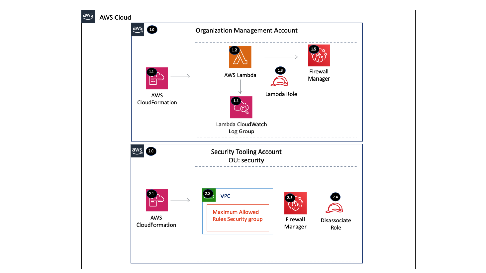

# Firewall Manager

The Organization Firewall Manager solution will delegate an administrator account (Security Account), deploy a maximum 
allowed security group, configure a security group policy, and configure multiple WAF policies.

AWS Firewall Manager simplifies your AWS WAF, AWS Shield Advanced, and Amazon VPC security groups administration and 
maintenance tasks across multiple accounts and resources. With Firewall Manager, you set up your AWS WAF firewall rules, 
Shield Advanced protections, and Amazon VPC security groups just once. Firewall Manager is particularly useful when you 
want to protect your entire organization rather than a small number of specific accounts and resources, or if you 
frequently add new resources that you want to protect. To use Firewall Manager, your account must be a member of an 
organization in the AWS Organizations service and you must enable AWS Config for each member account in your 
AWS Organization. 


**Resources Deployed:**

* Delegate Administrator (Organization Primary Account) - Delegate the administration of Firewall Manager to a 
    different account other than the Organizational Master account  
* Firewall Manager Security Group Policy (Security Account) - Deploy security policies for VPC Security Groups
* Firewall Manager WAF Policy (Security Account) - Deploy security policies for AWS WAF 
* Firewall Manager Disassociate IAM Role (Security Account) - Deploy an IAM role to use for disassociating the 
    delegated administrator account

**Directory Structure:**
```
    firewall-manager-org
    ├ aws-landing-zone/
        ├ parameters/
        ├ add_on_manifest.yaml
        ├ user-input.yaml
        ├ README.md
    ├ control-tower/
        ├ parameters/
        ├ manifest.yaml
        ├ README.md
    ├ code/
        ├ src/
            ├ app.py
            ├ requirements.txt
    ├ templates/
        ├ firewall-manager-org-delegate-admin.yaml
        ├ firewall-manager-org-waf-policy.yaml
        ├ firewall-manager-org-sg-policy.yaml
        ├ firewall-manager-org-disassociate-iam-role.yaml
    └ README.md
```

----

# Table of Contents
* [Deployed Resource Details](#deployed-resource-details)
* [Implementation Instructions](#implementation-instructions)
* [References](#references)

----

# Deployed Resource Details



## 1.0 Organization Management Account

### 1.1 AWS CloudFormation

**Description:**

All resources are deployed via CloudFormation StackSet and Stack

**Configuration:**

* StackSet Names:
    * FirewallManagerOrgDelegateAdmin
    * FirewallManagerOrgSGPolicy
    * FirewallManagerOrgWAFPolicy
    * FirewallManagerOrgDisassociateRole

### 1.2 AWS Lambda Function

**Description:**

The custom CloudFormation Lambda resource is required to delegate an administrator account because this capability 
is not supported by CloudFormation (September 2020)

**Configuration:**

* Lambda Function Name = [Prefix]-firewall-manager-org-delegate-admin
* Environment Variables (Configurable and set via CloudFormation)
    * ASSUME_ROLE_NAME - Disassociate IAM role name
    * LOG_LEVEL - Default = info, Valid Values = info, warning, error, critical
    
**Input Validation**

Validation of environment variables is done to make sure values exist and are the correct type

### 1.3 Lambda Execution IAM Role

**Description:**

Used by the custom CloudFormation Lambda function to enable the Firewall Delegated Administrator Account

**Configuration:**

* Role Name: [Prefix]-firewall-manager-org-lambda
* Policy Name: [Prefix]-firewall-manager-org-lambda
* Permissions:
    * CloudWatch Logs - Limited: Write on LogGroupName like /aws/lambda/[Lambda Function Name]
    * Firewall Manager - Limited: Read, Write All resources
    * IAM - Limited Write 
    * Organizations - Limited: Read, Write
    * STS - Limited: Write AssumeRole [Disassociate FMS Role]

### 1.4 Lambda CloudWatch Log Group

**Description:**

Contains Lambda function execution logs

**Configuration:**

* Retention = Default 2 weeks (14 days)
* Log group name = /aws/lambda/[Lambda Function Name]

### 1.5 Firewall Manager

**Description:**

Enable a Firewall Manager delegated administrator account. 

**Configuration:**

* Delegated administrator account ID

----

## 2.0 Security Tooling Account

### 2.1 AWS CloudFormation

**Description:**

All resources are deployed via CloudFormation Stack created by the Management account StackSet

**Configuration:**

* Stack Names: 
   * StackSet-...-FirewallManagerOrgSGPolicy...
   * StackSet-...-FirewallManagerOrgWAFPolicy...
   * StackSet-...-FirewallManagerOrgDisassociateRole...

### 2.2 VPC and Security Group

**Description:**

A security group is used by the Firewall Manager security group policy to define the maximum allowed rules. A VPC is 
needed for creating the security group.

**Using AWS Firewall Manager to audit VPC Security Groups:**

AWS Firewall Manager enables the ability to audit (and remediate - if desired) security groups across the 
AWS Organization Unit. This solution utilizes 
[*Content Audit Security Group Policies*](https://docs.aws.amazon.com/waf/latest/developerguide/security-group-policies.html#security-group-policies-audit) 
to verify that Security Groups created across the AWS Organization Unit adhere to the rules. A 
[Usage Audit Security Group Policy](https://docs.aws.amazon.com/waf/latest/developerguide/security-group-policies.html#security-group-policies-usage) 
is used to identify and remediate unused security groups to keep proper hygiene in the target accounts.  

**Configuration:**

* Create VPC for the Security Group = true or false
* VPC CIDR Block = (Optional) - Defines the CIDR block for the created VPC. Default = 10.0.0.0/28
* VPC ID = Existing VPC ID to use for the security group created by this solution
* Enable auto remediation = true or false - Enables auto remediation for the security group policy non compliant resources
* Internal Network CIDR = CIDR Block for internal network traffic
* Tag Key = Tag key to apply to the security group policy
* Tag Value = Tag value to apply to the security group policy

**Security Group Policies**

* Firewall Manager Security Group Content Audit Policy
   * This Security Group Policy utilizes a provided security group to audit against 2 rules:
      * The only protocol that can ever allow inbound traffic is TCP/443 (HTTPS)
      * All other protocols are allowed internally to the CIDR blocks for the VPC Networks
* Firewall Manager Unused Security Group Policy
   * This Security Group policy specifically targets unused Security groups. If remediation is enabled, Firewall Manager will automatically clean up security groups that are not actively being used to maintain good hygiene in the AWS environment.

### 2.3 Firewall Manager

**Description:**

[Firewall Manager WAF Policies](https://docs.aws.amazon.com/waf/latest/developerguide/waf-policies.html) 
allow Firewall Manager to centrally mandate the application of AWS WAF Rule sets and Web ACLs to endpoints 
(ELBs, CloudFront Distributions, and API Gateway) in the environment. This solution utilizes AWS Firewall Manager 
to deploy a baseline set of 
[AWS Managed WAF Rules](https://docs.aws.amazon.com/waf/latest/developerguide/aws-managed-rule-groups-list.html) 
to monitor and remediate the configured resources within the AWS Organization. The solution enforces the policies 
based on resource tags, which can be enforced using an IAM or SCP policy.

**Configuration:**

> All default configurations are defined within the CloudFormation template   

**WAF Policies**

* FMS Regional WAF Default Policy
   * Resource Types
      * ELBv2
	  * API Gateway
   * AWS Managed Rule sets
      * AWS Core Ruleset
      * AWS SQL Database Ruleset
      * AWS IP Reputation List
   * Resource Tag
      * Key: fms-default-policy 
      * Value: true
* FMS CloudFront Default Policy
   * Resource Types
      * Cloudfront Distribution
   * AWS Managed Rule sets
      * AWS Core Ruleset
      * AWS SQL Database Ruleset
      * AWS IP Reputation List
   * Resource Tag
      * Key: fms-default-policy 
      * Value: true
* FMS Regional WAF Windows Policy
   * Resource Types
      * ELBv2
      * API Gateway
   * AWS Managed Rule sets
      * AWS Windows Operating System Ruleset
   * Resource Tag
      * Key: workload-os 
      * Value: windows
* FMS Regional WAF Linux Policy
   * Resource Types
      * ELBv2
      * API Gateway
   * AWS Managed Rule sets
      * AWS Linux Operating System Ruleset
   * Resource Tag
      * Key: workload-os 
      * Value: linux
* FMS Regional WAF Posix Policy
   * Resource Types
      * ELBv2
      * API Gateway
   * AWS Managed Rule sets
      * AWS Posix Operating System Ruleset
   * Resource Tag
      * Key: workload-os 
      * Value: posix
      
### 2.4 Firewall Manager Disassociate IAM Role

**Description:**

The Firewall Manager Disassociate IAM role is deployed to the delegated administrator account to disassociate the 
account from Firewall Manager when the solution is deleted. Firewall Manager requires the disassociation to happen 
within the delegated administrator account. The Management Account Lambda function assumes this role to disassociate 
the account when the custom resource is deleted via CloudFormation. 

**Configuration:**

* Disassociate Role Name - Needs to be the same as the 1.2 Assume Role Name
* Management Account ID - The Organization Management Account ID
* Management Account Lambda Role Name - Role name used in 1.3
* Tag Key - IAM role tag key value
* Tag Value - IAM role tag value

----

# Implementation Instructions

### [AWS Control Tower](./aws-control-tower)
### [AWS Landing Zone](./aws-landing-zone)
### CloudFormation StackSets

> **Solution Deployment Order:**
> 1. Primary account (FirewallManagerOrgDelegateAdmin)
> 2. Security account (FirewallManagerOrgSGPolicy)
> 3. Security account (FirewallManagerOrgWAFPolicy)
> 4. Security account (FirewallManagerOrgDisassociateRole)

### Prerequisites

* Access to your AWS Organizational Management account to deploy Cloudformation templates
* Access to the AWS account that will act as the Firewall Manager Administration account to deploy 
    CloudFormation templates
* AWS Config must be enabled in all target accounts
* An S3 Bucket must be available to upload the Lambda zip file created in the steps below
   * [Example CloudFormation Template](../../../extras/lambda-s3-buckets.yaml) to create the S3 bucket

### Instructions

1. Following [AWS Lambda Best Practices](https://docs.aws.amazon.com/lambda/latest/dg/best-practices.html) - 
    Use the provided packaging script to locally build and package the Lambda function used by the CloudFormation 
    Custom Resource. Start the process by executing the **package-lambda.sh** in the **/extras/packaging-scripts** 
    directory. - [Packaging script](../../../extras/packaging-scripts/package-lambda.sh)

   ```bash
    ./package-lambda.sh \
     --file_name firewall-manager-org-v1.zip \
     --bucket lambda-src-s3-bucket \
     --src_dir ~/Security-Reference-Architecture/solutions/firewall-manager/firewall-manager-org/code/src
   ```

2. In your Organizational Management Account - deploy the fw-manager-delegated-admin.template. The Template 
    requires a single parameter: **pDelegatedAdministrationAccountNumber**. Specify the AWS Account Number of the 
    account that you wish to delegate administration of Firewall Manager to for the parameter. 
    IMPORTANT - replace the parameter values with the Account Number you wish to delegate FW manager administration to, 
    the S3 Bucket you uploaded the Lambda Package to, and the name of the lambda package (s3 key) in that bucket.

   ```bash
    aws cloudformation create-stack \
          --stack-name firewall-manager-org-delegate-admin \
          --capabilities CAPABILITY_IAM \
          --template-body file://firewall-manager-org-delegate-admin.yaml 
          --parameters \ 
                ParameterKey=pDelegatedAdminAccountId,ParameterValue=REPLACE-ME-WITH-YOUR-DELEGATED-ACCOUNT-NUMBER \
                ParameterKey=pLambdaS3BucketName,ParameterValue=REPLACE-ME-WITH-YOUR-LAMBDA-UPLOAD-BUCKET \
                ParameterKey=pLambdaZipFileName,ParameterValue=REPLACE-ME-WITH-THE-NAME-OF-THE-LAMBDA-ZIP-FILE \
                ParameterKey=pRoleToAssume,ParameterValue=REPLACE-ME-WITH-THE-ROLE-TO-ASSUME \
                ParameterKey=pTagKey1,ParameterValue=REPLACE-ME-WITH-THE-TAG-KEY \
                ParameterKey=pTagValue1,ParameterValue=REPLACE-ME-WITH-THE-TAG-VALUE      
   ```	

3. Next deploy both the **firewall-manager-org-waf-policy.yaml** and **firewall-manager-org-sg-policy.yaml** in the 
    AWS Account that you delegated Firewall Manager Administration to in the previous step. Review the templates for 
    specifics on parameter requirements.

----

# References
* [Firewall Manager Developer Guide](https://docs.aws.amazon.com/waf/latest/developerguide/fms-chapter.html)
* [Firewall Manager WAF Policies](https://docs.aws.amazon.com/waf/latest/developerguide/waf-policies.html)
* [Firewall Manager Security Group Policy Usage](https://docs.aws.amazon.com/waf/latest/developerguide/security-group-policies.html#security-group-policies-usage)

