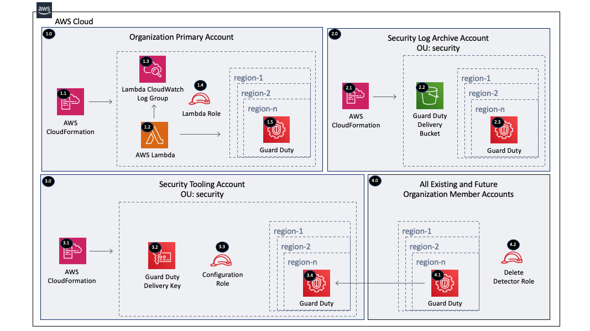

Copyright Amazon.com, Inc. or its affiliates. All Rights Reserved. SPDX-License-Identifier: CC-BY-SA-4.0

# GuardDuty Organization

The GuardDuty Organization solution will enable Amazon GuardDuty by delegating administration to a member account
 within the Organization management account and configuring GuardDuty within the delegated administrator account for all
  the existing and future AWS Organization accounts. GuardDuty is also configured to send the findings to a central 
  S3 bucket encrypted with a KMS key.

----

# Table of Contents
* [Deployed Resource Details](#deployed-resource-details)
* [Implementation Instructions](#implementation-instructions)
* [References](#references)

----

# Deployed Resource Details



## 1.0 Organization Management Account

### 1.1 AWS CloudFormation

**Description:**

All resources are deployed via CloudFormation StackSet and Stack

**Configuration:**

* StackSet Names:
    * GuardDutyOrgConfigurationRole
    * GuardDutyOrgDeliveryKMSKey
    * GuardDutyOrgDeliveryS3Bucket
    * GuardDutyOrgConfiguration
    * GuardDutyOrgDeleteDetectorRole

### 1.2 AWS Lambda Function

**Description:**

The custom CloudFormation Lambda resource is required to delegate an administrator account because this capability 
is not supported by CloudFormation (November 2020)

**Configuration:**

* Lambda Function Name = [Prefix]-guardduty-org-configuration
* Environment Variables (Configurable and set via CloudFormation)
    * AUTO_ENABLE_S3_LOGS - default = false, Valid values = true or false
    * AWS_PARTITION - aws, aws-cn, aws-us-gov 
    * CONFIGURATION_ROLE_NAME - Role within the delegated admin account to configure GuardDuty
    * DELEGATED_ADMIN_ACCOUNT_ID - Organization Member Account ID which is typically the Security account
    * DELETE_DETECTOR_ROLE_NAME - Role within each member account used to delete the GuardDuty detectors
    * ENABLED_REGIONS - Comma delimited list of regions to enable Guard Duty in. Leave blank for all supported regions.
    * FINDING_PUBLISHING_FREQUENCY - Default = 'FIFTEEN_MINUTES', Valid values = 'FIFTEEN_MINUTES', 'ONE_HOUR', 
      'SIX_HOURS'
    * KMS_KEY_ARN - KMS Key ARN to encrypt the Guard Duty findings sent to S3
    * LOG_LEVEL - Default = info, Valid Values = debug, info, warning, error, critical
    * PUBLISHING_DESTINATION_BUCKET_ARN - S3 bucket ARN to send the Guard Duty findings
    * TAG_KEY1 - Tags the IAM role and Lambda Function with this key
    * TAG_VALUE1 - Tags the IAM role and Lambda Function with this value
    
**Input Validation**

Validation of environment variables is done to make sure values exist and are the correct type

### 1.3 Lambda CloudWatch Log Group

**Description:**

Contains Lambda function execution logs

**Configuration:**

* Retention = Default 2 weeks (14 days)
* Log group name = /aws/lambda/[Lambda Function Name]

### 1.4 Lambda Execution IAM Role

**Description:**

Used by the custom CloudFormation Lambda function to enable the GuardDuty Delegated Administrator Account within 
each region provided

**Configuration:**

* Role Name: [Prefix]-guardduty-org-lambda
* Permissions:
    * CloudWatch Logs - Limited: Write on LogGroupName like /aws/lambda/[Lambda Function Name]
    * GuardDuty - Limited: List, Write
    * IAM - Limited Read, Write on AWSServiceRoleForAmazonGuardDuty
    * Organizations - Limited: List, Read
    * STS - Assume configuration role in delegated admin account

### 1.5 GuardDuty

**Description:**

Enable GuardDuty delegated administrator account within provide regions. Once enabled, a GuardDuty detector will 
exist in the delegated administrator account/region. The Lambda function assumes the configuration role within the 
delegated administrator account to configure GuardDuty with the below configurations.

**Configuration:**

* Delegated administrator account ID
* Regions to enable - Leave blank for all available regions
* GuardDuty publish destination S3 Bucket with KMS encryption
* Enable existing accounts
* Auto Enable new member accounts
* Auto Enable S3 Data Logs - Default = false

----

## 2.0 Security Log Archive Account

### 2.1 AWS CloudFormation

**Description:**

All resources are deployed via CloudFormation Stack created by the management account StackSet

**Configuration:**

* Stack Name: *GuardDutyOrgDeliveryS3Bucket-...

### 2.2 GuardDuty Delivery S3 Bucket

**Description:**

S3 bucket where GuardDuty findings are exported for each account/region within the AWS Organization

**Configuration:**

* S3 bucket name prefix - the account and region are appended to the prefix 
    e.g. guardduty-delivery-123456789012-us-east-1
* Encrypted with the GuardDuty delivery KMS key
* All public block settings set to true
* Versioning enabled
* S3 bucket tagged with provided key
* Bucket policy configured to limit access to the bucket
* Ownership controls - Object Ownership = BucketOwnerPreferred

### 2.3 GuardDuty

**Description:**

GuardDuty is enabled for existing accounts within each member account and region during the initial setup. 

**Configuration:**

* None - Controlled by the GuardDuty Delegated Administrator Account

----

## 3.0 Security Tooling Account

### 3.1 AWS CloudFormation

**Description:**

All resources are deployed via CloudFormation Stack created by the management account StackSet

**Configuration:**

* Stack Name: *GuardDutyOrgDeliveryKMSKey-...
* Stack Name: *GuardDutyOrgConfigurationRole-...

### 3.2 GuardDuty Delivery KMS Key

**Description:**

Customer managed KMS key used for encrypting exported GuardDuty findings

**Configuration:**

* Key alias
* Organization Management Account ID
* Logging Account ID
* KMS Key Tag

### 3.3 Configuration IAM Role

**Description:**

Assumed by the custom CloudFormation Lambda function within the management account to configure GuardDuty within each
 region provided

**Configuration:**

* Role Name: [Prefix]-guardduty-org-configuration
* Permissions:
    * GuardDuty - Limited: List, Write
    * IAM - Limited Read, Write on AWSServiceRoleForAmazonGuardDuty
    * Organizations - Limited: List

### 3.4 GuardDuty

**Description:**

Configure GuardDuty to add existing member accounts and to auto enable new member accounts.

**Configuration:**

* See configuration details in the management account GuardDuty configuration section

----

## 4.0 All Existing and Future Organization Member Accounts

### 4.1 GuardDuty

**Description:**

GuardDuty is enabled for existing accounts within each member account and region during the initial setup. 
GuardDuty will automatically enable new member accounts/regions when they are added to the AWS Organization.

**Configuration:**

* None - Controlled by the GuardDuty Delegated Administrator Account

### 4.2 Delete Detector Role

**Description:**

An IAM role is created within all the accounts to clean up the GuardDuty detectors in a delete event.

**Configuration:**

* Role Name: [Prefix]-guardduty-org-delete-detector
* Permissions:
    * GuardDuty - Limited: List, Write

----

# Implementation Instructions

### [AWS Control Tower](./aws-control-tower)
### [AWS Landing Zone](./aws-landing-zone)
### CloudFormation StackSets

> **Solution Deployment Order:**
> 1. security (GuardDutyOrgConfigurationRole)
> 2. security (GuardDutyOrgDeliveryKMSKey)
> 3. logging (GuardDutyOrgDeliveryS3Bucket)
> 4. management (GuardDutyOrgConfiguration) 
> 5. all accounts (GuardDutyOrgDeleteDetectorRole)

#### Pre-requisites

* Disable GuardDuty in all accounts/regions by removing the detector
   
#### Instructions

1. Create new or use existing S3 buckets within the us-east-1 region owned by the Organization Management Account
   * Example bucket name: lambda-zips-[Management Account ID]-us-east-1
   * [Example CloudFormation Template](../../../extras/lambda-s3-buckets.yaml)
   * The bucket must allow the s3:GetObject action to the Organization using a bucket policy like the one below to 
        allow the accounts within the Organization to get the Lambda files.
    ```
    {
        "Version": "2012-10-17",
        "Statement": [
            {
                "Sid": "AllowGetObject",
                "Effect": "Allow",
                "Principal": "*",
                "Action": "s3:GetObject",
                "Resource": "arn:[AWS::Partition]:s3:::[BUCKET NAME]/*",
                "Condition": {
                    "StringEquals": {
                        "aws:PrincipalOrgID": "[ORGANIZATION ID]"
                    }
                }
            }
        ]
    }
    ```
2. Package the Lambda code into a zip file and upload it to the S3 bucket
   * Package and Upload the Lambda zip file to S3 - [Packaging script](../../../extras/packaging-scripts/package-lambda.sh)
3. Copy the below folders/files to the new add-on folder excluding the lambda folder

    |     Account     |   StackSet Name   |  Template  |
    | --------------- | ----------------- | ---------- |
    | Security | GuardDutyOrgConfigurationRole | templates/guardduty-org-configuration-role.yaml |
    | Security | GuardDutyOrgDeliveryKMSKey | templates/guardduty-org-delivery-kms-key.yaml |
    | Log Archive | GuardDutyOrgDeliveryS3Bucket | templates/guardduty-org-delivery-s3-bucket.yaml |
    | Management | GuardDutyOrgConfiguration | templates/guardduty-org-configuration.yaml |
    | All | GuardDutyOrgDeleteDetectorRole | templates/guardduty-org-delete-detector-role.yaml |

4. If the CloudFormation StackSets are removed, the solution will attempt to remove GuardDuty
    > Environments containing large numbers of accounts may require additional cleanup scripts to remove the remaining
      GuardDuty detectors within the enabled accounts/regions. 

----

# References
* [Managing GuardDuty Accounts with AWS Organizations](https://docs.aws.amazon.com/guardduty/latest/ug/guardduty_organizations.html)
