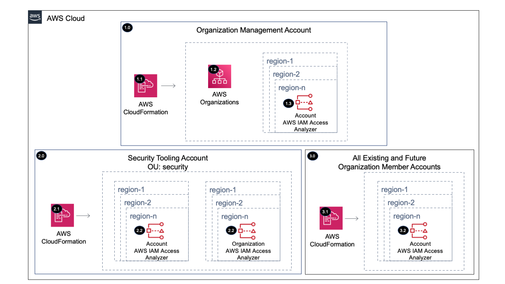

Copyright Amazon.com, Inc. or its affiliates. All Rights Reserved. SPDX-License-Identifier: CC-BY-SA-4.0

# Access Analyzer

The IAM Access Analyzer solution enables AWS IAM Access Analyzer by delegating administration to a member account
within the Organization management account. It then configures Access Analyzer within the delegated administrator account 
for all the existing and future AWS Organization accounts.

In addition to the organization deployment, the solution deploys AWS Access Analyzer to all the member accounts
and regions for analyzing account level permissions.

----

# Table of Contents
* [Deployed Resource Details](#deployed-resource-details)
* [Implementation Instructions](#implementation-instructions)
* [References](#references)

----

# Deployed Resource Details

## 1.0 Organization Management Account

### 1.1 AWS CloudFormation

**Description:**

All resources deployed via CloudFormation StackSet and Stacks within member accounts

**Configuration:**

* StackSet Names:
    * AccessAnalyzerOrganization
    * AccessAnalyzerAccount

### 1.2 AWS Organizations

**Description:**

AWS Organizations is used to delegate an administrator account for AWS Access Analyzer

**Configuration:**

* Delegated Administrator Account - See [Common Register Delegated Administrator](../../common/register-delegated-administrator)
    

### 1.3 Account AWS IAM Access Analyzer

**Description:**

AWS IAM Access Analyzer is configured to monitor supported resources for the AWS Account zone of trust.

**Configuration:**

* Access Analyzer Name Prefix: Default = account-access-analyzer
* Tag Key = Access Analyzer Tag Key 
* Tag Value = Access Analyzer Tag Value 

----

## 2.0 Security Tooling Account

### 2.1 AWS CloudFormation

**Description:**

All resources are deployed via CloudFormation Stack created by the Management account StackSet

**Configuration:**

* Stack Names: 
    * StackSet-...-AccessAnalyzerAccount-...
    * StackSet-...-AccessAnalyzerOrganization-...

### 2.2 Account AWS IAM Access Analyzer

**Description:**

AWS IAM Access Analyzer is configured to monitor supported resources for the AWS Account zone of trust.

**Configuration:**

* Access Analyzer Name Prefix: Default = account-access-analyzer
* Tag Key = Access Analyzer Tag Key 
* Tag Value = Access Analyzer Tag Value

### 2.3 Organization AWS IAM Access Analyzer

**Description:**

AWS IAM Access Analyzer is configured to monitor supported resources for the AWS Organization zone of trust.

**Configuration:**

* Access Analyzer Name Prefix: Default = organization-access-analyzer
* Tag Key = Access Analyzer Tag Key 
* Tag Value = Access Analyzer Tag Value

----

## 3.0 All Existing and Future Organization Member Accounts

### 3.1 AWS CloudFormation

**Description:**

All resources are deployed via CloudFormation Stack created by the Management account StackSet

**Configuration:**

* Stack Names: 
    * StackSet-...-AccessAnalyzerAccount-...

### 3.2 Account AWS IAM Access Analyzer

**Description:**

AWS IAM Access Analyzer is configured to monitor 
[supported resources](https://docs.aws.amazon.com/IAM/latest/UserGuide/access-analyzer-resources.html) for the 
AWS Account zone of trust.

**Configuration:**

* Access Analyzer Name Prefix: Default = account-access-analyzer
* Tag Key = Access Analyzer Tag Key 
* Tag Value = Access Analyzer Tag Value

----

# Implementation Instructions

### [AWS Control Tower](./aws-control-tower)
### CloudFormation StackSets

#### Pre-requisites
1. Register a delegated administrator using the
 [Common Register Delegated Administrator](../../common/register-delegated-administrator) solution
   1. pServicePrincipalList = "access-analyzer.amazonaws.com" 
   
#### Instructions

> **Solution Deployment Order:**
> 1. All Accounts (AccessAnalyzerAccount)
> 2. Security Account (AccessAnalyzerOrganization)

 Create CloudFormation StackSets using the following templates
   
   |     Account     |   StackSet Name   |  Template  |
   | --------------- | ----------------- | ---------- |
   | Management | CommonRegisterDelegatedAdmin | templates/common-register-delegated-administrator.yaml |
   | All Accounts | AccessAnalyzerAccount | templates/access-analyzer-acct.yaml |
   | Security | AccessAnalyzerOrganization | templates/access-analyzer-org.yaml |
   
----

# References
* [Using AWS IAM Access Analyzer](https://docs.aws.amazon.com/IAM/latest/UserGuide/what-is-access-analyzer.html)
