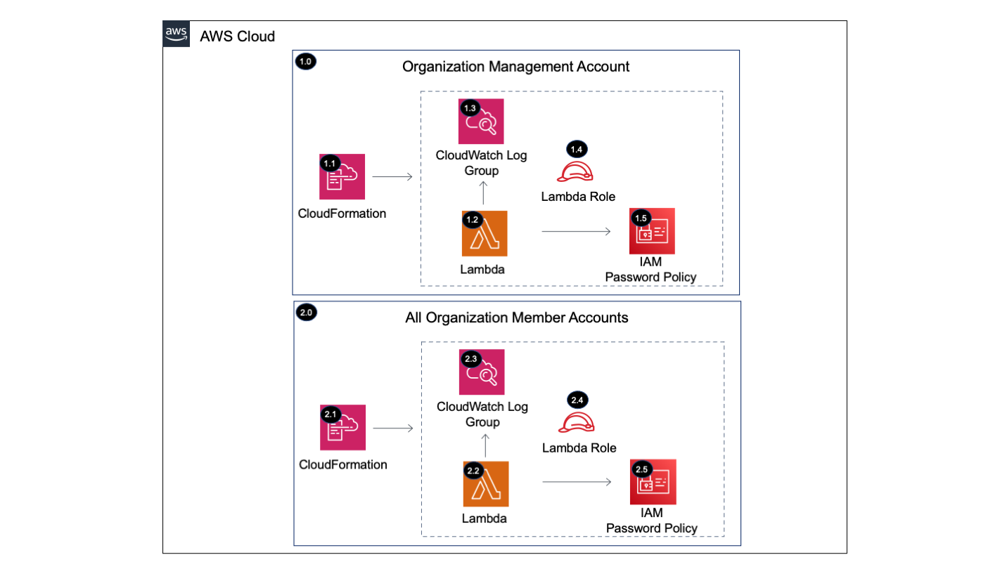

Copyright Amazon.com, Inc. or its affiliates. All Rights Reserved. SPDX-License-Identifier: CC-BY-SA-4.0

# IAM Password Policy 

The IAM Password Policy solution updates the AWS account password policy within all accounts in an AWS Organization. 

----

# Table of Contents
* [Deployed Resource Details](#deployed-resource-details)
* [Implementation Instructions](#implementation-instructions)
* [References](#references)

----

# Deployed Resource Details

## 1.0 Organization Management Account

### 1.1 AWS CloudFormation

**Description:**

All resources deployed via CloudFormation StackSet and Stacks within member accounts

**Configuration:**

* StackSet Names:
    * StackSet-...-PasswordPolicy-...

### 1.2 AWS Lambda Function

**Description:**

The custom CloudFormation Lambda resource is required to update the existing IAM account password policy.

**Configuration:**

* Lambda Function Name - [Prefix]-password-policy-acct
* Lambda S3 Bucket Name - Management account S3 bucket with the Lambda zip file
* Lambda Zip File Name - Default = password-policy-acct.zip
* Log Level - Default = debug, Valid Values = debug, info, warning, error, critical
* Allow Users To Change Password - Default = true 
* Hard Expiry - Default = false 
* Max Password Age - Default = 90 
* Minimum Password Length - Default = 14
* Password Reuse Prevention - Default = 24
* Require Lowercase Characters - Default = true
* Require Numbers - Default = true
* Require Symbols - Default = true
* Require Uppercase Characters - Default = true
    

### 1.3 Amazon CloudWatch Log Group

**Description:**

Contains the Lambda function execution logs

**Configuration:**

* Log group name = /aws/lambda/[Lambda Function Name]
* Retention = Never expire

### 1.4 Lambda Execution IAM Role

**Description:**

Used by the custom CloudFormation Lambda function to update the account password policy

**Configuration:**

* Execution role name = [Prefix]-password-policy-lambda
* Permissions:
   * CloudWatch Logs - Limited: Write on LogGroupName like /aws/lambda/[Lambda Function Name]
   * IAM - Limited: Write All resources

### 1.5 IAM Password Policy

**Description:**

AWS account password policy for IAM users

**Configuration:**

* [Custom password policy options](https://docs.aws.amazon.com/IAM/latest/UserGuide/id_credentials_passwords_account-policy.html#password-policy-details)

----

## 2.0 All Organization Member Accounts

Same configuration details as 1.0 Organization Management Account

----

# Implementation Instructions

### [AWS Control Tower](./aws-control-tower)
### CloudFormation StackSets

#### Solution Deployment Order
1. All Accounts (PasswordPolicy)

#### Instructions

1. Create new or use an existing S3 bucket within the region owned by the Organization Management Account
   * Example bucket name: lambda-zips-[Management Account ID]-us-east-1
   * [Example CloudFormation Template](../../../extras/lambda-s3-buckets.yaml)
2. Package the Lambda code into a zip file and upload it to the S3 bucket
   * Package and Upload the Lambda zip file to S3 (Packaging script: /extras/packaging-scripts/package-lambda.sh)
3. Create CloudFormation StackSets using the following templates
   
   |     Account     |   StackSet Name   |  Template  |
   | --------------- | ----------------- | ---------- |
   | All Accounts | PasswordPolicy | templates/password-policy-acct.yaml |
   
----

# References
* [Setting an account password policy](https://docs.aws.amazon.com/IAM/latest/UserGuide/id_credentials_passwords_account-policy.html)
* [CIS AWS Foundations Benchmark controls](https://docs.aws.amazon.com/securityhub/latest/userguide/securityhub-cis-controls.html)
