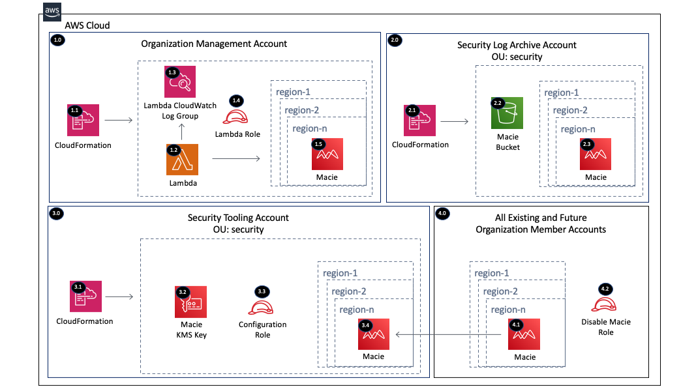

Copyright Amazon.com, Inc. or its affiliates. All Rights Reserved. SPDX-License-Identifier: CC-BY-SA-4.0

# Macie Organization

The Macie Organization solution will enable Amazon Macie by delegating administration to a member account
within the Organization Management Account and configuring Macie within the delegated administrator account for all 
the existing and future AWS Organization accounts. Macie is also configured to send the findings to a central 
S3 bucket encrypted with a KMS key.

----

# Table of Contents
* [Deployed Resource Details](#deployed-resource-details)
* [Implementation Instructions](#implementation-instructions)
* [References](#references)

----

# Deployed Resource Details



## 1.0 Organization Management Account

### 1.1 AWS CloudFormation

**Description:**

All resources are deployed via CloudFormation StackSet and Stack

**Configuration:**

* StackSet Names:
    * MacieOrgConfigurationRole
    * MacieOrgDeliveryKMSKey
    * MacieOrgDeliveryS3Bucket
    * MacieOrgConfiguration
    * MacieOrgMemberDisableRole

### 1.2 AWS Lambda Function

**Description:**

The custom CloudFormation Lambda resource is required to delegate an administrator account because this capability 
is not supported by CloudFormation (August 2021)

**Configuration:**

* Lambda Function Name = [Prefix]-macie-org-configuration
* Environment Variables (Configurable and set via CloudFormation)
    * AWS_PARTITION - aws, aws-cn, aws-us-gov
    * CONFIGURATION_ROLE_NAME - Role within the delegated admin account to configure Macie
    * CONTROL_TOWER_REGIONS_ONLY - Enable only the Control Tower regions
    * DELEGATED_ADMIN_ACCOUNT_ID - Organization Member Account ID which is typically the Security account
    * DISABLE_MACIE_ROLE_NAME - Role within each member account used to disable Macie
    * ENABLED_REGIONS - Comma delimited list of regions to enable Macie in. Leave blank for all supported regions.
    * FINDING_PUBLISHING_FREQUENCY - Specifies how often to publish updates to policy findings for the account
    * KMS_KEY_ARN - KMS Key ARN to encrypt the Macie classifications sent to S3
    * S3_BUCKET_NAME - S3 bucket ARN to send the Macie classifications
    
**Input Validation**

Validation of environment variables is done to make sure values exist and are the correct type

### 1.3 Lambda CloudWatch Log Group

**Description:**

Contains Lambda function execution logs

**Configuration:**

* Log group name = /aws/lambda/[Lambda Function Name]

### 1.4 Lambda Execution IAM Role

**Description:**

Used by the custom CloudFormation Lambda function to enable the Macie Delegated Administrator Account within 
each region provided

**Configuration:**

* Role Name: [Prefix]-macie-org-lambda
* Permissions:
    * CloudWatch Logs - Limited: Write on LogGroupName like /aws/lambda/[Lambda Function Name]
    * Macie - Limited: List, Write
    * IAM - Limited Read, Write on AWSServiceRoleForAmazonMacie
    * Organizations - Limited: List, Read
    * STS - Assume configuration role in delegated admin account

### 1.5 Macie

**Description:**

Enable Macie delegated administrator account within provide regions. 
The Lambda function assumes the configuration role within the delegated administrator account 
to configure Macie with the below configurations.

**Configuration:**

* Delegated administrator account ID
* Regions to enable - Leave blank for all available regions
* Macie publish destination S3 Bucket with KMS encryption
* Enable existing accounts
* Auto Enable new member accounts
* Auto Enable S3 Data Logs - Default = false

----

## 2.0 Security Log Archive Account

### 2.1 AWS CloudFormation

**Description:**

All resources are deployed via CloudFormation Stack created by the Management account StackSet

**Configuration:**

* Stack Name: *MacieOrgDeliveryS3Bucket-...

### 2.2 Macie Delivery S3 Bucket

**Description:**

S3 bucket where Macie classifications are exported for each account/region within the AWS Organization

**Configuration:**

* S3 bucket name prefix - the account and region are appended to the prefix 
    e.g. macie-delivery-123456789012-us-east-1
* Encrypted with the Macie delivery KMS key
* All public block settings set to true
* Versioning enabled
* S3 bucket tagged with provided key
* Bucket policy configured to limit access to the bucket
* Bucket owner preferred object ownership

### 2.3 Macie

**Description:**

Macie is enabled for existing accounts within each member account and region during the initial setup. 

**Configuration:**

* None - Controlled by the Macie Delegated Administrator Account

----

## 3.0 Security Tooling Account

### 3.1 AWS CloudFormation

**Description:**

All resources are deployed via CloudFormation Stack created by the Management account StackSet

**Configuration:**

* Stack Name: *MacieOrgDeliveryKMSKey-...
* Stack Name: *MacieOrgConfigurationRole-...

### 3.2 Macie KMS Key

**Description:**

Customer managed KMS key used for encrypting exported Macie findings

**Configuration:**

* Key alias
* Organization Management Account ID
* Logging Account ID
* KMS Key Tag

### 3.3 Configuration IAM Role

**Description:**

Assumed by the custom CloudFormation Lambda function within the management account to configure Macie within each
 region provided

**Configuration:**

* Role Name: [Prefix]-macie-org-configuration
* Permissions:
    * Macie - Limited: List, Write
    * IAM - Limited Read, Write on AWSServiceRoleForAmazonMacie
    * Organizations - Limited: List

### 3.4 Macie

**Description:**

Configure Macie to add existing member accounts and to auto enable new member accounts.

**Configuration:**

* See configuration details in the management account Macie configuration section

----

## 4.0 All Existing and Future Organization Member Accounts

### 4.1 Macie

**Description:**

Macie is enabled for existing accounts within each member account and region during the initial setup. 
Macie will automatically enable new member accounts/regions when they are added to the AWS Organization.

**Configuration:**

* None - Controlled by the Macie Delegated Administrator Account

### 4.2 Disable Macie Role

**Description:**

An IAM role is created within all the accounts to disable Macie in a delete event.

**Configuration:**

* Role Name: [Prefix]-disable-macie
* Permissions:
    * Macie - Limited: List, Write

----

# Implementation Instructions

### [Customizations for AWS Control Tower](./aws-control-tower)
### [AWS Landing Zone](./aws-landing-zone)
### CloudFormation StackSets

#### Solution Deployment Order

1. Security Account (MacieOrgConfigurationRole)
2. Security Account (MacieOrgDeliveryKMSKey)
3. Logging Account (MacieOrgDeliveryS3Bucket)
4. Management Account (MacieOrgConfiguration) 
5. All Accounts (MacieOrgMemberDisableRole)

### Pre-requisites

* Disable Macie in all accounts/regions
   
### Instructions

1. Create new or use an existing S3 bucket within the region owned by the Organization Management Account
   * Example bucket name: lambda-zips-[Management Account ID]-us-east-1
   * [Example CloudFormation Template](../../../extras/lambda-s3-buckets.yaml)
   * The bucket must allow the s3:GetObject action to the Organization using a bucket policy like the one below to 
        allow the accounts within the Organization to get the Lambda files.
    ```
    {
        "Version": "2012-10-17",
        "Statement": [
            {
                "Sid": "AllowGetObject",
                "Effect": "Allow",
                "Principal": "*",
                "Action": "s3:GetObject",
                "Resource": "arn:[AWS::Partition]:s3:::[BUCKET NAME]/*",
                "Condition": {
                    "StringEquals": {
                        "aws:PrincipalOrgID": "[ORGANIZATION ID]"
                    }
                }
            }
        ]
    }
    ```
2. Package the Lambda code into a zip file and upload it to the S3 bucket
   * Package and Upload the Lambda zip file to S3 (Packaging script: /extras/packaging-scripts/package-lambda.sh)
3. Copy the below folders/files to the new add-on folder excluding the lambda folder

    |     Account     |   StackSet Name   |  Template  |
    | --------------- | ----------------- | ---------- |
    | Security | MacieOrgConfigurationRole | templates/macie-org-configuration-role.yaml |
    | Security | MacieOrgDeliveryKMSKey | templates/macie-org-kms-key.yaml |
    | Log Archive | MacieOrgDeliveryS3Bucket | templates/macie-org-s3-bucket.yaml |
    | Management | MacieOrgConfiguration | templates/macie-org-configuration.yaml |
    | All | MacieOrgMemberDisableRole | templates/macie-org-member-disable-role.yaml |

4. If the CloudFormation StackSets are removed, the solution will attempt to disable Macie in all accounts
    > Environments containing large numbers of accounts may require additional cleanup scripts to disable Macie in 
    >  the remaining accounts/regions.

----

# References
* [Managing multiple Amazon Macie accounts with AWS Organizations](https://docs.aws.amazon.com/macie/latest/user/macie-organizations.html)
