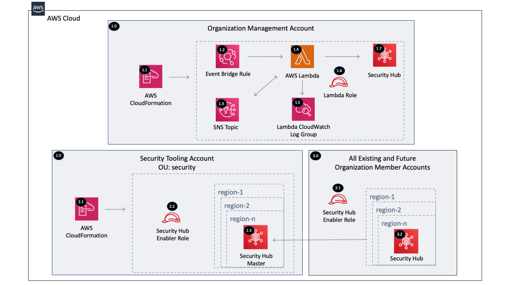

Copyright Amazon.com, Inc. or its affiliates. All Rights Reserved. SPDX-License-Identifier: CC-BY-SA-4.0

# SecurityHub Enabler Account

The SecurityHub Enabler solution will enable SecurityHub within each AWS Organizations account configured with 
an admin account (e.g. Security Tooling) and security standards enabled. Centralizing SecurityHub within the Security 
Tooling account provides a cross-account view of security standards compliance and findings from AWS service 
integrations.

The solution is implemented by deploying a SecurityHub Enabler Lambda function in the Organization Management account
 which runs periodically to verify each account/region has been invited into the central SecurityHub account and that 
 SecurityHub is enabled. 

This solution differs from that presented [here](https://github.com/awslabs/aws-securityhub-multiaccount-scripts).  
This solution take a serverless approach (vs. launching an EC2 instance) and auto enables new accounts added to the 
AWS Organization.

----

# Table of Contents
* [Deployed Resource Details](#deployed-resource-details)
* [Implementation Instructions](#implementation-instructions)
* [References](#references)

----

# Deployed Resource Details



## 1.0 Organization Management Account

### 1.1 AWS CloudFormation

**Description:**

All resources are deployed via a CloudFormation StackSet and a Stack Instance within each member account

**Configuration:**

* StackSet Names:
    * SecurityHubEnablerAcctService
    * SecurityHubEnablerAcctRole

### 1.2 EventBridge Scheduled Rule

**Description:**

The scheduled rule triggers the Lambda Function between 1 and 3600 minutes to check organization compliance

**Configuration:**

* pComplianceFrequency: Frequency (in minutes between 1 and 3600, default is 60) to check for new accounts added 
to the AWS Organization

### 1.3 SNS Topic

**Description:**

SNS Topic triggers the Lambda Function during initial setup to handle multiple accounts. The Lambda Function will 
publish all the AWS Organization accounts to the SNS Topic if it isn't triggered by SNS.

**Configuration:**

* SNS Topic Name: SecurityHubEnablerAcctTopic (Only configurable within the CloudFormation Template)


### 1.4 AWS Lambda Function

**Description:**

The Lambda Function enables Security Hub within all the active AWS Organizations accounts

**Configuration:**

* Lambda Function Name = [Prefix]-security-hub-enabler-acct
* Environment Variables (Configurable and set via CloudFormation)
    * ASSUME_ROLE - AWS IAM role to assume within each account to enable Security Hub
    * ENABLE_CIS_STANDARD - Default = false, enable the [CIS AWS Foundations Standard](https://docs.aws.amazon.com/securityhub/latest/userguide/securityhub-standards-cis.html)
    * CIS_STANDARD_VERSION - Default = 1.2.0
    * ENABLE_PCI_STANDARD - Default = false, enable the [Payment Card Industry Data Security Standard (PCI DSS)](https://docs.aws.amazon.com/securityhub/latest/userguide/securityhub-standards-pcidss.html)
    * PCI_STANDARD_VERSION - Default = 3.2.1
    * ENABLE_SBP_STANDARD - Default = false, enable the [AWS Foundational Security Best Practices Standard](https://docs.aws.amazon.com/securityhub/latest/userguide/securityhub-standards-fsbp.html)
    * SBP_STANDARD_VERSION - Default = 1.0.0
    * MGMT_ACCOUNT_ID - The Security Hub management account ID (e.g. Security account)
    * SNS_TOPIC_ARN - SNS Topic that triggers the Lambda Function during initial setup to handle multiple accounts. The Lambda 
        Function publishes to the SNS Topic if it isn't triggered by SNS.
    * LOG_LEVEL - Default = INFO
    * REGIONS_TO_ENABLE - Comma delimited list of regions to enable. Leave blank for all enabled regions.
    * CONTROL_TOWER_REGIONS_ONLY - Default = false, enables only the AWS Control Tower supported regions.
    * ENABLE_PROWLER_INTEGRATION - Default = false, enables the Prowler partner integration.
    
**Input Validation**

Validation of environment variables is done to make sure values exist and are the correct type

### 1.5 Lambda CloudWatch Log Group

**Description:**

Contains the Lambda function execution logs

**Configuration:**

* Retention = Default 2 weeks (14 days)
* Log group name = /aws/lambda/[Lambda Function]

### 1.6 Lambda Execution IAM Role

**Description:**

Used by the custom CloudFormation Lambda function to enable Security Hub in all accounts and regions

**Configuration:**

* Role Name: [Prefix]-security-hub-enabler-acct-lambda
* Policy Name: [Prefix]-security-hub-enabler-acct-lambda
* Permissions:
    * CloudWatch Logs - Limited: Write on LogGroupName like /aws/lambda/[Lambda Function] 
    * Organizations - Limited: List, Read
    * SNS - Limited: Write TopicName like SecurityHubEnablerTopic 
    * STS - Limited: Write RoleName like [Prefix]-security-hub-enabler-acct 

### 1.7 Security Hub

**Description:**

Security Hub is enabled in all the active Organization accounts and regions via the Lambda Function. Each member 
account Security Hub is configured with the provided Security Hub master account.

**Configuration:**

* Security Hub Management Account
* Enable CIS Standard
* Enable PCI Standard
* Enable Security Best Practices Standard
* Enable Prowler integration


----

## 2.0 Security Tooling Account

### 2.1 AWS CloudFormation

**Description:**

All resources are deployed via CloudFormation Stack created by the Management account CloudFormation StackSet

**Configuration:**

* Stack Name: SecurityHubEnablerAcctService-...

### 2.2 Security Hub Enabler Role

**Description:**

IAM role assumed by the Management account Lambda function to enable Security Hub within the account and all 
the active regions

**Configuration:**

* Role Name: [Prefix]-security-hub-enabler-acct
* Policy Name: [Prefix]-security-hub-enabler-acct
* Permissions:
    * IAM - Limited: Write iam:AWSServiceName like securityhub.amazonaws.com 
    * SecurityHub - Full access

### 2.3 Security Hub Master

**Description:**

Security Hub Master Account provides visibility of all Security Hub member results

**Configuration:**

* Provided by the Master account Lambda function


----

## 3.0 All Existing and Future Organization Member Accounts

### 3.1 Security Hub Enabler Role

**Description:**

IAM role assumed by the Management account Lambda function to enable Security Hub within the account and all 
the active regions

**Configuration:**

* Role Name: [Prefix]-security-hub-enabler-acct
* Policy Name: [Prefix]-security-hub-enabler-acct
* Permissions:
    * IAM - Limited: Write iam:AWSServiceName like securityhub.amazonaws.com 
    * SecurityHub - Full access

### 3.2 Security Hub Master

**Description:**

Security Hub enabled within the account and all active regions

**Configuration:**

* Provided by the Management account Lambda function

----

# Implementation Instructions
### Pre-requisites
* Security Hub disabled in all accounts
   
### Instructions

1. Create a new or use an existing S3 bucket within the us-east-1 region owned by the Orgs Master Account
   * Example bucket name: lambda-zips-[Management Account ID]-us-east-1
   * [Example CloudFormation Template](../../../extras/lambda-s3-buckets.yaml)
   * The bucket must allow the s3:GetObject action to the Organization using a bucket policy like the one 
        below to allow the accounts within the Organization to get the Lambda files.
    ```
    {
        "Version": "2012-10-17",
        "Statement": [
            {
                "Sid": "AllowGetObject",
                "Effect": "Allow",
                "Principal": "*",
                "Action": "s3:GetObject",
                "Resource": "arn:[AWS::Partition]:s3:::[BUCKET NAME]/*",
                "Condition": {
                    "StringEquals": {
                        "aws:PrincipalOrgID": "[ORGANIZATION ID]"
                    }
                }
            }
        ]
    }
    ```
2. Package the Lambda code into a zip file and upload it to the S3 bucket
   * Package and Upload the Lambda zip file to S3 (Packaging script: /extras/packaging-scripts/package-lambda.sh)
3. Create CloudFormation StackSets using the following templates
   
    |     Account     |   StackSet Name   |  Template  |
    | --------------- | ----------------- | ---------- |
    | Management | SecurityHubEnablerAcctService | templates/securityhub-enabler-acct.yaml |
    | All Member Accounts | SecurityHubEnablerAcctRole | templates/securityhub-enabler-acct-role.yaml |

----

# References
* [Setting up AWS Security Hub](https://docs.aws.amazon.com/securityhub/latest/userguide/securityhub-settingup.html)
